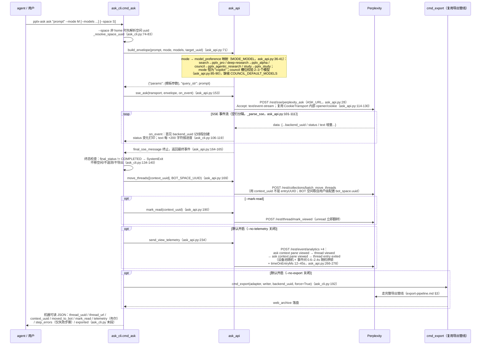
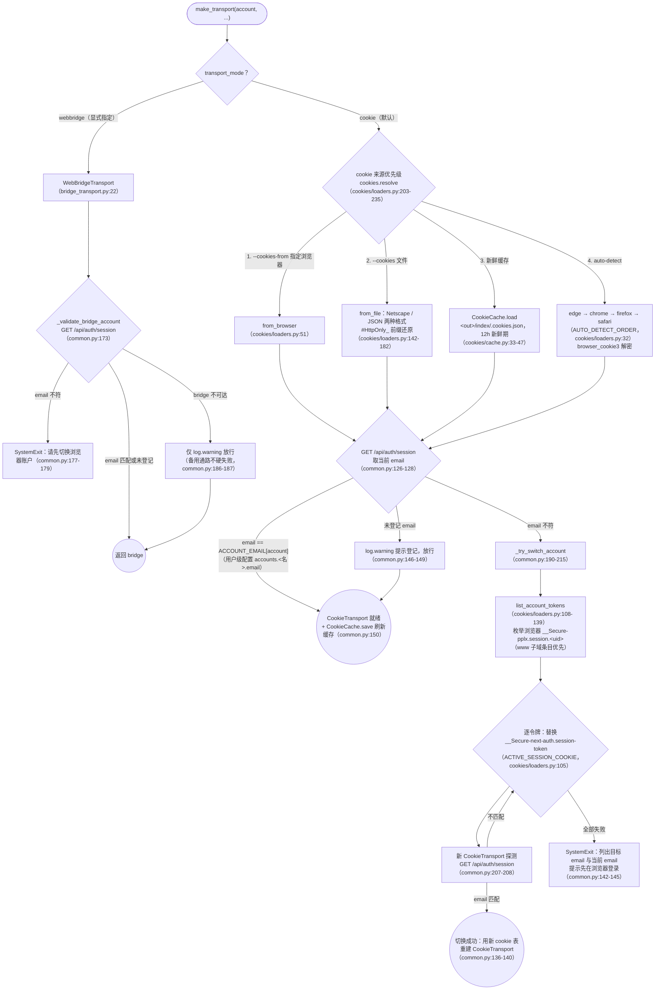

# pplx-ask 및 다중 계정

---

## pplx-ask 시퀀스 상세 다이어그램

`cmd_ask`(ask_cli.py:86-198)의 전체 시퀀스: envelope 구성 → SSE 스트림 → 최종 상태 확인 →
BOT 공간 → 읽음 확인 → 인간화된 원격 측정 → 재사용 내보내기 파이프라인 아카이브.

설계 포인트:

- **envelope은 실제 측정된 매개변수 템플릿**입니다: `_BASE_PARAMS`(ask_api.py:44-68) 25개의 고정 키
  (32개 항목의 `supported_block_use_cases`, 언어/시간대/검색 포커스 등 포함), `build_envelope`가
  mode/모델/frontend_uuid 등의 필드를 추가로 주입하며, 브라우저의 실제 제출과 일치합니다(참조:
  [../reference/api/api-rest-endpoints.md](../reference/api/api-rest-endpoints.md) §3.9 및 `docs/perplexity-api-samples/`의 39-params 샘플).
- **SSE 소비는 Transport ABC를 따르지 않음**: 스트리밍 인터페이스는 `get_json/post_json/download`
  추상화 내에 있지 않으며, `post_stream`는 `CookieTransport`의 `_cookie_header`/`_opener`를 직접 재사용합니다
  (ask_api.py:126-130) — 이는 [§1](overview.md)에서 언급된 의도적인 결합입니다.
- **원격 측정의 인간화**: `_DEVICE_POOL` 세 장치 무작위(ask_api.py:210-214), 무작위 지연,
  무작위 읽기 시간, 이벤트 스키마는 브라우저 실제 측정과 항목별로 정렬됩니다(`_telemetry_event`,
  ask_api.py:217-231); 읽음 확인과 원격 측정은 분리됨 — analytics의 "thread viewed"는 unread를
  변경하지 않으며, 실제 확인은 `mark_viewed`입니다(ask_api.py:194-201 주석).

---

## 다중 계정 쿠키 전환 흐름

쿠키 파싱 및 계정 검증은 `commands/common.py:make_transport`(common.py:93-155)에서 수행;
소스 열거는 `core/cookies/loaders.py`에서; webbridge 경로 검증은 `_validate_bridge_account`에서
(common.py:158-187).

요점:

- **다중 계정 모델**: 동일 브라우저에서 계정당 하나의 `__Secure-pplx.session.<uid>` 쿠키;
  전환 = 대상 계정의 값을 `__Secure-next-auth.session-token`에 쓰기(cookies/loaders.py:113-120
  주석; 메커니즘 실제 측정은 [../reference/api/api-authentication.md](../reference/api/api-authentication.md) §1.2 참조). 브라우저 UI 조작 불필요.
- **캐시는 `--out`를 따름**: `<out_root>/index/.cookies.json`(common.py:111),
  fetched_at/source/account_email 포함, 성공적인 검증 후 항상 새로고침(common.py:150).
- **webbridge와 쿠키는 상호 배타적**: `--cookies/--cookies-from`와 `--transport webbridge`를
  동시에 제공하면 오류 발생(cli.py:229-233; common.py:112-116).
- `core/auth.py:CredentialProvider`(WebBridge 쿠키 추출: CDP Storage.getCookies
  우선, document.cookie 대체, auth.py:41-67)는 **예비 폴백 체인**이며, 현재 유일한 호출자는
  `cookies.from_webbridge`(cookies/loaders.py:185-200)입니다.
