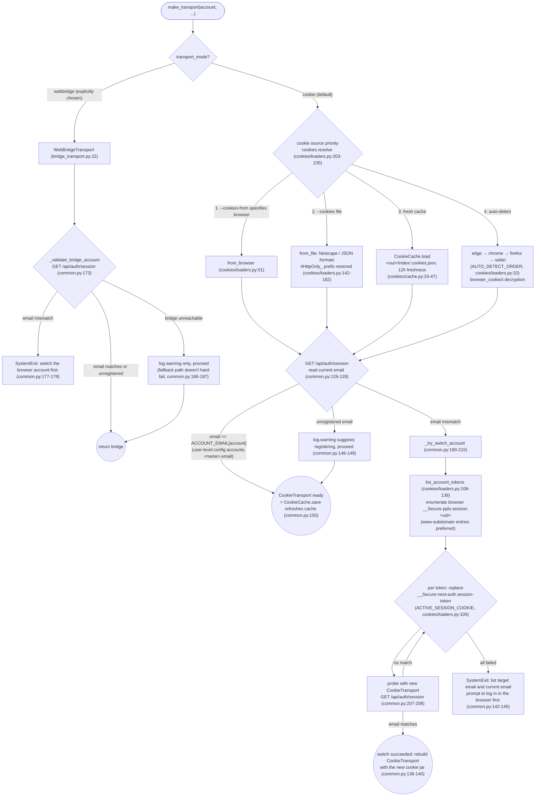

<a id="pplx-ask-and-accounts" data-pplx-source-anchor="true"></a>
# pplx-ask и учётные записи

---

<a id="pplx-ask-sequence-in-detail" data-pplx-source-anchor="true"></a>
## Последовательность pplx-ask в деталях

Полная последовательность `cmd_ask` (ask_cli.py:86-198): построение конверта → поток SSE → проверка финального статуса →
пространство BOT → подтверждение прочтения → гуманизированная телеметрия → архивирование через экспортный конвейер.

```mermaid
sequenceDiagram
    participant U as agent / user
    participant A as ask_cli.cmd_ask
    participant AK as ask_api
    participant P as Perplexity
    participant EX as cmd_export (export pipeline reused)

    U->>A: pplx-ask ask "prompt" --mode M [--models ...] [--space S]
    A->>A: when --space is not home, resolve the space uuid first<br/>_resolve_space_uuid (ask_cli.py:74-83)
    A->>AK: build_envelope(prompt, mode, models, target_uuid) (ask_api.py:71)
    Note over AK: mode → model_preference mapping (MODE_MODEL, ask_api.py:36-41):<br/>search→pplx_pro / deep-research→pplx_alpha /<br/>council→pplx_agentic_research / study→pplx_study;<br/>mode always "copilot"; council slot validation 2–3 models<br/>(ask_api.py:85-90), default COUNCIL_DEFAULT_MODELS
    AK-->>A: {"params": {template params}, "query_str": prompt}
    A->>AK: sse_ask(transport, envelope, on_event) (ask_api.py:153)
    AK->>P: POST /rest/sse/perplexity_ask (ASK_URL, ask_api.py:28)<br/>Accept: text/event-stream; reuses CookieTransport's internal opener/cookie (ask_api.py:114-130)
    loop SSE event stream (blank-line delimited, _parse_sse, ask_api.py:101-111)
        P-->>AK: data: {...backend_uuid / status / text deltas...}
        AK-->>A: on_event: first backend_uuid records thread creation<br/>status changes printed; progress every +200 text chars (ask_cli.py:106-119)
    end
    AK-->>A: final_sse_message terminates; return the final event (ask_api.py:164-165)
    A->>A: final-status check: final_status != COMPLETED → SystemExit<br/>no space move / no telemetry / no export (ask_cli.py:134-140)
    A->>AK: move_threads([context_uuid], BOT_SPACE_UUID) (ask_api.py:169)
    AK->>P: POST /rest/collections/batch_move_threads<br/>(use context_uuid, not entryUUID; BOT space from user-level config bot_space.uuid)
    opt --mark-read
        A->>AK: mark_read(context_uuid) (ask_api.py:190)
        AK->>P: POST /rest/thread/mark_viewed (unread flips immediately)
    end
    opt on by default (disabled by --no-telemetry)
        A->>AK: send_view_telemetry (ask_api.py:234)
        AK->>P: POST /rest/event/analytics ×4:<br/>ask context pane viewed → thread viewed<br/>→ ask context pane viewed → thread entry exited<br/>(random device pool + random 0.6–2.4s pauses between events<br/>+ timeOnEntryMs 12–45s, ask_api.py:266-278)
    end
    opt on by default (disabled by --no-export)
        A->>EX: cmd_export(adapter, writer, backend_uuid, force=True) (ask_cli.py:192)
        EX->>P: runs the full export pipeline (export-pipeline.md §3)
        EX-->>A: web_archive persisted
    end
    A-->>U: machine-readable JSON: thread_uuid / thread_url /<br/>context_uuid / moved_to_bot / mark_read / telemetry (booleans)<br/>/ step_errors (failed steps only) / exported (end of ask_cli.py)
```

Основные принципы проектирования:

- **Конверт — это проверенный шаблон параметров**: `_BASE_PARAMS` (ask_api.py:44-68) содержит 25 фиксированных ключей
  (включая 32 `supported_block_use_cases`, язык/часовой пояс/фокус поиска и т.д.); `build_envelope`
  добавляет поля mode/model/frontend_uuid, соответствующие реальным отправкам из браузера (сравните
  [../reference/api/api-rest-endpoints.md](../reference/api/api-rest-endpoints.md) §3.9 и образцы с 39 параметрами в `docs/perplexity-api-samples/`).
- **Потребление SSE обходит абстракцию Transport**: потоковая передача находится вне абстракции `get_json/post_json/download`;
  `post_stream` напрямую использует `CookieTransport`'s `_cookie_header`/`_opener`
  (ask_api.py:126-130) — преднамеренная связь, упомянутая в [§1](overview.md).
- **Гуманизация телеметрии**: `_DEVICE_POOL` рандомизирует по трём устройствам (ask_api.py:210-214), случайные паузы,
  случайная продолжительность чтения; схемы событий совпадают поэлементно с наблюдениями в браузере (`_telemetry_event`,
  ask_api.py:217-231); подтверждение прочтения отделено от телеметрии — аналитика "просмотр темы" не сбрасывает
  статус непрочитанного; реальное подтверждение — это `mark_viewed` (комментарий в ask_api.py:194-201).

---

<a id="multi-account-cookie-switching-flow" data-pplx-source-anchor="true"></a>
## Переключение между несколькими учётными записями через куки

Разрешение куки и проверка учётной записи находятся в `commands/common.py:make_transport` (common.py:93-155);
перечисление источников в `core/cookies/loaders.py`; проверка пути webbridge в `_validate_bridge_account`
(common.py:158-187).



Основное:

- **Модель нескольких учётных записей**: один `__Secure-pplx.session.<uid>` куки на учётную запись в одном браузере;
  переключение = запись значения целевой учётной записи в `__Secure-next-auth.session-token` (комментарий в cookies/loaders.py:113-120;
  механизм протестирован в [../reference/api/api-authentication.md](../reference/api/api-authentication.md) §1.2). Интерфейс браузера не требуется.
- **Кэш следует за `--out`**: `<out_root>/index/.cookies.json` (common.py:111),
  с fetched_at/source/account_email; всегда обновляется после успешной проверки (common.py:150).
- **WebBridge и куки взаимно исключают друг друга**: передача `--cookies/--cookies-from` вместе с `--transport webbridge`
  вызывает ошибку (cli.py:229-233; common.py:112-116).
- `core/auth.py:CredentialProvider` (извлечение куки через WebBridge: предпочтительно CDP Storage.getCookies,
  запасной вариант document.cookie, auth.py:41-67) относится к **зарезервированной цепочке запасных вариантов**; единственный вызывающий его сегодня —
  `cookies.from_webbridge` (cookies/loaders.py:185-200).
