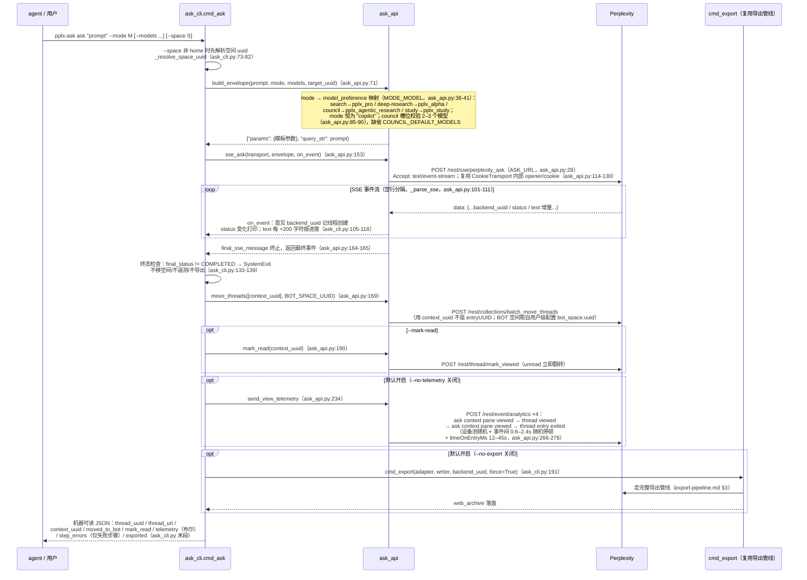
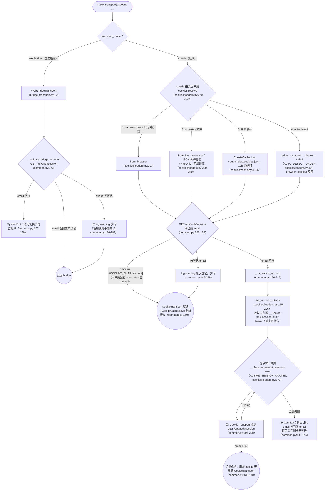

# pplx-ask 与多账户

---

## pplx-ask 时序详图

`cmd_ask`（ask_cli.py:85-197）的完整时序：envelope 构造 → SSE 流 → 终态检查 →
BOT 空间 → 已读回执 → 人性化遥测 → 复用导出管线归档。

设计要点：

- **envelope 是实测参数模板**：`_BASE_PARAMS`（ask_api.py:44-68）25 个固定键
  （含 32 项 `supported_block_use_cases`、语言/时区/搜索焦点等），`build_envelope`
  再注入 mode/模型/frontend_uuid 等字段，与浏览器真实提交一致（对照
  [../reference/api/api-rest-endpoints.md](../reference/api/api-rest-endpoints.md) §3.9 与 `docs/perplexity-api-samples/` 的 39-params 样本）。
- **SSE 消费不走 Transport ABC**：流式接口不在 `get_json/post_json/download`
  抽象内，`post_stream` 直接复用 `CookieTransport` 的 `_cookie_header`/`_opener`
  （ask_api.py:126-130）——这是 [§1](overview.md) 提到的刻意耦合。
- **遥测的人性化**：`_DEVICE_POOL` 三设备随机（ask_api.py:210-214）、随机停顿、
  随机阅读时长，事件 schema 与浏览器实测逐项对齐（`_telemetry_event`，
  ask_api.py:217-231）；已读回执与遥测分离——analytics 的 "thread viewed" 不翻转
  unread，真回执是 `mark_viewed`（ask_api.py:194-201 注释）。

---

## 多账户 cookie 切换流程

cookie 解析与账户校验在 `commands/common.py:make_transport`（common.py:93-155）；
来源枚举在 `core/cookies/loaders.py`；webbridge 通路校验在 `_validate_bridge_account`
（common.py:158-187）。

要点：

- **多账户模型**：同浏览器每账户一条 `__Secure-pplx.session.<uid>` cookie；
  切换 = 把目标账户那条的值写进 `__Secure-next-auth.session-token`（cookies/loaders.py:180-187
  注释；机制实测见 [../reference/api/api-authentication.md](../reference/api/api-authentication.md) §1.2）。无需操作浏览器 UI。
- **缓存跟随 `--out`**：`<out_root>/index/.cookies.json`（common.py:111），
  含 fetched_at/source/account_email，成功校验后总是刷新（common.py:150）。
- **webbridge 与 cookie 互斥**：`--cookies/--cookies-from` 与 `--transport webbridge`
  同给即报错（cli.py:228-232；common.py:112-116）。
- `core/auth.py:CredentialProvider`（WebBridge 提取 cookie：CDP Storage.getCookies
  优先、document.cookie 兜底，auth.py:42-68）属**预留降级链**，当前唯一调用方是
  `cookies.from_webbridge`（cookies/loaders.py:252-267）。
