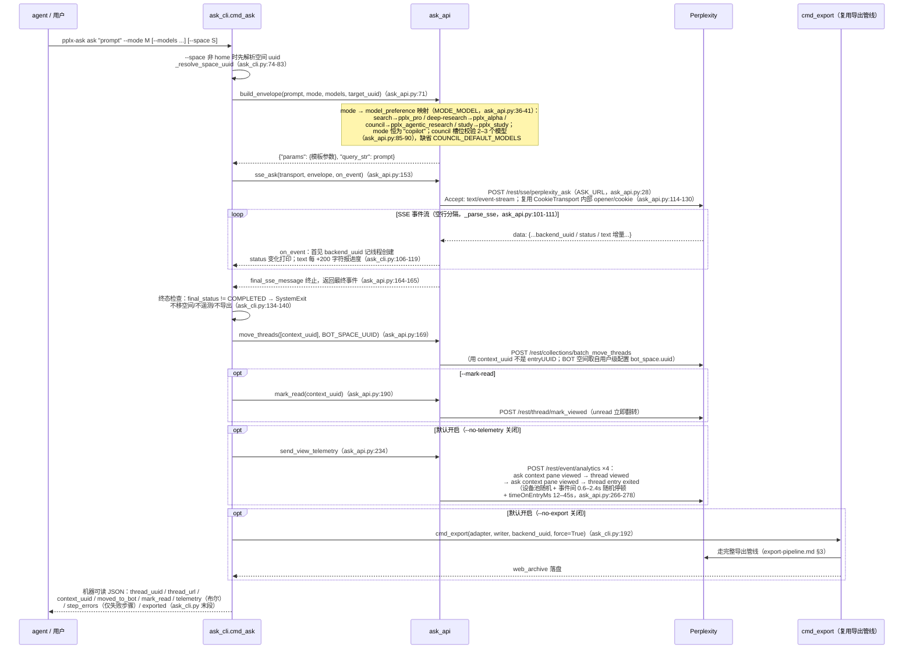
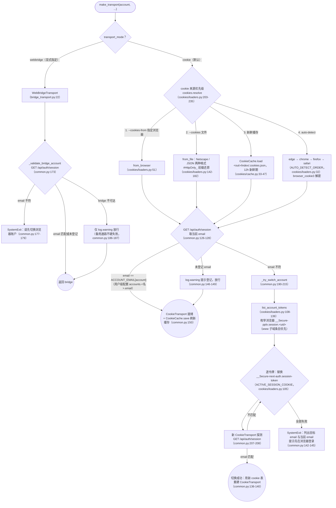

# pplx-ask 與多帳戶

---

## pplx-ask 時序詳圖

`cmd_ask`（ask_cli.py:86-198）的完整時序：envelope 構造 → SSE 流 → 終態檢查 →
BOT 空間 → 已讀回執 → 人性化遙測 → 複用匯出管線歸檔。

設計要點：

- **envelope 是實測參數模板**：`_BASE_PARAMS`（ask_api.py:44-68）25 個固定鍵
  （含 32 項 `supported_block_use_cases`、語言/時區/搜尋焦點等），`build_envelope`
  再注入 mode/模型/frontend_uuid 等欄位，與瀏覽器真實提交一致（對照
  [../reference/api/api-rest-endpoints.md](../reference/api/api-rest-endpoints.md) §3.9 與 `docs/perplexity-api-samples/` 的 39-params 樣本）。
- **SSE 消費不走 Transport ABC**：流式介面不在 `get_json/post_json/download`
  抽象內，`post_stream` 直接複用 `CookieTransport` 的 `_cookie_header`/`_opener`
  （ask_api.py:126-130）——這是 [§1](overview.md) 提到的刻意耦合。
- **遙測的人性化**：`_DEVICE_POOL` 三設備隨機（ask_api.py:210-214）、隨機停頓、
  隨機閱讀時長，事件 schema 與瀏覽器實測逐項對齊（`_telemetry_event`，
  ask_api.py:217-231）；已讀回執與遙測分離——analytics 的 "thread viewed" 不翻轉
  unread，真回執是 `mark_viewed`（ask_api.py:194-201 註釋）。

---

## 多帳戶 cookie 切換流程

cookie 解析與帳戶校驗在 `commands/common.py:make_transport`（common.py:93-155）；
來源列舉在 `core/cookies/loaders.py`；webbridge 通路校驗在 `_validate_bridge_account`
（common.py:158-187）。

要點：

- **多帳戶模型**：同瀏覽器每帳戶一條 `__Secure-pplx.session.<uid>` cookie；
  切換 = 把目標帳戶那條的值寫進 `__Secure-next-auth.session-token`（cookies/loaders.py:113-120
  註釋；機制實測見 [../reference/api/api-authentication.md](../reference/api/api-authentication.md) §1.2）。無需操作瀏覽器 UI。
- **快取跟隨 `--out`**：`<out_root>/index/.cookies.json`（common.py:111），
  含 fetched_at/source/account_email，成功校驗後總是重新整理（common.py:150）。
- **webbridge 與 cookie 互斥**：`--cookies/--cookies-from` 與 `--transport webbridge`
  同給即報錯（cli.py:229-233；common.py:112-116）。
- `core/auth.py:CredentialProvider`（WebBridge 提取 cookie：CDP Storage.getCookies
  優先、document.cookie 兜底，auth.py:41-67）屬**預留降級鏈**，當前唯一呼叫方是
  `cookies.from_webbridge`（cookies/loaders.py:185-200）。
