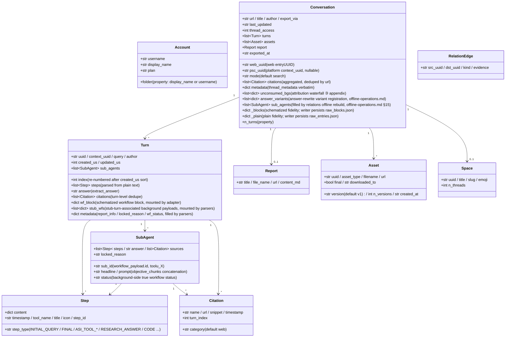

<a id="data-model-and-directory-contract" data-pplx-source-anchor="true"></a>
# نموذج البيانات وعقد الدليل

<a id="data-model-coremodelspy" data-pplx-source-anchor="true"></a>
## نموذج البيانات (core/models.py)

يتم تعيين جميع بيانات JSON الأولية للموقع بواسطة المحللات إلى فئات البيانات هذه؛ تعتمد المراحل النهائية (التقديم/الكتابة/العلاقات) فقط على هذه الطبقة. `Conversation._blocks/_plain` هي نسخ مطابقة للاستجابات الأولية (repr=False).



ملاحظات المسؤولية (أرقام الأسطر نسبة إلى `core/models.py`):

- **`Turn.wf_block`** (models.py:127): كتلة سير العمل المخططة للكمبيوتر/المجلس، يتم تركيبها بواسطة `parsers.attach_workflow_blocks` بواسطة uuid الإدخال (parsers.py:231-256)؛ يعتمد عليها التقديم وتراجع الإجابة (`_turn_answer`, render.py:489)؛ الكاتب للقراءة فقط.
- **`Turn.stub_wfs`** (models.py:131): حمولات الخلفية المرتبطة بتحولات نتيجة الوكيل الفرعي عبر نافذة الـ 10 ثوانٍ (يتم تركيبها بواسطة parsers.match_stub_workflows).
- **`Turn.metadata`** (models.py:134): ثلاثة مفاتيح — `report_info` (خطوة RESEARCH_ANSWER، parsers.py:199-204)، `locked_reason` (parsers.py:205-208)، `wf_status` (parsers.py:256).
- **`Conversation.unconsumed_bgs`** (models.py:165-170): مصدر البيانات للتراجع الثالث لشلال الإسناد، `[{wp, locked_reason, updated, bg_uuid}]`، يتم تقديمه كملحق في نهاية conversation.md.
- **`Conversation.answer_variants`** (models.py:171-177): تسجيل متغيرات إعادة كتابة الإجابة (مصدر بيانات thread.json.answer_variants)؛ `parsers.collect_answer_variants` (parsers.py:589) يستخرج من `entries[].side_by_side_metadata` بمعايير تضييق — سلسلة الكشف في [§18](offline-operations.md).
- **`Conversation.sub_agents`** (models.py:178-182): قائمة تشغيل الوكيل الفرعي على مستوى المحادثة، يتم ملؤها بواسطة `adapter.sub_agents` فقط أثناء إعادة البناء غير المتصل `cmd_relations`؛ خط التصدير لا يعيد ملء هذا الحقل (الكاتب يقدم مع خريطة فرعية محلية؛ العلاقات تقرأ هنا) — انظر [§15](offline-operations.md).
- **`Conversation._blocks/_plain`** (models.py:183-190): دقة الاستجابة الأولية؛ `fs_writer` يحتفظ بها حرفيًا كـ raw_*.json (fs_writer.py:257-266)؛ يمكن إنشاء `get_report/get_assets/sub_agents` and offline re-render all read from them. `PerplexityAdapter(None)` مع نقل None لإعادة استخدام تجميع البيانات النقية (rerender_cmd.py:138).
- **المعرف المزدوج**: `web_uuid` = entryUUID الويب (رابط الموضوع)؛ `psc_uuid` = UUID المنصة `past_session_contexts`، مأخوذ من أول `context_uuid` غير فارغ (adapter.py:99).

---

<a id="write-boundaries-and-directory-contract" data-pplx-source-anchor="true"></a>
## حدود الكتابة وعقد الدليل

<a id="the-web_archive-thread-archive-tool-generated-content-files-not-hand-edited" data-pplx-source-anchor="true"></a>
### أرشيف موضوع web_archive (منشأ بواسطة الأداة؛ ملفات المحتوى غير محررة يدويًا)

```
web_archive/
├── <account display name>/               # author_folder → _safe_folder cleanup
│   │                                     #   (fs_writer.py:40-51; spaces kept, e.g. "Alice Example")
│   ├── <mode>/                           # search | deep-research | computer | council | study
│   │   └── <YYYY-MM-DD>_<title-slug>_<uuid8>/     # thread_dir_for (fs_writer.py:58-72)
│   │       ├── thread.json               # metadata + interruptions / answer_variants (optional keys) + report_info + psc_uuid
│   │       ├── conversation.md           # compact: per-turn Query/Answer + background appendix (render.py:641)
│   │       ├── turns/turn_NNNN.md        # full: complete work-process detail (render.py:596)
│   │       ├── sources.json / sources.md # thread-wide citations (deduped by url)
│   │       ├── report.md                 # deep-research report (exists only when there is one)
│   │       ├── raw_entries.json          # plain response fidelity (always present)
│   │       ├── raw_blocks.json           # schematized fidelity (absent for search)
│   │       └── assets/
│   │           ├── assets_manifest.json  # versioned manifest (uuid/type/version/destination)
│   │           └── files/                # downloaded bodies (resolve_ext decides extensions)
│   └── ...
├── index/                                # state and indexes (see 14.2)
├── relations/                            # edges.jsonl + graph.md (rebuilt by the relations command)
├── crosscheck/                           # cross-validation reports (manual/review artifacts)
└── <account 2>/ ...
```

<a id="web_archiveindex-state-files-tool-managed-do-not-hand-edit" data-pplx-source-anchor="true"></a>
### ملفات حالة web_archive/index/ (مدارة بواسطة الأداة، لا تحرر يدويًا)

| الملف | الكاتب | الدلالة |
|---|---|---|
| `library_<account>.json` | `cmd_index` (index_cmd.py) | فهرس موضوعات الحساب (GraphQL)؛ يتم دمجه تدريجيًا افتراضيًا (`--full` يعيد الكتابة)؛ يحمل أيضًا `last_full_index_at` / `incremental_runs_since_full`؛ إدخال لفهارس الدفعة/الجدولة/المساحات |
| `batch_state.json` | `BatchState` (state.py) | نقطة تفتيش: uuid → حالة (ok/error/expired/deleted) + lastUpdated؛ كتابات ذرية؛ الملفات التالفة تُنسخ احتياطيًا تلقائيًا كـ `.corrupt-<ts>` |
| `.cookies.json` | `CookieCache` (common.py:111, 150) | ذاكرة تخزين مؤقت لملفات تعريف الارتباط (حداثة 12 ساعة)، مع المصدر والبريد الإلكتروني للحساب؛ كتابة ذرية: يتم إنشاء ملف مؤقت بـ 0o600 ثم os.replace (cookies/cache.py:59-67 — بيانات جلسة العمل قابلة للقراءة فقط من قبل المالك؛ ضمن نطاق gitignore) |
| `space_<slug>.json` | `cmd_space_index` (spaces_cmd.py:106-167) | قائمة موضوعات "الكل" لكل مساحة (بما في ذلك تعيين المعرف المزدوج context_uuid) |
| `space_meta.json` | `cmd_spaces --fetch-meta` (spaces_cmd.py:299-330) | ذاكرة تخزين مؤقت لمالك/عضو المساحة (يُعاد استخدامها عند إعادة بناء الفهارس، لتجنب إعادة الجلب) |
| `credit_usage_<account>.json` | `cmd_usage_backfill` (usage_backfill_cmd.py:17) | استخدام الائتمان لكل موضوع (عديم الحالة وقابل للاستئناف، يتم مسحه كل 25 إدخالًا) |
| `cron_snippet.txt` | `cmd_schedule` (scheduler.py:48-78) | مقتطف استدعاء cron (مسارات مطلقة) |
| `answer_variants_log.jsonl` | `variant_log.append_registry` (variant_log.py:76) | سجل مركزي لمتغيرات إعادة كتابة الإجابة (إزالة التكرار حسب الموضوع+الإدخال، عديم الحالة؛ ملف مُسجل، وليس logs/) — سلسلة الكشف في [§18](offline-operations.md) |
| `logs/` | `--log-file` (common.py:218-229) | سجلات DEBUG كاملة (مُهملة بواسطة gitignore) |

<a id="the-spaces-index-layer-repository-root-tool-generated" data-pplx-source-anchor="true"></a>
### طبقة فهارس spaces/ (جذر المستودع، منشأ بواسطة الأداة)

`cmd_spaces` يعيد البناء عن طريق تجميع `index/library_*.json` (spaces_cmd.py:259-389):
واحد `<slug>.md` لكل مساحة (تجميع الحسابات المشاركة + رأس المالك/العضو +
جدول الموضوعات + روابط خلفية لموقع التصدير) بالإضافة إلى سجل `spaces.json`. **ملاحظة**: دليل
الإخراج هو `spaces/` نسبة إلى CWD (spaces_cmd.py:332) — لا يتبع `--out`؛
يتم تجميع معلومات الحسابات المشاركة محليًا بحتًا، بينما يأتي المالكون/الأعضاء من
ذاكرة التخزين المؤقت `index/space_meta.json`. لا تحرر يدويًا — إعادة البناء التالية تستبدل.

<a id="hand-editable-vs-tool-managed" data-pplx-source-anchor="true"></a>
### قابل للتحرير يدويًا مقابل مُدار بالأداة

- **قابل للتحرير يدويًا**: [مستند تصميم النظام](overview.md)، [مرجع API](../reference/api/api-authentication.md)، ملف README للمشروع ومستندات
  المواصفات الأخرى، وتقارير المراجعة `web_archive/crosscheck/` (مستندات المواصفات وقطع المراجعة).
- **مُدار بالأداة (لا تحرر ملفات المحتوى يدويًا)**: جميع القطع في أدلة موضوعات `web_archive/`،
  `index/`، `spaces/`، `relations/` — عندما تكون التغييرات مطلوبة، قم بتغيير الأداة وأعد
  التشغيل (تعديلات التقديم تمر عبر إعادة التقديم، تعديلات البيانات عبر أمر التعبئة الخلفية المقابل)،
  مع الحفاظ على مصدر واحد للقطع القابلة لإعادة الإنتاج.
