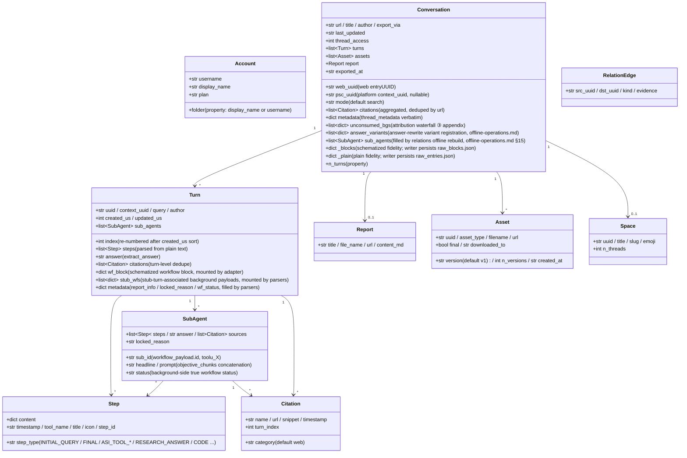

<a id="data-model-and-directory-contract" data-pplx-source-anchor="true"></a>
# Datenmodell und Verzeichnisvertrag

<a id="data-model-coremodelspy" data-pplx-source-anchor="true"></a>
## Datenmodell (core/models.py)

Alle rohen JSON-Daten der Site werden von Parsern in diese Dataclasses abgebildet; nachgelagerte Komponenten (Render/Writer/Relations) hängen nur von dieser Schicht ab. `Conversation._blocks/_plain` sind originalgetreue Abbilder der Rohantworten (repr=False).



Verantwortlichkeitshinweise (Zeilennummern relativ zu `core/models.py`):

- **`Turn.wf_block`** (models.py:127): der schematisierte Workflow-Block von Computer/Council, eingehängt durch `parsers.attach_workflow_blocks` nach Eintrags-UUID (parsers.py:231-256); Rendering und Antwort-Fallback (`_turn_answer`, render.py:489) hängen davon ab; Writer ist schreibgeschützt.
- **`Turn.stub_wfs`** (models.py:131): Hintergrund-Payloads, die über das 10-Sekunden-Fenster mit Subagent-Ergebnis-Stub-Turns verknüpft sind (eingehängt durch parsers.match_stub_workflows).
- **`Turn.metadata`** (models.py:134): drei Schlüssel — `report_info` (RESEARCH_ANSWER-Schritt, parsers.py:199-204), `locked_reason` (parsers.py:205-208), `wf_status` (parsers.py:256).
- **`Conversation.unconsumed_bgs`** (models.py:165-170): die Datenquelle des dritten Fallbacks im Attributions-Wasserfall, `[{wp, locked_reason, updated, bg_uuid}]`, gerendert als Anhang am Ende von conversation.md.
- **`Conversation.answer_variants`** (models.py:171-177): Antwort-Umschreibungs-Variantenregistrierung (Datenquelle von thread.json.answer_variants); `parsers.collect_answer_variants` (parsers.py:589) extrahiert aus `entries[].side_by_side_metadata` mit Eingrenzungskriterien — Erkennungskette in [§18](offline-operations.md).
- **`Conversation.sub_agents`** (models.py:178-182): Konversations-Level-Subagent-Ausführungsliste, gefüllt von `adapter.sub_agents` nur während der `cmd_relations`-Offline-Neuerstellung; die Export-Pipeline füllt dieses Feld nicht nach (Writer rendert mit einem lokalen sub_map; Relations liest hier) — siehe [§15](offline-operations.md).
- **`Conversation._blocks/_plain`** (models.py:183-190): Originaltreue der Rohantworten; `fs_writer` speichert sie unverändert als raw_*.json (fs_writer.py:257-266); `get_report/get_assets/sub_agents` and offline re-render all read from them. `PerplexityAdapter(None)` kann mit einem None-Transport konstruiert werden, um reine Datenmontage wiederzuverwenden (rerender_cmd.py:138).
- **Duale ID**: `web_uuid` = Web-Eintrags-UUID (Thread-URL); `psc_uuid` = Plattform-`past_session_contexts`-UUID, übernommen aus der ersten nicht-leeren Turns `context_uuid` (adapter.py:99).

---

<a id="write-boundaries-and-directory-contract" data-pplx-source-anchor="true"></a>
## Schreibgrenzen und Verzeichnisvertrag

<a id="the-web_archive-thread-archive-tool-generated-content-files-not-hand-edited" data-pplx-source-anchor="true"></a>
### Das web_archive-Thread-Archiv (tool-generiert; Inhaltsdateien nicht manuell bearbeitet)

```
web_archive/
├── <account display name>/               # author_folder → _safe_folder cleanup
│   │                                     #   (fs_writer.py:40-51; spaces kept, e.g. "Alice Example")
│   ├── <mode>/                           # search | deep-research | computer | council | study
│   │   └── <YYYY-MM-DD>_<title-slug>_<uuid8>/     # thread_dir_for (fs_writer.py:58-72)
│   │       ├── thread.json               # metadata + interruptions / answer_variants (optional keys) + report_info + psc_uuid
│   │       ├── conversation.md           # compact: per-turn Query/Answer + background appendix (render.py:641)
│   │       ├── turns/turn_NNNN.md        # full: complete work-process detail (render.py:596)
│   │       ├── sources.json / sources.md # thread-wide citations (deduped by url)
│   │       ├── report.md                 # deep-research report (exists only when there is one)
│   │       ├── raw_entries.json          # plain response fidelity (always present)
│   │       ├── raw_blocks.json           # schematized fidelity (absent for search)
│   │       └── assets/
│   │           ├── assets_manifest.json  # versioned manifest (uuid/type/version/destination)
│   │           └── files/                # downloaded bodies (resolve_ext decides extensions)
│   └── ...
├── index/                                # state and indexes (see 14.2)
├── relations/                            # edges.jsonl + graph.md (rebuilt by the relations command)
├── crosscheck/                           # cross-validation reports (manual/review artifacts)
└── <account 2>/ ...
```

<a id="web_archiveindex-state-files-tool-managed-do-not-hand-edit" data-pplx-source-anchor="true"></a>
### web_archive/index/-Zustandsdateien (tool-verwaltet, nicht manuell bearbeiten)

| Datei | Writer | Semantik |
|---|---|---|
| `library_<account>.json` | `cmd_index` (index_cmd.py) | Konto-Thread-Index (GraphQL); standardmäßig inkrementell zusammengeführt (`--full` überschreibt); enthält auch `last_full_index_at` / `incremental_runs_since_full`; Eingabe für Batch-/Zeitplanungs-/Bereichsindizes |
| `batch_state.json` | `BatchState` (state.py) | Prüfpunkt: UUID → Status(ok/error/expired/deleted) + lastUpdated; atomare Schreibvorgänge; beschädigte Dateien werden automatisch als `.corrupt-<ts>` gesichert |
| `.cookies.json` | `CookieCache` (common.py:111, 150) | Cookie-Cache (12h Frische), mit Quelle und Konto-E-Mail; atomarer Schreibvorgang: temporäre Datei mit 0o600 erstellt, dann os.replace (cookies/cache.py:59-67 — Sitzungsanmeldeinformationen nur für den Eigentümer lesbar; innerhalb des gitignore-Bereichs) |
| `space_<slug>.json` | `cmd_space_index` (spaces_cmd.py:106-167) | Pro-Bereich "Alle"-Thread-Liste (inkl. context_uuid-Dual-ID-Zuordnung) |
| `space_meta.json` | `cmd_spaces --fetch-meta` (spaces_cmd.py:299-330) | Bereichsbesitzer-/Mitglieder-Cache (wiederverwendet beim Neuerstellen von Indizes, vermeidet erneutes Abrufen) |
| `credit_usage_<account>.json` | `cmd_usage_backfill` (usage_backfill_cmd.py:17) | Pro-Thread-Guthabennutzung (idempotent und fortsetzbar, alle 25 Einträge geleert) |
| `cron_snippet.txt` | `cmd_schedule` (scheduler.py:48-78) | Cron-Aufruf-Ausschnitt (absolute Pfade) |
| `answer_variants_log.jsonl` | `variant_log.append_registry` (variant_log.py:76) | Zentrales Antwort-Umschreibungs-Variantenregister (dedupliziert nach Thread+Eintrag, idempotent; eine eingecheckte Datei, nicht logs/) — Erkennungskette in [§18](offline-operations.md) |
| `logs/` | `--log-file` (common.py:218-229) | Vollständige DEBUG-Protokolle (gitignoriert) |

<a id="the-spaces-index-layer-repository-root-tool-generated" data-pplx-source-anchor="true"></a>
### Die spaces/-Indexschicht (Repository-Stamm, tool-generiert)

`cmd_spaces` erstellt durch Aggregation von `index/library_*.json` (spaces_cmd.py:259-389): ein `<slug>.md` pro Bereich (teilnehmende-Konto-Aggregation + Besitzer/Mitglieder-Kopfzeile + Thread-Tabelle + Exportort-Rückverweise) plus das `spaces.json`-Register. **Hinweis**: Das Ausgabeverzeichnis ist `spaces/` relativ zum aktuellen Arbeitsverzeichnis (spaces_cmd.py:332) — es folgt nicht `--out`; Informationen zu teilnehmenden Konten werden rein lokal aggregiert, während Besitzer/Mitglieder aus dem `index/space_meta.json`-Cache stammen. Nicht manuell bearbeiten — die nächste Neuerstellung überschreibt.

<a id="hand-editable-vs-tool-managed" data-pplx-source-anchor="true"></a>
### Manuell bearbeitbar vs. tool-verwaltet

- **Manuell bearbeitbar**: das [Systementwurfsdokument](overview.md), die [API-Referenz](../reference/api/api-authentication.md), das Projekt-README und andere Spezifikationsdokumente sowie die `web_archive/crosscheck/`-Überprüfungsberichte (Spezifikationsdokumente und Überprüfungsartefakte).
- **Tool-verwaltet (Inhaltsdateien nicht manuell bearbeiten)**: alle Artefakte in `web_archive/`-Thread-Verzeichnissen, `index/`, `spaces/`, `relations/` — wenn Änderungen erforderlich sind, ändern Sie das Tool und führen Sie es erneut aus (Render-Korrekturen erfolgen durch erneutes Rendern, Datenkorrekturen durch den entsprechenden Backfill-Befehl), um eine einzige Quelle reproduzierbarer Artefakte zu erhalten.
