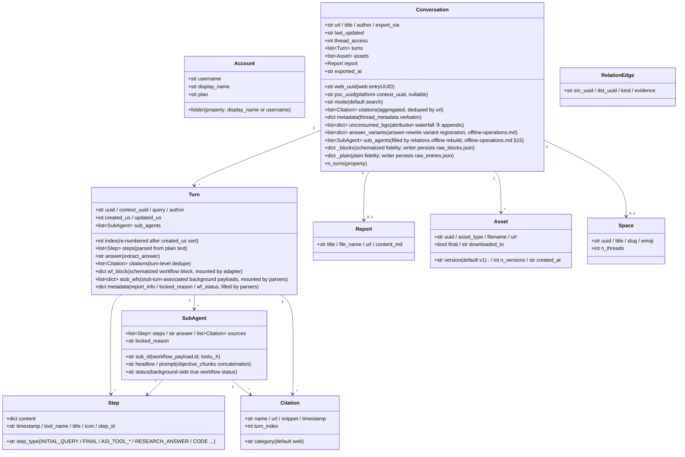

<a id="data-model-and-directory-contract" data-pplx-source-anchor="true"></a>
# Modelo de datos y contrato de directorio

<a id="data-model-coremodelspy" data-pplx-source-anchor="true"></a>
## Modelo de datos (core/models.py)

Todo el JSON sin procesar del sitio es mapeado por analizadores en estas dataclasses; los componentes posteriores (render/writer/relations) dependen solo de esta capa. `Conversation._blocks/_plain` son montajes de fidelidad de las respuestas sin procesar (repr=False).



Notas de responsabilidad (números de línea relativos a `core/models.py`):

- **`Turn.wf_block`** (models.py:127): el bloque de flujo de trabajo esquematizado de computer/council, montado por `parsers.attach_workflow_blocks` por uuid de entrada (parsers.py:231-256); la representación y el fallback de respuesta (`_turn_answer`, render.py:489) dependen de él; el escritor es de solo lectura.
- **`Turn.stub_wfs`** (models.py:131): cargas útiles de fondo asociadas a los stub de subagent_result a través de la ventana de 10s (montado por parsers.match_stub_workflows).
- **`Turn.metadata`** (models.py:134): tres claves — `report_info` (paso RESEARCH_ANSWER, parsers.py:199-204), `locked_reason` (parsers.py:205-208), `wf_status` (parsers.py:256).
- **`Conversation.unconsumed_bgs`** (models.py:165-170): la fuente de datos del fallback de tercer nivel de la cascada de atribución, `[{wp, locked_reason, updated, bg_uuid}]`, representado como apéndice al final de conversation.md.
- **`Conversation.answer_variants`** (models.py:171-177): registro de variantes de reescritura de respuesta (fuente de datos de thread.json.answer_variants); `parsers.collect_answer_variants` (parsers.py:589) extrae de `entries[].side_by_side_metadata` con criterios de reducción — cadena de detección en [§18](offline-operations.md).
- **`Conversation.sub_agents`** (models.py:178-182): lista de ejecuciones de subagentes a nivel de conversación, llenada por `adapter.sub_agents` solo durante la reconstrucción offline de `cmd_relations`; el pipeline de exportación no rellena este campo (el escritor renderiza con un sub_map local; relations lee aquí) — ver [§15](offline-operations.md).
- **`Conversation._blocks/_plain`** (models.py:183-190): fidelidad de respuesta sin procesar; `fs_writer` los persiste textualmente como raw_*.json (fs_writer.py:257-266); `get_report/get_assets/sub_agents` and offline re-render all read from them. `PerplexityAdapter(None)` puede construirse con un transporte None para reutilizar el ensamblaje de datos puros (rerender_cmd.py:138).
- **ID dual**: `web_uuid` = web entryUUID (URL del hilo); `psc_uuid` = UUID de plataforma `past_session_contexts`, tomado del primer turno no vacío de `context_uuid` (adapter.py:99).

---

<a id="write-boundaries-and-directory-contract" data-pplx-source-anchor="true"></a>
## Límites de escritura y contrato de directorio

<a id="the-web_archive-thread-archive-tool-generated-content-files-not-hand-edited" data-pplx-source-anchor="true"></a>
### El archivo de hilos web_archive (generado por herramientas; archivos de contenido no editados manualmente)

```
web_archive/
├── <account display name>/               # author_folder → _safe_folder cleanup
│   │                                     #   (fs_writer.py:40-51; spaces kept, e.g. "Alice Example")
│   ├── <mode>/                           # search | deep-research | computer | council | study
│   │   └── <YYYY-MM-DD>_<title-slug>_<uuid8>/     # thread_dir_for (fs_writer.py:58-72)
│   │       ├── thread.json               # metadata + interruptions / answer_variants (optional keys) + report_info + psc_uuid
│   │       ├── conversation.md           # compact: per-turn Query/Answer + background appendix (render.py:641)
│   │       ├── turns/turn_NNNN.md        # full: complete work-process detail (render.py:596)
│   │       ├── sources.json / sources.md # thread-wide citations (deduped by url)
│   │       ├── report.md                 # deep-research report (exists only when there is one)
│   │       ├── raw_entries.json          # plain response fidelity (always present)
│   │       ├── raw_blocks.json           # schematized fidelity (absent for search)
│   │       └── assets/
│   │           ├── assets_manifest.json  # versioned manifest (uuid/type/version/destination)
│   │           └── files/                # downloaded bodies (resolve_ext decides extensions)
│   └── ...
├── index/                                # state and indexes (see 14.2)
├── relations/                            # edges.jsonl + graph.md (rebuilt by the relations command)
├── crosscheck/                           # cross-validation reports (manual/review artifacts)
└── <account 2>/ ...
```

<a id="web_archiveindex-state-files-tool-managed-do-not-hand-edit" data-pplx-source-anchor="true"></a>
### Archivos de estado de web_archive/index/ (gestionados por herramientas, no editar manualmente)

| Archivo | Escritor | Semántica |
|---|---|---|
| `library_<account>.json` | `cmd_index` (index_cmd.py:17-43) | índice completo de hilos de la cuenta (GraphQL); entrada para índices de lote/programación/espacios |
| `batch_state.json` | `BatchState` (state.py) | punto de control: uuid → estado(ok/error/expired/deleted) + lastUpdated; escrituras atómicas; archivos corruptos respaldados automáticamente como `.corrupt-<ts>` |
| `.cookies.json` | `CookieCache` (common.py:111, 150) | caché de cookies (frescura de 12h), con fuente y correo electrónico de la cuenta; escritura atómica: archivo temporal creado con 0o600 luego os.replace (cookies/cache.py:59-67 — credenciales de sesión legibles solo por el propietario; dentro del ámbito de gitignore) |
| `space_<slug>.json` | `cmd_space_index` (spaces_cmd.py:106-167) | lista de "todos" los hilos por espacio (incluye el mapeo de ID dual context_uuid) |
| `space_meta.json` | `cmd_spaces --fetch-meta` (spaces_cmd.py:299-330) | caché de propietario/miembro del espacio (reutilizado al reconstruir índices, evitando recuperación adicional) |
| `credit_usage_<account>.json` | `cmd_usage_backfill` (usage_backfill_cmd.py:17) | uso de crédito por hilo (idempotente y reanudable, vaciado cada 25 entradas) |
| `cron_snippet.txt` | `cmd_schedule` (scheduler.py:48-78) | fragmento de invocación de cron (rutas absolutas) |
| `answer_variants_log.jsonl` | `variant_log.append_registry` (variant_log.py:76) | registro central de variantes de reescritura de respuesta (deduplicado por hilo+entrada, idempotente; archivo verificado, no logs/) — cadena de detección en [§18](offline-operations.md) |
| `logs/` | `--log-file` (common.py:218-229) | registros DEBUG completos (gitignorados) |

<a id="the-spaces-index-layer-repository-root-tool-generated" data-pplx-source-anchor="true"></a>
### La capa de índice spaces/ (raíz del repositorio, generada por herramientas)

`cmd_spaces` reconstruye agregando `index/library_*.json` (spaces_cmd.py:259-389): un `<slug>.md` por espacio (agregación de cuentas participantes + encabezado de propietario/miembro + tabla de hilos + enlaces de retroceso de ubicación de exportación) más el registro `spaces.json`. **Nota**: el directorio de salida es `spaces/` relativo al CWD (spaces_cmd.py:332) — no sigue a `--out`; la información de cuentas participantes se agrega puramente de forma local, mientras que los propietarios/miembros provienen de la caché `index/space_meta.json`. No editar manualmente — la próxima reconstrucción sobrescribe.

<a id="hand-editable-vs-tool-managed" data-pplx-source-anchor="true"></a>
### Editable manualmente vs gestionado por herramientas

- **Editable manualmente**: el [documento de diseño del sistema](overview.md), la [referencia de API](../reference/api/api-authentication.md), el README del proyecto y otros documentos de especificación, y los informes de revisión `web_archive/crosscheck/` (documentos de especificación y artefactos de revisión).
- **Gestionado por herramientas (no editar manualmente los archivos de contenido)**: todos los artefactos en directorios de hilos `web_archive/`, `index/`, `spaces/`, `relations/` — cuando se necesiten cambios, modifique la herramienta y vuelva a ejecutar (las correcciones de representación pasan por re-renderización, las correcciones de datos por el comando de backfill correspondiente), manteniendo una única fuente de artefactos reproducibles.
