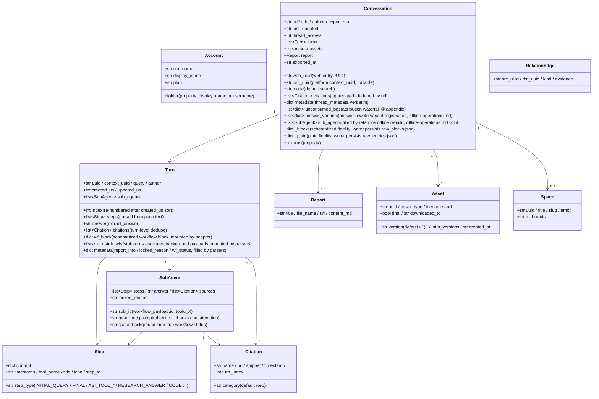

<a id="data-model-and-directory-contract" data-pplx-source-anchor="true"></a>
# Modèle de données et contrat de répertoire

<a id="data-model-coremodelspy" data-pplx-source-anchor="true"></a>
## Modèle de données (core/models.py)

Tout le JSON brut du site est mappé par des analyseurs dans ces dataclasses ; l'aval (render/writer/relations) ne dépend que de cette couche. `Conversation._blocks/_plain` sont des montures de fidélité des réponses brutes (repr=False).



Notes de responsabilité (numéros de ligne relatifs à `core/models.py`) :

- **`Turn.wf_block`** (models.py:127) : le bloc de workflow schématisé de computer/council, monté par `parsers.attach_workflow_blocks` par uuid d'entrée (parsers.py:231-256) ; le rendu et le fallback de réponse (`_turn_answer`, render.py:489) en dépendent ; writer est en lecture seule.
- **`Turn.stub_wfs`** (models.py:131) : charges utiles d'arrière-plan associées aux souches de résultat de sous-agent via la fenêtre de 10 s (monté par parsers.match_stub_workflows).
- **`Turn.metadata`** (models.py:134) : trois clés — `report_info` (étape RESEARCH_ANSWER, parsers.py:199-204), `locked_reason` (parsers.py:205-208), `wf_status` (parsers.py:256).
- **`Conversation.unconsumed_bgs`** (models.py:165-170) : la source de données du troisième niveau de repli de la cascade d'attribution, `[{wp, locked_reason, updated, bg_uuid}]`, rendue comme annexe à la fin de conversation.md.
- **`Conversation.answer_variants`** (models.py:171-177) : enregistrement des variantes de réécriture de réponse (source de données de thread.json.answer_variants) ; `parsers.collect_answer_variants` (parsers.py:589) extrait de `entries[].side_by_side_metadata` avec des critères de restriction — chaîne de détection dans [§18](offline-operations.md).
- **`Conversation.sub_agents`** (models.py:178-182) : liste d'exécution de sous-agent au niveau de la conversation, remplie par `adapter.sub_agents` uniquement lors de la reconstruction hors ligne `cmd_relations` ; le pipeline d'exportation ne remplit pas ce champ (writer rend avec un sub_map local ; relations lit ici) — voir [§15](offline-operations.md).
- **`Conversation._blocks/_plain`** (models.py:183-190) : fidélité de la réponse brute ; `fs_writer` les persiste textuellement sous forme de raw_*.json (fs_writer.py:257-266) ; `get_report/get_assets/sub_agents` and offline re-render all read from them. `PerplexityAdapter(None)` peut être construit avec un transport None pour réutiliser l'assemblage de données pures (rerender_cmd.py:138).
- **Double ID** : `web_uuid` = web entryUUID (URL du fil) ; `psc_uuid` = UUID de plateforme `past_session_contexts`, pris du premier tour non vide de `context_uuid` (adapter.py:99).

---

<a id="write-boundaries-and-directory-contract" data-pplx-source-anchor="true"></a>
## Limites d'écriture et contrat de répertoire

<a id="the-web_archive-thread-archive-tool-generated-content-files-not-hand-edited" data-pplx-source-anchor="true"></a>
### L'archive de fils web_archive (générée par l'outil ; fichiers de contenu non modifiés à la main)

```
web_archive/
├── <account display name>/               # author_folder → _safe_folder cleanup
│   │                                     #   (fs_writer.py:40-51; spaces kept, e.g. "Alice Example")
│   ├── <mode>/                           # search | deep-research | computer | council | study
│   │   └── <YYYY-MM-DD>_<title-slug>_<uuid8>/     # thread_dir_for (fs_writer.py:58-72)
│   │       ├── thread.json               # metadata + interruptions / answer_variants (optional keys) + report_info + psc_uuid
│   │       ├── conversation.md           # compact: per-turn Query/Answer + background appendix (render.py:641)
│   │       ├── turns/turn_NNNN.md        # full: complete work-process detail (render.py:596)
│   │       ├── sources.json / sources.md # thread-wide citations (deduped by url)
│   │       ├── report.md                 # deep-research report (exists only when there is one)
│   │       ├── raw_entries.json          # plain response fidelity (always present)
│   │       ├── raw_blocks.json           # schematized fidelity (absent for search)
│   │       └── assets/
│   │           ├── assets_manifest.json  # versioned manifest (uuid/type/version/destination)
│   │           └── files/                # downloaded bodies (resolve_ext decides extensions)
│   └── ...
├── index/                                # state and indexes (see 14.2)
├── relations/                            # edges.jsonl + graph.md (rebuilt by the relations command)
├── crosscheck/                           # cross-validation reports (manual/review artifacts)
└── <account 2>/ ...
```

<a id="web_archiveindex-state-files-tool-managed-do-not-hand-edit" data-pplx-source-anchor="true"></a>
### Fichiers d'état web_archive/index/ (gérés par l'outil, ne pas modifier à la main)

| Fichier | Writer | Sémantique |
|---|---|---|
| `library_<account>.json` | `cmd_index` (index_cmd.py) | index de fils de compte (GraphQL) ; fusionné de manière incrémentielle par défaut (`--full` réécrit) ; contient également `last_full_index_at` / `incremental_runs_since_full` ; entrée pour les index batch/scheduling/space |
| `batch_state.json` | `BatchState` (state.py) | point de contrôle : uuid → statut (ok/error/expired/deleted) + lastUpdated ; écritures atomiques ; fichiers corrompus sauvegardés automatiquement sous `.corrupt-<ts>` |
| `.cookies.json` | `CookieCache` (common.py:111, 150) | cache de cookies (fraîcheur de 12 h), avec source et email de compte ; écriture atomique : fichier temporaire créé avec 0o600 puis os.replace (cookies/cache.py:59-67 — informations d'identification de session lisibles uniquement par le propriétaire ; dans le périmètre gitignore) |
| `space_<slug>.json` | `cmd_space_index` (spaces_cmd.py:106-167) | liste de fils "tous" par espace (incluant le mappage double ID context_uuid) |
| `space_meta.json` | `cmd_spaces --fetch-meta` (spaces_cmd.py:299-330) | cache propriétaire/membre d'espace (réutilisé lors de la reconstruction des index, évitant une nouvelle récupération) |
| `credit_usage_<account>.json` | `cmd_usage_backfill` (usage_backfill_cmd.py:17) | utilisation de crédit par fil (idempotent et reprenable, vidé tous les 25 enregistrements) |
| `cron_snippet.txt` | `cmd_schedule` (scheduler.py:48-78) | extrait d'invocation cron (chemins absolus) |
| `answer_variants_log.jsonl` | `variant_log.append_registry` (variant_log.py:76) | registre central des variantes de réécriture de réponse (dédoublonné par fil+entrée, idempotent ; fichier versionné, pas logs/) — chaîne de détection dans [§18](offline-operations.md) |
| `logs/` | `--log-file` (common.py:218-229) | journaux DEBUG complets (gitignorés) |

Le `config.toml` au niveau utilisateur contient en plus une table `[models]` gérée par machine (le catalogue de modèles plus `last_refreshed`), écrite par `pplx-ask models --refresh` et initialisée par `pplx-export init` via un aller-retour `tomlkit` qui préserve les autres tables et commentaires de l'utilisateur — schéma dans [Configuration](../guide/configuration.md).

**Note du mainteneur — constantes de protocole épinglées.** Les faits de protocole filaire Perplexity qui sont couplés à l'analyseur/au rendu — l'API `version`, l'enveloppe de demande `supported_block_use_cases`, `supported_features`, et la lecture de fil `SCHEMATIZED_BLOCK_USE_CASES` — sont sourcés de manière unique dans `pplx_export/sites/perplexity/platform.py` et doivent être mis à jour en synchronisation avec `parsers.py` / `render.py` lorsque l'API de la plateforme change (épinglé par un humain, jamais actualisé automatiquement ; un test interdit les copies éparses du littéral de version). Les identifiants de modèle, en revanche, sont des données côté serveur découplées et résident dans le catalogue `[models]` actualisable ci-dessus.

<a id="the-spaces-index-layer-repository-root-tool-generated" data-pplx-source-anchor="true"></a>
### La couche d'index spaces/ (racine du dépôt, générée par l'outil)

`cmd_spaces` reconstruit en agrégeant `index/library_*.json` (spaces_cmd.py:259-389) : un `<slug>.md` par espace (agrégation des comptes participants + en-tête propriétaire/membre + table des fils + liens de retour vers l'emplacement d'exportation) plus le registre `spaces.json`. **Remarque** : le répertoire de sortie est `spaces/` relatif au CWD (spaces_cmd.py:332) — il ne suit pas `--out` ; les informations des comptes participants sont agrégées purement localement, tandis que les propriétaires/membres proviennent du cache `index/space_meta.json`. Ne pas modifier à la main — la prochaine reconstruction écrase.

<a id="hand-editable-vs-tool-managed" data-pplx-source-anchor="true"></a>
### Modifiable à la main vs géré par l'outil

- **Modifiable à la main** : le [document de conception système](overview.md), la [référence API](../reference/api/api-authentication.md), le README du projet et autres documents de spécification, et les rapports de révision `web_archive/crosscheck/` (documents de spécification et artefacts de révision).
- **Géré par l'outil (ne pas modifier les fichiers de contenu à la main)** : tous les artefacts dans les répertoires de fils `web_archive/`, `index/`, `spaces/`, `relations/` — lorsque des modifications sont nécessaires, modifiez l'outil et réexécutez (les corrections de rendu passent par un nouveau rendu, les corrections de données par la commande de remplissage correspondante), en maintenant une source unique d'artefacts reproductibles.
