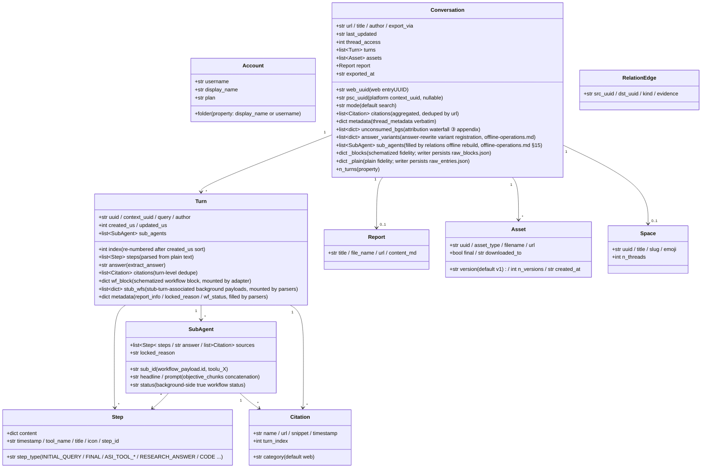

<a id="data-model-and-directory-contract" data-pplx-source-anchor="true"></a>
# Modello dati e contratto di directory

<a id="data-model-coremodelspy" data-pplx-source-anchor="true"></a>
## Modello dati (core/models.py)

Tutto il JSON grezzo del sito viene mappato dai parser in queste dataclass; i componenti a valle (render/writer/relations) dipendono solo da questo livello. `Conversation._blocks/_plain` sono montature fedeli delle risposte grezze (repr=False).



Note sulle responsabilità (numeri di riga relativi a `core/models.py`):

- **`Turn.wf_block`** (models.py:127): il blocco di workflow schematizzato di computer/council, montato da `parsers.attach_workflow_blocks` per entry uuid (parsers.py:231-256); il rendering e il fallback della risposta (`_turn_answer`, render.py:489) dipendono da esso; writer è in sola lettura.
- **`Turn.stub_wfs`** (models.py:131): payload di background associati ai stub turn subagent_result tramite la finestra di 10s (montati da parsers.match_stub_workflows).
- **`Turn.metadata`** (models.py:134): tre chiavi — `report_info` (passo RESEARCH_ANSWER, parsers.py:199-204), `locked_reason` (parsers.py:205-208), `wf_status` (parsers.py:256).
- **`Conversation.unconsumed_bgs`** (models.py:165-170): la fonte dati del fallback di terzo livello della cascata di attribuzione, `[{wp, locked_reason, updated, bg_uuid}]`, renderizzata come appendice alla fine di conversation.md.
- **`Conversation.answer_variants`** (models.py:171-177): registrazione delle varianti di riscrittura della risposta (fonte dati di thread.json.answer_variants); `parsers.collect_answer_variants` (parsers.py:589) estrae da `entries[].side_by_side_metadata` con criteri di restrizione — catena di rilevamento in [§18](offline-operations.md).
- **`Conversation.sub_agents`** (models.py:178-182): elenco delle esecuzioni subagent a livello di conversazione, popolato da `adapter.sub_agents` solo durante la ricostruzione offline `cmd_relations`; la pipeline di esportazione non retropropaga questo campo (writer renderizza con una sub_map locale; relations legge qui) — vedere [§15](offline-operations.md).
- **`Conversation._blocks/_plain`** (models.py:183-190): fedeltà della risposta grezza; `fs_writer` le persiste verbatim come raw_*.json (fs_writer.py:257-266); `get_report/get_assets/sub_agents` and offline re-render all read from them. `PerplexityAdapter(None)` può essere costruito con un trasporto None per riutilizzare l'assemblaggio puro dei dati (rerender_cmd.py:138).
- **Dual ID**: `web_uuid` = web entryUUID (URL thread); `psc_uuid` = UUID della piattaforma `past_session_contexts`, preso dal primo turno non vuoto di `context_uuid` (adapter.py:99).

---

<a id="write-boundaries-and-directory-contract" data-pplx-source-anchor="true"></a>
## Confini di scrittura e contratto di directory

<a id="the-web_archive-thread-archive-tool-generated-content-files-not-hand-edited" data-pplx-source-anchor="true"></a>
### L'archivio thread web_archive (generato da strumenti; file di contenuto non modificati a mano)

```
web_archive/
├── <account display name>/               # author_folder → _safe_folder cleanup
│   │                                     #   (fs_writer.py:40-51; spaces kept, e.g. "Alice Example")
│   ├── <mode>/                           # search | deep-research | computer | council | study
│   │   └── <YYYY-MM-DD>_<title-slug>_<uuid8>/     # thread_dir_for (fs_writer.py:58-72)
│   │       ├── thread.json               # metadata + interruptions / answer_variants (optional keys) + report_info + psc_uuid
│   │       ├── conversation.md           # compact: per-turn Query/Answer + background appendix (render.py:641)
│   │       ├── turns/turn_NNNN.md        # full: complete work-process detail (render.py:596)
│   │       ├── sources.json / sources.md # thread-wide citations (deduped by url)
│   │       ├── report.md                 # deep-research report (exists only when there is one)
│   │       ├── raw_entries.json          # plain response fidelity (always present)
│   │       ├── raw_blocks.json           # schematized fidelity (absent for search)
│   │       └── assets/
│   │           ├── assets_manifest.json  # versioned manifest (uuid/type/version/destination)
│   │           └── files/                # downloaded bodies (resolve_ext decides extensions)
│   └── ...
├── index/                                # state and indexes (see 14.2)
├── relations/                            # edges.jsonl + graph.md (rebuilt by the relations command)
├── crosscheck/                           # cross-validation reports (manual/review artifacts)
└── <account 2>/ ...
```

<a id="web_archiveindex-state-files-tool-managed-do-not-hand-edit" data-pplx-source-anchor="true"></a>
### File di stato web_archive/index/ (gestiti da strumenti, non modificare a mano)

| File | Writer | Semantica |
|---|---|---|
| `library_<account>.json` | `cmd_index` (index_cmd.py) | indice thread dell'account (GraphQL); unito incrementalmente per default (`--full` riscrive); contiene anche `last_full_index_at` / `incremental_runs_since_full`; input per indici batch/scheduling/space |
| `batch_state.json` | `BatchState` (state.py) | checkpoint: uuid → stato(ok/error/expired/deleted) + lastUpdated; scritture atomiche; file corrotti automaticamente salvati come `.corrupt-<ts>` |
| `.cookies.json` | `CookieCache` (common.py:111, 150) | cache dei cookie (freschezza 12h), con source e email account; scrittura atomica: file temporaneo creato con 0o600 poi os.replace (cookies/cache.py:59-67 — credenziali di sessione leggibili solo dal proprietario; nell'ambito gitignore) |
| `space_<slug>.json` | `cmd_space_index` (spaces_cmd.py:106-167) | elenco thread "tutti" per spazio (incl. mappatura dual-ID context_uuid) |
| `space_meta.json` | `cmd_spaces --fetch-meta` (spaces_cmd.py:299-330) | cache proprietario/membro dello spazio (riutilizzata durante la ricostruzione degli indici, evitando un nuovo recupero) |
| `credit_usage_<account>.json` | `cmd_usage_backfill` (usage_backfill_cmd.py:17) | utilizzo crediti per thread (idempotente e riprendibile, scaricato ogni 25 voci) |
| `cron_snippet.txt` | `cmd_schedule` (scheduler.py:48-78) | frammento di invocazione cron (percorsi assoluti) |
| `answer_variants_log.jsonl` | `variant_log.append_registry` (variant_log.py:76) | registro centrale delle varianti di riscrittura della risposta (deduplicato per thread+entry, idempotente; file tracciato, non logs/) — catena di rilevamento in [§18](offline-operations.md) |
| `logs/` | `--log-file` (common.py:218-229) | log DEBUG completi (gitignorati) |

<a id="the-spaces-index-layer-repository-root-tool-generated" data-pplx-source-anchor="true"></a>
### Il livello indice spaces/ (radice del repository, generato da strumenti)

`cmd_spaces` ricostruisce aggregando `index/library_*.json` (spaces_cmd.py:259-389): un `<slug>.md` per spazio (aggregazione account partecipanti + intestazione proprietario/membro + tabella thread + backlink posizione esportazione) più il registro `spaces.json`. **Nota**: la directory di output è `spaces/` relativa a CWD (spaces_cmd.py:332) — non segue `--out`; le informazioni sugli account partecipanti sono aggregate puramente localmente, mentre proprietari/membri provengono dalla cache `index/space_meta.json`. Non modificare a mano — la prossima ricostruzione sovrascrive.

<a id="hand-editable-vs-tool-managed" data-pplx-source-anchor="true"></a>
### Modificabile a mano vs gestito da strumenti

- **Modificabile a mano**: il [documento di progettazione del sistema](overview.md), il [riferimento API](../reference/api/api-authentication.md), il README del progetto e altri documenti di specifica, e i report di revisione `web_archive/crosscheck/` (documenti di specifica e artefatti di revisione).
- **Gestito da strumenti (non modificare a mano i file di contenuto)**: tutti gli artefatti nelle directory thread `web_archive/`, `index/`, `spaces/`, `relations/` — quando sono necessarie modifiche, modificare lo strumento e rieseguire (le correzioni di rendering passano attraverso un re-render, le correzioni dei dati attraverso il corrispondente comando di backfill), mantenendo un'unica fonte di artefatti riproducibili.
