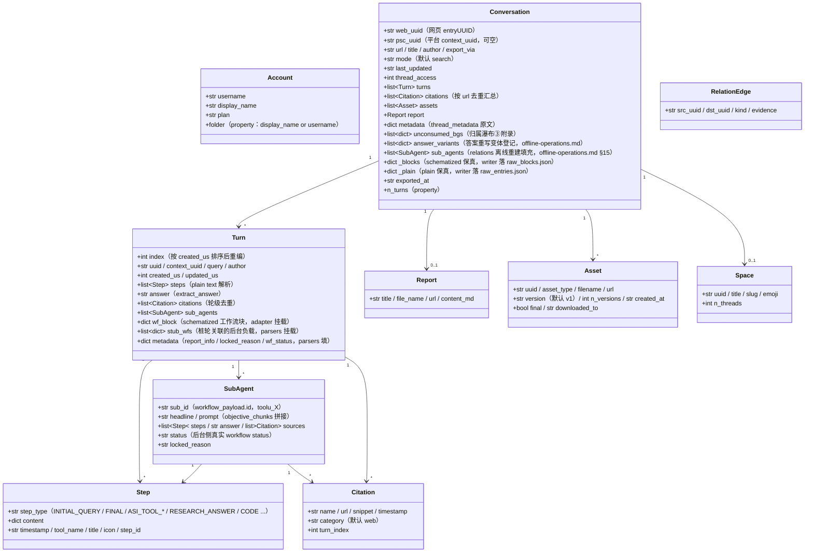

<a id="数据模型与目录契约" data-pplx-source-anchor="true"></a>
# データモデルとディレクトリ契約

<a id="数据模型coremodelspy" data-pplx-source-anchor="true"></a>
## データモデル（core/models.py）

すべてのサイトの生JSONはパーサーによってこれらのdataclassにマッピングされ、下流（render/writer/relations）はこのレイヤーのみに依存します。`Conversation._blocks/_plain`は元のレスポンスの忠実なマウント（repr=False）です。



責務コメント（行番号は`core/models.py`を基準）：

- **`Turn.wf_block`**（models.py:127）：computer/councilのスキーマ化されたワークフローブロック。`parsers.attach_workflow_blocks`によってエントリのuuidでマウントされ（parsers.py:231-256）、レンダリングと回答のフォールバック（`_turn_answer`、render.py:489）が依存します。writerは読み取り専用。
- **`Turn.stub_wfs`**（models.py:131）：subagent_resultスタブが10秒ウィンドウで関連付けられたバックグラウンド負荷（parsers.match_stub_workflowsがマウント）。
- **`Turn.metadata`**（models.py:134）：`report_info`（RESEARCH_ANSWERステップ、parsers.py:199-204）、`locked_reason`（parsers.py:205-208）、`wf_status`（parsers.py:256）の3つのキー。
- **`Conversation.unconsumed_bgs`**（models.py:165-170）：帰属ウォーターフォールの第3レベルのフォールバックデータソース。`[{wp, locked_reason, updated, bg_uuid}]`、conversation.mdの末尾の付録としてレンダリング。
- **`Conversation.answer_variants`**（models.py:171-177）：回答書き換えバリアントの登録（thread.json.answer_variantsデータソース）。`parsers.collect_answer_variants`（parsers.py:589）が`entries[].side_by_side_metadata`から絞り込み基準を抽出——検出チェーンは[§18](offline-operations.md)を参照。
- **`Conversation.sub_agents`**（models.py:178-182）：セッションレベルのサブエージェント実行リスト。`cmd_relations`のオフライン再構築時にのみ`adapter.sub_agents`によって入力されます。エクスポートパイプラインはこのフィールドを再入力しません（writerはローカルのsub_mapを使用してレンダリングし、relationsはここを読み取ります）——[§15](offline-operations.md)を参照。
- **`Conversation._blocks/_plain`**（models.py:183-190）：元のレスポンスの忠実なコピー。`fs_writer`がそのままraw_*.jsonに書き込まれます（fs_writer.py:257-266）。`get_report/get_assets/sub_agents` 与离线 re-render 均从其取数。`PerplexityAdapter(None)`はNone-transportを使用して純粋なデータアセンブリを再利用できます（rerender_cmd.py:138）。
- **二重ID**：`web_uuid` = ウェブページのentryUUID（スレッドURL）。`psc_uuid` = プラットフォームの`past_session_contexts` UUID。最初の非空のターンの`context_uuid`を取得します（adapter.py:99）。

---

<a id="写边界与目录契约" data-pplx-source-anchor="true"></a>
## 書き込み境界とディレクトリ契約

<a id="web_archive-线程归档工具生成不手工编辑内容文件" data-pplx-source-anchor="true"></a>
### web_archive スレッドアーカイブ（ツール生成、内容ファイルは手動編集不可）

```
web_archive/
├── <账户显示名>/                        # author_folder → _safe_folder 消毒
│   │                                   #   （fs_writer.py:40-51；空格保留，如「Alice Example」）
│   ├── <模式>/                         # search | deep-research | computer | council | study
│   │   └── <YYYY-MM-DD>_<标题slug>_<uuid8>/     # thread_dir_for（fs_writer.py:58-72）
│   │       ├── thread.json             # 元数据 + interruptions / answer_variants（可选键）+ report_info + psc_uuid
│   │       ├── conversation.md         # 简版：逐轮 Query/Answer + 后台附录（render.py:641）
│   │       ├── turns/turn_NNNN.md      # 完整版：工作过程全细节（render.py:596）
│   │       ├── sources.json / sources.md        # 全线程引文（按 url 去重）
│   │       ├── report.md               # deep-research 报告（有报告才存在）
│   │       ├── raw_entries.json        # plain 响应保真（必有）
│   │       ├── raw_blocks.json         # schematized 保真（search 无）
│   │       └── assets/
│   │           ├── assets_manifest.json        # 版本化清单（uuid/类型/版本/落点）
│   │           └── files/                      # 下载本体（resolve_ext 定扩展名）
│   └── ...
├── index/                              # 状态与索引（见 14.2）
├── relations/                          # edges.jsonl + graph.md（relations 命令重建）
├── crosscheck/                         # 交叉验证报告（人工/审核产物）
└── <账户2>/ ...
```

<a id="web_archiveindex-状态文件工具托管勿手改" data-pplx-source-anchor="true"></a>
### web_archive/index/ 状態ファイル（ツール管理、手動変更禁止）

| ファイル | 書き込み元 | セマンティクス |
|---|---|---|
| `library_<account>.json` | `cmd_index`（index_cmd.py） | アカウントスレッドインデックス（GraphQL）。デフォルトでインクリメンタルマージ（`--full`は全体書き換え）。さらに`last_full_index_at` / `incremental_runs_since_full`を伴う。バッチ/スケジューリング/スペースインデックスの入力。 |
| `batch_state.json` | `BatchState`（state.py） | ブレークポイント：uuid → status(ok/error/expired/deleted) + lastUpdated。アトミック書き込み。破損時は自動バックアップ`.corrupt-<ts>`。 |
| `.cookies.json` | `CookieCache`（common.py:111,150） | Cookieキャッシュ（12時間の鮮度）。ソースとアカウントメールを含む。アトミック書き込み：一時ファイルを0o600で作成後、os.replace（cookies/cache.py:59-67、セッション資格情報は所有者のみ読み取り可能。gitignore対象）。 |
| `space_<slug>.json` | `cmd_space_index`（spaces_cmd.py:106-167） | 単一スペースの「すべて」スレッドリスト（context_uuid二重IDマッピングを含む）。 |
| `space_meta.json` | `cmd_spaces --fetch-meta`（spaces_cmd.py:299-330） | スペース所有者/メンバーキャッシュ（インデックス再構築時に再利用、重複フェッチを回避）。 |
| `credit_usage_<account>.json` | `cmd_usage_backfill`（usage_backfill_cmd.py:17） | スレッドごとのクレジット使用量（べき等で再実行可能、25件ごとに書き込み）。 |
| `cron_snippet.txt` | `cmd_schedule`（scheduler.py:48-78） | cron呼び出しスニペット（絶対パス）。 |
| `answer_variants_log.jsonl` | `variant_log.append_registry`（variant_log.py:76） | 回答書き換えバリアントの集中登録（thread+entryで重複排除、べき等。ログファイルではなくデータファイル）——検出チェーンは[§18](offline-operations.md)を参照。 |
| `logs/` | `--log-file`（common.py:218-229） | 全量DEBUGログ（gitignore済み）。 |

ユーザーレベルの`config.toml`には、さらに機械管理の`[models]`テーブル（モデルディレクトリ + `last_refreshed`）が付属し、`pplx-ask models --refresh`が書き込み、`pplx-export init`がシードし、`tomlkit`のラウンドトリップでユーザーの他のテーブルとコメントを保持します。構造は[設定](../guide/configuration.md)を参照。

**メンテナーへの注意——固定されたプロトコル定数。** パーサー/レンダラーと強く結合したPerplexityワイヤープロトコルの事実——APIの`version`、askエンベロープの`supported_block_use_cases`、`supported_features`、スレッド読み取りの`SCHEMATIZED_BLOCK_USE_CASES`——は、`pplx_export/sites/perplexity/platform.py`に単一のソースがあります。プラットフォームAPIが変更された場合は、`parsers.py` / `render.py`と一緒に更新する必要があります（手動で固定、自動更新は禁止。バージョンリテラルが散在することを禁止するテストあり）。一方、モデルIDは疎結合のサーバーサイドデータであり、上記の更新可能な`[models]`ディレクトリに格納されています。

<a id="spaces-索引层仓库根工具生成" data-pplx-source-anchor="true"></a>
### spaces/ インデックスレイヤー（リポジトリルート、ツール生成）

`cmd_spaces`は`index/library_*.json`から集約して再構築されます（spaces_cmd.py:259-389）。スペースごとに1つの`<slug>.md`（参加アカウント集約 + 所有者/メンバーヘッダー + スレッドテーブル + エクスポート場所のバックリンク）と`spaces.json`レジストリ。**注意**：出力ディレクトリはCWD相対の`spaces/`（spaces_cmd.py:332）であり、`--out`には従いません。参加アカウント情報はローカル集約のみ、所有者/メンバーは`index/space_meta.json`キャッシュから取得。手動編集禁止——次回の再構築で上書きされます。

<a id="可手改-vs-工具托管" data-pplx-source-anchor="true"></a>
### 手動編集可能 vs ツール管理

- **手動編集可能**：[システム設計ドキュメント](overview.md)、[APIリファレンス](../reference/api/api-authentication.md)、プロジェクトREADMEなどの規範ドキュメント、`web_archive/crosscheck/`監査レポート（規範ドキュメントと監査成果物）。
- **ツール管理（内容ファイルは手動編集禁止）**：`web_archive/`スレッドディレクトリの全成果物、`index/`、`spaces/`、`relations/`——変更が必要な場合はツールを変更して再実行（レンダリング修正はre-render、データ修正は対応するbackfillコマンド）。成果物の再現可能な単一ソースを保証します。
