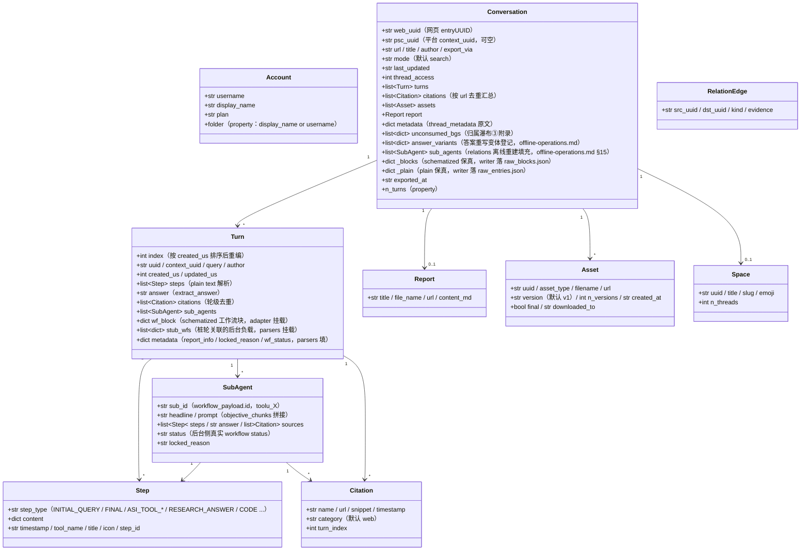

<a id="数据模型与目录契约" data-pplx-source-anchor="true"></a>
# 데이터 모델 및 디렉터리 계약

<a id="数据模型coremodelspy" data-pplx-source-anchor="true"></a>
## 데이터 모델 (core/models.py)

모든 사이트 원시 JSON은 parsers를 통해 이러한 dataclass로 매핑되며, 다운스트림(render/writer/relations)은 이 계층에만 의존합니다. `Conversation._blocks/_plain`는 원시 응답 정확성 마운트(repr=False)입니다.



책임 주석(행 번호는 `core/models.py` 기준):

- **`Turn.wf_block`** (models.py:127): computer/council의 schematized 워크플로 블록, `parsers.attach_workflow_blocks`에 의해 entry uuid로 마운트됨(parsers.py:231-256), 렌더링 및 답변 폴백(`_turn_answer`, render.py:489)이 의존; writer는 읽기 전용.
- **`Turn.stub_wfs`** (models.py:131): subagent_result 스텁이 10초 창을 통해 연관된 백그라운드 부하(parsers.match_stub_workflows 마운트).
- **`Turn.metadata`** (models.py:134): `report_info` (RESEARCH_ANSWER 단계, parsers.py:199-204), `locked_reason` (parsers.py:205-208), `wf_status` (parsers.py:256) 세 키.
- **`Conversation.unconsumed_bgs`** (models.py:165-170): 귀속 폭포수 3단계 폴백 데이터 소스, `[{wp, locked_reason, updated, bg_uuid}]`, conversation.md 끝부분 부록으로 렌더링.
- **`Conversation.answer_variants`** (models.py:171-177): 답변 재작성 변형 등록 (thread.json.answer_variants 데이터 소스), `parsers.collect_answer_variants` (parsers.py:589)가 `entries[].side_by_side_metadata`에서 좁혀진 판단 기준을 추출 — 감지 체인은 [§18](offline-operations.md) 참조.
- **`Conversation.sub_agents`** (models.py:178-182): 세션 수준 하위 에이전트 실행 목록, `cmd_relations` 오프라인 재구성 시에만 `adapter.sub_agents`에 의해 채워짐; 내보내기 파이프라인은 이 필드를 역채우지 않음 (writer는 로컬 sub_map을 사용하여 렌더링, relations는 여기서 읽음) — [§15](offline-operations.md) 참조.
- **`Conversation._blocks/_plain`** (models.py:183-190): 원시 응답 정확성, `fs_writer`이 그대로 raw_*.json에 기록됨 (fs_writer.py:257-266); `get_report/get_assets/sub_agents` 与离线 re-render 均从其取数。`PerplexityAdapter(None)`은 None-transport로 구성하여 순수 데이터 조립을 재사용 가능 (rerender_cmd.py:138).
- **이중 ID**: `web_uuid` = 웹 entryUUID (스레드 URL); `psc_uuid` = 플랫폼 `past_session_contexts` UUID, 첫 번째 비어 있지 않은 turn의 `context_uuid`을 가져옴 (adapter.py:99).

---

<a id="写边界与目录契约" data-pplx-source-anchor="true"></a>
## 쓰기 경계 및 디렉터리 계약

<a id="web_archive-线程归档工具生成不手工编辑内容文件" data-pplx-source-anchor="true"></a>
### web_archive 스레드 아카이브 (도구 생성, 내용 파일 수동 편집 금지)

```
web_archive/
├── <账户显示名>/                        # author_folder → _safe_folder 消毒
│   │                                   #   （fs_writer.py:40-51；空格保留，如「Alice Example」）
│   ├── <模式>/                         # search | deep-research | computer | council | study
│   │   └── <YYYY-MM-DD>_<标题slug>_<uuid8>/     # thread_dir_for（fs_writer.py:58-72）
│   │       ├── thread.json             # 元数据 + interruptions / answer_variants（可选键）+ report_info + psc_uuid
│   │       ├── conversation.md         # 简版：逐轮 Query/Answer + 后台附录（render.py:641）
│   │       ├── turns/turn_NNNN.md      # 完整版：工作过程全细节（render.py:596）
│   │       ├── sources.json / sources.md        # 全线程引文（按 url 去重）
│   │       ├── report.md               # deep-research 报告（有报告才存在）
│   │       ├── raw_entries.json        # plain 响应保真（必有）
│   │       ├── raw_blocks.json         # schematized 保真（search 无）
│   │       └── assets/
│   │           ├── assets_manifest.json        # 版本化清单（uuid/类型/版本/落点）
│   │           └── files/                      # 下载本体（resolve_ext 定扩展名）
│   └── ...
├── index/                              # 状态与索引（见 14.2）
├── relations/                          # edges.jsonl + graph.md（relations 命令重建）
├── crosscheck/                         # 交叉验证报告（人工/审核产物）
└── <账户2>/ ...
```

<a id="web_archiveindex-状态文件工具托管勿手改" data-pplx-source-anchor="true"></a>
### web_archive/index/ 상태 파일 (도구 관리, 수동 수정 금지)

| 파일 | 작성자 | 의미 |
|---|---|---|
| `library_<account>.json` | `cmd_index` (index_cmd.py) | 계정 스레드 인덱스 (GraphQL); 기본 증분 병합 (`--full` 전체 재작성); `last_full_index_at` / `incremental_runs_since_full`도 포함; batch/스케줄링/공간 인덱스의 입력 |
| `batch_state.json` | `BatchState` (state.py) | 중단점: uuid → status(ok/error/expired/deleted) + lastUpdated; 원자적 쓰기; 손상 시 자동 백업 `.corrupt-<ts>` |
| `.cookies.json` | `CookieCache` (common.py:111,150) | 쿠키 캐시 (12시간 신선도), 출처 및 계정 이메일 포함; 원자적 쓰기: 임시 파일을 0o600으로 생성한 후 os.replace (cookies/cache.py:59-67, 세션 자격 증명은 소유자만 읽기 가능; gitignore 범위 내) |
| `space_<slug>.json` | `cmd_space_index` (spaces_cmd.py:106-167) | 단일 공간 '전체' 스레드 목록 (context_uuid 이중 ID 매핑 포함) |
| `space_meta.json` | `cmd_spaces --fetch-meta` (spaces_cmd.py:299-330) | 공간 소유자/구성원 캐시 (인덱스 재구성 시 재사용, 중복 가져오기 방지) |
| `credit_usage_<account>.json` | `cmd_usage_backfill` (usage_backfill_cmd.py:17) | 스레드별 포인트 사용량 (멱등성, 계속 실행 가능, 25개마다 한 번씩 기록) |
| `cron_snippet.txt` | `cmd_schedule` (scheduler.py:48-78) | cron 호출 조각 (절대 경로) |
| `answer_variants_log.jsonl` | `variant_log.append_registry` (variant_log.py:76) | 답변 재작성 변형 중앙 등록 (thread+entry 기준 중복 제거 멱등성; 로그 파일, logs/ 아님) — 감지 체인은 [§18](offline-operations.md) 참조 |
| `logs/` | `--log-file` (common.py:218-229) | 전체 DEBUG 로그 (gitignore 처리됨) |

<a id="spaces-索引层仓库根工具生成" data-pplx-source-anchor="true"></a>
### spaces/ 인덱스 계층 (저장소 루트, 도구 생성)

`cmd_spaces`가 `index/library_*.json`에서 집계되어 재구성됨 (spaces_cmd.py:259-389): 공간당 하나의 `<slug>.md` (참여 계정 집계 + 소유자/구성원 헤더 + 스레드 테이블 + 내보내기 위치 역링크) 및 `spaces.json` 레지스트리. **참고**: 출력 디렉터리는 CWD 기준 `spaces/` (spaces_cmd.py:332), `--out`를 따르지 않음; 참여 계정 정보는 순수 로컬 집계, 소유자/구성원은 `index/space_meta.json` 캐시에서 가져옴. 수동 수정 금지 — 다음 재구성 시 덮어쓰기됨.

<a id="可手改-vs-工具托管" data-pplx-source-anchor="true"></a>
### 수동 수정 가능 vs 도구 관리

- **수동 수정 가능**: [시스템 설계 문서](overview.md), [API 참조](../reference/api/api-authentication.md), 프로젝트 README 등 규범 문서, `web_archive/crosscheck/` 검토 보고서 (규범 문서 및 검토 산출물).
- **도구 관리 (내용 파일 수동 수정 금지)**: `web_archive/` 스레드 디렉터리의 모든 산출물, `index/`, `spaces/`, `relations/` — 변경이 필요하면 도구를 수정한 후 다시 실행 (렌더링 수정은 re-render, 데이터 수정은 해당 backfill 명령), 재생산 가능한 단일 진실 공급원 보장.
