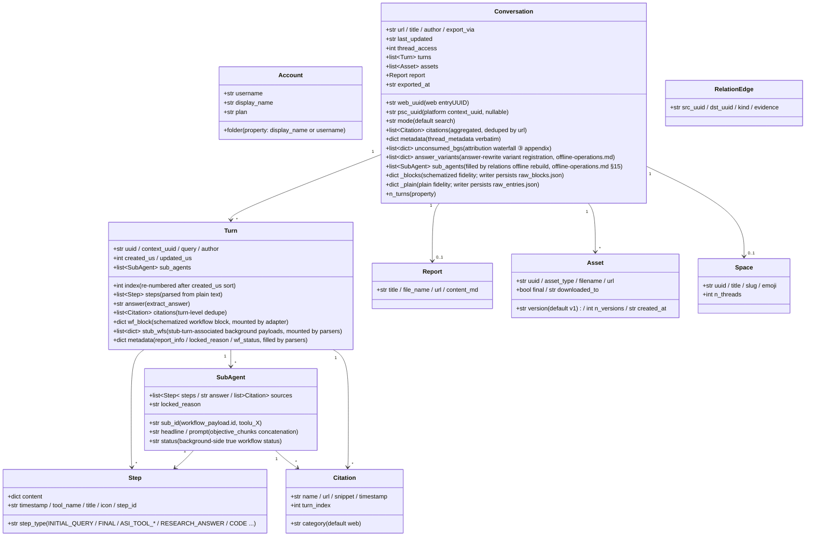

# Data model and directory contract

## Data model (core/models.py)

All site raw JSON is mapped by parsers into these dataclasses; downstream (render/writer/relations)
depends only on this layer. `Conversation._blocks/_plain` are fidelity mounts of the raw responses (repr=False).



Responsibility notes (line numbers relative to `core/models.py`):

- **`Turn.wf_block`** (models.py:127): the schematized workflow block of computer/council,
  mounted by `parsers.attach_workflow_blocks` by entry uuid (parsers.py:230-255);
  rendering and answer fallback (`_turn_answer`, render.py:489) depend on it; writer is read-only.
- **`Turn.stub_wfs`** (models.py:131): background payloads associated to subagent_result stub turns via the 10s window
  (mounted by parsers.match_stub_workflows).
- **`Turn.metadata`** (models.py:134): three keys — `report_info` (RESEARCH_ANSWER step,
  parsers.py:198-203), `locked_reason` (parsers.py:204-207), `wf_status`
  (parsers.py:255).
- **`Conversation.unconsumed_bgs`** (models.py:165-170): the data source of the attribution waterfall's third-level fallback,
  `[{wp, locked_reason, updated, bg_uuid}]`, rendered as the appendix at the end of conversation.md.
- **`Conversation.answer_variants`** (models.py:171-177): answer-rewrite variant registration
  (data source of thread.json.answer_variants); `parsers.collect_answer_variants`
  (parsers.py:588) extracts from `entries[].side_by_side_metadata` with narrowing criteria — detection chain in [§18](offline-operations.md).
- **`Conversation.sub_agents`** (models.py:178-182): conversation-level subagent run list, filled by
  `adapter.sub_agents` only during `cmd_relations` offline rebuild; the export pipeline doesn't backfill this field
  (writer renders with a local sub_map; relations reads here) — see [§15](offline-operations.md).
- **`Conversation._blocks/_plain`** (models.py:183-190): raw-response fidelity;
  `fs_writer` persists them verbatim as raw_*.json (fs_writer.py:257-266); `get_report/get_assets/
  sub_agents` and offline re-render all read from them. `PerplexityAdapter(None)` can be
  constructed with a None-transport to reuse pure data assembly (rerender_cmd.py:138).
- **Dual ID**: `web_uuid` = web entryUUID (thread URL); `psc_uuid` = platform
  `past_session_contexts` UUID, taken from the first non-empty turn's `context_uuid` (adapter.py:99).

---

## Write boundaries and directory contract

### The web_archive thread archive (tool-generated; content files not hand-edited)

```
web_archive/
├── <account display name>/               # author_folder → _safe_folder cleanup
│   │                                     #   (fs_writer.py:40-51; spaces kept, e.g. "Alice Example")
│   ├── <mode>/                           # search | deep-research | computer | council | study
│   │   └── <YYYY-MM-DD>_<title-slug>_<uuid8>/     # thread_dir_for (fs_writer.py:58-72)
│   │       ├── thread.json               # metadata + interruptions / answer_variants (optional keys) + report_info + psc_uuid
│   │       ├── conversation.md           # compact: per-turn Query/Answer + background appendix (render.py:641)
│   │       ├── turns/turn_NNNN.md        # full: complete work-process detail (render.py:596)
│   │       ├── sources.json / sources.md # thread-wide citations (deduped by url)
│   │       ├── report.md                 # deep-research report (exists only when there is one)
│   │       ├── raw_entries.json          # plain response fidelity (always present)
│   │       ├── raw_blocks.json           # schematized fidelity (absent for search)
│   │       └── assets/
│   │           ├── assets_manifest.json  # versioned manifest (uuid/type/version/destination)
│   │           └── files/                # downloaded bodies (resolve_ext decides extensions)
│   └── ...
├── index/                                # state and indexes (see 14.2)
├── relations/                            # edges.jsonl + graph.md (rebuilt by the relations command)
├── crosscheck/                           # cross-validation reports (manual/review artifacts)
└── <account 2>/ ...
```

### web_archive/index/ state files (tool-managed, do not hand-edit)

| File | Writer | Semantics |
|---|---|---|
| `library_<account>.json` | `cmd_index` (index_cmd.py) | account thread index (GraphQL); incremental-merged by default (`--full` rewrites); carries only stable fields (`account` / `count` / `threads`) — the volatile refresh state (`extracted_at` / `last_full_index_at` / `incremental_runs_since_full`) lives in the user config's machine-managed `[index_state]` table, so a no-change refresh is a git no-op; input for batch/scheduling/space indexes |
| `batch_state.json` | `BatchState` (state.py) | checkpoint: uuid → status(ok/error/expired/deleted) + lastUpdated; atomic writes; corrupt files auto-backed up as `.corrupt-<ts>` |
| `.cookies.json` | `CookieCache` (common.py:172) | cookie cache (12h freshness), with source and account email; atomic write: temp file created with 0o600 then os.replace (cookies/cache.py:59-67 — session credentials readable only by the owner; within gitignore scope) |
| `space_<slug>.json` | `cmd_space_index` (spaces_cmd.py:106-167) | per-space "all" thread list (incl. the context_uuid dual-ID mapping) |
| `space_meta.json` | `cmd_spaces --fetch-meta` (spaces_cmd.py:299-330) | space owner/member cache (reused when rebuilding indexes, avoiding refetch) |
| `credit_usage_<account>.json` | `cmd_usage_backfill` (usage_backfill_cmd.py:17) | per-thread credit usage (idempotent and resumable, flushed every 25 entries) |
| `cron_snippet.txt` | `cmd_schedule` (scheduler.py:47-77) | cron invocation snippet (absolute paths) |
| `answer_variants_log.jsonl` | `variant_log.append_registry` (variant_log.py:76) | central answer-rewrite variant registry (dedup by thread+entry, idempotent; a checked-in file, not logs/) — detection chain in [§18](offline-operations.md) |
| `logs/` | `--log-file` (common.py:270-281) | full DEBUG logs (gitignored) |

The user-level `config.toml` additionally carries machine-managed tables: `[models]`
(the model catalog metadata plus `last_refreshed`), written by `pplx-ask models --refresh`
and seeded by `pplx-export init`, and `[index_state]` (per-account index refresh state,
written by `pplx-export index` / `sync`) — both through a `tomlkit` round-trip that
preserves the user's other tables and comments — schema in
[Configuration](../guide/configuration.md).

**Maintainer note — pinned protocol constants.** Perplexity wire-protocol facts that
are coupled to the parser/renderer — the API `version`, the ask-envelope
`supported_block_use_cases`, `supported_features`, and the thread-read
`SCHEMATIZED_BLOCK_USE_CASES` — are single-sourced in
`pplx_export/sites/perplexity/platform.py` and must be updated in lockstep with
`parsers.py` / `render.py` when the platform API changes (human-pinned, never
auto-refreshed; a test forbids stray copies of the version literal). Model ids, by
contrast, are decoupled server-side data and live in the refreshable `models_cache.json`
catalog next to the config file, with the `[models]` metadata table above.

### The spaces/ index layer (repository root, tool-generated)

`cmd_spaces` rebuilds by aggregating `index/library_*.json` (spaces_cmd.py:259-389):
one `<slug>.md` per space (participating-account aggregation + owner/member header +
thread table + export-location backlinks) plus the `spaces.json` registry. **Note**: the output
directory is `spaces/` relative to CWD (spaces_cmd.py:332) — it does not follow `--out`;
participating-account information is aggregated purely locally, while owner/members come from
the `index/space_meta.json` cache. Do not hand-edit — the next rebuild overwrites.

### Hand-editable vs tool-managed

- **Hand-editable**: the [system design document](overview.md), the [API reference](../reference/api/api-authentication.md), the project README and other
  specification documents, and the `web_archive/crosscheck/` review reports (spec documents and review artifacts).
- **Tool-managed (do not hand-edit content files)**: all artifacts in `web_archive/` thread
  directories, `index/`, `spaces/`, `relations/` — when changes are needed, change the tool and
  rerun (render fixes go through re-render, data fixes through the corresponding backfill
  command), keeping a single source of reproducible artifacts.
