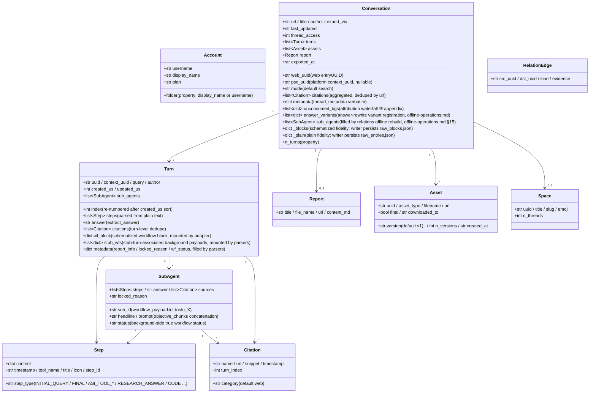

<a id="data-model-and-directory-contract" data-pplx-source-anchor="true"></a>
# Modelo de dados e contrato de diretório

<a id="data-model-coremodelspy" data-pplx-source-anchor="true"></a>
## Modelo de dados (core/models.py)

Todo o JSON bruto do site é mapeado por parsers para estas dataclasses; downstream (render/writer/relations)
depende apenas desta camada. `Conversation._blocks/_plain` são montagens de fidelidade das respostas brutas (repr=False).



Notas de responsabilidade (números de linha relativos a `core/models.py`):

- **`Turn.wf_block`** (models.py:127): o bloco de workflow esquematizado de computer/council,
  montado por `parsers.attach_workflow_blocks` pelo uuid da entrada (parsers.py:231-256);
  a renderização e o fallback de resposta (`_turn_answer`, render.py:489) dependem dele; writer é somente leitura.
- **`Turn.stub_wfs`** (models.py:131): payloads de fundo associados a stubs de subagent_result via janela de 10s
  (montado por parsers.match_stub_workflows).
- **`Turn.metadata`** (models.py:134): três chaves — `report_info` (etapa RESEARCH_ANSWER,
  parsers.py:199-204), `locked_reason` (parsers.py:205-208), `wf_status`
  (parsers.py:256).
- **`Conversation.unconsumed_bgs`** (models.py:165-170): a fonte de dados do fallback de terceiro nível da cascata de atribuição,
  `[{wp, locked_reason, updated, bg_uuid}]`, renderizado como apêndice no final de conversation.md.
- **`Conversation.answer_variants`** (models.py:171-177): registro de variantes de reescrita de resposta
  (fonte de dados de thread.json.answer_variants); `parsers.collect_answer_variants`
  (parsers.py:589) extrai de `entries[].side_by_side_metadata` com critérios de restrição — cadeia de detecção em [§18](offline-operations.md).
- **`Conversation.sub_agents`** (models.py:178-182): lista de execução de subagentes no nível da conversa, preenchida por
  `adapter.sub_agents` apenas durante a reconstrução offline de `cmd_relations`; o pipeline de exportação não retroalimenta este campo
  (writer renderiza com um sub_map local; relations lê aqui) — veja [§15](offline-operations.md).
- **`Conversation._blocks/_plain`** (models.py:183-190): fidelidade da resposta bruta;
  `fs_writer` persiste-os textualmente como raw_*.json (fs_writer.py:257-266); `get_report/get_assets/
  sub_agents` and offline re-render all read from them. `PerplexityAdapter(None)` pode ser
  construído com um transporte None para reutilizar montagem de dados pura (rerender_cmd.py:138).
- **ID duplo**: `web_uuid` = entryUUID da web (URL da thread); `psc_uuid` = UUID da
  plataforma `past_session_contexts`, obtido do primeiro turno não vazio de `context_uuid` (adapter.py:99).

---

<a id="write-boundaries-and-directory-contract" data-pplx-source-anchor="true"></a>
## Limites de escrita e contrato de diretório

<a id="the-web_archive-thread-archive-tool-generated-content-files-not-hand-edited" data-pplx-source-anchor="true"></a>
### O arquivo de thread web_archive (gerado por ferramenta; arquivos de conteúdo não editados manualmente)

```
web_archive/
├── <account display name>/               # author_folder → _safe_folder cleanup
│   │                                     #   (fs_writer.py:40-51; spaces kept, e.g. "Alice Example")
│   ├── <mode>/                           # search | deep-research | computer | council | study
│   │   └── <YYYY-MM-DD>_<title-slug>_<uuid8>/     # thread_dir_for (fs_writer.py:58-72)
│   │       ├── thread.json               # metadata + interruptions / answer_variants (optional keys) + report_info + psc_uuid
│   │       ├── conversation.md           # compact: per-turn Query/Answer + background appendix (render.py:641)
│   │       ├── turns/turn_NNNN.md        # full: complete work-process detail (render.py:596)
│   │       ├── sources.json / sources.md # thread-wide citations (deduped by url)
│   │       ├── report.md                 # deep-research report (exists only when there is one)
│   │       ├── raw_entries.json          # plain response fidelity (always present)
│   │       ├── raw_blocks.json           # schematized fidelity (absent for search)
│   │       └── assets/
│   │           ├── assets_manifest.json  # versioned manifest (uuid/type/version/destination)
│   │           └── files/                # downloaded bodies (resolve_ext decides extensions)
│   └── ...
├── index/                                # state and indexes (see 14.2)
├── relations/                            # edges.jsonl + graph.md (rebuilt by the relations command)
├── crosscheck/                           # cross-validation reports (manual/review artifacts)
└── <account 2>/ ...
```

<a id="web_archiveindex-state-files-tool-managed-do-not-hand-edit" data-pplx-source-anchor="true"></a>
### Arquivos de estado web_archive/index/ (gerenciados por ferramenta, não editar manualmente)

| Arquivo | Escritor | Semântica |
|---|---|---|
| `library_<account>.json` | `cmd_index` (index_cmd.py:17-43) | índice completo de threads da conta (GraphQL); entrada para índices de lote/agendamento/espaço |
| `batch_state.json` | `BatchState` (state.py) | ponto de verificação: uuid → status(ok/error/expired/deleted) + lastUpdated; escritas atômicas; arquivos corrompidos são copiados automaticamente como `.corrupt-<ts>` |
| `.cookies.json` | `CookieCache` (common.py:111, 150) | cache de cookies (frescura de 12h), com origem e email da conta; escrita atômica: arquivo temporário criado com 0o600 e depois os.replace (cookies/cache.py:59-67 — credenciais de sessão legíveis apenas pelo proprietário; dentro do escopo do gitignore) |
| `space_<slug>.json` | `cmd_space_index` (spaces_cmd.py:106-167) | lista "todas" as threads por espaço (incluindo o mapeamento de ID duplo context_uuid) |
| `space_meta.json` | `cmd_spaces --fetch-meta` (spaces_cmd.py:299-330) | cache de proprietário/membro do espaço (reutilizado ao reconstruir índices, evitando nova busca) |
| `credit_usage_<account>.json` | `cmd_usage_backfill` (usage_backfill_cmd.py:17) | uso de crédito por thread (idempotente e retomável, liberado a cada 25 entradas) |
| `cron_snippet.txt` | `cmd_schedule` (scheduler.py:48-78) | trecho de invocação cron (caminhos absolutos) |
| `answer_variants_log.jsonl` | `variant_log.append_registry` (variant_log.py:76) | registro central de variantes de reescrita de resposta (deduplicado por thread+entrada, idempotente; arquivo versionado, não logs/) — cadeia de detecção em [§18](offline-operations.md) |
| `logs/` | `--log-file` (common.py:218-229) | logs completos de DEBUG (gitignorados) |

<a id="the-spaces-index-layer-repository-root-tool-generated" data-pplx-source-anchor="true"></a>
### A camada de índice spaces/ (raiz do repositório, gerada por ferramenta)

`cmd_spaces` reconstrói agregando `index/library_*.json` (spaces_cmd.py:259-389):
um `<slug>.md` por espaço (agregação de contas participantes + cabeçalho proprietário/membro +
tabela de threads + backlinks de localização de exportação) mais o registro `spaces.json`. **Nota**: o diretório
de saída é `spaces/` relativo ao CWD (spaces_cmd.py:332) — não segue `--out`;
as informações de contas participantes são agregadas puramente localmente, enquanto proprietários/membros vêm do
cache `index/space_meta.json`. Não edite manualmente — a próxima reconstrução sobrescreve.

<a id="hand-editable-vs-tool-managed" data-pplx-source-anchor="true"></a>
### Editável manualmente vs gerenciado por ferramenta

- **Editável manualmente**: o [documento de design do sistema](overview.md), a [referência da API](../reference/api/api-authentication.md), o README do projeto e outros
documentos de especificação, e os relatórios de revisão `web_archive/crosscheck/` (documentos de especificação e artefatos de revisão).
- **Gerenciado por ferramenta (não editar arquivos de conteúdo manualmente)**: todos os artefatos nos diretórios de thread
  `web_archive/`, `index/`, `spaces/`, `relations/` — quando forem necessárias alterações, altere a ferramenta e
  reexecute (correções de renderização passam por re-renderização, correções de dados pelo comando de retroalimentação
  correspondente), mantendo uma única fonte de artefatos reproduzíveis.
