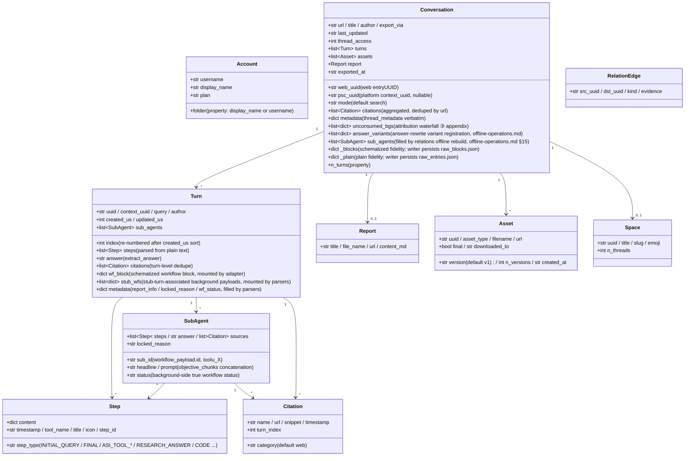

<a id="data-model-and-directory-contract" data-pplx-source-anchor="true"></a>
# Модель данных и контракт каталога

<a id="data-model-coremodelspy" data-pplx-source-anchor="true"></a>
## Модель данных (core/models.py)

Все необработанные JSON-данные сайта отображаются парсерами в эти классы данных; нижележащие слои (render/writer/relations)
зависят только от этого уровня. `Conversation._blocks/_plain` являются точными копиями необработанных ответов (repr=False).



Примечания об ответственности (номера строк относительно `core/models.py`):

- **`Turn.wf_block`** (models.py:127): схематизированный блок рабочего процесса computer/council,
  монтируемый `parsers.attach_workflow_blocks` по uuid записи (parsers.py:231-256);
  рендеринг и резервный ответ (`_turn_answer`, render.py:489) зависят от него; writer доступен только для чтения.
- **`Turn.stub_wfs`** (models.py:131): фоновые полезные нагрузки, связанные с заглушками subagent_result через 10-секундное окно
  (монтируются parsers.match_stub_workflows).
- **`Turn.metadata`** (models.py:134): три ключа — `report_info` (шаг RESEARCH_ANSWER,
  parsers.py:199-204), `locked_reason` (parsers.py:205-208), `wf_status`
  (parsers.py:256).
- **`Conversation.unconsumed_bgs`** (models.py:165-170): источник данных для резервного варианта третьего уровня водопада атрибуции,
  `[{wp, locked_reason, updated, bg_uuid}]`, отображаемый как приложение в конце conversation.md.
- **`Conversation.answer_variants`** (models.py:171-177): регистрация вариантов перезаписи ответа
  (источник данных thread.json.answer_variants); `parsers.collect_answer_variants`
  (parsers.py:589) извлекает из `entries[].side_by_side_metadata` с сужающими критериями — цепочка обнаружения в [§18](offline-operations.md).
- **`Conversation.sub_agents`** (models.py:178-182): список запусков subagent на уровне беседы, заполняемый
  `adapter.sub_agents` только во время автономной перестройки `cmd_relations`; конвейер экспорта не заполняет это поле задним числом
  (writer отображает с локальным sub_map; relations читает здесь) — см. [§15](offline-operations.md).
- **`Conversation._blocks/_plain`** (models.py:183-190): точность необработанного ответа;
  `fs_writer` сохраняет их дословно как raw_*.json (fs_writer.py:257-266); `get_report/get_assets/
  sub_agents` and offline re-render all read from them. `PerplexityAdapter(None)` может быть
  создан с транспортом None для повторного использования чистой сборки данных (rerender_cmd.py:138).
- **Двойной ID**: `web_uuid` = веб- entryUUID (URL потока); `psc_uuid` = платформенный
  `past_session_contexts` UUID, взятый из первого непустого поворота `context_uuid` (adapter.py:99).

---

<a id="write-boundaries-and-directory-contract" data-pplx-source-anchor="true"></a>
## Границы записи и контракт каталога

<a id="the-web_archive-thread-archive-tool-generated-content-files-not-hand-edited" data-pplx-source-anchor="true"></a>
### Архив потоков web_archive (создан инструментом; файлы содержимого не редактируются вручную)

```
web_archive/
├── <account display name>/               # author_folder → _safe_folder cleanup
│   │                                     #   (fs_writer.py:40-51; spaces kept, e.g. "Alice Example")
│   ├── <mode>/                           # search | deep-research | computer | council | study
│   │   └── <YYYY-MM-DD>_<title-slug>_<uuid8>/     # thread_dir_for (fs_writer.py:58-72)
│   │       ├── thread.json               # metadata + interruptions / answer_variants (optional keys) + report_info + psc_uuid
│   │       ├── conversation.md           # compact: per-turn Query/Answer + background appendix (render.py:641)
│   │       ├── turns/turn_NNNN.md        # full: complete work-process detail (render.py:596)
│   │       ├── sources.json / sources.md # thread-wide citations (deduped by url)
│   │       ├── report.md                 # deep-research report (exists only when there is one)
│   │       ├── raw_entries.json          # plain response fidelity (always present)
│   │       ├── raw_blocks.json           # schematized fidelity (absent for search)
│   │       └── assets/
│   │           ├── assets_manifest.json  # versioned manifest (uuid/type/version/destination)
│   │           └── files/                # downloaded bodies (resolve_ext decides extensions)
│   └── ...
├── index/                                # state and indexes (see 14.2)
├── relations/                            # edges.jsonl + graph.md (rebuilt by the relations command)
├── crosscheck/                           # cross-validation reports (manual/review artifacts)
└── <account 2>/ ...
```

<a id="web_archiveindex-state-files-tool-managed-do-not-hand-edit" data-pplx-source-anchor="true"></a>
### Файлы состояния web_archive/index/ (управляются инструментом, не редактировать вручную)

| Файл | Writer | Семантика |
|---|---|---|
| `library_<account>.json` | `cmd_index` (index_cmd.py) | индекс потоков учетной записи (GraphQL); по умолчанию инкрементально объединяется (`--full` перезаписывает); также содержит `last_full_index_at` / `incremental_runs_since_full`; входные данные для пакетных/планирующих/пространственных индексов |
| `batch_state.json` | `BatchState` (state.py) | контрольная точка: uuid → статус(ok/error/expired/deleted) + lastUpdated; атомарные записи; поврежденные файлы автоматически резервируются как `.corrupt-<ts>` |
| `.cookies.json` | `CookieCache` (common.py:111, 150) | кеш cookie (свежесть 12 часов), с источником и email учетной записи; атомарная запись: временный файл создается с 0o600, затем os.replace (cookies/cache.py:59-67 — учетные данные сеанса доступны только владельцу; в области gitignore) |
| `space_<slug>.json` | `cmd_space_index` (spaces_cmd.py:106-167) | список потоков "все" для пространства (включая отображение двойного ID context_uuid) |
| `space_meta.json` | `cmd_spaces --fetch-meta` (spaces_cmd.py:299-330) | кеш владельца/участника пространства (повторно используется при перестройке индексов, избегая повторной выборки) |
| `credit_usage_<account>.json` | `cmd_usage_backfill` (usage_backfill_cmd.py:17) | использование кредитов на поток (идемпотентно и возобновляемо, сбрасывается каждые 25 записей) |
| `cron_snippet.txt` | `cmd_schedule` (scheduler.py:48-78) | фрагмент вызова cron (абсолютные пути) |
| `answer_variants_log.jsonl` | `variant_log.append_registry` (variant_log.py:76) | центральный реестр вариантов перезаписи ответа (дедупликация по thread+entry, идемпотентно; файл под версионным контролем, не logs/) — цепочка обнаружения в [§18](offline-operations.md) |
| `logs/` | `--log-file` (common.py:218-229) | полные журналы DEBUG (игнорируются git) |

Пользовательский `config.toml` дополнительно содержит управляемую машиной таблицу `[models]`
(каталог моделей плюс `last_refreshed`), записываемую `pplx-ask models --refresh` и
заполняемую `pplx-export init` через цикл `tomlkit`, который сохраняет другие таблицы и комментарии пользователя —
схема в [Configuration](../guide/configuration.md).

**Примечание для сопровождающего — закрепленные константы протокола.** Perplexity факты протокола передачи, которые
связаны с парсером/рендерером — API `version`, конверт запроса
`supported_block_use_cases`, `supported_features` и чтение потока
`SCHEMATIZED_BLOCK_USE_CASES` — имеют единый источник в
`pplx_export/sites/perplexity/platform.py` и должны обновляться синхронно с
`parsers.py` / `render.py` при изменении платформенного API (закреплено человеком, никогда
не обновляется автоматически; тест запрещает случайные копии литерала версии). Идентификаторы моделей, напротив,
являются развязанными серверными данными и находятся в обновляемом каталоге `[models]`
выше.

<a id="the-spaces-index-layer-repository-root-tool-generated" data-pplx-source-anchor="true"></a>
### Слой индекса spaces/ (корень репозитория, создан инструментом)

`cmd_spaces` перестраивается путем агрегации `index/library_*.json` (spaces_cmd.py:259-389):
один `<slug>.md` на пространство (агрегация участвующих учетных записей + заголовок владельца/участника +
таблица потоков + обратные ссылки на местоположение экспорта) плюс реестр `spaces.json`. **Примечание**: выходной
каталог — `spaces/` относительно CWD (spaces_cmd.py:332) — он не следует `--out`;
информация об участвующих учетных записях агрегируется чисто локально, в то время как владельцы/участники берутся из
кеша `index/space_meta.json`. Не редактируйте вручную — следующая перестройка перезапишет.

<a id="hand-editable-vs-tool-managed" data-pplx-source-anchor="true"></a>
### Редактируемое вручную vs управляемое инструментом

- **Редактируемое вручную**: [документ проектирования системы](overview.md), [справочник API](../reference/api/api-authentication.md), README проекта и другие
  спецификационные документы, а также отчеты проверки `web_archive/crosscheck/` (документы спецификации и артефакты проверки).
- **Управляемое инструментом (не редактировать файлы содержимого вручную)**: все артефакты в каталогах потоков `web_archive/`,
  `index/`, `spaces/`, `relations/` — когда необходимы изменения, измените инструмент и
  запустите заново (исправления рендеринга проходят через повторный рендеринг, исправления данных — через соответствующую команду
  обратного заполнения), сохраняя единый источник воспроизводимых артефактов.
