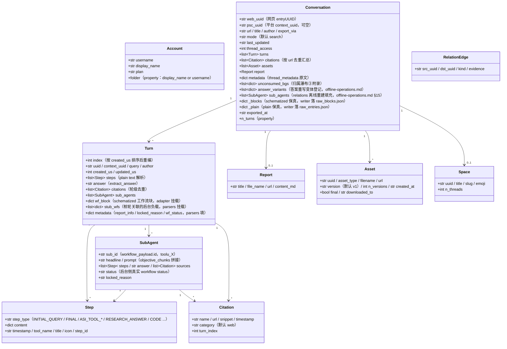

# 数据模型与目录契约

## 数据模型（core/models.py）

所有站点原始 JSON 经 parsers 映射为这些 dataclass，下游（render/writer/relations）
只依赖本层。`Conversation._blocks/_plain` 为原始响应保真挂载（repr=False）。



职责注释（行号相对 `core/models.py`）：

- **`Turn.wf_block`**（models.py:127）：computer/council 的 schematized 工作流块，
  由 `parsers.attach_workflow_blocks` 按 entry uuid 挂载（parsers.py:231-256），
  渲染与答案兜底（`_turn_answer`，render.py:489）依赖；writer 只读。
- **`Turn.stub_wfs`**（models.py:131）：subagent_result 桩轮经 10s 窗关联到的后台
  负载（parsers.match_stub_workflows 挂载）。
- **`Turn.metadata`**（models.py:134）：`report_info`（RESEARCH_ANSWER 步骤，
  parsers.py:199-204）、`locked_reason`（parsers.py:205-208）、`wf_status`
  （parsers.py:256）三个键。
- **`Conversation.unconsumed_bgs`**（models.py:165-170）：归属瀑布第三级兜底数据源，
  `[{wp, locked_reason, updated, bg_uuid}]`，渲染为 conversation.md 末尾附录。
- **`Conversation.answer_variants`**（models.py:171-177）：答案重写变体登记
  （thread.json.answer_variants 数据源），`parsers.collect_answer_variants`
  （parsers.py:589）从 `entries[].side_by_side_metadata` 收窄判据提取——检测链见 [§18](offline-operations.md)。
- **`Conversation.sub_agents`**（models.py:178-182）：会话级子代理运行列表，仅
  `cmd_relations` 离线重建时由 `adapter.sub_agents` 填充；导出管线不回填本字段
  （writer 用局部 sub_map 渲染，relations 读这里）——见 [§15](offline-operations.md)。
- **`Conversation._blocks/_plain`**（models.py:183-190）：原始响应保真，
  `fs_writer` 原样落盘 raw_*.json（fs_writer.py:257-266）；`get_report/get_assets/
  sub_agents` 与离线 re-render 均从其取数。`PerplexityAdapter(None)` 可用
  None-transport 构造复用纯数据组装（rerender_cmd.py:138）。
- **双 ID**：`web_uuid` = 网页 entryUUID（线程 URL）；`psc_uuid` = 平台
  `past_session_contexts` UUID，取首个非空 turn 的 `context_uuid`（adapter.py:99）。

---

## 写边界与目录契约

### web_archive 线程归档（工具生成，不手工编辑内容文件）

```
web_archive/
├── <账户显示名>/                        # author_folder → _safe_folder 消毒
│   │                                   #   （fs_writer.py:40-51；空格保留，如「Alice Example」）
│   ├── <模式>/                         # search | deep-research | computer | council | study
│   │   └── <YYYY-MM-DD>_<标题slug>_<uuid8>/     # thread_dir_for（fs_writer.py:58-72）
│   │       ├── thread.json             # 元数据 + interruptions / answer_variants（可选键）+ report_info + psc_uuid
│   │       ├── conversation.md         # 简版：逐轮 Query/Answer + 后台附录（render.py:641）
│   │       ├── turns/turn_NNNN.md      # 完整版：工作过程全细节（render.py:596）
│   │       ├── sources.json / sources.md        # 全线程引文（按 url 去重）
│   │       ├── report.md               # deep-research 报告（有报告才存在）
│   │       ├── raw_entries.json        # plain 响应保真（必有）
│   │       ├── raw_blocks.json         # schematized 保真（search 无）
│   │       └── assets/
│   │           ├── assets_manifest.json        # 版本化清单（uuid/类型/版本/落点）
│   │           └── files/                      # 下载本体（resolve_ext 定扩展名）
│   └── ...
├── index/                              # 状态与索引（见 14.2）
├── relations/                          # edges.jsonl + graph.md（relations 命令重建）
├── crosscheck/                         # 交叉验证报告（人工/审核产物）
└── <账户2>/ ...
```

### web_archive/index/ 状态文件（工具托管，勿手改）

| 文件 | 写入方 | 语义 |
|---|---|---|
| `library_<account>.json` | `cmd_index`（index_cmd.py:17-43） | 账户全量线程索引（GraphQL），batch/调度/空间索引的输入 |
| `batch_state.json` | `BatchState`（state.py） | 断点：uuid → status(ok/error/expired/deleted) + lastUpdated；原子写入；损坏自动备份 `.corrupt-<ts>` |
| `.cookies.json` | `CookieCache`（common.py:111,150） | cookie 缓存（12h 新鲜期），含来源与账户 email；原子写入：临时文件以 0o600 创建后 os.replace（cookies/cache.py:59-67，会话凭证仅属主可读；gitignore 范围内） |
| `space_<slug>.json` | `cmd_space_index`（spaces_cmd.py:106-167） | 单空间「全部」线程列表（含 context_uuid 双 ID 映射） |
| `space_meta.json` | `cmd_spaces --fetch-meta`（spaces_cmd.py:299-330） | 空间所有者/成员缓存（重建索引时复用，避免重复抓取） |
| `credit_usage_<account>.json` | `cmd_usage_backfill`（usage_backfill_cmd.py:17） | 逐线程积分用量（幂等可续跑，每 25 条落盘一次） |
| `cron_snippet.txt` | `cmd_schedule`（scheduler.py:48-78） | cron 调用片段（绝对路径） |
| `answer_variants_log.jsonl` | `variant_log.append_registry`（variant_log.py:76） | 答案重写变体集中登记（按 thread+entry 去重幂等；入库文件，非 logs/）——检测链见 [§18](offline-operations.md) |
| `logs/` | `--log-file`（common.py:218-229） | 全量 DEBUG 日志（已 gitignore） |

### spaces/ 索引层（仓库根，工具生成）

`cmd_spaces` 从 `index/library_*.json` 聚合重建（spaces_cmd.py:259-389）：
每空间一个 `<slug>.md`（参与账户聚合 + 所有者/成员头 + 线程表 + 导出位置反链）
加 `spaces.json` 注册表。**注意**：输出目录是相对 CWD 的 `spaces/`
（spaces_cmd.py:332），不跟随 `--out`；参与账户信息纯本地聚合，
所有者/成员来自 `index/space_meta.json` 缓存。勿手改——下次重建即覆盖。

### 可手改 vs 工具托管

- **可手改**：[系统设计文档](overview.md)、[API 参考](../reference/api/api-authentication.md)、项目 README 等规范文档、
  `web_archive/crosscheck/` 审核报告（规范文档与审核产物）。
- **工具托管（勿手改内容文件）**：`web_archive/` 线程目录全部产物、`index/`、
  `spaces/`、`relations/`——需要变更时改工具后重跑（渲染修复走 re-render，
  数据修复走对应 backfill 命令），保证产物可再生的单一来源。
