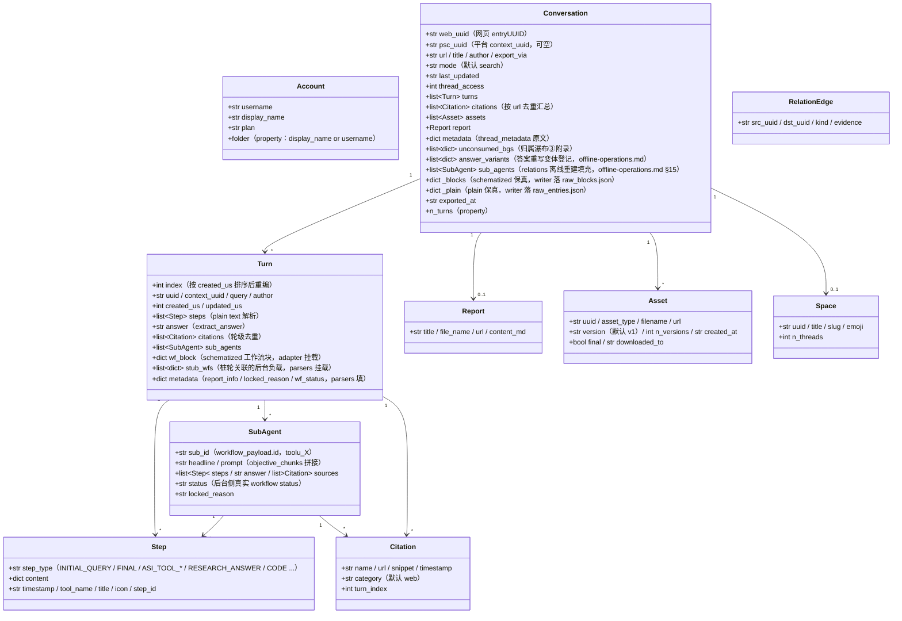

<a id="数据模型与目录契约" data-pplx-source-anchor="true"></a>
# 資料模型與目錄契約

<a id="数据模型coremodelspy" data-pplx-source-anchor="true"></a>
## 資料模型（core/models.py）

所有站點原始 JSON 經 parsers 映射為這些 dataclass，下游（render/writer/relations）
只依賴本層。`Conversation._blocks/_plain` 為原始回應保真掛載（repr=False）。



職責註釋（行號相對 `core/models.py`）：

- **`Turn.wf_block`**（models.py:127）：computer/council 的 schematized 工作流區塊，
  由 `parsers.attach_workflow_blocks` 按 entry uuid 掛載（parsers.py:231-256），
  渲染與答案備援（`_turn_answer`，render.py:489）依賴；writer 唯讀。
- **`Turn.stub_wfs`**（models.py:131）：subagent_result 樁輪經 10s 窗關聯到的後台
  負載（parsers.match_stub_workflows 掛載）。
- **`Turn.metadata`**（models.py:134）：`report_info`（RESEARCH_ANSWER 步驟，
  parsers.py:199-204）、`locked_reason`（parsers.py:205-208）、`wf_status`
  （parsers.py:256）三個鍵。
- **`Conversation.unconsumed_bgs`**（models.py:165-170）：歸屬瀑布第三級備援資料源，
  `[{wp, locked_reason, updated, bg_uuid}]`，渲染為 conversation.md 末尾附錄。
- **`Conversation.answer_variants`**（models.py:171-177）：答案改寫變體登記
  （thread.json.answer_variants 資料源），`parsers.collect_answer_variants`
  （parsers.py:589）從 `entries[].side_by_side_metadata` 收窄判據提取——檢測鏈見 [§18](offline-operations.md)。
- **`Conversation.sub_agents`**（models.py:178-182）：會話級子代理執行列表，僅
  `cmd_relations` 離線重建時由 `adapter.sub_agents` 填入；匯出管線不回填本欄位
  （writer 用區域 sub_map 渲染，relations 讀這裡）——見 [§15](offline-operations.md)。
- **`Conversation._blocks/_plain`**（models.py:183-190）：原始回應保真，
  `fs_writer` 原樣落盤 raw_*.json（fs_writer.py:257-266）；`get_report/get_assets/
  sub_agents` 与离线 re-render 均从其取数。`PerplexityAdapter(None)` 可用
  None-transport 建構複用純資料組裝（rerender_cmd.py:138）。
- **雙 ID**：`web_uuid` = 網頁 entryUUID（執行緒 URL）；`psc_uuid` = 平台
  `past_session_contexts` UUID，取首個非空 turn 的 `context_uuid`（adapter.py:99）。

---

<a id="写边界与目录契约" data-pplx-source-anchor="true"></a>
## 寫邊界與目錄契約

<a id="web_archive-线程归档工具生成不手工编辑内容文件" data-pplx-source-anchor="true"></a>
### web_archive 執行緒歸檔（工具產生，不手工編輯內容檔案）

```
web_archive/
├── <账户显示名>/                        # author_folder → _safe_folder 消毒
│   │                                   #   （fs_writer.py:40-51；空格保留，如「Alice Example」）
│   ├── <模式>/                         # search | deep-research | computer | council | study
│   │   └── <YYYY-MM-DD>_<标题slug>_<uuid8>/     # thread_dir_for（fs_writer.py:58-72）
│   │       ├── thread.json             # 元数据 + interruptions / answer_variants（可选键）+ report_info + psc_uuid
│   │       ├── conversation.md         # 简版：逐轮 Query/Answer + 后台附录（render.py:641）
│   │       ├── turns/turn_NNNN.md      # 完整版：工作过程全细节（render.py:596）
│   │       ├── sources.json / sources.md        # 全线程引文（按 url 去重）
│   │       ├── report.md               # deep-research 报告（有报告才存在）
│   │       ├── raw_entries.json        # plain 响应保真（必有）
│   │       ├── raw_blocks.json         # schematized 保真（search 无）
│   │       └── assets/
│   │           ├── assets_manifest.json        # 版本化清单（uuid/类型/版本/落点）
│   │           └── files/                      # 下载本体（resolve_ext 定扩展名）
│   └── ...
├── index/                              # 状态与索引（见 14.2）
├── relations/                          # edges.jsonl + graph.md（relations 命令重建）
├── crosscheck/                         # 交叉验证报告（人工/审核产物）
└── <账户2>/ ...
```

<a id="web_archiveindex-状态文件工具托管勿手改" data-pplx-source-anchor="true"></a>
### web_archive/index/ 狀態檔案（工具託管，勿手改）

| 檔案 | 寫入方 | 語意 |
|---|---|---|
| `library_<account>.json` | `cmd_index`（index_cmd.py） | 帳戶執行緒索引（GraphQL）；預設增量合併（`--full` 整體重寫）；另帶 `last_full_index_at` / `incremental_runs_since_full`；batch/排程/空間索引的輸入 |
| `batch_state.json` | `BatchState`（state.py） | 斷點：uuid → status(ok/error/expired/deleted) + lastUpdated；原子寫入；損壞自動備份 `.corrupt-<ts>` |
| `.cookies.json` | `CookieCache`（common.py:111,150） | cookie 快取（12h 新鮮期），含來源與帳戶 email；原子寫入：暫存檔以 0o600 建立後 os.replace（cookies/cache.py:59-67，會話憑證僅擁有者可讀；gitignore 範圍內） |
| `space_<slug>.json` | `cmd_space_index`（spaces_cmd.py:106-167） | 單空間「全部」執行緒列表（含 context_uuid 雙 ID 映射） |
| `space_meta.json` | `cmd_spaces --fetch-meta`（spaces_cmd.py:299-330） | 空間擁有者/成員快取（重建索引時重複使用，避免重複抓取） |
| `credit_usage_<account>.json` | `cmd_usage_backfill`（usage_backfill_cmd.py:17） | 逐執行緒積分用量（等冪可續跑，每 25 條落盤一次） |
| `cron_snippet.txt` | `cmd_schedule`（scheduler.py:48-78） | cron 呼叫片段（絕對路徑） |
| `answer_variants_log.jsonl` | `variant_log.append_registry`（variant_log.py:76） | 答案改寫變體集中登記（按 thread+entry 去重等冪；入庫檔案，非 logs/）——檢測鏈見 [§18](offline-operations.md) |
| `logs/` | `--log-file`（common.py:218-229） | 全量 DEBUG 日誌（已 gitignore） |

<a id="spaces-索引层仓库根工具生成" data-pplx-source-anchor="true"></a>
### spaces/ 索引層（倉庫根，工具產生）

`cmd_spaces` 從 `index/library_*.json` 聚合重建（spaces_cmd.py:259-389）：
每空間一個 `<slug>.md`（參與帳戶聚合 + 擁有者/成員頭 + 執行緒表 + 匯出位置反鏈）
加 `spaces.json` 註冊表。**注意**：輸出目錄是相對 CWD 的 `spaces/`
（spaces_cmd.py:332），不跟隨 `--out`；參與帳戶資訊純本地聚合，
擁有者/成員來自 `index/space_meta.json` 快取。勿手改——下次重建即覆蓋。

<a id="可手改-vs-工具托管" data-pplx-source-anchor="true"></a>
### 可手改 vs 工具託管

- **可手改**：[系統設計文件](overview.md)、[API 參考](../reference/api/api-authentication.md)、專案 README 等規範文件、
  `web_archive/crosscheck/` 審核報告（規範文件與審核產物）。
- **工具託管（勿手改內容檔案）**：`web_archive/` 執行緒目錄全部產物、`index/`、
  `spaces/`、`relations/`——需要變更時改工具後重跑（渲染修復走 re-render，
  資料修復走對應 backfill 命令），保證產物可再生的單一來源。
