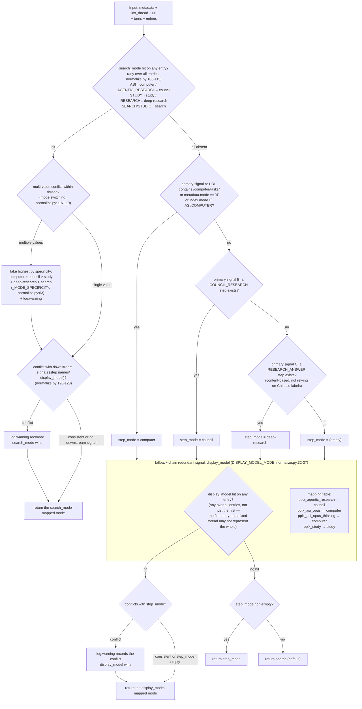

# Pipeline d'exportation

---

## Pipeline d'exportation en détail

Le pipeline d'exportation monothread complet (`cmd_export`, export_cmd.py:42-86 ; le chemin batch `cmd_batch`
réutilise le même pipeline, batch_cmd.py:117-204). Fonctions clés et numéros de ligne entre crochets :

```mermaid
flowchart TD
    START(["thread URL / UUID"]) --> IDX

    subgraph S1["① indexing (pre-step of index / batch)"]
        IDX["GraphQLClient.list_threads<br/>(graphql.py:51)<br/>LibraryThreadsRelayQuery first page 25 items<br/>LibraryRecentThreadsPaginationQuery pagination<br/>stop when endCursor is empty (graphql.py:81-85)"]
        IDX --> IDXO[("index/library_&lt;account&gt;.json<br/>cmd_index (index_cmd.py:17)")]
    end

    subgraph S2["② incremental planning (batch only)"]
        PLAN["plan_incremental pure function<br/>(hooks/incremental.py:36)<br/>sorted by lastUpdated desc, four-state classification:<br/>new / updated / done / expired"]
        PLAN --> ES{"neither full nor force?"}
        ES -->|"yes"| TRIM["trim the longest trailing done/expired run<br/>(early stop, incremental.py:83-86)"]
        ES -->|"no"| KEEP["return item by item (full-scan fallback)"]
    end

    subgraph S3["③ fetching (adapter.get_thread)"]
        GT["PerplexityAdapter.get_thread<br/>(adapter.py:58)"]
        GT --> PLAIN["ThreadFetcher.get_thread<br/>plain response (rest.py:59)<br/>GET /rest/thread/uuid<br/>entries + background_entries<br/>cursor pagination ≤20 pages, 3s between pages (rest.py:43-57)"]
        DM{"detect_mode<br/>(normalize.py:66)<br/>mode detection after parse_turn, see §4"}
        DM -->|"computer / deep-research / council / study"| BLK["ThreadFetcher.get_thread_blocks<br/>schematized response (rest.py:67)<br/>8 SCHEMATIZED_USE_CASES (rest.py:26)<br/>sleep blocks_delay=4s before fetching (adapter.py:28,88)"]
        DM -->|"search (all signals present)"| NOBLK["skip blocks<br/>(search is simple query+answer)"]
        DM -->|"all-signals-missing fallback (adapter.py:84-87)<br/>mode=search and no entry has display_model"| BLK
        BLK --> ANOM["scan_wf_anomalies<br/>log.warning on any non-COMPLETED workflow<br/>(parsers.py:646; call site adapter.py:131-134)"]
    end

    subgraph S4["④ in-memory parsing and assembly (before persistence)"]
        PT["parse_turn × N (parsers.py:173)<br/>steps / three-channel citation collection<br/>(entry.sources + FINAL.web_results<br/>+ WORKFLOW_ITEM_SOURCES)<br/>report_info / locked_reason into metadata"]
        EA["extract_answer (parsers.py:80)<br/>FINAL.answer JSON → plan.goals fallback"]
        BASE["Base Conversation assembled in memory<br/>raw responses retained on conv._plain / conv._blocks"]
        ATT["attach_workflow_blocks (parsers.py:231)<br/>wf_block attached to turns by entry uuid<br/>wf_status into turn.metadata"]
        STUB["attach_stub_workflows (parsers.py:470)<br/>stub-turn 10s time-window matching"]
        UNC["collect_unconsumed_background<br/>(parsers.py:491) attribution waterfall ③"]
        READY["Conversation ready for export<br/>(adapter.py:91-157)"]
        BASE -->|"other modes"| READY
        BASE -->|"computer/council only<br/>(adapter.py:150-157)"| ATT
        ATT --> STUB
        STUB -.-> UNC
        UNC --> READY
    end

    subgraph S5["⑤ asset preparation (before writer)"]
        ADL["adapter.get_assets (adapter.py:196)<br/>collect_downloadable_assets (parsers.py:696)<br/>same-name multi-version numbered v1..vN by created_at"]
        CDN["CloudFront signed-URL direct download<br/>AssetDownloader.download_all (assets.py:80)<br/>resolve_ext three-source extension resolution (assets.py:122)"]
    end

    subgraph S6["⑥ persistence (fs_writer.write_thread)"]
        WJ[("thread.json (fs_writer.py:224-253)<br/>+ interruptions registration collect_interruptions (parsers.py:535)<br/>+ answer_variants registration collect_answer_variants (parsers.py:589)")]
        RAW1[("raw_entries.json<br/>retained plain response (fs_writer.py:257-261)")]
        RAW2[("raw_blocks.json<br/>retained schematized response (fs_writer.py:262-266)<br/>absent when blocks were not fetched")]
        WM[("conversation.md compact version<br/>render_conversation (render.py:641)")]
        WT[("turns/turn_NNNN.md full version<br/>render_turn (render.py:596)")]
        WS[("sources.json + sources.md<br/>(fs_writer.py:270-278)")]
        WR[("report.md (fs_writer.py:308-316)<br/>adapter.get_report fallback when needed")]
        MF[("assets/assets_manifest.json<br/>versioned manifest (fs_writer.py:320-330)")]
    end

    IDX --> S2
    S2 -->|"per-thread new/updated"| S3
    PLAIN --> PT
    PT --> EA
    EA --> DM
    ANOM --> BASE
    NOBLK --> BASE
    READY --> ADL
    ADL --> CDN
    CDN --> WJ
    WJ --> RAW1
    WJ -. "when blocks fetched" .-> RAW2
    RAW1 --> WS
    RAW1 -. "offline re-runnable<br/>(re-render, see offline-operations.md §12)" .-> PT
    WS --> WM
    WM --> WT
    WT --> WR
    WR --> MF
    MF --> DONE(["state.mark_ok<br/>BatchState checkpoint (state.py:123)"])
```

Conceptions clés :

1. **Réponses brutes conservées pour relecture hors ligne** : `adapter.get_thread` analyse et
   assemble la conversation en mémoire avant que `FilesystemWriter.write_thread` ne
   s'exécute (adapter.py:58-157). Une écriture réussie stocke d'abord `thread.json`, puis
   les réponses plain/blocks disponibles sous forme de `raw_*.json`
   (fs_writer.py:224-266) ; l'analyse/rendu peut ensuite être relancé à partir de ces fichiers
   sans accès réseau.
2. **Plain toujours récupéré ; blocks selon la détection du mode** : la recherche ignore les blocks (économise une requête) ;
   lorsque tous les signaux de détection échouent, **le fallback récupère également** (adapter.py:74-85 commentaire et décision : mieux vaut trop récupérer que de laisser
   `raw_blocks.json` disparaître silencieusement après un changement de champ de plateforme).
3. **Point d'analyse unique** : toute l'extraction de champs est centralisée dans `parsers.py` (`_g` accès sécurisé multi-niveaux parsers.py:23,
   `_loads` tolérance aux pannes parsers.py:33, `to_int` clé de tri flexible parsers.py:44) — les refontes du site ne nécessitent qu'un seul endroit modifié.
4. **Writer est en lecture seule** : le montage de `wf_block`/`stub_wfs`/`unconsumed_bgs` se produit dans
   `adapter.get_thread` (adapter.py:150-157) ; `FilesystemWriter` ne monte pas, seulement consomme
   (fs_writer.py:217 commentaire).

---

## Arbre de décision de détection de mode (detect_mode)

La logique de décision complète de `normalize.detect_mode` (normalize.py:66-128). Cinq modes :
`computer / council / deep-research / study / search` (la recherche est le mode par défaut).

Le signal de plus haute priorité est le champ faisant autorité de la plateforme **`entry.search_mode`** (SEARCH_MODE_MAP,
normalize.py:50-59) : configuration de modèle officielle testée (`GET /rest/models/config/v2`)
`default_models.search=pplx_pro` (UI "Best"), `default_models.research=pplx_alpha`
(UI "Deep research") ; les valeurs search_mode correspondent une à une aux modes de conversation (vérification d'archive : 100+
threads SEARCH + pplx_alpha sont 100 % search_mode=RESEARCH ; 100+ threads purs pplx_pro sont tous
SEARCH). Ce n'est que lorsque search_mode est totalement absent qu'il retombe sur la chaîne originale step-name + display_model.

Discipline de détection (base testée) :

- **`pplx_alpha` n'est délibérément pas dans la table de correspondance** (normalize.py:15-31 commentaire) : c'est le modèle dédié à RESEARCH
  (`default_models.research` ; UI fixe, pas de sélecteur) — c'est la **cible que ce classifieur doit détecter**,
  pas un indice de détection. La statistique antérieure "121 threads de recherche utilisaient pplx_alpha" était en fait des échantillons de la propre
  erreur de jugement de ce classifieur (sans le signal search_mode, les sessions RESEARCH sans étape RESEARCH_ANSWER étaient jugées
  comme recherche) — rejugées par search_mode et 124 threads migrés.
- **search_mode l'emporte en cas de conflit avec les signaux aval** : c'est l'enregistrement faisant autorité de la plateforme pour le mode de conversation ;
  les noms d'étape sont les champs les plus sujets aux changements de la plateforme, display_model n'est qu'une énumération de couche de modèle. Les conflits
  déclenchent toujours log.warning (normalize.py:120-123).
- **Le changement de mode au sein d'un thread prend le plus élevé par spécificité** : computer > council > study > deep-research >
  search (normalize.py:63, 116-119), avec log.warning.
- **L'absence de tous signaux ne conclut pas à la recherche** : fallback vers la récupération des blocks au niveau du pipeline (adapter.py:84-87),
  garantissant que les données schématisées ne disparaissent pas silencieusement en raison d'une dérive de champ.
