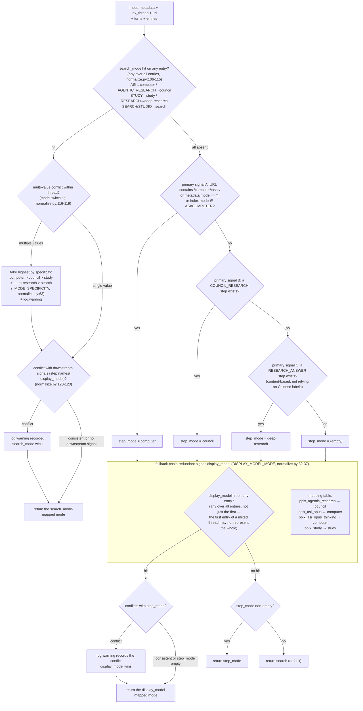

# Pipeline di esportazione

---

## Pipeline di esportazione in dettaglio

La pipeline di esportazione single-thread completa (`cmd_export`, export_cmd.py:42-86; il percorso batch `cmd_batch`
riutilizza la stessa pipeline, batch_cmd.py:117-204). Funzioni chiave e numeri di riga tra parentesi:

```mermaid
flowchart TD
    START(["thread URL / UUID"]) --> IDX

    subgraph S1["① indexing (pre-step of index / batch)"]
        IDX["GraphQLClient.list_threads<br/>(graphql.py:51)<br/>LibraryThreadsRelayQuery first page 25 items<br/>LibraryRecentThreadsPaginationQuery pagination<br/>stop when endCursor is empty (graphql.py:81-85)"]
        IDX --> IDXO[("index/library_&lt;account&gt;.json<br/>cmd_index (index_cmd.py:17)")]
    end

    subgraph S2["② incremental planning (batch only)"]
        PLAN["plan_incremental pure function<br/>(hooks/incremental.py:36)<br/>sorted by lastUpdated desc, four-state classification:<br/>new / updated / done / expired"]
        PLAN --> ES{"neither full nor force?"}
        ES -->|"yes"| TRIM["trim the longest trailing done/expired run<br/>(early stop, incremental.py:83-86)"]
        ES -->|"no"| KEEP["return item by item (full-scan fallback)"]
    end

    subgraph S3["③ fetching (adapter.get_thread)"]
        GT["PerplexityAdapter.get_thread<br/>(adapter.py:58)"]
        GT --> PLAIN["ThreadFetcher.get_thread<br/>plain response (rest.py:59)<br/>GET /rest/thread/uuid<br/>entries + background_entries<br/>cursor pagination ≤20 pages, 3s between pages (rest.py:43-57)"]
        DM{"detect_mode<br/>(normalize.py:66)<br/>mode detection after parse_turn, see §4"}
        DM -->|"computer / deep-research / council / study"| BLK["ThreadFetcher.get_thread_blocks<br/>schematized response (rest.py:67)<br/>8 SCHEMATIZED_USE_CASES (rest.py:26)<br/>sleep blocks_delay=4s before fetching (adapter.py:28,88)"]
        DM -->|"search (all signals present)"| NOBLK["skip blocks<br/>(search is simple query+answer)"]
        DM -->|"all-signals-missing fallback (adapter.py:84-87)<br/>mode=search and no entry has display_model"| BLK
        BLK --> ANOM["scan_wf_anomalies<br/>log.warning on any non-COMPLETED workflow<br/>(parsers.py:646; call site adapter.py:131-134)"]
    end

    subgraph S4["④ in-memory parsing and assembly (before persistence)"]
        PT["parse_turn × N (parsers.py:173)<br/>steps / three-channel citation collection<br/>(entry.sources + FINAL.web_results<br/>+ WORKFLOW_ITEM_SOURCES)<br/>report_info / locked_reason into metadata"]
        EA["extract_answer (parsers.py:80)<br/>FINAL.answer JSON → plan.goals fallback"]
        BASE["Base Conversation assembled in memory<br/>raw responses retained on conv._plain / conv._blocks"]
        ATT["attach_workflow_blocks (parsers.py:231)<br/>wf_block attached to turns by entry uuid<br/>wf_status into turn.metadata"]
        STUB["attach_stub_workflows (parsers.py:470)<br/>stub-turn 10s time-window matching"]
        UNC["collect_unconsumed_background<br/>(parsers.py:491) attribution waterfall ③"]
        READY["Conversation ready for export<br/>(adapter.py:91-157)"]
        BASE -->|"other modes"| READY
        BASE -->|"computer/council only<br/>(adapter.py:150-157)"| ATT
        ATT --> STUB
        STUB -.-> UNC
        UNC --> READY
    end

    subgraph S5["⑤ asset preparation (before writer)"]
        ADL["adapter.get_assets (adapter.py:196)<br/>collect_downloadable_assets (parsers.py:696)<br/>same-name multi-version numbered v1..vN by created_at"]
        CDN["CloudFront signed-URL direct download<br/>AssetDownloader.download_all (assets.py:80)<br/>resolve_ext three-source extension resolution (assets.py:122)"]
    end

    subgraph S6["⑥ persistence (fs_writer.write_thread)"]
        WJ[("thread.json (fs_writer.py:224-253)<br/>+ interruptions registration collect_interruptions (parsers.py:535)<br/>+ answer_variants registration collect_answer_variants (parsers.py:589)")]
        RAW1[("raw_entries.json<br/>retained plain response (fs_writer.py:257-261)")]
        RAW2[("raw_blocks.json<br/>retained schematized response (fs_writer.py:262-266)<br/>absent when blocks were not fetched")]
        WM[("conversation.md compact version<br/>render_conversation (render.py:641)")]
        WT[("turns/turn_NNNN.md full version<br/>render_turn (render.py:596)")]
        WS[("sources.json + sources.md<br/>(fs_writer.py:270-278)")]
        WR[("report.md (fs_writer.py:308-316)<br/>adapter.get_report fallback when needed")]
        MF[("assets/assets_manifest.json<br/>versioned manifest (fs_writer.py:320-330)")]
    end

    IDX --> S2
    S2 -->|"per-thread new/updated"| S3
    PLAIN --> PT
    PT --> EA
    EA --> DM
    ANOM --> BASE
    NOBLK --> BASE
    READY --> ADL
    ADL --> CDN
    CDN --> WJ
    WJ --> RAW1
    WJ -. "when blocks fetched" .-> RAW2
    RAW1 --> WS
    RAW1 -. "offline re-runnable<br/>(re-render, see offline-operations.md §12)" .-> PT
    WS --> WM
    WM --> WT
    WT --> WR
    WR --> MF
    MF --> DONE(["state.mark_ok<br/>BatchState checkpoint (state.py:123)"])
```

Progetti chiave:

1. **Risposte grezze conservate per replay offline**: `adapter.get_thread` analizza e
   assembla la conversazione in memoria prima che `FilesystemWriter.write_thread`
   venga eseguito (adapter.py:58-157). Una scrittura riuscita memorizza `thread.json` per primo e
   poi le risposte plain/blocks disponibili come `raw_*.json`
   (fs_writer.py:224-266); l'analisi/rendering può essere rieseguito successivamente da quei file
   senza accesso alla rete.
2. **Plain sempre recuperato; blocks in base al rilevamento della modalità**: la ricerca salta i blocks (risparmia una richiesta);
   quando tutti i segnali di rilevamento falliscono, **il fallback recupera comunque** (adapter.py:74-85 commento e decisione: meglio sovrarecuperare che lasciare
   che `raw_blocks.json` scompaia silenziosamente dopo una modifica del campo della piattaforma).
3. **Punto di analisi singolo**: tutta l'estrazione dei campi è centralizzata in `parsers.py` (`_g` accesso sicuro multilivello parsers.py:23,
   `_loads` tolleranza ai guasti parsers.py:33, `to_int` chiave di ordinamento permissiva parsers.py:44) — i rifacimenti del sito richiedono solo una modifica in un punto.
4. **Writer è read-only**: il montaggio di `wf_block`/`stub_wfs`/`unconsumed_bgs` avviene in
   `adapter.get_thread` (adapter.py:150-157); `FilesystemWriter` non monta, consuma solo
   (fs_writer.py:217 commento).

---

## Albero decisionale di rilevamento della modalità (detect_mode)

La logica decisionale completa di `normalize.detect_mode` (normalize.py:66-128). Cinque modalità:
`computer / council / deep-research / study / search` (la ricerca è l'impostazione predefinita).

Il segnale con priorità più alta è il campo autorevole della piattaforma **`entry.search_mode`** (SEARCH_MODE_MAP,
normalize.py:50-59): configurazione del modello ufficiale testata (`GET /rest/models/config/v2`)
`default_models.search=pplx_pro` (UI "Migliore"), `default_models.research=pplx_alpha`
(UI "Deep research"); i valori search_mode mappano uno a uno con le modalità di conversazione (verifica archivio: 100+
thread SEARCH-entry + pplx_alpha sono al 100% search_mode=RESEARCH; 100+ thread puri pplx_pro sono tutti
SEARCH). Solo quando search_mode è completamente assente si ricade alla catena originale step-name + display_model.

Disciplina di rilevamento (base testata):

- **`pplx_alpha` non è deliberatamente nella tabella di mappatura** (normalize.py:15-31 commento): è il modello dedicato a RESEARCH
  (`default_models.research`; UI fissa, nessun selettore) — è il **target che questo classificatore deve rilevare**,
  non un indizio di rilevamento. La statistica precedente "121 thread di ricerca usavano pplx_alpha" era in realtà campioni del proprio
  errore di giudizio di questo classificatore (senza il segnale search_mode, le sessioni RESEARCH prive di un passo RESEARCH_ANSWER venivano giudicate
  ricerca) — rivalutate da search_mode e 124 thread migrati.
- **search_mode vince in caso di conflitto con segnali downstream**: è il record autorevole della piattaforma della modalità di conversazione;
  i nomi dei passi sono i campi più soggetti a modifiche della piattaforma, display_model è solo un enum a livello di modello. I conflitti registrano sempre
  log.warning (normalize.py:120-123).
- **Il cambio di modalità all'interno di un thread prende la più alta per specificità**: computer > council > study > deep-research >
  search (normalize.py:63, 116-119), con log.warning.
- **Tutti i segnali mancanti non concludono ricerca**: si ricade al recupero dei blocks a livello di pipeline (adapter.py:84-87),
  assicurando che i dati schematizzati non scompaiano silenziosamente a causa di derive dei campi.
