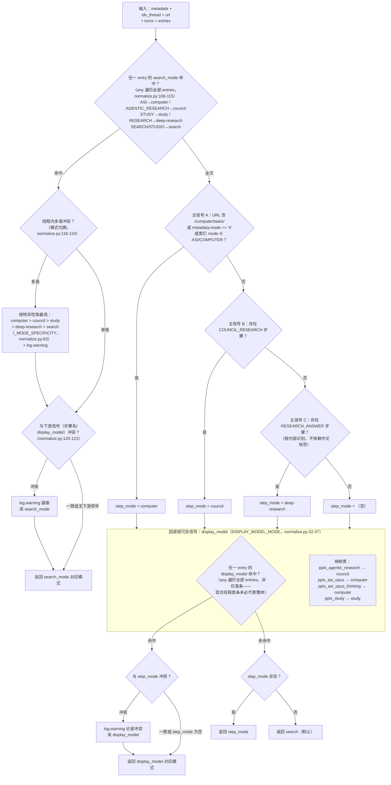

# エクスポートパイプライン

---

## エクスポートパイプライン詳細図

シングルスレッドエクスポートの完全なパイプライン（`cmd_export`、export_cmd.py:42-86；バッチパス `cmd_batch`
は同一パイプラインを再利用、batch_cmd.py:117-204）。角括弧内は主要関数と行番号：

```mermaid
flowchart TD
    START(["线程 URL / UUID"]) --> IDX

    subgraph S1["① 索引（index / batch 前置）"]
        IDX["GraphQLClient.list_threads<br/>（graphql.py:51）<br/>LibraryThreadsRelayQuery 首页 25 条<br/>LibraryRecentThreadsPaginationQuery 翻页<br/>endCursor 为空即止（graphql.py:81-85）"]
        IDX --> IDXO[("index/library_&lt;account&gt;.json<br/>cmd_index（index_cmd.py:17）")]
    end

    subgraph S2["② 增量计划（batch 专用）"]
        PLAN["plan_incremental 纯函数<br/>（hooks/incremental.py:36）<br/>按 lastUpdated 降序，四态分类：<br/>new / updated / done / expired"]
        PLAN --> ES{"非 full 非 force？"}
        ES -->|"是"| TRIM["截掉尾部最长 done/expired 连续段<br/>（早停，incremental.py:83-86）"]
        ES -->|"否"| KEEP["逐项返回（全量扫描兜底）"]
    end

    subgraph S3["③ 抓取（adapter.get_thread）"]
        GT["PerplexityAdapter.get_thread<br/>（adapter.py:58）"]
        GT --> PLAIN["ThreadFetcher.get_thread<br/>plain 响应（rest.py:59）<br/>GET /rest/thread/uuid<br/>entries + background_entries<br/>cursor 翻页 ≤20 页，页间 3s（rest.py:43-57）"]
        DM{"detect_mode<br/>（normalize.py:66）<br/>parse_turn 后判别模式，见 §4"}
        DM -->|"computer / deep-research / council / study"| BLK["ThreadFetcher.get_thread_blocks<br/>schematized 响应（rest.py:67）<br/>SCHEMATIZED_USE_CASES 8 项（rest.py:26）<br/>抓前 sleep blocks_delay=4s（adapter.py:28,88）"]
        DM -->|"search（信号齐全）"| NOBLK["不抓 blocks<br/>（search 为简单 query+answer）"]
        DM -->|"信号全灭兜底（adapter.py:84-87）<br/>mode=search 且全部 entry 无 display_model"| BLK
        BLK --> ANOM["scan_wf_anomalies<br/>非 COMPLETED 工作流即 log.warning<br/>（parsers.py:646；调用点 adapter.py:131-134）"]
    end

    subgraph S4["④ 内存解析与组装（发生在写盘之前）"]
        PT["parse_turn × N（parsers.py:173）<br/>steps / 引文三路归集<br/>（entry.sources + FINAL.web_results<br/>+ WORKFLOW_ITEM_SOURCES）<br/>report_info / locked_reason 入 metadata"]
        EA["extract_answer（parsers.py:80）<br/>FINAL.answer JSON → plan.goals 兜底"]
        BASE["内存中组装基础 Conversation<br/>原始响应保留在 conv._plain / conv._blocks"]
        ATT["attach_workflow_blocks（parsers.py:231）<br/>wf_block 按 entry uuid 挂轮<br/>wf_status 入 turn.metadata"]
        STUB["attach_stub_workflows（parsers.py:470）<br/>桩轮 10s 时间窗关联"]
        UNC["collect_unconsumed_background<br/>（parsers.py:491）归属瀑布③"]
        READY["Conversation 可供导出<br/>（adapter.py:91-157）"]
        BASE -->|"其他模式"| READY
        BASE -->|"仅 computer/council<br/>（adapter.py:150-157）"| ATT
        ATT --> STUB
        STUB -.-> UNC
        UNC --> READY
    end

    subgraph S5["⑤ 资产准备（writer 之前）"]
        ADL["adapter.get_assets（adapter.py:196）<br/>collect_downloadable_assets（parsers.py:696）<br/>同名多版本按 created_at 编号 v1..vN"]
        CDN["CloudFront 签名 URL 直连下载<br/>AssetDownloader.download_all（assets.py:80）<br/>resolve_ext 三源定扩展名（assets.py:122）"]
    end

    subgraph S6["⑥ 落盘（fs_writer.write_thread）"]
        WJ[("thread.json（fs_writer.py:224-253）<br/>+ interruptions 登记 collect_interruptions（parsers.py:535）<br/>+ answer_variants 登记 collect_answer_variants（parsers.py:589）")]
        RAW1[("raw_entries.json<br/>保留的 plain 响应（fs_writer.py:257-261）")]
        RAW2[("raw_blocks.json<br/>保留的 schematized 响应（fs_writer.py:262-266）<br/>未抓 blocks 时无此文件")]
        WM[("conversation.md 简版<br/>render_conversation（render.py:641）")]
        WT[("turns/turn_NNNN.md 完整版<br/>render_turn（render.py:596）")]
        WS[("sources.json + sources.md<br/>（fs_writer.py:270-278）")]
        WR[("report.md（fs_writer.py:308-316）<br/>需要时用 adapter.get_report 兜底")]
        MF[("assets/assets_manifest.json<br/>版本化清单（fs_writer.py:320-330）")]
    end

    IDX --> S2
    S2 -->|"逐线程 new/updated"| S3
    PLAIN --> PT
    PT --> EA
    EA --> DM
    ANOM --> BASE
    NOBLK --> BASE
    READY --> ADL
    ADL --> CDN
    CDN --> WJ
    WJ --> RAW1
    WJ -. "实际抓取 blocks 时" .-> RAW2
    RAW1 --> WS
    RAW1 -. "离线可重跑<br/>（re-render，见 offline-operations.md §12）" .-> PT
    WS --> WM
    WM --> WT
    WT --> WR
    WR --> MF
    MF --> DONE(["state.mark_ok<br/>BatchState 断点（state.py:123）"])
```

主要設計：

1. **オフライン再実行のための元のレスポンスを保持**：`adapter.get_thread` はまずメモリ内で会話を解析・組み立て
   （adapter.py:58-157）、その後 `FilesystemWriter.write_thread` が実行されます。
   書き込み成功時は最初に `thread.json` を保存し、次に実際に取得した plain/blocks レスポンスを
   `raw_*.json` として保存します（fs_writer.py:224-266）；その後、解析/レンダリングはこれらのファイルからネットワークなしで再実行可能です。
2. **plain は必ず取得、blocks はモードに応じて判断**：search は blocks を取得しません（リクエスト1回節約）；
   判断シグナルがすべて欠落している場合でも**念のため取得**します（adapter.py:74-85 のコメントと判定：取りすぎても、プラットフォームのフィールド変更後に
   `raw_blocks.json` が黙ってディスクに保存されないのを防ぐため）。
3. **解析の単一ポイント**：すべてのフィールド抽出は `parsers.py` に集中（`_g` 多段安全な値取得 parsers.py:23、
   `_loads` フォールトトレラント parsers.py:33、`to_int` 寛容なソートキー parsers.py:44）、サイト変更時は1か所のみ修正。
4. **writer は読み取り専用**：`wf_block`/`stub_wfs`/`unconsumed_bgs` のマウントは
   `adapter.get_thread`（adapter.py:150-157）で完了、`FilesystemWriter` はマウントせず、消費のみ
   （fs_writer.py:217 コメント）。

---

## モード判定決定木（detect_mode）

`normalize.detect_mode`（normalize.py:66-128）の完全な判定ロジック。5つのモード：
`computer / council / deep-research / study / search`（search がデフォルト）。

最優先シグナルはプラットフォームの権威フィールド **`entry.search_mode`**（SEARCH_MODE_MAP、
normalize.py:50-59）：公式モデル設定の実測（`GET /rest/models/config/v2`）
`default_models.search=pplx_pro`（UI「ベスト」）、`default_models.research=pplx_alpha`
（UI「Deep research」）、search_mode の値はセッションモードと一対一対応（アーカイブ検証：100以上の
SEARCH エントリ+pplx_alpha スレッドは 100% search_mode=RESEARCH；100以上の純粋な pplx_pro スレッドはすべて
SEARCH）。search_mode がすべて欠落している場合のみ、従来のステップ名+display_model チェーンにフォールバックします。

判定規律（実測に基づく）：

- **`pplx_alpha` は意図的にマッピングテーブルに含めない**（normalize.py:15-31 コメント）：これは RESEARCH 専用モデル
  （`default_models.research`、UI 固定、セレクターなし）であり、本分類器が**判定すべき対象**であって、
  判定の根拠ではありません。以前の「121 の search スレッドが pplx_alpha を使用」という統計は、本分類器自身の
  誤判定のサンプルです（search_mode シグナルがない場合、RESEARCH_ANSWER ステップのない RESEARCH セッションを
  search と誤判定）——search_mode で再判定し、124 スレッドを移行済み。
- **search_mode と下流シグナルが競合する場合は search_mode を優先**：これはプラットフォームがセッションモードを記録する権威フィールドです；
  ステップ名はプラットフォームが最も変更しやすい表面フィールドであり、display_model はモデル層の列挙に過ぎません。競合は必ず
  log.warning で記録されます（normalize.py:120-123）。
- **スレッド内のモード切り替えは特異性の高いものを優先**：computer > council > study > deep-research >
  search（normalize.py:63、116-119）、log.warning を出力。
- **シグナルがすべて欠落している場合、search と断定しない**：パイプライン層で念のため blocks を取得し（adapter.py:84-87）、
  スキーマ化されたデータがフィールドのドリフトによって黙って欠落しないようにします。
