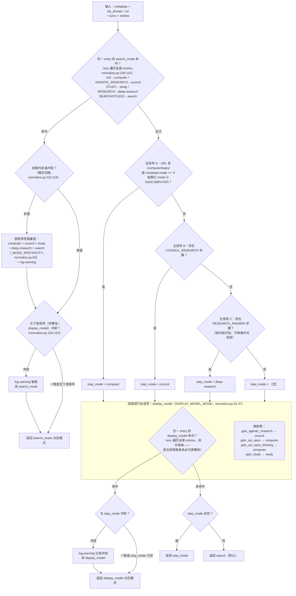

# 내보내기 파이프라인

---

## 내보내기 파이프라인 상세

단일 스레드 내보내기의 전체 파이프라인(`cmd_export`, export_cmd.py:42-86; 배치 경로 `cmd_batch`
동일 파이프라인 재사용, batch_cmd.py:117-204). 대괄호 안은 주요 함수와 줄 번호:

```mermaid
flowchart TD
    START(["线程 URL / UUID"]) --> IDX

    subgraph S1["① 索引（index / batch 前置）"]
        IDX["GraphQLClient.list_threads<br/>（graphql.py:51）<br/>LibraryThreadsRelayQuery 首页 25 条<br/>LibraryRecentThreadsPaginationQuery 翻页<br/>endCursor 为空即止（graphql.py:81-85）"]
        IDX --> IDXO[("index/library_&lt;account&gt;.json<br/>cmd_index（index_cmd.py:17）")]
    end

    subgraph S2["② 增量计划（batch 专用）"]
        PLAN["plan_incremental 纯函数<br/>（hooks/incremental.py:36）<br/>按 lastUpdated 降序，四态分类：<br/>new / updated / done / expired"]
        PLAN --> ES{"非 full 非 force？"}
        ES -->|"是"| TRIM["截掉尾部最长 done/expired 连续段<br/>（早停，incremental.py:83-86）"]
        ES -->|"否"| KEEP["逐项返回（全量扫描兜底）"]
    end

    subgraph S3["③ 抓取（adapter.get_thread）"]
        GT["PerplexityAdapter.get_thread<br/>（adapter.py:58）"]
        GT --> PLAIN["ThreadFetcher.get_thread<br/>plain 响应（rest.py:59）<br/>GET /rest/thread/uuid<br/>entries + background_entries<br/>cursor 翻页 ≤20 页，页间 3s（rest.py:43-57）"]
        DM{"detect_mode<br/>（normalize.py:66）<br/>parse_turn 后判别模式，见 §4"}
        DM -->|"computer / deep-research / council / study"| BLK["ThreadFetcher.get_thread_blocks<br/>schematized 响应（rest.py:67）<br/>SCHEMATIZED_USE_CASES 8 项（rest.py:26）<br/>抓前 sleep blocks_delay=4s（adapter.py:28,88）"]
        DM -->|"search（信号齐全）"| NOBLK["不抓 blocks<br/>（search 为简单 query+answer）"]
        DM -->|"信号全灭兜底（adapter.py:84-87）<br/>mode=search 且全部 entry 无 display_model"| BLK
        BLK --> ANOM["scan_wf_anomalies<br/>非 COMPLETED 工作流即 log.warning<br/>（parsers.py:646；调用点 adapter.py:131-134）"]
    end

    subgraph S4["④ 内存解析与组装（发生在写盘之前）"]
        PT["parse_turn × N（parsers.py:173）<br/>steps / 引文三路归集<br/>（entry.sources + FINAL.web_results<br/>+ WORKFLOW_ITEM_SOURCES）<br/>report_info / locked_reason 入 metadata"]
        EA["extract_answer（parsers.py:80）<br/>FINAL.answer JSON → plan.goals 兜底"]
        BASE["内存中组装基础 Conversation<br/>原始响应保留在 conv._plain / conv._blocks"]
        ATT["attach_workflow_blocks（parsers.py:231）<br/>wf_block 按 entry uuid 挂轮<br/>wf_status 入 turn.metadata"]
        STUB["attach_stub_workflows（parsers.py:470）<br/>桩轮 10s 时间窗关联"]
        UNC["collect_unconsumed_background<br/>（parsers.py:491）归属瀑布③"]
        READY["Conversation 可供导出<br/>（adapter.py:91-157）"]
        BASE -->|"其他模式"| READY
        BASE -->|"仅 computer/council<br/>（adapter.py:150-157）"| ATT
        ATT --> STUB
        STUB -.-> UNC
        UNC --> READY
    end

    subgraph S5["⑤ 资产准备（writer 之前）"]
        ADL["adapter.get_assets（adapter.py:196）<br/>collect_downloadable_assets（parsers.py:696）<br/>同名多版本按 created_at 编号 v1..vN"]
        CDN["CloudFront 签名 URL 直连下载<br/>AssetDownloader.download_all（assets.py:80）<br/>resolve_ext 三源定扩展名（assets.py:122）"]
    end

    subgraph S6["⑥ 落盘（fs_writer.write_thread）"]
        WJ[("thread.json（fs_writer.py:224-253）<br/>+ interruptions 登记 collect_interruptions（parsers.py:535）<br/>+ answer_variants 登记 collect_answer_variants（parsers.py:589）")]
        RAW1[("raw_entries.json<br/>保留的 plain 响应（fs_writer.py:257-261）")]
        RAW2[("raw_blocks.json<br/>保留的 schematized 响应（fs_writer.py:262-266）<br/>未抓 blocks 时无此文件")]
        WM[("conversation.md 简版<br/>render_conversation（render.py:641）")]
        WT[("turns/turn_NNNN.md 完整版<br/>render_turn（render.py:596）")]
        WS[("sources.json + sources.md<br/>（fs_writer.py:270-278）")]
        WR[("report.md（fs_writer.py:308-316）<br/>需要时用 adapter.get_report 兜底")]
        MF[("assets/assets_manifest.json<br/>版本化清单（fs_writer.py:320-330）")]
    end

    IDX --> S2
    S2 -->|"逐线程 new/updated"| S3
    PLAIN --> PT
    PT --> EA
    EA --> DM
    ANOM --> BASE
    NOBLK --> BASE
    READY --> ADL
    ADL --> CDN
    CDN --> WJ
    WJ --> RAW1
    WJ -. "实际抓取 blocks 时" .-> RAW2
    RAW1 --> WS
    RAW1 -. "离线可重跑<br/>（re-render，见 offline-operations.md §12）" .-> PT
    WS --> WM
    WM --> WT
    WT --> WR
    WR --> MF
    MF --> DONE(["state.mark_ok<br/>BatchState 断点（state.py:123）"])
```

주요 설계:

1. **오프라인 재실행을 위한 원본 응답 보존**: `adapter.get_thread`가 먼저 메모리에서 대화를 파싱하고 조립합니다
   (adapter.py:58-157), 그 후 `FilesystemWriter.write_thread`가 실행됩니다.
   성공적으로 쓰기 시 먼저 `thread.json`를 저장하고, 실제로 얻은 plain/blocks 응답을
   `raw_*.json`로 저장합니다(fs_writer.py:224-266); 이후 파싱/렌더링은 이러한 파일에서 네트워크 없이 재실행 가능합니다.
2. **plain은 항상 가져오고, blocks는 모드에 따라 판별**: search는 blocks를 가져오지 않음(요청 한 번 절약);
   판별 신호가 모두 없을 때는 **fallback으로 blocks도 가져옴**(adapter.py:74-85 주석 및 판단: 차라리 더 가져와서, 플랫폼이 필드를 변경한 후
   `raw_blocks.json`가 조용히 디스크에 저장되지 않는 것을 방지).
3. **파싱 단일 지점**: 모든 필드 추출은 `parsers.py`에 집중됨(`_g` 다단계 안전 값 가져오기 parsers.py:23,
   `_loads` 오류 허용 parsers.py:33, `to_int` 느슨한 정렬 키 parsers.py:44), 사이트 개편 시 한 곳만 수정.
4. **writer는 읽기 전용**: `wf_block`/`stub_wfs`/`unconsumed_bgs`의 마운트는
   `adapter.get_thread`(adapter.py:150-157)에서 완료되며, `FilesystemWriter`는 마운트하지 않고 소비만 함
   (fs_writer.py:217 주석).

---

## 모드 판별 결정 트리 (detect_mode)

`normalize.detect_mode`(normalize.py:66-128)의 전체 판별 로직. 다섯 가지 모드:
`computer / council / deep-research / study / search`(검색이 기본값).

최우선 순위 신호는 플랫폼 권위 필드 **`entry.search_mode`**(SEARCH_MODE_MAP,
normalize.py:50-59): 공식 모델 구성 실측(`GET /rest/models/config/v2`)
`default_models.search=pplx_pro`(UI '최적'), `default_models.research=pplx_alpha`
(UI 'Deep research'), search_mode 값은 세션 모드와 일대일 대응(아카이브 검증: 100여 개
SEARCH 진입점+pplx_alpha 스레드 100% search_mode=RESEARCH; 100여 개 순수 pplx_pro 스레드 모두
SEARCH). search_mode가 모두 없을 때만 기존의 단계 이름+display_model 체인으로 fallback.

판별 규율(실측 근거):

- **`pplx_alpha`는 의도적으로 매핑 테이블에 없음**(normalize.py:15-31 주석): RESEARCH 전용 모델
  (`default_models.research`, UI 고정, 선택기 없음), 본 분류기가 **판별해야 할 대상**이지
  판별 근거가 아님. 이전 '121개 search 스레드가 pplx_alpha 사용' 통계는 실제로 본 분류기 자체
  오판 샘플(search_mode 신호가 없을 때 RESEARCH_ANSWER 단계가 없는 RESEARCH 세션을 search로 판별)
  — search_mode로 재판별하고 124개 스레드를 마이그레이션 완료.
- **search_mode와 하위 신호가 충돌할 때 search_mode 우선**: 플랫폼이 세션 모드를 기록하는 권위 필드;
  단계 이름은 플랫폼에서 가장 쉽게 변경할 수 있는 표면 필드이고, display_model은 모델 계층 열거형일 뿐.
  충돌 시 반드시 log.warning으로 기록(normalize.py:120-123).
- **스레드 내 모드 전환은 특이성에 따라 가장 높은 것 선택**: computer > council > study > deep-research >
  search(normalize.py:63, 116-119), log.warning 기록.
- **신호가 모두 없을 때 search로 단정하지 않음**: 파이프라인 레벨에서 fallback으로 blocks 가져오기(adapter.py:84-87),
  필드 드리프트로 인해 schematized 데이터가 조용히 누락되지 않도록 보장.
