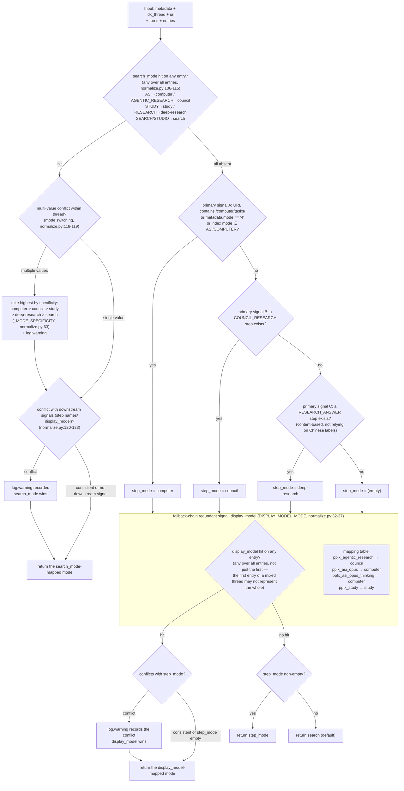

# Export pipeline

---

## Export pipeline in detail

The complete single-thread export pipeline (`cmd_export`, export_cmd.py:42-86; the batch path `cmd_batch`
reuses the same pipeline, batch_cmd.py:117-204). Key functions and line numbers in brackets:

```mermaid
flowchart TD
    START(["thread URL / UUID"]) --> IDX

    subgraph S1["① indexing (pre-step of index / batch)"]
        IDX["GraphQLClient.list_threads<br/>(graphql.py:51)<br/>LibraryThreadsRelayQuery first page 25 items<br/>LibraryRecentThreadsPaginationQuery pagination<br/>stop when endCursor is empty (graphql.py:81-85)"]
        IDX --> IDXO[("index/library_&lt;account&gt;.json<br/>cmd_index (index_cmd.py:17)")]
    end

    subgraph S2["② incremental planning (batch only)"]
        PLAN["plan_incremental pure function<br/>(hooks/incremental.py:36)<br/>sorted by lastUpdated desc, four-state classification:<br/>new / updated / done / expired"]
        PLAN --> ES{"neither full nor force?"}
        ES -->|"yes"| TRIM["trim the longest trailing done/expired run<br/>(early stop, incremental.py:83-86)"]
        ES -->|"no"| KEEP["return item by item (full-scan fallback)"]
    end

    subgraph S3["③ fetching (adapter.get_thread)"]
        GT["PerplexityAdapter.get_thread<br/>(adapter.py:58)"]
        GT --> PLAIN["ThreadFetcher.get_thread<br/>plain response (rest.py:59)<br/>GET /rest/thread/uuid<br/>entries + background_entries<br/>cursor pagination ≤20 pages, 3s between pages (rest.py:43-57)"]
        DM{"detect_mode<br/>(normalize.py:66)<br/>mode detection after parse_turn, see §4"}
        DM -->|"computer / deep-research / council / study"| BLK["ThreadFetcher.get_thread_blocks<br/>schematized response (rest.py:67)<br/>8 SCHEMATIZED_USE_CASES (rest.py:26)<br/>sleep blocks_delay=4s before fetching (adapter.py:28,88)"]
        DM -->|"search (all signals present)"| NOBLK["skip blocks<br/>(search is simple query+answer)"]
        DM -->|"all-signals-missing fallback (adapter.py:84-87)<br/>mode=search and no entry has display_model"| BLK
        BLK --> ANOM["scan_wf_anomalies<br/>log.warning on any non-COMPLETED workflow<br/>(parsers.py:646; call site adapter.py:131-134)"]
    end

    subgraph S4["④ in-memory parsing and assembly (before persistence)"]
        PT["parse_turn × N (parsers.py:173)<br/>steps / three-channel citation collection<br/>(entry.sources + FINAL.web_results<br/>+ WORKFLOW_ITEM_SOURCES)<br/>report_info / locked_reason into metadata"]
        EA["extract_answer (parsers.py:80)<br/>FINAL.answer JSON → plan.goals fallback"]
        BASE["Base Conversation assembled in memory<br/>raw responses retained on conv._plain / conv._blocks"]
        ATT["attach_workflow_blocks (parsers.py:231)<br/>wf_block attached to turns by entry uuid<br/>wf_status into turn.metadata"]
        STUB["attach_stub_workflows (parsers.py:470)<br/>stub-turn 10s time-window matching"]
        UNC["collect_unconsumed_background<br/>(parsers.py:491) attribution waterfall ③"]
        READY["Conversation ready for export<br/>(adapter.py:91-157)"]
        BASE -->|"other modes"| READY
        BASE -->|"computer/council only<br/>(adapter.py:150-157)"| ATT
        ATT --> STUB
        STUB -.-> UNC
        UNC --> READY
    end

    subgraph S5["⑤ asset preparation (before writer)"]
        ADL["adapter.get_assets (adapter.py:196)<br/>collect_downloadable_assets (parsers.py:696)<br/>same-name multi-version numbered v1..vN by created_at"]
        CDN["CloudFront signed-URL direct download<br/>AssetDownloader.download_all (assets.py:80)<br/>resolve_ext three-source extension resolution (assets.py:122)"]
    end

    subgraph S6["⑥ persistence (fs_writer.write_thread)"]
        WJ[("thread.json (fs_writer.py:224-253)<br/>+ interruptions registration collect_interruptions (parsers.py:535)<br/>+ answer_variants registration collect_answer_variants (parsers.py:589)")]
        RAW1[("raw_entries.json<br/>retained plain response (fs_writer.py:257-261)")]
        RAW2[("raw_blocks.json<br/>retained schematized response (fs_writer.py:262-266)<br/>absent when blocks were not fetched")]
        WM[("conversation.md compact version<br/>render_conversation (render.py:641)")]
        WT[("turns/turn_NNNN.md full version<br/>render_turn (render.py:596)")]
        WS[("sources.json + sources.md<br/>(fs_writer.py:270-278)")]
        WR[("report.md (fs_writer.py:308-316)<br/>adapter.get_report fallback when needed")]
        MF[("assets/assets_manifest.json<br/>versioned manifest (fs_writer.py:320-330)")]
    end

    IDX --> S2
    S2 -->|"per-thread new/updated"| S3
    PLAIN --> PT
    PT --> EA
    EA --> DM
    ANOM --> BASE
    NOBLK --> BASE
    READY --> ADL
    ADL --> CDN
    CDN --> WJ
    WJ --> RAW1
    WJ -. "when blocks fetched" .-> RAW2
    RAW1 --> WS
    RAW1 -. "offline re-runnable<br/>(re-render, see offline-operations.md §12)" .-> PT
    WS --> WM
    WM --> WT
    WT --> WR
    WR --> MF
    MF --> DONE(["state.mark_ok<br/>BatchState checkpoint (state.py:123)"])
```

Key designs:

1. **Raw responses retained for offline replay**: `adapter.get_thread` parses and
   assembles the conversation in memory before `FilesystemWriter.write_thread`
   runs (adapter.py:58-157). A successful write stores `thread.json` first and
   then the available plain/blocks responses as `raw_*.json`
   (fs_writer.py:224-266); parsing/rendering can later re-run from those files
   without network access.
2. **Plain always fetched; blocks by mode detection**: search skips blocks (saves one request);
   when all detection signals fail, **the fallback also fetches** (adapter.py:74-85 comment and decision: better over-fetch than let
   `raw_blocks.json` silently go missing after a platform field change).
3. **Single parsing point**: all field extraction is centralized in `parsers.py` (`_g` multi-level safe access parsers.py:23,
   `_loads` fault tolerance parsers.py:33, `to_int` lenient sort key parsers.py:44) — site revamps only need one place changed.
4. **Writer is read-only**: the mounting of `wf_block`/`stub_wfs`/`unconsumed_bgs` happens in
   `adapter.get_thread` (adapter.py:150-157); `FilesystemWriter` doesn't mount, only consumes
   (fs_writer.py:217 comment).

---

## Mode detection decision tree (detect_mode)

The complete decision logic of `normalize.detect_mode` (normalize.py:66-128). Five modes:
`computer / council / deep-research / study / search` (search is the default).

The highest-priority signal is the platform-authoritative field **`entry.search_mode`** (SEARCH_MODE_MAP,
normalize.py:50-59): official model config tested (`GET /rest/models/config/v2`)
`default_models.search=pplx_pro` (UI "Best"), `default_models.research=pplx_alpha`
(UI "Deep research"); search_mode values map one-to-one to conversation modes (archive verification: 100+
SEARCH-entry + pplx_alpha threads are 100% search_mode=RESEARCH; 100+ pure pplx_pro threads are all
SEARCH). Only when search_mode is entirely absent does it fall back to the original step-name + display_model chain.

Detection discipline (tested basis):

- **`pplx_alpha` is deliberately not in the mapping table** (normalize.py:15-31 comment): it is the RESEARCH-dedicated model
  (`default_models.research`; UI fixed, no selector) — it is the **target this classifier must detect**,
  not a detection cue. The earlier statistic "121 search threads used pplx_alpha" was actually samples of this classifier's own
  misjudgment (without the search_mode signal, RESEARCH sessions lacking a RESEARCH_ANSWER step were judged
  search) — re-judged by search_mode and 124 threads migrated.
- **search_mode wins on conflict with downstream signals**: it is the platform's authoritative record of the conversation mode;
  step names are the platform's most change-prone surface fields, display_model just a model-layer enum. Conflicts always
  log.warning (normalize.py:120-123).
- **Mode switching within a thread takes the highest by specificity**: computer > council > study > deep-research >
  search (normalize.py:63, 116-119), with log.warning.
- **All-signals-missing doesn't conclude search**: fall back to the pipeline-level blocks fetch (adapter.py:84-87),
  ensuring schematized data doesn't silently go missing due to field drift.
