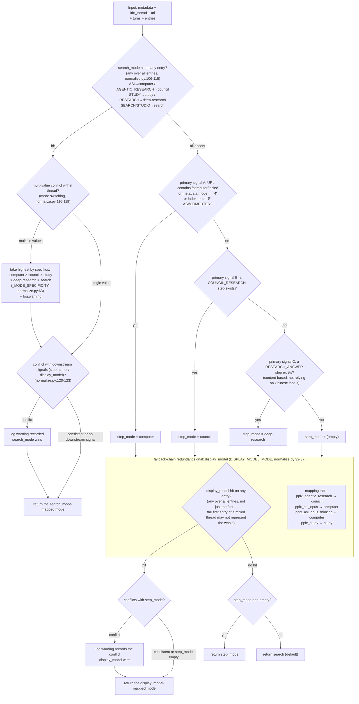

# Pipeline de exportação

---

## Pipeline de exportação em detalhes

O pipeline completo de exportação single-thread (`cmd_export`, export_cmd.py:42-86; o caminho batch `cmd_batch`
reutiliza o mesmo pipeline, batch_cmd.py:117-204). Funções-chave e números de linha entre colchetes:

```mermaid
flowchart TD
    START(["thread URL / UUID"]) --> IDX

    subgraph S1["① indexing (pre-step of index / batch)"]
        IDX["GraphQLClient.list_threads<br/>(graphql.py:51)<br/>LibraryThreadsRelayQuery first page 25 items<br/>LibraryRecentThreadsPaginationQuery pagination<br/>stop when endCursor is empty (graphql.py:81-85)"]
        IDX --> IDXO[("index/library_&lt;account&gt;.json<br/>cmd_index (index_cmd.py:17)")]
    end

    subgraph S2["② incremental planning (batch only)"]
        PLAN["plan_incremental pure function<br/>(hooks/incremental.py:36)<br/>sorted by lastUpdated desc, four-state classification:<br/>new / updated / done / expired"]
        PLAN --> ES{"neither full nor force?"}
        ES -->|"yes"| TRIM["trim the longest trailing done/expired run<br/>(early stop, incremental.py:83-86)"]
        ES -->|"no"| KEEP["return item by item (full-scan fallback)"]
    end

    subgraph S3["③ fetching (adapter.get_thread)"]
        GT["PerplexityAdapter.get_thread<br/>(adapter.py:58)"]
        GT --> PLAIN["ThreadFetcher.get_thread<br/>plain response (rest.py:59)<br/>GET /rest/thread/uuid<br/>entries + background_entries<br/>cursor pagination ≤20 pages, 3s between pages (rest.py:43-57)"]
        DM{"detect_mode<br/>(normalize.py:66)<br/>mode detection after parse_turn, see §4"}
        DM -->|"computer / deep-research / council / study"| BLK["ThreadFetcher.get_thread_blocks<br/>schematized response (rest.py:67)<br/>8 SCHEMATIZED_USE_CASES (rest.py:26)<br/>sleep blocks_delay=4s before fetching (adapter.py:28,88)"]
        DM -->|"search (all signals present)"| NOBLK["skip blocks<br/>(search is simple query+answer)"]
        DM -->|"all-signals-missing fallback (adapter.py:84-87)<br/>mode=search and no entry has display_model"| BLK
        BLK --> ANOM["scan_wf_anomalies<br/>log.warning on any non-COMPLETED workflow<br/>(parsers.py:646; call site adapter.py:131-134)"]
    end

    subgraph S4["④ in-memory parsing and assembly (before persistence)"]
        PT["parse_turn × N (parsers.py:173)<br/>steps / three-channel citation collection<br/>(entry.sources + FINAL.web_results<br/>+ WORKFLOW_ITEM_SOURCES)<br/>report_info / locked_reason into metadata"]
        EA["extract_answer (parsers.py:80)<br/>FINAL.answer JSON → plan.goals fallback"]
        BASE["Base Conversation assembled in memory<br/>raw responses retained on conv._plain / conv._blocks"]
        ATT["attach_workflow_blocks (parsers.py:231)<br/>wf_block attached to turns by entry uuid<br/>wf_status into turn.metadata"]
        STUB["attach_stub_workflows (parsers.py:470)<br/>stub-turn 10s time-window matching"]
        UNC["collect_unconsumed_background<br/>(parsers.py:491) attribution waterfall ③"]
        READY["Conversation ready for export<br/>(adapter.py:91-157)"]
        BASE -->|"other modes"| READY
        BASE -->|"computer/council only<br/>(adapter.py:150-157)"| ATT
        ATT --> STUB
        STUB -.-> UNC
        UNC --> READY
    end

    subgraph S5["⑤ asset preparation (before writer)"]
        ADL["adapter.get_assets (adapter.py:196)<br/>collect_downloadable_assets (parsers.py:696)<br/>same-name multi-version numbered v1..vN by created_at"]
        CDN["CloudFront signed-URL direct download<br/>AssetDownloader.download_all (assets.py:80)<br/>resolve_ext three-source extension resolution (assets.py:122)"]
    end

    subgraph S6["⑥ persistence (fs_writer.write_thread)"]
        WJ[("thread.json (fs_writer.py:224-253)<br/>+ interruptions registration collect_interruptions (parsers.py:535)<br/>+ answer_variants registration collect_answer_variants (parsers.py:589)")]
        RAW1[("raw_entries.json<br/>retained plain response (fs_writer.py:257-261)")]
        RAW2[("raw_blocks.json<br/>retained schematized response (fs_writer.py:262-266)<br/>absent when blocks were not fetched")]
        WM[("conversation.md compact version<br/>render_conversation (render.py:641)")]
        WT[("turns/turn_NNNN.md full version<br/>render_turn (render.py:596)")]
        WS[("sources.json + sources.md<br/>(fs_writer.py:270-278)")]
        WR[("report.md (fs_writer.py:308-316)<br/>adapter.get_report fallback when needed")]
        MF[("assets/assets_manifest.json<br/>versioned manifest (fs_writer.py:320-330)")]
    end

    IDX --> S2
    S2 -->|"per-thread new/updated"| S3
    PLAIN --> PT
    PT --> EA
    EA --> DM
    ANOM --> BASE
    NOBLK --> BASE
    READY --> ADL
    ADL --> CDN
    CDN --> WJ
    WJ --> RAW1
    WJ -. "when blocks fetched" .-> RAW2
    RAW1 --> WS
    RAW1 -. "offline re-runnable<br/>(re-render, see offline-operations.md §12)" .-> PT
    WS --> WM
    WM --> WT
    WT --> WR
    WR --> MF
    MF --> DONE(["state.mark_ok<br/>BatchState checkpoint (state.py:123)"])
```

Principais designs:

1. **Respostas brutas retidas para reprodução offline**: `adapter.get_thread` analisa e
   monta a conversa em memória antes de `FilesystemWriter.write_thread`
   ser executado (adapter.py:58-157). Uma gravação bem-sucedida armazena `thread.json` primeiro e
   depois as respostas plain/blocks disponíveis como `raw_*.json`
   (fs_writer.py:224-266); a análise/renderização pode ser reexecutada posteriormente a partir desses arquivos
   sem acesso à rede.
2. **Plain sempre buscado; blocks por detecção de modo**: pesquisa ignora blocks (economiza uma requisição);
   quando todos os sinais de detecção falham, **o fallback também busca** (adapter.py:74-85 comentário e decisão: melhor buscar demais do que deixar
   `raw_blocks.json` desaparecer silenciosamente após uma alteração no campo da plataforma).
3. **Ponto único de análise**: toda extração de campo é centralizada em `parsers.py` (`_g` acesso seguro multinível parsers.py:23,
   `_loads` tolerância a falhas parsers.py:33, `to_int` chave de ordenação leniente parsers.py:44) — reformulações do site precisam apenas de um local alterado.
4. **Writer é somente leitura**: a montagem de `wf_block`/`stub_wfs`/`unconsumed_bgs` ocorre em
   `adapter.get_thread` (adapter.py:150-157); `FilesystemWriter` não monta, apenas consome
   (fs_writer.py:217 comentário).

---

## Árvore de decisão de detecção de modo (detect_mode)

A lógica de decisão completa de `normalize.detect_mode` (normalize.py:66-128). Cinco modos:
`computer / council / deep-research / study / search` (pesquisa é o padrão).

O sinal de maior prioridade é o campo autoritativo da plataforma **`entry.search_mode`** (SEARCH_MODE_MAP,
normalize.py:50-59): configuração oficial do modelo testada (`GET /rest/models/config/v2`)
`default_models.search=pplx_pro` (UI "Best"), `default_models.research=pplx_alpha`
(UI "Deep research"); os valores de search_mode mapeiam um-para-um para os modos de conversa (verificação de arquivo: 100+
threads de entrada SEARCH + pplx_alpha são 100% search_mode=RESEARCH; 100+ threads puras pplx_pro são todas
SEARCH). Apenas quando search_mode está totalmente ausente, ele recai na cadeia original de step_name + display_model.

Disciplina de detecção (base testada):

- **`pplx_alpha` está deliberadamente ausente da tabela de mapeamento** (normalize.py:15-31 comentário): é o modelo dedicado a RESEARCH
  (`default_models.research`; UI fixa, sem seletor) — é o **alvo que este classificador deve detectar**,
  não uma pista de detecção. A estatística anterior "121 threads de pesquisa usaram pplx_alpha" era na verdade amostras do próprio
  erro de julgamento deste classificador (sem o sinal search_mode, sessões RESEARCH sem uma etapa RESEARCH_ANSWER foram julgadas
  como pesquisa) — rejulgadas por search_mode e 124 threads migradas.
- **search_mode vence em conflito com sinais downstream**: é o registro autoritativo da plataforma para o modo de conversa;
  nomes de etapas são os campos mais propensos a mudanças da plataforma, display_model é apenas um enum da camada de modelo. Conflitos sempre
  geram log.warning (normalize.py:120-123).
- **Mudança de modo dentro de uma thread assume o de maior especificidade**: computer > council > study > deep-research >
  search (normalize.py:63, 116-119), com log.warning.
- **Ausência total de sinais não conclui pesquisa**: recai na busca de blocks do nível do pipeline (adapter.py:84-87),
  garantindo que dados esquematizados não desapareçam silenciosamente devido a desvios de campo.
