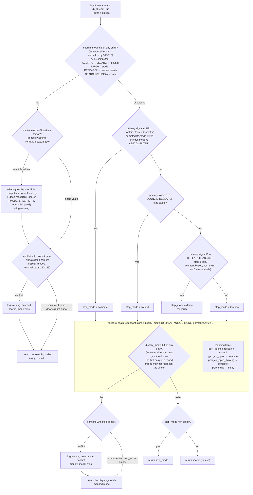

# Конвейер экспорта

---

## Конвейер экспорта подробно

Полный однопоточный конвейер экспорта (`cmd_export`, export_cmd.py:42-86; пакетный путь `cmd_batch`
повторно использует тот же конвейер, batch_cmd.py:117-204). Ключевые функции и номера строк в скобках:

```mermaid
flowchart TD
    START(["thread URL / UUID"]) --> IDX

    subgraph S1["① indexing (pre-step of index / batch)"]
        IDX["GraphQLClient.list_threads<br/>(graphql.py:51)<br/>LibraryThreadsRelayQuery first page 25 items<br/>LibraryRecentThreadsPaginationQuery pagination<br/>stop when endCursor is empty (graphql.py:81-85)"]
        IDX --> IDXO[("index/library_&lt;account&gt;.json<br/>cmd_index (index_cmd.py:17)")]
    end

    subgraph S2["② incremental planning (batch only)"]
        PLAN["plan_incremental pure function<br/>(hooks/incremental.py:36)<br/>sorted by lastUpdated desc, four-state classification:<br/>new / updated / done / expired"]
        PLAN --> ES{"neither full nor force?"}
        ES -->|"yes"| TRIM["trim the longest trailing done/expired run<br/>(early stop, incremental.py:83-86)"]
        ES -->|"no"| KEEP["return item by item (full-scan fallback)"]
    end

    subgraph S3["③ fetching (adapter.get_thread)"]
        GT["PerplexityAdapter.get_thread<br/>(adapter.py:58)"]
        GT --> PLAIN["ThreadFetcher.get_thread<br/>plain response (rest.py:59)<br/>GET /rest/thread/uuid<br/>entries + background_entries<br/>cursor pagination ≤20 pages, 3s between pages (rest.py:43-57)"]
        DM{"detect_mode<br/>(normalize.py:66)<br/>mode detection after parse_turn, see §4"}
        DM -->|"computer / deep-research / council / study"| BLK["ThreadFetcher.get_thread_blocks<br/>schematized response (rest.py:67)<br/>8 SCHEMATIZED_USE_CASES (rest.py:26)<br/>sleep blocks_delay=4s before fetching (adapter.py:28,88)"]
        DM -->|"search (all signals present)"| NOBLK["skip blocks<br/>(search is simple query+answer)"]
        DM -->|"all-signals-missing fallback (adapter.py:84-87)<br/>mode=search and no entry has display_model"| BLK
        BLK --> ANOM["scan_wf_anomalies<br/>log.warning on any non-COMPLETED workflow<br/>(parsers.py:646; call site adapter.py:131-134)"]
    end

    subgraph S4["④ in-memory parsing and assembly (before persistence)"]
        PT["parse_turn × N (parsers.py:173)<br/>steps / three-channel citation collection<br/>(entry.sources + FINAL.web_results<br/>+ WORKFLOW_ITEM_SOURCES)<br/>report_info / locked_reason into metadata"]
        EA["extract_answer (parsers.py:80)<br/>FINAL.answer JSON → plan.goals fallback"]
        BASE["Base Conversation assembled in memory<br/>raw responses retained on conv._plain / conv._blocks"]
        ATT["attach_workflow_blocks (parsers.py:231)<br/>wf_block attached to turns by entry uuid<br/>wf_status into turn.metadata"]
        STUB["attach_stub_workflows (parsers.py:470)<br/>stub-turn 10s time-window matching"]
        UNC["collect_unconsumed_background<br/>(parsers.py:491) attribution waterfall ③"]
        READY["Conversation ready for export<br/>(adapter.py:91-157)"]
        BASE -->|"other modes"| READY
        BASE -->|"computer/council only<br/>(adapter.py:150-157)"| ATT
        ATT --> STUB
        STUB -.-> UNC
        UNC --> READY
    end

    subgraph S5["⑤ asset preparation (before writer)"]
        ADL["adapter.get_assets (adapter.py:196)<br/>collect_downloadable_assets (parsers.py:696)<br/>same-name multi-version numbered v1..vN by created_at"]
        CDN["CloudFront signed-URL direct download<br/>AssetDownloader.download_all (assets.py:80)<br/>resolve_ext three-source extension resolution (assets.py:122)"]
    end

    subgraph S6["⑥ persistence (fs_writer.write_thread)"]
        WJ[("thread.json (fs_writer.py:224-253)<br/>+ interruptions registration collect_interruptions (parsers.py:535)<br/>+ answer_variants registration collect_answer_variants (parsers.py:589)")]
        RAW1[("raw_entries.json<br/>retained plain response (fs_writer.py:257-261)")]
        RAW2[("raw_blocks.json<br/>retained schematized response (fs_writer.py:262-266)<br/>absent when blocks were not fetched")]
        WM[("conversation.md compact version<br/>render_conversation (render.py:641)")]
        WT[("turns/turn_NNNN.md full version<br/>render_turn (render.py:596)")]
        WS[("sources.json + sources.md<br/>(fs_writer.py:270-278)")]
        WR[("report.md (fs_writer.py:308-316)<br/>adapter.get_report fallback when needed")]
        MF[("assets/assets_manifest.json<br/>versioned manifest (fs_writer.py:320-330)")]
    end

    IDX --> S2
    S2 -->|"per-thread new/updated"| S3
    PLAIN --> PT
    PT --> EA
    EA --> DM
    ANOM --> BASE
    NOBLK --> BASE
    READY --> ADL
    ADL --> CDN
    CDN --> WJ
    WJ --> RAW1
    WJ -. "when blocks fetched" .-> RAW2
    RAW1 --> WS
    RAW1 -. "offline re-runnable<br/>(re-render, see offline-operations.md §12)" .-> PT
    WS --> WM
    WM --> WT
    WT --> WR
    WR --> MF
    MF --> DONE(["state.mark_ok<br/>BatchState checkpoint (state.py:123)"])
```

Ключевые решения:

1. **Сырые ответы сохраняются для офлайн-воспроизведения**: `adapter.get_thread` анализирует и
   собирает беседу в памяти до того, как `FilesystemWriter.write_thread`
   запускается (adapter.py:58-157). Успешная запись сохраняет `thread.json` сначала,
   а затем доступные ответы в формате plain/blocks как `raw_*.json`
   (fs_writer.py:224-266); анализ/рендеринг может быть повторно запущен из этих файлов
   без доступа к сети.
2. **Plain всегда извлекается; blocks — по определению режима**: поиск пропускает blocks (экономит один запрос);
   когда все сигналы определения не срабатывают, **запасной вариант также извлекает** (adapter.py:74-85 комментарий и решение: лучше переизвлечь, чем допустить
   `raw_blocks.json` бесшумно пропасть после изменения поля платформы).
3. **Единая точка анализа**: все извлечения полей централизованы в `parsers.py` (`_g` многоуровневый безопасный доступ parsers.py:23,
   `_loads` отказоустойчивость parsers.py:33, `to_int` нестрогий ключ сортировки parsers.py:44) — обновления сайта требуют изменений только в одном месте.
4. **Writer доступен только для чтения**: монтирование `wf_block`/`stub_wfs`/`unconsumed_bgs` происходит в
   `adapter.get_thread` (adapter.py:150-157); `FilesystemWriter` не монтирует, только потребляет
   (fs_writer.py:217 комментарий).

---

## Дерево решений определения режима (detect_mode)

Полная логика принятия решений `normalize.detect_mode` (normalize.py:66-128). Пять режимов:
`computer / council / deep-research / study / search` (поиск — по умолчанию).

Сигнал наивысшего приоритета — авторитетное поле платформы **`entry.search_mode`** (SEARCH_MODE_MAP,
normalize.py:50-59): официальная конфигурация модели протестирована (`GET /rest/models/config/v2`)
`default_models.search=pplx_pro` (UI "Best"), `default_models.research=pplx_alpha`
(UI "Deep research"); значения search_mode сопоставляются один к одному с режимами беседы (архивная проверка: 100+
SEARCH-записей + pplx_alpha потоков на 100% search_mode=RESEARCH; 100+ чистых pplx_pro потоков — все
SEARCH). Только когда search_mode полностью отсутствует, происходит откат к исходной цепочке step-name + display_model.

Дисциплина определения (проверенная основа):

- **`pplx_alpha` намеренно отсутствует в таблице сопоставления** (normalize.py:15-31 комментарий): это модель, предназначенная для RESEARCH
  (`default_models.research`; UI фиксирован, без селектора) — это **цель, которую должен обнаружить этот классификатор**,
  а не сигнал для обнаружения. Более ранняя статистика "121 поисковый поток использовал pplx_alpha" на самом деле была выборками собственного
  ошибочного суждения этого классификатора (без сигнала search_mode сеансы RESEARCH, не имеющие шага RESEARCH_ANSWER, оценивались как
  поиск) — переоценены по search_mode, и 124 потока были перенесены.
- **search_mode побеждает при конфликте с нижестоящими сигналами**: это авторитетная запись платформы о режиме беседы;
  имена шагов — наиболее изменчивые поверхностные поля платформы, display_model — всего лишь перечисление уровня модели. Конфликты всегда
  log.warning (normalize.py:120-123).
- **Переключение режима в рамках одного потока выбирает наивысший по специфичности**: computer > council > study > deep-research >
  search (normalize.py:63, 116-119), с log.warning.
- **Отсутствие всех сигналов не означает поиск**: откат к извлечению blocks на уровне конвейера (adapter.py:84-87),
  гарантируя, что схематизированные данные не пропадут бесшумно из-за дрейфа полей.
