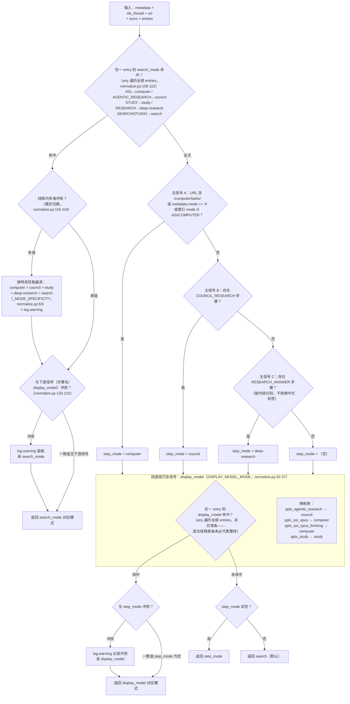

# 导出管线

---

## 导出管线详图

单线程导出的完整管线（`cmd_export`，export_cmd.py:43-89；批量路径 `cmd_batch`
复用同一管线，batch_cmd.py:124-231）。方括号内为关键函数与行号：

```mermaid
flowchart TD
    START(["线程 URL / UUID"]) --> IDX

    subgraph S1["① 索引（index / batch 前置）"]
        IDX["GraphQLClient.list_threads<br/>（graphql.py:51）<br/>LibraryThreadsRelayQuery 首页 25 条<br/>LibraryRecentThreadsPaginationQuery 翻页<br/>endCursor 为空即止（graphql.py:81-85）"]
        IDX --> IDXO[("index/library_&lt;account&gt;.json<br/>cmd_index（index_cmd.py:47）")]
    end

    subgraph S2["② 增量计划（batch 专用）"]
        PLAN["plan_incremental 纯函数<br/>（hooks/incremental.py:36）<br/>按 lastUpdated 降序，四态分类：<br/>new / updated / done / expired"]
        PLAN --> ES{"非 full 非 force？"}
        ES -->|"是"| TRIM["截掉尾部最长 done/expired 连续段<br/>（早停，incremental.py:83-86）"]
        ES -->|"否"| KEEP["逐项返回（全量扫描兜底）"]
    end

    subgraph S3["③ 抓取（adapter.get_thread）"]
        GT["PerplexityAdapter.get_thread<br/>（adapter.py:58）"]
        GT --> PLAIN["ThreadFetcher.get_thread<br/>plain 响应（rest.py:58）<br/>GET /rest/thread/uuid<br/>entries + background_entries<br/>cursor 翻页 ≤20 页，页间 3s（rest.py:42-56）"]
        DM{"detect_mode<br/>（normalize.py:66）<br/>parse_turn 后判别模式，见 §4"}
        DM -->|"computer / deep-research / council / study"| BLK["ThreadFetcher.get_thread_blocks<br/>schematized 响应（rest.py:66）<br/>SCHEMATIZED_USE_CASES 8 项（rest.py:25）<br/>抓前 sleep blocks_delay=4s（adapter.py:28,88）"]
        DM -->|"search（信号齐全）"| NOBLK["不抓 blocks<br/>（search 为简单 query+answer）"]
        DM -->|"信号全灭兜底（adapter.py:84-87）<br/>mode=search 且全部 entry 无 display_model"| BLK
        BLK --> ANOM["scan_wf_anomalies<br/>非 COMPLETED 工作流即 log.warning<br/>（parsers.py:645；调用点 adapter.py:131-134）"]
    end

    subgraph S4["④ 内存解析与组装（发生在写盘之前）"]
        PT["parse_turn × N（parsers.py:172）<br/>steps / 引文三路归集<br/>（entry.sources + FINAL.web_results<br/>+ WORKFLOW_ITEM_SOURCES）<br/>report_info / locked_reason 入 metadata"]
        EA["extract_answer（parsers.py:79）<br/>FINAL.answer JSON → plan.goals 兜底"]
        BASE["内存中组装基础 Conversation<br/>原始响应保留在 conv._plain / conv._blocks"]
        ATT["attach_workflow_blocks（parsers.py:230）<br/>wf_block 按 entry uuid 挂轮<br/>wf_status 入 turn.metadata"]
        STUB["attach_stub_workflows（parsers.py:469）<br/>桩轮 10s 时间窗关联"]
        UNC["collect_unconsumed_background<br/>（parsers.py:490）归属瀑布③"]
        READY["Conversation 可供导出<br/>（adapter.py:91-157）"]
        BASE -->|"其他模式"| READY
        BASE -->|"仅 computer/council<br/>（adapter.py:150-157）"| ATT
        ATT --> STUB
        STUB -.-> UNC
        UNC --> READY
    end

    subgraph S5["⑤ 资产准备（writer 之前）"]
        ADL["adapter.get_assets（adapter.py:199）<br/>collect_downloadable_assets（parsers.py:695）<br/>同名多版本按 created_at 编号 v1..vN"]
        CDN["CloudFront 签名 URL 直连下载<br/>AssetDownloader.download_all（assets.py:80）<br/>resolve_ext 三源定扩展名（assets.py:122）"]
    end

    subgraph S6["⑥ 落盘（fs_writer.write_thread）"]
        WJ[("thread.json（fs_writer.py:224-253）<br/>+ interruptions 登记 collect_interruptions（parsers.py:534）<br/>+ answer_variants 登记 collect_answer_variants（parsers.py:588）")]
        RAW1[("raw_entries.json<br/>保留的 plain 响应（fs_writer.py:257-261）")]
        RAW2[("raw_blocks.json<br/>保留的 schematized 响应（fs_writer.py:262-266）<br/>未抓 blocks 时无此文件")]
        WM[("conversation.md 简版<br/>render_conversation（render.py:641）")]
        WT[("turns/turn_NNNN.md 完整版<br/>render_turn（render.py:596）")]
        WS[("sources.json + sources.md<br/>（fs_writer.py:270-278）")]
        WR[("report.md（fs_writer.py:308-316）<br/>需要时用 adapter.get_report 兜底")]
        MF[("assets/assets_manifest.json<br/>版本化清单（fs_writer.py:320-330）")]
    end

    IDX --> S2
    S2 -->|"逐线程 new/updated"| S3
    PLAIN --> PT
    PT --> EA
    EA --> DM
    ANOM --> BASE
    NOBLK --> BASE
    READY --> ADL
    ADL --> CDN
    CDN --> WJ
    WJ --> RAW1
    WJ -. "实际抓取 blocks 时" .-> RAW2
    RAW1 --> WS
    RAW1 -. "离线可重跑<br/>（re-render，见 offline-operations.md §12）" .-> PT
    WS --> WM
    WM --> WT
    WT --> WR
    WR --> MF
    MF --> DONE(["state.mark_ok<br/>BatchState 断点（state.py:123）"])
```

关键设计：

1. **保留原始响应以供离线重跑**：`adapter.get_thread` 会先在内存中解析并组装
   对话（adapter.py:58-157），随后 `FilesystemWriter.write_thread` 才运行。
   成功写入时先保存 `thread.json`，再把实际取得的 plain/blocks 响应保存为
   `raw_*.json`（fs_writer.py:224-266）；之后解析/渲染可从这些文件零网络重跑。
2. **plain 必抓，blocks 按模式判别**：search 不抓 blocks（省一次请求）；
   判别信号全灭时**兜底也抓**（adapter.py:74-85 注释与判定：宁可多抓，避免平台改字段后
   `raw_blocks.json` 静默不落盘）。
3. **解析单点**：所有字段提取集中在 `parsers.py`（`_g` 多级安全取值 parsers.py:22、
   `_loads` 容错 parsers.py:32、`to_int` 宽松排序键 parsers.py:43），站点改版只改一处。
4. **writer 只读**：`wf_block`/`stub_wfs`/`unconsumed_bgs` 的挂载在
   `adapter.get_thread`（adapter.py:150-157）完成，`FilesystemWriter` 不挂载、只消费
   （fs_writer.py:217 注释）。

---

## 模式判别决策树（detect_mode）

`normalize.detect_mode`（normalize.py:66-128）的完整判定逻辑。五种模式：
`computer / council / deep-research / study / search`（搜索为默认）。

最高优先级信号是平台权威字段 **`entry.search_mode`**（SEARCH_MODE_MAP，
normalize.py:50-59）：官方模型配置实测（`GET /rest/models/config/v2`）
`default_models.search=pplx_pro`（UI「最佳」）、`default_models.research=pplx_alpha`
（UI「Deep research」），search_mode 取值与会话模式一一对应（归档验证：百余个
SEARCH 入口+pplx_alpha 线程 100% search_mode=RESEARCH；百余个纯 pplx_pro 线程全部
SEARCH）。search_mode 全灭时才回退原有的步骤名+display_model 链。

判别纪律（实测依据）：

- **`pplx_alpha` 刻意不在映射表**（normalize.py:15-31 注释）：它是 RESEARCH 专属模型
  （`default_models.research`，UI 固定、无选择器），是本分类器**要判出的目标**、
  而非判别依据。早前「121 个 search 线程使用 pplx_alpha」的统计实为本分类器自身
  误判的样本（缺 search_mode 信号时把缺 RESEARCH_ANSWER 步骤的 RESEARCH 会话判成
  search）——已按 search_mode 重判并迁移 124 个线程。
- **search_mode 与下游信号冲突时 search_mode 优先**：它是平台记录会话模式的权威字段；
  步骤名是平台最易改的表层字段，display_model 只是模型层枚举。冲突必然
  log.warning 留痕（normalize.py:120-123）。
- **线程内模式切换按特异性取最高**：computer > council > study > deep-research >
  search（normalize.py:63、116-119），并 log.warning。
- **信号全灭不做 search 定论**：回到管线层兜底抓 blocks（adapter.py:84-87），
  保证 schematized 数据不因字段漂移静默缺失。
