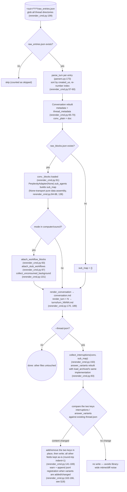
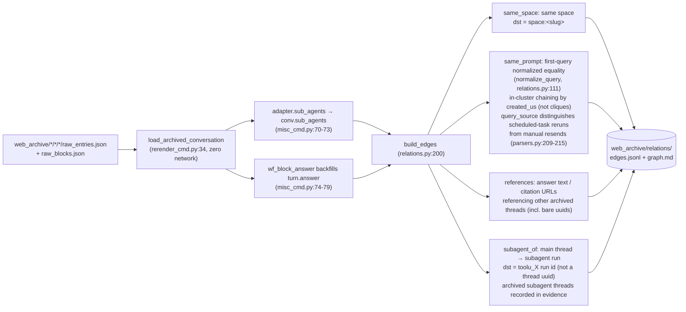
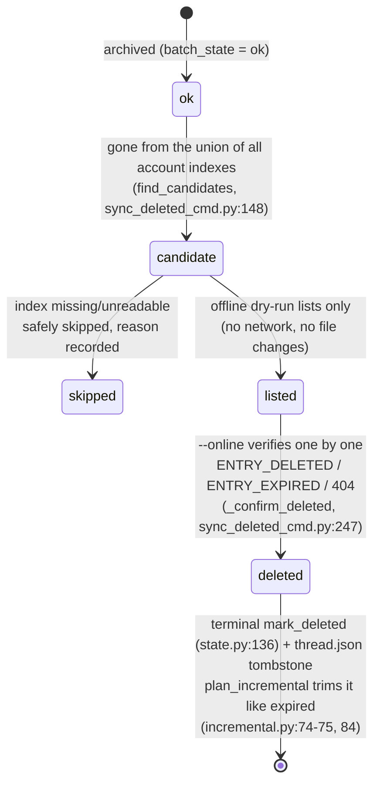
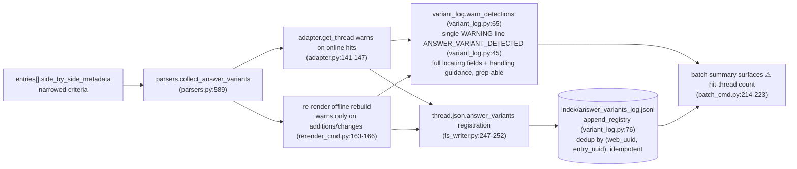

# العمليات غير المتصلة

الجانب الخالي من الشبكة في `pplx_export`: إعادة التوليد دون اتصال من JSON الخام، وخط أنابيب إعادة بناء العلاقات، وإثراء فهرس الخلفية، وآلة الحالة للحذف عن بُعد، وسلسلة كشف answer_variants. تحتفظ الأقسام بترقيمها الأصلي من [نظرة عامة على البنية](overview.md).

---

## إعادة التوليد دون اتصال (إعادة العرض)

بعد إصلاحات طبقة العرض، أعد توليد جميع القطع الأثرية من JSON الخام **بدون شبكة**، وبطريقة متساوية النتائج.
التنفيذ: `commands/rerender_cmd.py` (مفرد الخيط `rerender` rerender_cmd.py:105-190؛
دفعة `cmd_rerender` rerender_cmd.py:193-212).

الانضباط:

- **بدون شبكة**: يعيد `PerplexityAdapter(None)` استخدام طرق تجميع البيانات الخالصة فقط؛ لا يتم استدعاء أي طريقة عبر الإنترنت (get_thread إلخ).
- **متساوي النتائج**: تعتمد القطع الأثرية فقط على الخام + العارض؛ إعادة التشغيل متطابقة بايت ببايت (مضمونة بواسطة اختبارات الانحدار اللقطة، [§13](../development/testing-architecture.md)).
- **الملفات الأخرى دون تغيير**: تبقى المصادر و report.md والأصول كما هي؛ يبقى thread.json دون تغيير افتراضيًا — مع `--thread-json` يتم إضافة أو إزالة المفتاحين interruptions / answer_variants فقط.
- `--dry-run` يسرد الدلائل فقط دون كتابة ملفات (rerender_cmd.py:204-206)؛ `--limit N` يأخذ أول N.

---

## خط أنابيب إعادة بناء العلاقات دون اتصال

`cmd_relations` (misc_cmd.py:16) يعيد بناء رسم بياني لعلاقات المحادثات على مستوى المكتبة من البيانات الخام المؤرشفة **بدون شبكة**: يعيد استخدام خط أنابيب إعادة البناء دون اتصال الخاص بإعادة العرض `load_archived_conversation` (rerender_cmd.py:34) لاستعادة كل محادثة (تحليل/فرز/ترقيم الأدوار، إرفاق _plain/_blocks)، ويملأ `conv.sub_agents` على مستوى المحادثة عبر `adapter.sub_agents` خيطًا بخيط (misc_cmd.py:70-73؛ لا يقوم خط أنابيب التصدير بملء هذا الحقل، models.py:178-182)؛ يقوم الاحتياطي لإجابة الكمبيوتر (`wf_block_answer`) بملء `turn.answer` في هذه الطبقة، مما يوسع نطاق مسح المراجع (misc_cmd.py:74-79). الخيوط بدون بيانات خام تتحول إلى غلاف thread.json + conversation.md (يمكن اكتشاف حواف same_space / bare-uuid فقط، misc_cmd.py:61-66).

انضباط القرار (2026-07-23): تم تأكيد آلية `branch_of` ولكن لا يوجد مثيل لها في الأرشيف — لم يتم بناء أي حواف؛ لا يمكن تحليل `related_query` من البيانات الموجودة — لم يتم بناء أي حواف أيضًا: من الأفضل فقدان حافة بدلاً من بناء حافة تخمينية.
النطاق الملاحظ: 772 حافة / 21 مجموعة عبر الأرشيف (same_space 559 / subagent_of 154 / same_prompt 49 / references 10).

---

## search-mode-backfill (إثراء search_mode للفهرس)

`cmd_search_mode_backfill` (search_mode_backfill_cmd.py:81) يثري الحقل الموثوق من المنصة `search_mode` في `index/library_<account>.json`: **الخام المحلي أولاً** (للخيوط المؤرشفة، المستخرج من `entries[].search_mode` لـ raw_entries.json، بدون شبكة)؛ فقط الخيوط بدون خام محلي تلجأ إلى جلب الخيط عبر الإنترنت. الكتابة تدمج وتحافظ على حقول الفهرس الموجودة (دلالات التحديث: مفاتيح الإثراء تستبدل، كل شيء آخر يبقى)، متساوية النتائج وقابلة للاستئناف، مع `--limit` للمجموعات الفرعية.
صفوف الفهرس المثرية تجعل مرشح `--mode` للدفعة موثوقًا:
`index_row_matches_mode` (batch_cmd.py:46) يحكم بواسطة search_mode للفهرس أولاً
(SEARCH_MODE_MAP، normalize.py:50)، ويعود إلى الاستدلال فقط عندما يكون مفقودًا.

---

## sync-deleted آلة الحالة للحذف عن بُعد

`cmd_sync_deleted` (sync_deleted_cmd.py:262) يحدد الخيوط "المحذوفة من قبل المستخدم/عن بُعد على جانب المنصة" ويسجل حالة نهائية، جنبًا إلى جنب مع منتهية الصلاحية. تحديد المرشح هو **فرق اتحاد جميع فهارس الحسابات**: يعتبر الخيط المؤرشف ok مرشحًا فقط عندما يختفي من **جميع** ملفات `index/library_*.json` (يظهر خيط export_via عبر الحسابات فقط في فهرس مالكه، لذا فإن فرق حساب واحد سيعطي إيجابية خاطئة؛ find_candidates، sync_deleted_cmd.py:148)؛ يتم تخطي الفهارس المفقودة/غير القابلة للقراءة بأمان مع تسجيل السبب. التشغيل الجاف الافتراضي دون اتصال يسرد المرشحين فقط (بدون شبكة، بدون تغييرات في الملفات)؛ `--online` يتحقق من الخيط خيطًا بخيط باستخدام GET: `ENTRY_DELETED` / `ENTRY_EXPIRED` / 404 → تأكيد الحذف، `state.mark_deleted` (state.py:136) + شاهد قبر thread.json (mark_thread_json_remote_deleted، sync_deleted_cmd.py:215).

طبقات أنواع الأخطاء: يرث `EntryDeletedError` من `EntryExpiredError` (يأتي التحقق من 400 مع نص يحتوي على ENTRY_DELETED قبل ENTRY_EXPIRED، cookie_transport.py:93-98)؛ يجب على الدفعة التقاط الفئة الفرعية قبل الفئة الأم (batch_cmd.py:163-174 قبل 175-183)، وإلا سيتم تسجيل المحذوف خطأً كمنتهي الصلاحية. واجهة برمجة تطبيقات الحذف نفسها:
`DELETE /rest/thread/delete_thread_by_entry_uuid`
(يتم أخذ read_write_token من أول `entries[].read_write_token` غير فارغ؛ تم التحقق عمليًا 10/10 عمليات حذف ناجحة على خيوط اختبار ذاتية الإنشاء وخيوط مساحة BOT).

---

## سلسلة كشف answer_variants لإعادة كتابة الإجابة

البدائل المستبدلة في "إعادة كتابة الإجابة / تجارب A-B" للمنصة غير مرئية من جانب واجهة برمجة التطبيقات — الإجابة المحددة مرئية، بينما يترك الشقيق الخاسر أثرًا فقط في `entries[].side_by_side_metadata`، وقد يتم تطهيره بواسطة المنصة (تم إثبات روابط الأشقاء الميتة: 403 VIEW_THREAD_NOT_ALLOWED + إعادة توجيه SPA إلى الصفحة الرئيسية؛ راجع [مرجع واجهة برمجة التطبيقات §5.2](../reference/api/api-responses-errors.md)). تجعل سلسلة الكشف "حدثت إعادة كتابة" قابلة للملاحظة والتتبع:

- **معايير ضيقة**: يتم قبول الإشارات الموثوقة فقط من side_by_side_metadata؛ يتم تسجيل حقول التحديد الكاملة (معرف الخيط الكامل + uuid8، العنوان، entry_uuid، sibling_uuid، selection_status، experiment_role) بالإضافة إلى إرشادات المعالجة؛ التنسيق موجود في `format_detection` (variant_log.py:53).
- **متساوي النتائج**: يقوم jsonl بإزالة التكرارات بناءً على (web_uuid، entry_uuid)؛ التسجيلات المكررة من المسار عبر الإنترنت (source=online) والمسار دون اتصال (source=offline) لا تنتج صفوفًا مكررة؛ يحذر إعادة العرض فقط عندما يتغير محتوى البديل، لذا فإن عمليات إعادة التشغيل على مستوى المكتبة لا تسبب إزعاجًا.
- **تدفق المعالجة**: عند حدوث إصابة، قم بتأكيد الإجابة البديلة يدويًا في أقرب وقت ممكن وسجلها (قد يتم تطهير البديل بواسطة المنصة ولا يمكن استرداده عبر واجهة برمجة التطبيقات)؛ التدفق الكامل موجود في [مرجع واجهة برمجة التطبيقات §5.2](../reference/api/api-responses-errors.md).
