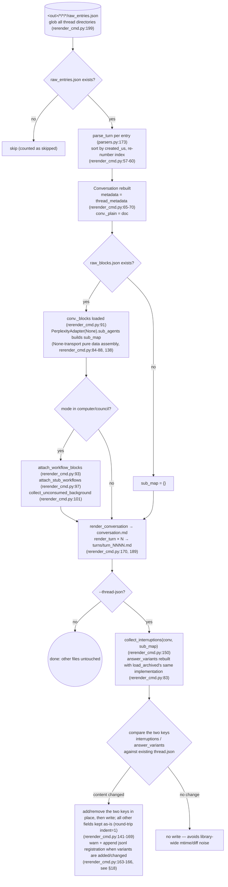
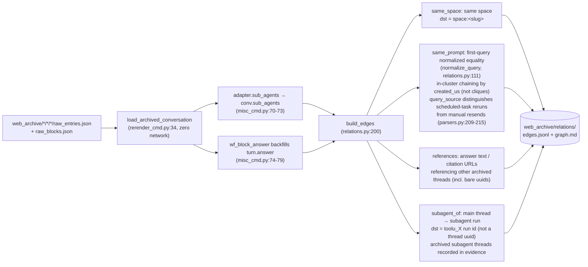
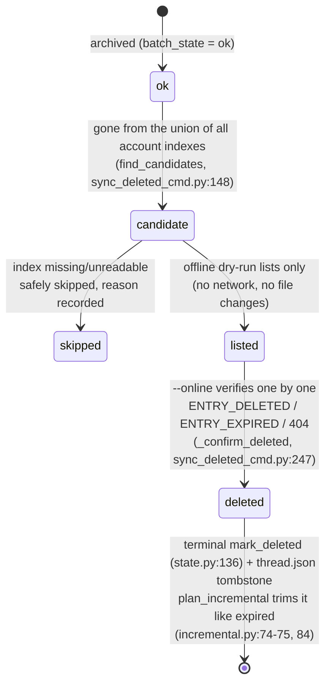
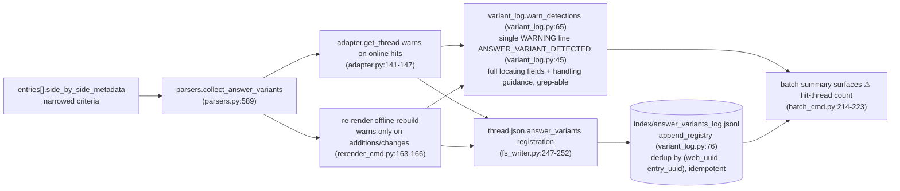

# Offline-Operationen

Die netzwerkfreie Seite von `pplx_export`: Offline-Regenerierung aus rohem JSON, die Relations-Neuerstellungspipeline, Index-Anreicherungs-Backfills, die Zustandsmaschine für Remote-Löschungen und die answer_variants-Erkennungskette. Die Abschnitte behalten ihre ursprüngliche Nummerierung aus der [Architekturübersicht](overview.md).

---

## Offline-Regenerierung (Neu-Rendering)

Nach Render-Ebene-Korrekturen alle Artefakte aus rohem JSON **ohne Netzwerk** idempotent regenerieren.
Implementierung: `commands/rerender_cmd.py` (Einzelthread `rerender` rerender_cmd.py:105-190;
Batch `cmd_rerender` rerender_cmd.py:193-212).

Disziplin:

- **Kein Netzwerk**: `PerplexityAdapter(None)` verwendet nur reine Daten-Assembly-Methoden; keine Online-Methode (get_thread usw.) wird jemals aufgerufen.
- **Idempotent**: Artefakte hängen nur von Rohdaten + Renderer ab; Wiederholungsläufe sind byte-identisch (garantiert durch die Snapshot-Regressionstests, [§13](../development/testing-architecture.md)).
- **Andere Dateien unberührt**: Quellen, report.md, Assets bleiben unverändert; thread.json wird standardmäßig nicht berührt – mit `--thread-json` werden nur die beiden Schlüssel interruptions / answer_variants hinzugefügt oder entfernt.
- `--dry-run` listet nur Verzeichnisse auf, ohne Dateien zu schreiben (rerender_cmd.py:204-206); `--limit N` nimmt die ersten N.

---

## Relations-Offline-Neuerstellungspipeline

`cmd_relations` (misc_cmd.py:16) erstellt den bibliotheksweiten Konversationsbeziehungsgraphen aus archivierten Rohdaten **ohne Netzwerk** neu: Es verwendet die Offline-Neuerstellungspipeline von Re-Render `load_archived_conversation` (rerender_cmd.py:34), um jede Konversation wiederherzustellen (Zug-Parsing/Sortierung/Nummerierung, _plain/_blocks-Anhängung), füllt konversationsebene `conv.sub_agents` über `adapter.sub_agents` Thread für Thread (misc_cmd.py:70-73; die Export-Pipeline füllt dieses Feld nicht nach, models.py:178-182); der Computer-Antwort-Fallback (`wf_block_answer`) füllt `turn.answer` auf dieser Ebene nach und erweitert die Referenz-Scan-Oberfläche (misc_cmd.py:74-79). Threads ohne Rohdaten degradieren zu einer thread.json + conversation.md-Hülle (nur same_space / bare-uuid-Kanten können erkannt werden, misc_cmd.py:61-66).

Entscheidungsdisziplin (2026-07-23): Der `branch_of`-Mechanismus ist bestätigt, hat aber keine Instanz im Archiv – keine Kanten erstellt; `related_query` kann nicht aus vorhandenen Daten geparst werden – ebenfalls keine Kanten erstellt: Lieber eine Kante verpassen, als eine geratene zu erstellen.
Beobachteter Umfang: 772 Kanten / 21 Cluster im gesamten Archiv (same_space 559 / subagent_of 154 / same_prompt 49 / references 10).

---

## search-mode-backfill (Index search_mode-Anreicherung)

`cmd_search_mode_backfill` (search_mode_backfill_cmd.py:81) reichert das plattformautoritative Feld `search_mode` in `index/library_<account>.json` an: **zuerst lokale Rohdaten** (für archivierte Threads, extrahiert aus `entries[].search_mode` von raw_entries.json, kein Netzwerk); nur Threads ohne lokale Rohdaten fallen auf einen Online-Thread-Abruf zurück. Das Schreiben führt Zusammenführung durch und bewahrt vorhandene Indexfelder (Aktualisierungssemantik: Anreicherungsschlüssel überschreiben, alles andere bleibt erhalten), idempotent und fortsetzbar, mit `--limit` für Teilmengen.
Angereicherte Indexzeilen machen den Batch-Filter `--mode` autoritativ:
`index_row_matches_mode` (batch_cmd.py:46) urteilt zuerst nach Index search_mode
(SEARCH_MODE_MAP, normalize.py:50) und fällt nur dann auf Heuristiken zurück, wenn es fehlt.

---

## sync-deleted Remote-Löschungs-Zustandsmaschine

`cmd_sync_deleted` (sync_deleted_cmd.py:262) identifiziert Threads, die "vom Benutzer/remote auf der Plattformseite gelöscht" wurden, und zeichnet einen Endzustand auf, zusammen mit abgelaufen. Die Kandidatenbestimmung ist ein **Union-of-all-Account-Indexes-Diff**: Ein archivierter ok-Thread zählt nur dann als Kandidat, wenn er aus **allen** `index/library_*.json`-Dateien verschwunden ist (ein Cross-Account-export_via-Thread erscheint nur im Index seines Besitzers, daher würde ein Einzelaccount-Diff falsch positiv sein; find_candidates, sync_deleted_cmd.py:148); fehlende/unlesbare Indizes werden sicher übersprungen, wobei der Grund aufgezeichnet wird. Der standardmäßige Offline-Trockenlauf listet nur Kandidaten (kein Netzwerk, keine Dateiänderungen); `--online` verifiziert Thread für Thread mit GET: `ENTRY_DELETED` / `ENTRY_EXPIRED` / 404 → Löschung bestätigt, `state.mark_deleted` (state.py:136) + ein thread.json-Grabstein (mark_thread_json_remote_deleted, sync_deleted_cmd.py:215).

Fehlertyp-Schichtung: `EntryDeletedError` erbt von `EntryExpiredError` (die Prüfung auf 400 mit einem Rumpf, der ENTRY_DELETED enthält, erfolgt vor ENTRY_EXPIRED, cookie_transport.py:93-98); Batch muss die Unterklasse vor der Elternklasse abfangen (batch_cmd.py:163-174 vor 175-183), sonst würde gelöscht fälschlich als abgelaufen aufgezeichnet. Die Lösch-API selbst:
`DELETE /rest/thread/delete_thread_by_entry_uuid`
(read_write_token aus dem ersten nicht leeren `entries[].read_write_token` entnommen;
in der Praxis verifiziert: 10/10 Löschungen erfolgreich bei selbst erstellten Test-Threads und BOT-Space-Threads).

---

## Die answer_variants-Antwort-Umschreibungs-Variantenerkennungskette

Varianten, die in der Plattform "Antwort-Umschreibung / A-B-Experimente" ersetzt wurden, sind auf der API-Seite unsichtbar – die ausgewählte Antwort ist sichtbar, während der verlierende Gegenpart nur eine Spur in `entries[].side_by_side_metadata` hinterlässt und von der Plattform gelöscht werden kann (tote Gegenpart-Links sind nachgewiesen: 403 VIEW_THREAD_NOT_ALLOWED + eine SPA-Weiterleitung zur Startseite; siehe [die API-Referenz §5.2](../reference/api/api-responses-errors.md)). Die Erkennungskette macht "eine Umschreibung ist passiert" beobachtbar und nachvollziehbar:

- **Eingeschränkte Kriterien**: Nur die autoritativen Signale von side_by_side_metadata werden akzeptiert; vollständige Lokalisierungsfelder werden aufgezeichnet (vollständige Thread-UUID + UUID8, Titel, entry_uuid, sibling_uuid, selection_status, experiment_role) plus Handhabungshinweise; das Format ist in `format_detection` (variant_log.py:53).
- **Idempotent**: Das JSONL dedupliziert nach (web_uuid, entry_uuid); doppelte Registrierungen aus dem Online- (source=online) und Offline-Pfad (source=offline) erzeugen keine doppelten Zeilen; Neu-Rendering warnt nur, wenn sich der Varianteninhalt ändert, sodass bibliotheksweite Wiederholungsläufe nicht spammen.
- **Handhabungsablauf**: Bei einem Treffer die alternative Antwort so schnell wie möglich manuell bestätigen und aufzeichnen (die Alternative kann von der Plattform gelöscht werden und ist über die API nicht wiederherstellbar); der vollständige Ablauf ist in [der API-Referenz §5.2](../reference/api/api-responses-errors.md).
