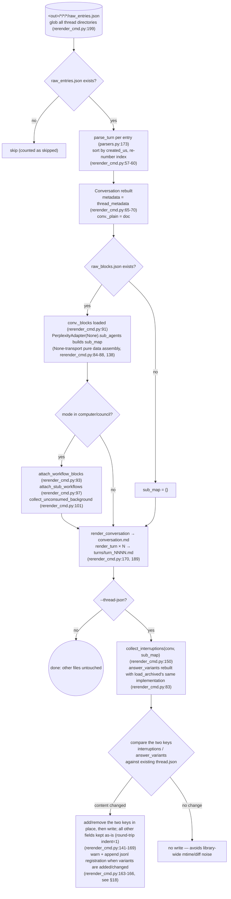
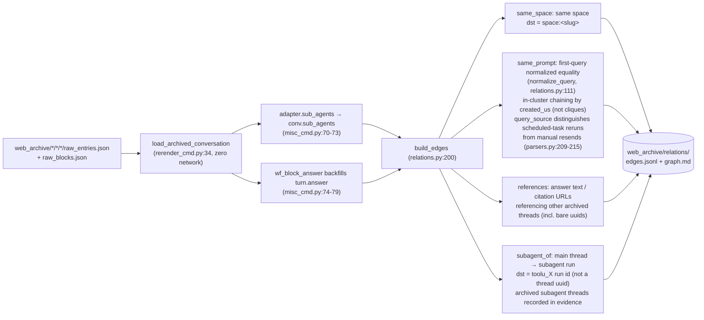
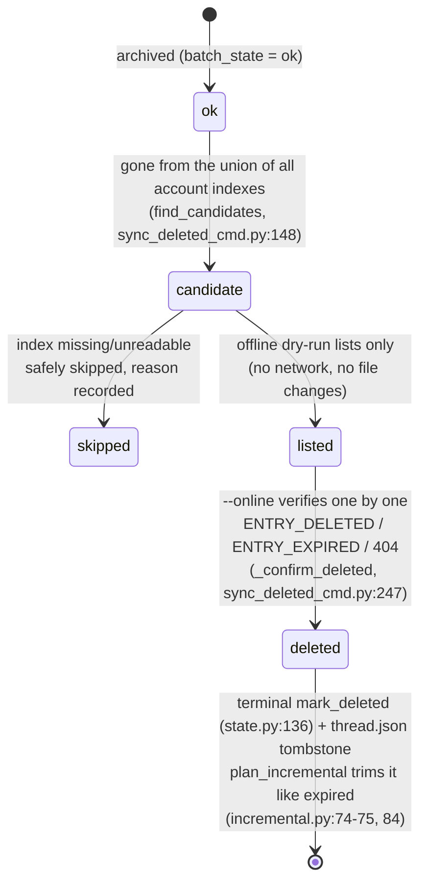
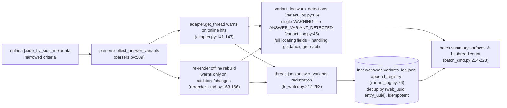

# Operaciones sin conexión

El lado sin red de `pplx_export`: regeneración sin conexión a partir de JSON sin procesar, la canalización de reconstrucción de relaciones, el relleno de enriquecimiento de índices, la máquina de estados de eliminación remota y la cadena de detección de answer_variants. Las secciones mantienen su numeración original de la [visión general de la arquitectura](overview.md).

---

## Regeneración sin conexión (re-renderizado)

Después de las correcciones en la capa de renderizado, regenerar todos los artefactos a partir de JSON sin procesar **sin conexión a la red**, de forma idempotente.
Implementación: `commands/rerender_cmd.py` (un solo hilo `rerender` rerender_cmd.py:105-190;
lote `cmd_rerender` rerender_cmd.py:193-212).

Disciplina:

- **Sin conexión a la red**: `PerplexityAdapter(None)` solo reutiliza métodos de ensamblaje de datos puros; nunca se llama a ningún método en línea (get_thread, etc.).
- **Idempotente**: los artefactos dependen solo de los datos sin procesar y el renderizador; las reejecuciones son byte-idénticas (garantizado por las pruebas de regresión de instantáneas, [§13](../development/testing-architecture.md)).
- **Otros archivos intactos**: las fuentes, report.md, los activos permanecen como están; thread.json no se modifica por defecto; con `--thread-json` solo se añaden o eliminan las dos claves interruptions / answer_variants.
- `--dry-run` solo lista directorios sin escribir archivos (rerender_cmd.py:204-206); `--limit N` toma los primeros N.

---

## Canalización de reconstrucción de relaciones sin conexión

`cmd_relations` (misc_cmd.py:16) reconstruye el grafo de relaciones de conversaciones de toda la biblioteca a partir de datos sin procesar archivados **sin conexión a la red**: reutiliza la canalización de reconstrucción sin conexión de re-renderizado `load_archived_conversation` (rerender_cmd.py:34) para restaurar cada Conversación (análisis/ordenación/numeración de turnos, adjuntado _plain/_blocks), completa `conv.sub_agents` a nivel de conversación mediante `adapter.sub_agents` hilo por hilo (misc_cmd.py:70-73; la canalización de exportación no rellena este campo, models.py:178-182); el fallback de respuesta de computadora (`wf_block_answer`) rellena `turn.answer` en esta capa, ampliando la superficie de escaneo de referencias (misc_cmd.py:74-79). Los hilos sin datos sin procesar se degradan a un shell de thread.json + conversation.md (solo se pueden detectar bordes same_space / bare-uuid, misc_cmd.py:61-66).

Disciplina de decisión (2026-07-23): el mecanismo `branch_of` está confirmado pero no tiene instancia en el archivo — no se construyen bordes; `related_query` no se puede analizar a partir de los datos existentes — tampoco se construyen bordes: es mejor omitir un borde que construir uno supuesto.
Escala observada: 772 bordes / 21 grupos en todo el archivo (same_space 559 / subagent_of 154 / same_prompt 49 / references 10).

---

## Relleno de modo de búsqueda (enriquecimiento de search_mode del índice)

`cmd_search_mode_backfill` (search_mode_backfill_cmd.py:81) enriquece el campo autoritativo de la plataforma `search_mode` en `index/library_<account>.json`: **primero los datos sin procesar locales** (para hilos archivados, extraídos de `entries[].search_mode` de raw_entries.json, sin conexión a la red); solo los hilos sin datos sin procesar locales recurren a una obtención de hilo en línea. La escritura fusiona y conserva los campos de índice existentes (semántica de actualización: las claves de enriquecimiento sobrescriben, todo lo demás se mantiene), idempotente y reanudable, con `--limit` para subconjuntos.
Las filas de índice enriquecidas hacen que el filtro `--mode` del lote sea autoritativo:
`index_row_matches_mode` (batch_cmd.py:46) juzga primero por el search_mode del índice
(SEARCH_MODE_MAP, normalize.py:50), recurriendo a heurísticas solo cuando falta.

---

## Máquina de estados de eliminación remota sync-deleted

`cmd_sync_deleted` (sync_deleted_cmd.py:262) identifica hilos "eliminados por el usuario/remotamente en el lado de la plataforma" y registra un estado terminal, junto con expirados. La determinación de candidatos es una **diferencia de unión de todos los índices de cuenta**: un hilo archivado ok se considera candidato solo cuando ha desaparecido de **todos** los archivos `index/library_*.json` (un hilo export_via entre cuentas aparece solo en el índice de su propietario, por lo que una diferencia de una sola cuenta daría un falso positivo; find_candidates, sync_deleted_cmd.py:148); los índices faltantes/ilegibles se omiten de forma segura con la razón registrada. La ejecución en seco sin conexión predeterminada solo lista candidatos (sin red, sin cambios de archivos); `--online` verifica hilo por hilo con GET: `ENTRY_DELETED` / `ENTRY_EXPIRED` / 404 → eliminación confirmada, `state.mark_deleted` (state.py:136) + un marcador de thread.json (mark_thread_json_remote_deleted, sync_deleted_cmd.py:215).

Jerarquía de tipos de error: `EntryDeletedError` hereda de `EntryExpiredError` (la comprobación de 400 con un cuerpo que contiene ENTRY_DELETED ocurre antes que ENTRY_EXPIRED, cookie_transport.py:93-98); el lote debe capturar la subclase antes que la clase padre (batch_cmd.py:163-174 antes de 175-183), de lo contrario, eliminado se registraría incorrectamente como expirado. La API de eliminación en sí:
`DELETE /rest/thread/delete_thread_by_entry_uuid`
(read_write_token tomado del primer `entries[].read_write_token` no vacío;
verificado en la práctica: 10/10 eliminaciones exitosas en hilos de prueba creados por uno mismo y hilos del espacio BOT).

---

## La cadena de detección de variantes de reescritura de respuesta answer_variants

Las variantes reemplazadas en la "reescritura de respuesta / experimentos A-B" de la plataforma son invisibles en el lado de la API — la respuesta seleccionada es visible, mientras que la hermana perdedora deja solo un rastro en `entries[].side_by_side_metadata`, y puede ser purgada por la plataforma (los enlaces a hermanas muertas están probados: 403 VIEW_THREAD_NOT_ALLOWED + una redirección SPA a la página de inicio; consulte [la referencia de la API §5.2](../reference/api/api-responses-errors.md)). La cadena de detección hace que "ocurrió una reescritura" sea observable y rastreable:

- **Criterios reducidos**: solo se aceptan las señales autoritativas de side_by_side_metadata;
  se registran los campos de localización completos (uuid completo del hilo + uuid8, título, entry_uuid, sibling_uuid,
  selection_status, experiment_role) más orientación de manejo; el formato está en
  `format_detection` (variant_log.py:53).
- **Idempotente**: el jsonl deduplica por (web_uuid, entry_uuid); los registros duplicados de las rutas
  en línea (source=online) y sin conexión (source=offline) no producen filas duplicadas; el re-renderizado
  advierte solo cuando el contenido de la variante cambia, por lo que las reejecuciones en toda la biblioteca no generan spam.
- **Flujo de manejo**: en un acierto, confirme manualmente la respuesta alternativa lo antes posible y
  regístrela (la alternativa puede ser purgada por la plataforma y no se puede recuperar a través de la API);
  el flujo completo está en [la referencia de la API §5.2](../reference/api/api-responses-errors.md).
