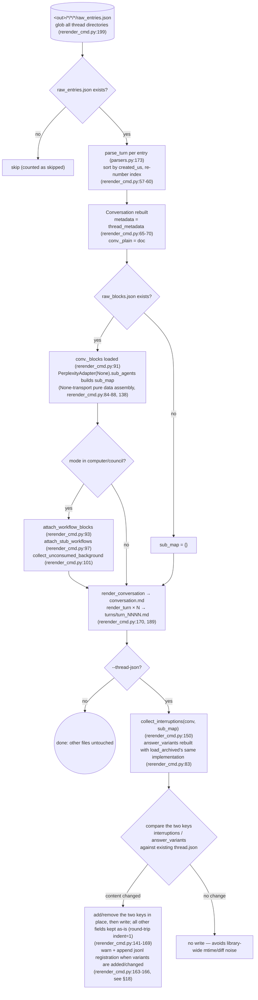
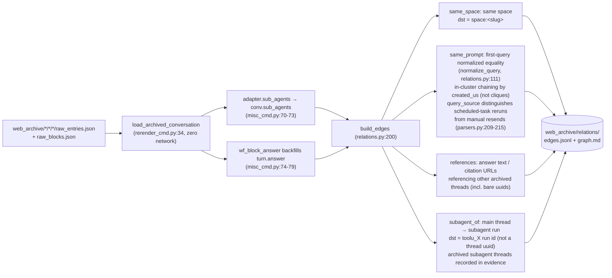
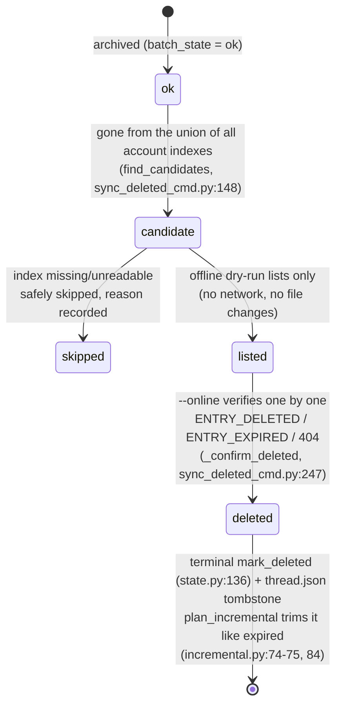
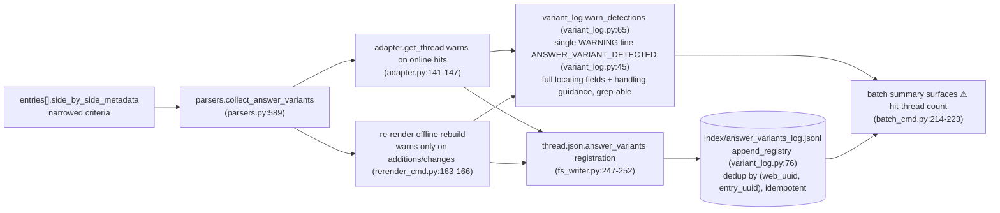

# Opérations hors ligne

Le côté zéro-réseau de `pplx_export` : régénération hors ligne à partir de JSON brut, pipeline de reconstruction des relations, remplissage d'enrichissement d'index, machine d'état de suppression à distance et chaîne de détection answer_variants. Les sections conservent leur numérotation d'origine de la [vue d'ensemble de l'architecture](overview.md).

---

## Régénération hors ligne (re-rendu)

Après les corrections de la couche de rendu, régénérer tous les artefacts à partir du JSON brut **sans réseau**, de manière idempotente.
Implémentation : `commands/rerender_cmd.py` (monothread `rerender` rerender_cmd.py:105-190 ;
lots `cmd_rerender` rerender_cmd.py:193-212).

Discipline :

- **Zéro réseau** : `PerplexityAdapter(None)` ne réutilise que des méthodes pures d'assemblage de données ; aucune méthode
  en ligne (get_thread, etc.) n'est jamais appelée.
- **Idempotent** : les artefacts ne dépendent que du brut + du moteur de rendu ; les réexécutions sont identiques octet par octet
  (garanti par les tests de régression instantanés, [§13](../development/testing-architecture.md)).
- **Autres fichiers inchangés** : les sources, report.md, assets restent en l'état ; thread.json n'est pas modifié par défaut —
  avec `--thread-json` seules les deux clés interruptions / answer_variants sont ajoutées ou supprimées.
- `--dry-run` liste uniquement les répertoires sans écrire de fichiers (rerender_cmd.py:204-206) ; `--limit N` prend les N premiers.

---

## Pipeline de reconstruction hors ligne des relations

`cmd_relations` (misc_cmd.py:16) reconstruit le graphe des relations de conversation à l'échelle de la bibliothèque à partir des
archives de données brutes **sans réseau** : il réutilise le pipeline de reconstruction hors ligne du re-rendu
`load_archived_conversation` (rerender_cmd.py:34) pour restaurer chaque Conversation (analyse/tri/numérotation des tours, rattachement _plain/_blocks), remplit le champ `conv.sub_agents` au niveau conversation via
`adapter.sub_agents` fil par fil (misc_cmd.py:70-73 ; le pipeline d'export ne remplit pas
ce champ, models.py:178-182) ; le repli de réponse computer (`wf_block_answer`) remplit
`turn.answer` à cette couche, élargissant la surface de balayage des références (misc_cmd.py:74-79). Les fils
sans données brutes se dégradent en une coque thread.json + conversation.md (seules les arêtes same_space / bare-uuid
peuvent être détectées, misc_cmd.py:61-66).

Discipline de décision (2026-07-23) : le mécanisme `branch_of` est confirmé mais n'a aucune instance
dans l'archive — aucune arête construite ; `related_query` ne peut pas être analysé à partir des données existantes — aucune arête
construite non plus : plutôt manquer une arête que d'en construire une supposée.
Échelle observée : 772 arêtes / 21 clusters dans l'archive (same_space 559 / subagent_of 154 /
same_prompt 49 / references 10).

---

## search-mode-backfill (enrichissement search_mode de l'index)

`cmd_search_mode_backfill` (search_mode_backfill_cmd.py:81) enrichit le champ faisant autorité sur la plateforme
`search_mode` dans `index/library_<account>.json` : **brut local d'abord** (pour les fils
archivés, extrait de `entries[].search_mode` de raw_entries.json, zéro réseau) ; seuls les fils
sans brut local se replient sur une récupération en ligne du fil. L'écriture fusionne et préserve les champs
d'index existants (sémantique d'actualisation : les clés d'enrichissement écrasent, tout le reste est conservé), idempotent
et reprenable, avec `--limit` pour les sous-ensembles.
Les lignes d'index enrichies rendent le filtre `--mode` du lot faisant autorité :
`index_row_matches_mode` (batch_cmd.py:46) juge d'abord par search_mode de l'index
(SEARCH_MODE_MAP, normalize.py:50), ne tombant dans les heuristiques que lorsqu'il est manquant.

---

## sync-deleted machine d'état de suppression à distance

`cmd_sync_deleted` (sync_deleted_cmd.py:262) identifie les fils « supprimés par l'utilisateur/à distance
côté plateforme » et enregistre un état terminal, ainsi que expiré. La détermination des candidats est une
**différence d'union de tous les index de comptes** : un fil archivé ok est considéré comme candidat uniquement
lorsqu'il a disparu de **tous** les fichiers `index/library_*.json` (un export_via
inter-compte apparaît uniquement dans l'index de son propriétaire, donc une différence mono-compte serait un faux positif ;
find_candidates, sync_deleted_cmd.py:148) ; les index manquants/illisibles sont ignorés en toute sécurité avec
la raison enregistrée. L'essai à blanc hors ligne par défaut liste uniquement les candidats (pas de réseau, pas de
modification de fichier) ; `--online` vérifie fil par fil avec GET : `ENTRY_DELETED` / `ENTRY_EXPIRED` /
404 → suppression confirmée, `state.mark_deleted` (state.py:136) + une pierre tombale thread.json
(mark_thread_json_remote_deleted, sync_deleted_cmd.py:215).

Superposition des types d'erreur : `EntryDeletedError` hérite de `EntryExpiredError` (la vérification d'un 400 avec un
corps contenant ENTRY_DELETED a lieu avant ENTRY_EXPIRED, cookie_transport.py:93-98) ; le lot
doit attraper la sous-classe avant la classe parente (batch_cmd.py:163-174 avant 175-183), sinon supprimé
serait mal enregistré comme expiré. L'API de suppression elle-même :
`DELETE /rest/thread/delete_thread_by_entry_uuid`
(read_write_token pris du premier `entries[].read_write_token` non vide ;
vérifié en pratique 10/10 suppressions réussies sur des fils de test auto-créés et des fils de l'espace BOT).

---

## La chaîne de détection des variantes de réponse answer_variants

Les variantes remplacées dans les « answer rewrite / A-B experiments » de la plateforme sont invisibles côté API
— la réponse sélectionnée est visible, tandis que la sœur perdante ne laisse qu'une trace dans
`entries[].side_by_side_metadata`, et peut être purgée par la plateforme (les liens morts des sœurs sont
prouvés : 403 VIEW_THREAD_NOT_ALLOWED + une redirection SPA vers la page d'accueil ; voir
[la référence API §5.2](../reference/api/api-responses-errors.md)). La chaîne de détection rend « une réécriture a eu lieu » observable
et traçable :

- **Critères resserrés** : seuls les signaux faisant autorité de side_by_side_metadata sont acceptés ;
  les champs de localisation complets sont enregistrés (uuid complet du fil + uuid8, titre, entry_uuid, sibling_uuid,
  selection_status, experiment_role) ainsi que des conseils de traitement ; le format est dans
  `format_detection` (variant_log.py:53).
- **Idempotent** : le jsonl déduplique par (web_uuid, entry_uuid) ; les enregistrements en double provenant des chemins
  en ligne (source=online) et hors ligne (source=offline) ne produisent pas de lignes en double ; le re-rendu
  n'avertit que lorsque le contenu de la variante change, donc les réexécutions à l'échelle de la bibliothèque ne spamment pas.
- **Flux de traitement** : sur un hit, confirmer manuellement la réponse alternative dès que possible et
  l'enregistrer (l'alternative peut être purgée par la plateforme et ne peut pas être récupérée via l'API) ;
  le flux complet est dans [la référence API §5.2](../reference/api/api-responses-errors.md).
