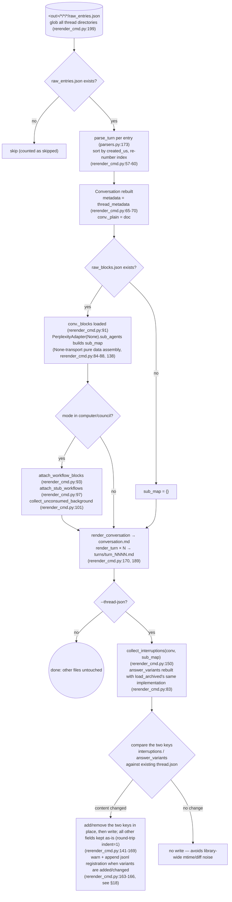
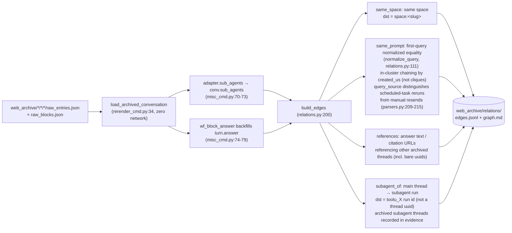
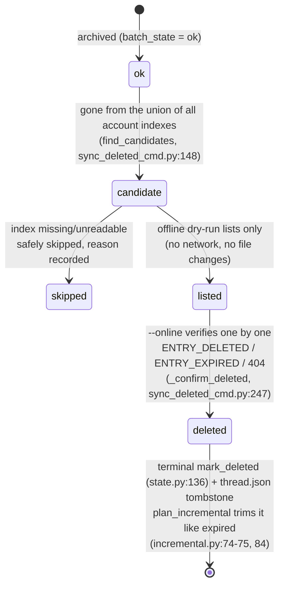
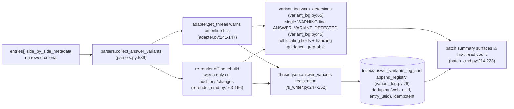

# Operazioni offline

Il lato a rete zero di `pplx_export`: rigenerazione offline da JSON grezzo, pipeline di ricostruzione delle relazioni, backfill di arricchimento degli indici, macchina a stati per la cancellazione remota e catena di rilevamento delle varianti di risposta. Le sezioni mantengono la loro numerazione originale dalla [panoramica dell'architettura](overview.md).

---

## Rigenerazione offline (re-render)

Dopo le correzioni al livello di rendering, rigenera tutti gli artefatti dal JSON grezzo **a rete zero**, in modo idempotente.
Implementazione: `commands/rerender_cmd.py` (single-thread `rerender` rerender_cmd.py:105-190;
batch `cmd_rerender` rerender_cmd.py:193-212).

Disciplina:

- **Rete zero**: `PerplexityAdapter(None)` riutilizza solo metodi puri di assemblaggio dati; nessun metodo
  online (get_thread, ecc.) viene mai chiamato.
- **Idempotente**: gli artefatti dipendono solo dal grezzo + renderer; le riesecuzioni sono byte-identiche
  (garantito dai test di regressione degli snapshot, [§13](../development/testing-architecture.md)).
- **Altri file non toccati**: sorgenti, report.md, asset rimangono invariati; thread.json è intoccato per impostazione predefinita —
  con `--thread-json` solo le due chiavi interruptions / answer_variants vengono aggiunte o rimosse.
- `--dry-run` elenca solo le directory senza scrivere file (rerender_cmd.py:204-206); `--limit N` prende i primi N.

---

## Pipeline offline di ricostruzione delle relazioni

`cmd_relations` (misc_cmd.py:16) ricostruisce il grafo delle relazioni delle conversazioni a livello di libreria dai
dati grezzi archiviati **a rete zero**: riutilizza la pipeline offline di ricostruzione del re-render
`load_archived_conversation` (rerender_cmd.py:34) per ripristinare ogni Conversazione (analisi/ordinamento/numerazione dei turni,
allegamento _plain/_blocks), riempie `conv.sub_agents` a livello di conversazione tramite
`adapter.sub_agents` thread per thread (misc_cmd.py:70-73; la pipeline di esportazione non esegue il backfill
 di questo campo, models.py:178-182); il fallback per le risposte computer (`wf_block_answer`) esegue il backfill di
`turn.answer` a questo livello, ampliando la superficie di scansione dei riferimenti (misc_cmd.py:74-79). I thread
senza dati grezzi degradano a un guscio thread.json + conversation.md (possono essere rilevati solo bordi same_space / bare-uuid,
misc_cmd.py:61-66).

Disciplina decisionale (2026-07-23): il meccanismo `branch_of` è confermato ma non ha istanze
nell'archivio — nessun bordo costruito; `related_query` non può essere analizzato dai dati esistenti — nessun bordo
costruito: meglio perdere un bordo che costruirne uno ipotetico.
Scala osservata: 772 bordi / 21 cluster nell'archivio (same_space 559 / subagent_of 154 /
same_prompt 49 / references 10).

---

## search-mode-backfill (arricchimento search_mode dell'indice)

`cmd_search_mode_backfill` (search_mode_backfill_cmd.py:81) arricchisce il campo autorevole della piattaforma
`search_mode` in `index/library_<account>.json`: **prima il grezzo locale** (per i thread
archiviati, estratto da `entries[].search_mode` di raw_entries.json, rete zero); solo i thread
senza grezzo locale ricadono in un recupero online del thread. La scrittura unisce e preserva i campi
esistenti dell'indice (semantica di aggiornamento: le chiavi di arricchimento sovrascrivono, tutto il resto viene mantenuto), idempotente
e riprendibile, con `--limit` per sottoinsiemi.
Le righe di indice arricchite rendono autorevole il filtro `--mode` del batch:
`index_row_matches_mode` (batch_cmd.py:46) giudica prima in base a search_mode dell'indice
(SEARCH_MODE_MAP, normalize.py:50), ricadendo su euristiche solo quando è assente.

---

## sync-deleted macchina a stati per cancellazione remota

`cmd_sync_deleted` (sync_deleted_cmd.py:262) identifica i thread "cancellati dall'utente/da remoto
sul lato piattaforma" e registra uno stato terminale, insieme a expired. La determinazione dei candidati
è un **diff di unione di tutti gli indici degli account**: un thread archiviato ok conta come candidato
solo quando è scomparso da **tutti** i file `index/library_*.json` (un export_via cross-account
appare solo nell'indice del suo proprietario, quindi un diff di un singolo account darebbe un falso positivo;
find_candidates, sync_deleted_cmd.py:148); gli indici mancanti/illeggibili vengono saltati in sicurezza con
la registrazione del motivo. Il dry-run offline predefinito elenca solo i candidati (nessuna rete, nessuna modifica
dei file); `--online` verifica thread per thread con GET: `ENTRY_DELETED` / `ENTRY_EXPIRED` /
404 → cancellazione confermata, `state.mark_deleted` (state.py:136) + un tombstone thread.json
(mark_thread_json_remote_deleted, sync_deleted_cmd.py:215).

Stratificazione dei tipi di errore: `EntryDeletedError` eredita `EntryExpiredError` (il controllo per 400 con un
corpo contenente ENTRY_DELETED viene prima di ENTRY_EXPIRED, cookie_transport.py:93-98); il batch
deve catturare la sottoclasse prima della superclasse (batch_cmd.py:163-174 prima di 175-183), altrimenti deleted
verrebbe registrato erroneamente come expired. L'API di cancellazione stessa:
`DELETE /rest/thread/delete_thread_by_entry_uuid`
(read_write_token preso dal primo `entries[].read_write_token` non vuoto;
verificato in pratica 10/10 cancellazioni riuscite su thread di test auto-creati e thread dello spazio BOT).

---

## La catena di rilevamento delle varianti di risposta answer_variants

Le varianti sostituite negli "esperimenti di riscrittura / A-B" della piattaforma sono invisibili dal lato
API — la risposta selezionata è visibile, mentre il fratello perdente lascia solo una traccia in
`entries[].side_by_side_metadata`, e può essere rimosso dalla piattaforma (i collegamenti a fratelli morti sono
provati: 403 VIEW_THREAD_NOT_ALLOWED + un reindirizzamento SPA alla home page; vedere
[il riferimento API §5.2](../reference/api/api-responses-errors.md)). La catena di rilevamento rende osservabile e tracciabile
"una riscrittura è avvenuta":

- **Criteri ristretti**: vengono accettati solo i segnali autorevoli di side_by_side_metadata;
  vengono registrati i campi di localizzazione completi (uuid completo del thread + uuid8, titolo,
  entry_uuid, sibling_uuid, selection_status, experiment_role) più le linee guida per la gestione; il formato è in
  `format_detection` (variant_log.py:53).
- **Idempotente**: il jsonl deduplica per (web_uuid, entry_uuid); le registrazioni duplicate dai percorsi
  online (source=online) e offline (source=offline) non producono righe duplicate; il re-render
  avverte solo quando il contenuto della variante cambia, quindi le riesecuzioni a livello di libreria non generano spam.
- **Flusso di gestione**: su un hit, confermare manualmente la risposta alternativa il prima possibile e
  registrarla (l'alternativa potrebbe essere rimossa dalla piattaforma e non può essere recuperata tramite API);
  il flusso completo è in [il riferimento API §5.2](../reference/api/api-responses-errors.md).
