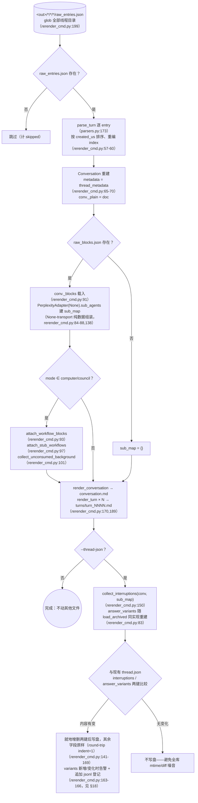
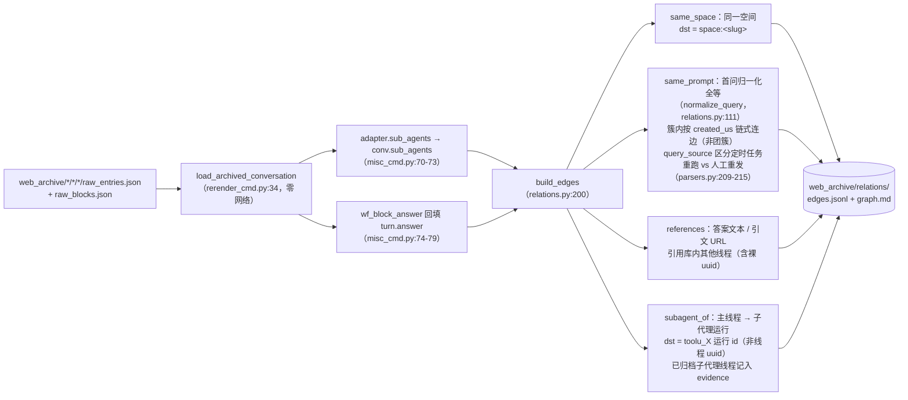
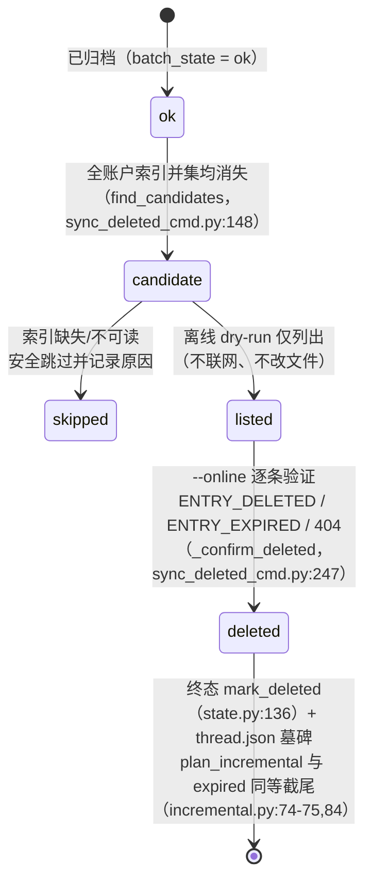
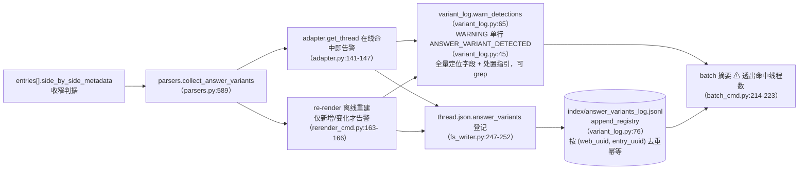

# オフライン操作

`pplx_export` のネットワークゼロ側：raw JSON オフライン再生成、relations オフライン再構築パイプライン、インデックスリッチ化バックフィル、リモート削除ステートマシン、answer_variants 検出チェーン。各セクションは[アーキテクチャ概要](overview.md)の元の番号を保持します。

---

## オフライン再生成（re-render）

レンダリング層の修正後、raw JSON から**ネットワークゼロ**で冪等に全成果物を再生成します。実装：
`commands/rerender_cmd.py`（シングルスレッド `rerender` rerender_cmd.py:105-190；
バッチ `cmd_rerender` rerender_cmd.py:193-212）。

規律：

- **ネットワークゼロ**：`PerplexityAdapter(None)` は純粋なデータアセンブリメソッドのみを再利用し、オンラインメソッド（get_thread など）は呼び出されません。
- **冪等**：成果物は raw + レンダラーのみで決定され、再実行の結果はバイト単位で一致します（スナップショット回帰テストで保証、[§13](../development/testing-architecture.md)）。
- **他ファイルは変更しない**：sources、report.md、assets はそのまま；thread.json はデフォルトで変更せず、`--thread-json` の場合のみ interruptions / answer_variants の2つのキーを追加/削除します。
- `--dry-run` はディレクトリをリストするのみでファイルは書き込みません（rerender_cmd.py:204-206）；`--limit N` は先頭 N 個を取得します。

---

## relations オフライン再構築パイプライン

`cmd_relations`（misc_cmd.py:16）はアーカイブされた raw から**ネットワークゼロ**で全ライブラリの会話関係グラフを再構築します：re-render のオフライン再構築パイプライン `load_archived_conversation`（rerender_cmd.py:34）を再利用して Conversation（turns の解析/ソート/番号付け、_plain/_blocks のマウント）を復元し、スレッドごとに `adapter.sub_agents` を介してセッションレベルの `conv.sub_agents`（misc_cmd.py:70-73；エクスポートパイプラインはこのフィールドをバックフィルしません、models.py:178-182）を入力します；computer の回答フォールバック（`wf_block_answer`）はこの層で `turn.answer` をバックフィルし、references のスキャン範囲を拡大します（misc_cmd.py:74-79）。raw がないスレッドは thread.json + conversation.md シェルに退化します（same_space / 裸の uuid のみ判定可能、misc_cmd.py:61-66）。

確定規律（2026-07-23）：`branch_of` メカニズムは確認済みだが全ライブラリにインスタンスなし、エッジは作成しない；`related_query` は既存データから解析不可、エッジは作成しない——エッジが欠けても推測エッジは作成しない。実測規模：全ライブラリ 772 エッジ / 21 クラスター（same_space 559 / subagent_of 154 / same_prompt 49 / references 10）。

---

## search-mode-backfill（インデックス search_mode リッチ化）

`cmd_search_mode_backfill`（search_mode_backfill_cmd.py:81）はプラットフォームの権威フィールド `search_mode` を `index/library_<account>.json` にリッチ化します：**ローカル raw 優先**（アーカイブ済みスレッドは raw_entries.json の `entries[].search_mode` から抽出、ネットワークゼロ）、ローカル raw がない場合のみオンラインでフォールバックして thread を取得；書き込み時に既存のインデックスフィールドをマージして保持（リフレッシュセマンティクス：リッチ化キーは上書き、その他はそのまま）、冪等で再実行可能、`--limit` でサブセットを取得可能。リッチ化後のインデックスにより、バッチの `--mode` フィルタリングが権威フィルタリングになります：`index_row_matches_mode`（batch_cmd.py:46）はインデックスの search_mode（SEARCH_MODE_MAP、normalize.py:50）を優先して判定し、欠落している場合のみヒューリスティックにフォールバックします。

---

## sync-deleted リモート削除ステートマシン

`cmd_sync_deleted`（sync_deleted_cmd.py:262）は「プラットフォーム側でユーザー/リモートにより削除された」スレッドを識別し、最終状態に設定します。expired と並列です。候補判定は**全アカウントインデックスの和集合 diff**：アーカイブ済み ok スレッドが**すべて**の `index/library_*.json` で消失した場合のみ候補とみなします（クロスアカウント export_via スレッドは所有者のインデックスにのみ出現するため、単一アカウントの diff は誤検出します；find_candidates、sync_deleted_cmd.py:148）；インデックスが欠落/読み取り不可の場合は安全にスキップし、理由を正確に記録します。デフォルトのオフライン dry-run は候補をリストするのみ（ネットワーク接続なし、ファイル変更なし）；`--online` はスレッドごとに GET で検証：`ENTRY_DELETED` / `ENTRY_EXPIRED` / 404 → 削除確認、`state.mark_deleted`（state.py:136）+ thread.json 墓石（mark_thread_json_remote_deleted、sync_deleted_cmd.py:215）。

エラータイプの階層化：`EntryDeletedError` は `EntryExpiredError` を継承（400 かつボディに ENTRY_DELETED を含む場合の判定は ENTRY_EXPIRED より優先、cookie_transport.py:93-98）；バッチのキャッチ順序は子を先に、親を後にしなければなりません（batch_cmd.py:163-174 が 175-183 より先）、そうしないと deleted が誤って expired として記録されます。削除 API 自体：`DELETE /rest/thread/delete_thread_by_entry_uuid`（read_write_token は `entries[].read_write_token` の最初の非空を取得；自前のテストスレッドと BOT スペーススレッドで実際に検証済み、10/10 削除成功）。

---

## answer_variants 回答書き換えバリアント検出チェーン

プラットフォームの「回答書き換え / A-B 実験」で置き換えられたバリアントは API 側では見えません——選択された answer は見えますが、選ばれなかった sibling は `entries[].side_by_side_metadata` の痕跡のみ残り、プラットフォームによってクリーンアップされる可能性があります（sibling のデッドリンクは実証済み：403 VIEW_THREAD_NOT_ALLOWED + SPA リダイレクトでトップページへ、[API リファレンス §5.2](../reference/api/api-responses-errors.md) 参照）。検出チェーンにより、「書き換えが発生したこと」を観測可能かつトレース可能にします：

- **判定基準の絞り込み**：side_by_side_metadata の権威シグナルのみを認識し、完全な位置特定フィールド（スレッドの完全な uuid + uuid8、タイトル、entry_uuid、sibling_uuid、selection_status、experiment_role）と処置ガイダンスを記録します。形式は `format_detection`（variant_log.py:53）を参照。
- **冪等**：jsonl は (web_uuid, entry_uuid) で重複排除され、オンライン（source=online）/オフライン（source=offline）の2つの経路からの重複登録で重複行は生成されません；rerender は variants の内容が変更された場合のみ警告し、全ライブラリの再実行で画面が埋め尽くされることはありません。
- **処置フロー**：ヒット後、直ちに手動で代替回答を確認し補足記録します（代替回答はプラットフォームによってクリーンアップされる可能性があり、API では救済できません）。完全なフローは [API リファレンス §5.2](../reference/api/api-responses-errors.md) を参照。
