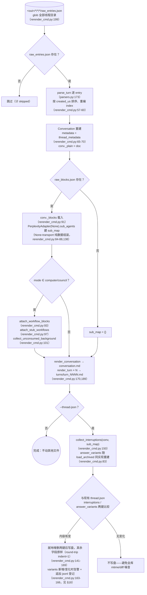
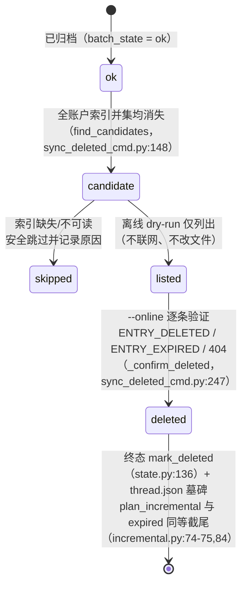
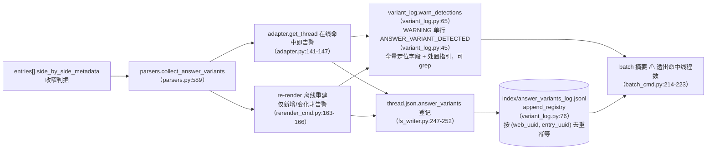

# 오프라인 작업

`pplx_export`의 제로 네트워크 측: raw JSON 오프라인 재생성, relations 오프라인 재구축 파이프라인, 인덱스 강화 백필, 원격 삭제 상태 머신 및 answer_variants 감지 체인. 하위 섹션은 [아키텍처 개요](overview.md)의 원래 번호를 유지합니다.

---

## 오프라인 재생성(re-render)

렌더링 계층 수정 후, raw JSON에서 **제로 네트워크**로 모든 산출물을 멱등적으로 재생성합니다. 구현:
`commands/rerender_cmd.py`(단일 스레드 `rerender` rerender_cmd.py:105-190;
배치 `cmd_rerender` rerender_cmd.py:193-212).

규칙:

- **제로 네트워크**: `PerplexityAdapter(None)`는 순수 데이터 조립 메서드만 재사용하며, 온라인 메서드(get_thread 등)는 호출되지 않습니다.
- **멱등성**: 산출물은 raw + 렌더러에 의해서만 결정됩니다. 재실행 시 결과가 바이트 단위로 일치합니다(스냅샷 회귀 테스트로 보장, [§13](../development/testing-architecture.md)).
- **다른 파일 수정 안 함**: sources, report.md, assets은 그대로 유지됩니다. thread.json은 기본적으로 수정되지 않으며, `--thread-json`인 경우에만 interruptions / answer_variants 두 키를 추가/제거합니다.
- `--dry-run`는 디렉토리만 나열하고 파일을 쓰지 않습니다(rerender_cmd.py:204-206). `--limit N`는 처음 N개를 가져옵니다.

---

## relations 오프라인 재구축 파이프라인

`cmd_relations`(misc_cmd.py:16)는 아카이브된 raw에서 **제로 네트워크**로 전체 라이브러리의 대화 관계 그래프를 재구축합니다: re-render의 오프라인 재구축 파이프라인 `load_archived_conversation`(rerender_cmd.py:34)을 재사용하여 Conversation(turns 파싱/정렬/번호 매기기, _plain/_blocks 마운트)을 복원하고, 스레드별로 `adapter.sub_agents`를 통해 세션 수준 `conv.sub_agents`를 채웁니다(misc_cmd.py:70-73; 내보내기 파이프라인은 이 필드를 백필하지 않음, models.py:178-182). computer의 답변 폴백(`wf_block_answer`)은 이 계층에서 `turn.answer`을 백필하여 references 스캔 범위를 확장합니다(misc_cmd.py:74-79). raw가 없는 스레드는 thread.json + conversation.md 셸로 퇴화합니다(same_space / bare uuid만 판별 가능, misc_cmd.py:61-66).

```mermaid
flowchart LR
    RAW["web_archive/*/*/*/raw_entries.json<br/>+ raw_blocks.json"] --> LA["load_archived_conversation<br/>（rerender_cmd.py:34，零网络）"]
    LA --> SUB["adapter.sub_agents → conv.sub_agents<br/>（misc_cmd.py:70-73）"]
    LA --> FB["wf_block_answer 回填 turn.answer<br/>（misc_cmd.py:74-79）"]
    SUB --> BE["build_edges（relations.py:200）"]
    FB --> BE
    BE --> SS["same_space：同一空间<br/>dst = space:&lt;slug&gt;"]
    BE --> SP["same_prompt：首问归一化全等<br/>（normalize_query，relations.py:111）<br/>簇内按 created_us 链式连边（非团簇）<br/>query_source 区分定时任务重跑 vs 人工重发<br/>（parsers.py:209-215）"]
    BE --> RF["references：答案文本 / 引文 URL<br/>引用库内其他线程（含裸 uuid）"]
    BE --> SA["subagent_of：主线程 → 子代理运行<br/>dst = toolu_X 运行 id（非线程 uuid）<br/>已归档子代理线程记入 evidence"]
    SS --> OUT[("web_archive/relations/<br/>edges.jsonl + graph.md")]
    SP --> OUT
    RF --> OUT
    SA --> OUT
```

확정 규칙(2026-07-23): `branch_of` 메커니즘은 확인되었지만 전체 라이브러리에 인스턴스가 없으므로 엣지를 생성하지 않습니다. `related_query`는 기존 데이터에서 구문 분석할 수 없으므로 엣지를 생성하지 않습니다. 엣지가 부족하더라도 추측 엣지는 생성하지 않습니다.
실측 규모: 전체 라이브러리 772 엣지 / 21 클러스터(same_space 559 / subagent_of 154 / same_prompt 49 / references 10).

---

## search-mode-backfill(인덱스 search_mode 강화)

`cmd_search_mode_backfill`(search_mode_backfill_cmd.py:81)은 플랫폼 권위 필드 `search_mode`을 `index/library_<account>.json`에 강화합니다: **로컬 raw 우선**(이미 아카이브된 스레드는 raw_entries.json의 `entries[].search_mode`에서 추출, 제로 네트워크), 로컬 raw가 없는 경우에만 온라인 폴백으로 thread를 가져옵니다. 디스크에 쓸 때 기존 인덱스 필드를 병합하여 유지합니다(refresh 의미: 강화 키는 덮어쓰고 나머지는 그대로 유지). 멱등적이며 중단 후 재개 가능하고, `--limit`는 하위 집합을 가져올 수 있습니다. 강화된 인덱스는 배치의 `--mode` 필터를 권위 필터로 만듭니다: `index_row_matches_mode`(batch_cmd.py:46)는 인덱스 search_mode(SEARCH_MODE_MAP, normalize.py:50)를 우선적으로 판단하고, 없으면 휴리스틱으로 폴백합니다.

---

## sync-deleted 원격 삭제 상태 머신

`cmd_sync_deleted`(sync_deleted_cmd.py:262)는 '플랫폼 측에서 사용자/원격에 의해 삭제된' 스레드를 식별하고 최종 상태로 기록하며, expired와 병렬로 처리됩니다. 후보 판정은 **전체 계정 인덱스의 합집합 diff**입니다: 이미 아카이브된 ok 스레드가 **모든** `index/library_*.json`에서 사라진 경우에만 후보로 간주됩니다(계정 간 export_via 스레드는 소유자 인덱스에만 나타나므로 단일 계정 diff는 오탐을 일으킴; find_candidates, sync_deleted_cmd.py:148). 인덱스가 없거나 읽을 수 없는 경우 안전하게 건너뛰고 이유를 기록합니다. 기본적으로 오프라인 dry-run은 후보만 나열합니다(네트워크 연결 없음, 파일 수정 없음). `--online`는 스레드별로 GET thread를 호출하여 확인합니다: `ENTRY_DELETED` / `ENTRY_EXPIRED` / 404 → 삭제 확인, `state.mark_deleted`(state.py:136) + thread.json 묘비(mark_thread_json_remote_deleted, sync_deleted_cmd.py:215).

오류 유형 계층화: `EntryDeletedError`는 `EntryExpiredError`를 상속합니다(400 상태 코드이며 본문에 ENTRY_DELETED가 포함된 경우 ENTRY_EXPIRED보다 먼저 판단, cookie_transport.py:93-98). batch의 포착 순서는 자식이 먼저, 부모가 나중이어야 합니다(batch_cmd.py:163-174가 175-183보다 먼저). 그렇지 않으면 deleted가 expired로 잘못 기록될 수 있습니다. 삭제 API 자체: `DELETE /rest/thread/delete_thread_by_entry_uuid`(read_write_token은 `entries[].read_write_token`의 첫 번째 비어 있지 않은 값을 가져옴; 자체 제작 테스트 스레드와 BOT 공간 스레드에 대해 10/10 삭제 성공을 실전 검증함).

---

## answer_variants 답변 재작성 변형 감지 체인

플랫폼의 '답변 재작성 / A-B 실험'에서 대체된 변형은 API 측에서 보이지 않습니다. 선택된 답변은 표시되지만, 선택되지 않은 sibling은 `entries[].side_by_side_metadata` 흔적만 남으며 플랫폼에 의해 정리될 수 있습니다(sibling 끊긴 링크는 이미 실증됨: 403 VIEW_THREAD_NOT_ALLOWED + SPA 리디렉션 홈페이지, [API 참조 §5.2](../reference/api/api-responses-errors.md) 참조). 감지 체인은 '재작성이 발생했음'을 관찰 가능하고 추적 가능하게 만듭니다:

- **판단 기준 축소**: side_by_side_metadata의 권위 신호만 인정하며, 전체 위치 필드(thread 전체 uuid + uuid8, 제목, entry_uuid, sibling_uuid, selection_status, experiment_role)와 처리 지침을 기록합니다. 형식은 `format_detection`(variant_log.py:53)을 참조하십시오.
- **멱등성**: jsonl은 (web_uuid, entry_uuid)로 중복 제거됩니다. 온라인(source=online) / 오프라인(source=offline) 두 경로에서 중복 등록해도 중복 행이 생성되지 않습니다. rerender는 variants 내용이 변경된 경우에만 경고하며, 전체 라이브러리 재실행 시 화면이 넘치지 않습니다.
- **처리 절차**: 적중 시 즉시 수동으로 대체 답변을 확인하고 보충 기록합니다(대체 답변은 플랫폼에 의해 정리될 수 있으며 API로 복구 불가능). 전체 절차는 [API 참조 §5.2](../reference/api/api-responses-errors.md)를 참조하십시오.
