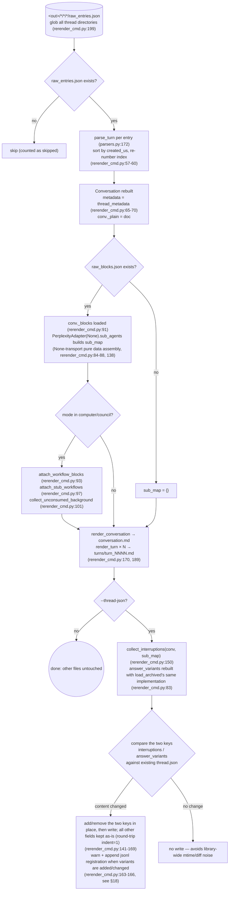
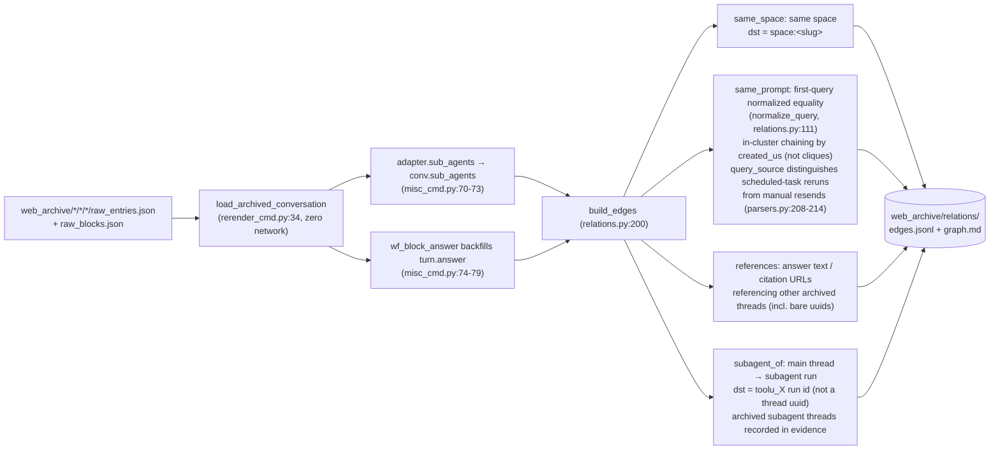
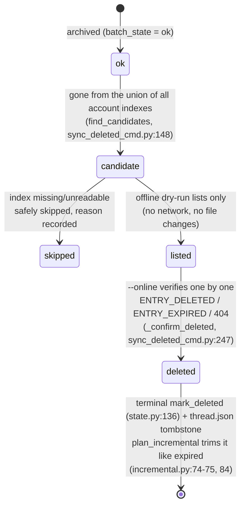
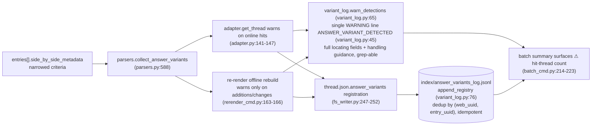

# Offline operations

The zero-network side of `pplx_export`: offline regeneration from raw JSON, the relations
rebuild pipeline, index enrichment backfills, the remote-deletion state machine, and the
answer_variants detection chain. Sections keep their original numbering from the
[architecture overview](overview.md).

---

## Offline regeneration (re-render)

After render-layer fixes, regenerate all artifacts from raw JSON **with zero network**, idempotently.
Implementation: `commands/rerender_cmd.py` (single-thread `rerender` rerender_cmd.py:105-190;
batch `cmd_rerender` rerender_cmd.py:193-212).

Discipline:

- **Zero network**: `PerplexityAdapter(None)` only reuses pure data-assembly methods; no online
  method (get_thread etc.) is ever called.
- **Idempotent**: artifacts depend only on raw + renderer; reruns are byte-identical
  (guaranteed by the snapshot regression tests, [§13](../development/testing-architecture.md)).
- **Other files untouched**: sources, report.md, assets stay as-is; thread.json is untouched by default —
  with `--thread-json` only the two keys interruptions / answer_variants are added or removed.
- `--dry-run` only lists directories without writing files (rerender_cmd.py:204-206); `--limit N` takes the first N.

---

## relations offline rebuild pipeline

`cmd_relations` (misc_cmd.py:16) rebuilds the library-wide conversation relations graph from
archived raw data **with zero network**: it reuses re-render's offline rebuild pipeline
`load_archived_conversation` (rerender_cmd.py:34) to restore each Conversation (turn parsing/
sorting/numbering, _plain/_blocks attachment), fills conversation-level `conv.sub_agents` via
`adapter.sub_agents` thread by thread (misc_cmd.py:70-73; the export pipeline does not backfill
this field, models.py:178-182); the computer answer fallback (`wf_block_answer`) backfills
`turn.answer` at this layer, widening the references scan surface (misc_cmd.py:74-79). Threads
without raw data degrade to a thread.json + conversation.md shell (only same_space / bare-uuid
edges can be detected, misc_cmd.py:61-66).

Decision discipline (2026-07-23): the `branch_of` mechanism is confirmed but has no instance
in the archive — no edges built; `related_query` cannot be parsed from existing data — no edges
built either: rather miss an edge than build a guessed one.
Observed scale: 772 edges / 21 clusters across the archive (same_space 559 / subagent_of 154 /
same_prompt 49 / references 10).

---

## search-mode-backfill (index search_mode enrichment)

`cmd_search_mode_backfill` (search_mode_backfill_cmd.py:81) enriches the platform-authoritative
field `search_mode` into `index/library_<account>.json`: **local raw first** (for archived
threads, extracted from `entries[].search_mode` of raw_entries.json, zero network); only threads
without local raw fall back to an online thread fetch. Writing merges and preserves existing
index fields (refresh semantics: enrichment keys overwrite, everything else kept), idempotent
and resumable, with `--limit` for subsets.
Enriched index rows make batch's `--mode` filter authoritative:
`index_row_matches_mode` (batch_cmd.py:46) judges by index search_mode first
(SEARCH_MODE_MAP, normalize.py:50), falling back to heuristics only when it is missing.

---

## sync-deleted remote-deletion state machine

`cmd_sync_deleted` (sync_deleted_cmd.py:262) identifies threads "deleted by the user/remotely
on the platform side" and records a terminal state, alongside expired. Candidate determination
is a **union-of-all-account-indexes diff**: an archived ok thread counts as a candidate only
when it has disappeared from **all** `index/library_*.json` files (a cross-account export_via
thread appears only in its owner's index, so a single-account diff would false-positive;
find_candidates, sync_deleted_cmd.py:148); missing/unreadable indexes are safely skipped with
the reason recorded. The default offline dry-run only lists candidates (no network, no file
changes); `--online` verifies thread by thread with GET: `ENTRY_DELETED` / `ENTRY_EXPIRED` /
404 → deletion confirmed, `state.mark_deleted` (state.py:136) + a thread.json tombstone
(mark_thread_json_remote_deleted, sync_deleted_cmd.py:215).

Error-type layering: `EntryDeletedError` inherits `EntryExpiredError` (the check for 400 with a
body containing ENTRY_DELETED comes before ENTRY_EXPIRED, cookie_transport.py:93-98); batch
must catch the subclass before the parent (batch_cmd.py:163-174 before 175-183), or deleted
would be misrecorded as expired. The deletion API itself:
`DELETE /rest/thread/delete_thread_by_entry_uuid`
(read_write_token taken from the first non-empty `entries[].read_write_token`;
verified in practice 10/10 deletions succeeded on self-created test threads and BOT-space threads).

---

## The answer_variants answer-rewrite variant detection chain

Variants replaced in the platform's "answer rewrite / A-B experiments" are invisible on the API
side — the selected answer is visible, while the losing sibling leaves only a trace in
`entries[].side_by_side_metadata`, and may be purged by the platform (dead sibling links are
proven: 403 VIEW_THREAD_NOT_ALLOWED + an SPA redirect to the home page; see
[the API reference §5.2](../reference/api/api-responses-errors.md)). The detection chain makes "a rewrite happened" observable
and traceable:

- **Narrowed criteria**: only the authoritative signals of side_by_side_metadata are accepted;
  full locating fields are recorded (full thread uuid + uuid8, title, entry_uuid, sibling_uuid,
  selection_status, experiment_role) plus handling guidance; the format is in
  `format_detection` (variant_log.py:53).
- **Idempotent**: the jsonl dedups by (web_uuid, entry_uuid); duplicate registrations from the
  online (source=online) and offline (source=offline) paths produce no duplicate rows; rerender
  warns only when variant content changes, so library-wide reruns don't spam.
- **Handling flow**: on a hit, manually confirm the alternate answer as soon as possible and
  record it (the alternate may be purged by the platform and cannot be recovered via the API);
  the full flow is in [the API reference §5.2](../reference/api/api-responses-errors.md).
