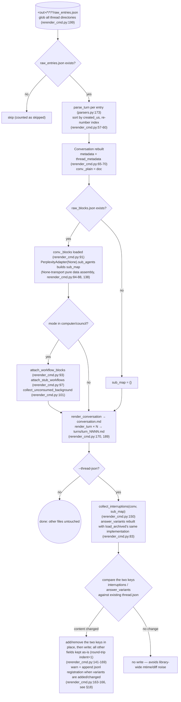
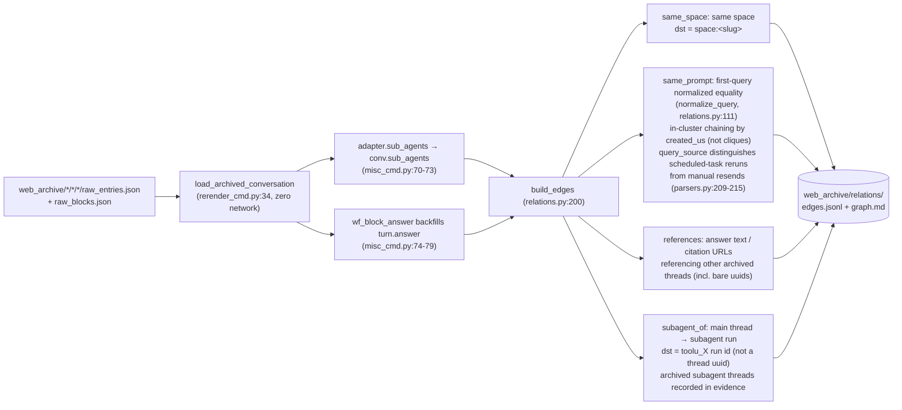
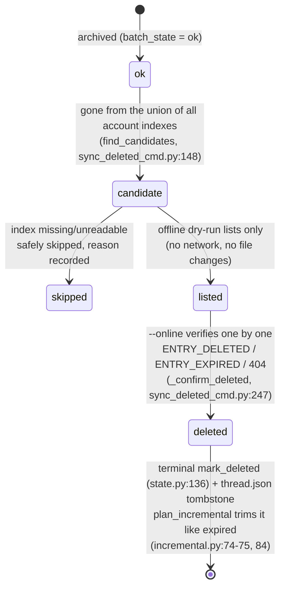
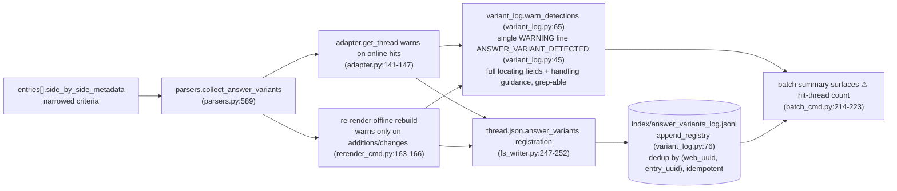

# Operações offline

O lado sem rede do `pplx_export`: regeneração offline a partir de JSON bruto, o pipeline de reconstrução de relações, backfills de enriquecimento de índice, a máquina de estado de exclusão remota e a cadeia de detecção de answer_variants. As seções mantêm sua numeração original da [visão geral da arquitetura](overview.md).

---

## Regeneração offline (re-render)

Após correções na camada de renderização, regenerar todos os artefatos a partir de JSON bruto **sem rede**, de forma idempotente.
Implementação: `commands/rerender_cmd.py` (single-thread `rerender` rerender_cmd.py:105-190;
lote `cmd_rerender` rerender_cmd.py:193-212).

Disciplina:

- **Sem rede**: `PerplexityAdapter(None)` reutiliza apenas métodos de montagem de dados puros; nenhum método online (get_thread etc.) é chamado.
- **Idempotente**: artefatos dependem apenas de bruto + renderizador; reexecuções são byte-idênticas (garantido pelos testes de regressão de snapshot, [§13](../development/testing-architecture.md)).
- **Outros arquivos intactos**: fontes, report.md, assets permanecem como estão; thread.json não é alterado por padrão — com `--thread-json` apenas as duas chaves interruptions / answer_variants são adicionadas ou removidas.
- `--dry-run` apenas lista diretórios sem escrever arquivos (rerender_cmd.py:204-206); `--limit N` pega os primeiros N.

---

## Pipeline de reconstrução offline de relações

`cmd_relations` (misc_cmd.py:16) reconstrói o grafo de relações de conversas em toda a biblioteca a partir de dados brutos arquivados **sem rede**: reutiliza o pipeline de reconstrução offline do re-render `load_archived_conversation` (rerender_cmd.py:34) para restaurar cada Conversation (análise/ordenação/numeração de turnos, anexação _plain/_blocks), preenche `conv.sub_agents` em nível de conversa via `adapter.sub_agents` thread por thread (misc_cmd.py:70-73; o pipeline de exportação não preenche este campo, models.py:178-182); o fallback de resposta do computador (`wf_block_answer`) preenche `turn.answer` nesta camada, ampliando a superfície de varredura de referências (misc_cmd.py:74-79). Threads sem dados brutos degradam para um shell thread.json + conversation.md (apenas arestas same_space / bare-uuid podem ser detectadas, misc_cmd.py:61-66).

Disciplina de decisão (2026-07-23): o mecanismo `branch_of` está confirmado, mas não possui instância no arquivo — nenhuma aresta construída; `related_query` não pode ser analisado a partir de dados existentes — nenhuma aresta construída também: é melhor perder uma aresta do que construir uma suposta.
Escala observada: 772 arestas / 21 clusters em todo o arquivo (same_space 559 / subagent_of 154 / same_prompt 49 / references 10).

---

## search-mode-backfill (enriquecimento search_mode do índice)

`cmd_search_mode_backfill` (search_mode_backfill_cmd.py:81) enriquece o campo autoritativo da plataforma `search_mode` em `index/library_<account>.json`: **bruto local primeiro** (para threads arquivados, extraído de `entries[].search_mode` do raw_entries.json, zero rede); apenas threads sem bruto local recorrem a uma busca online de thread. A escrita mescla e preserva campos de índice existentes (semântica de atualização: chaves de enriquecimento sobrescrevem, todo o resto mantido), idempotente e retomável, com `--limit` para subconjuntos.
Linhas de índice enriquecidas tornam o filtro `--mode` do lote autoritativo:
`index_row_matches_mode` (batch_cmd.py:46) julga pelo search_mode do índice primeiro (SEARCH_MODE_MAP, normalize.py:50), recorrendo a heurísticas apenas quando ausente.

---

## sync-deleted máquina de estado de exclusão remota

`cmd_sync_deleted` (sync_deleted_cmd.py:262) identifica threads "excluídos pelo usuário/remotamente no lado da plataforma" e registra um estado terminal, junto com expirados. A determinação de candidatos é uma **diferença de uniões de todos os índices de conta**: um thread arquivado ok conta como candidato apenas quando desapareceu de **todos** os arquivos `index/library_*.json` (um thread export_via entre contas aparece apenas no índice de seu proprietário, então uma diferença de conta única geraria falso positivo; find_candidates, sync_deleted_cmd.py:148); índices ausentes/ilegíveis são ignorados com segurança, com o motivo registrado. O dry-run offline padrão apenas lista candidatos (sem rede, sem alterações de arquivo); `--online` verifica thread por thread com GET: `ENTRY_DELETED` / `ENTRY_EXPIRED` / 404 → exclusão confirmada, `state.mark_deleted` (state.py:136) + um thread.json tombstone (mark_thread_json_remote_deleted, sync_deleted_cmd.py:215).

Camadas de tipo de erro: `EntryDeletedError` herda de `EntryExpiredError` (a verificação de 400 com corpo contendo ENTRY_DELETED vem antes de ENTRY_EXPIRED, cookie_transport.py:93-98); o lote deve capturar a subclasse antes da classe pai (batch_cmd.py:163-174 antes de 175-183), ou excluído seria registrado incorretamente como expirado. A API de exclusão em si:
`DELETE /rest/thread/delete_thread_by_entry_uuid`
(read_write_token retirado do primeiro `entries[].read_write_token` não vazio;
verificado na prática 10/10 exclusões bem-sucedidas em threads de teste criados por si e threads do espaço BOT).

---

## A cadeia de detecção de variantes answer_variants (reescrita de resposta)

Variantes substituídas nos "experimentos de reescrita de resposta / A-B" da plataforma são invisíveis no lado da API — a resposta selecionada é visível, enquanto o irmão perdedor deixa apenas um rastro em `entries[].side_by_side_metadata`, e pode ser removido pela plataforma (links de irmãos mortos são comprovados: 403 VIEW_THREAD_NOT_ALLOWED + um redirecionamento SPA para a página inicial; veja [a referência da API §5.2](../reference/api/api-responses-errors.md)). A cadeia de detecção torna "uma reescrita ocorreu" observável e rastreável:

- **Critérios restritos**: apenas os sinais autoritativos de side_by_side_metadata são aceitos; campos de localização completos são registrados (full thread uuid + uuid8, title, entry_uuid, sibling_uuid, selection_status, experiment_role) além de orientação de tratamento; o formato está em `format_detection` (variant_log.py:53).
- **Idempotente**: o jsonl deduplica por (web_uuid, entry_uuid); registros duplicados dos caminhos online (source=online) e offline (source=offline) não produzem linhas duplicadas; re-render avisa apenas quando o conteúdo da variante muda, então reexecuções em toda a biblioteca não geram spam.
- **Fluxo de tratamento**: em um acerto, confirme manualmente a resposta alternativa o mais rápido possível e registre-a (a alternativa pode ser removida pela plataforma e não pode ser recuperada via API); o fluxo completo está em [a referência da API §5.2](../reference/api/api-responses-errors.md).
