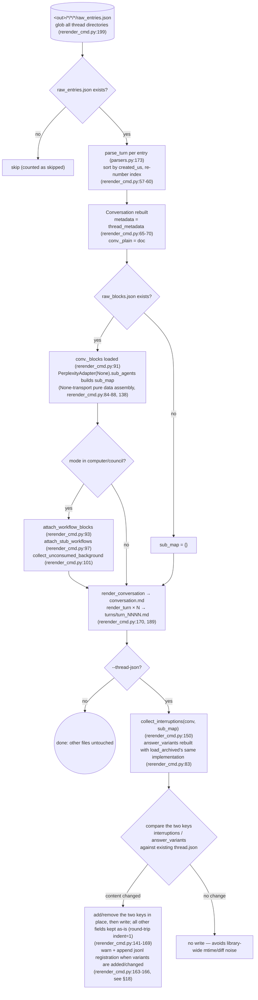
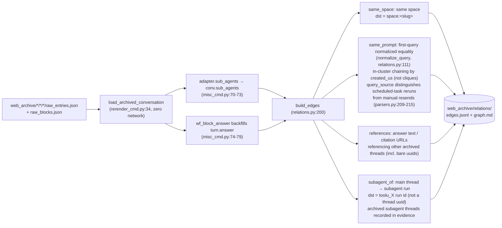
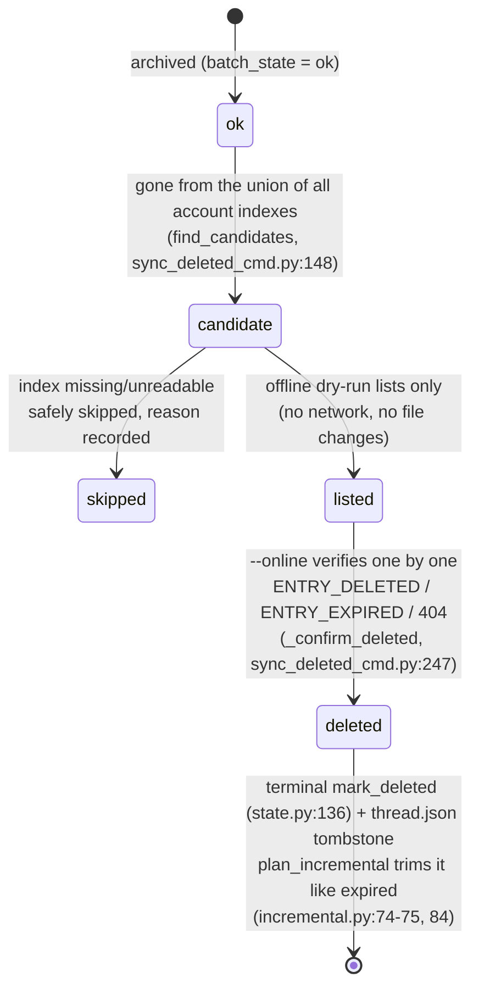
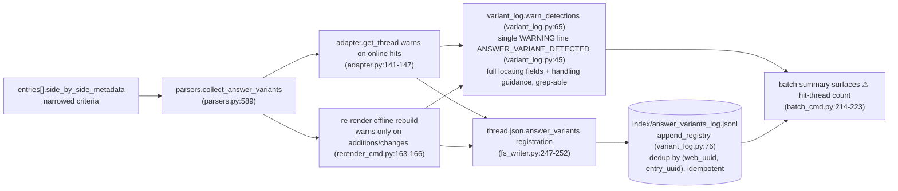

# Офлайн-операции

Сторона с нулевым сетевым доступом `pplx_export`: офлайн-регенерация из сырого JSON, конвейер перестроения связей, обратное заполнение обогащения индекса, конечный автомат удаленного удаления и цепочка обнаружения answer_variants. Разделы сохраняют свою исходную нумерацию из [обзора архитектуры](overview.md).

---

## Офлайн-регенерация (повторный рендеринг)

После исправлений слоя рендеринга регенерировать все артефакты из сырого JSON **с нулевым сетевым доступом**, идемпотентно. Реализация: `commands/rerender_cmd.py` (однопоточный `rerender` rerender_cmd.py:105-190; пакетный `cmd_rerender` rerender_cmd.py:193-212).

Дисциплина:

- **Нулевой сетевой доступ**: `PerplexityAdapter(None)` использует только чистые методы сборки данных; ни один онлайн-метод (get_thread и т.д.) никогда не вызывается.
- **Идемпотентность**: артефакты зависят только от сырых данных + рендерера; повторные запуски дают побайтово идентичные результаты (гарантируется регрессионными тестами снимков, [§13](../development/testing-architecture.md)).
- **Другие файлы не затрагиваются**: исходники, report.md, ассеты остаются без изменений; thread.json по умолчанию не изменяется — с `--thread-json` добавляются или удаляются только два ключа interruptions / answer_variants.
- `--dry-run` только перечисляет каталоги без записи файлов (rerender_cmd.py:204-206); `--limit N` берет первые N.

---

## Конвейер офлайн-перестроения связей

`cmd_relations` (misc_cmd.py:16) перестраивает граф связей бесед всей библиотеки из архивных сырых данных **с нулевым сетевым доступом**: он повторно использует конвейер офлайн-перестроения повторного рендеринга `load_archived_conversation` (rerender_cmd.py:34) для восстановления каждой беседы (разбор/сортировка/нумерация поворотов, прикрепление _plain/_blocks), заполняет `conv.sub_agents` на уровне беседы через `adapter.sub_agents` поток за потоком (misc_cmd.py:70-73; конвейер экспорта не заполняет это поле, models.py:178-182); запасной вариант ответа компьютера (`wf_block_answer`) обратно заполняет `turn.answer` на этом уровне, расширяя область сканирования ссылок (misc_cmd.py:74-79). Потоки без сырых данных деградируют до оболочки thread.json + conversation.md (могут быть обнаружены только ребра same_space / bare-uuid, misc_cmd.py:61-66).

Дисциплина принятия решений (2026-07-23): механизм `branch_of` подтвержден, но не имеет экземпляров в архиве — ребра не построены; `related_query` не может быть извлечен из существующих данных — ребра также не построены: лучше пропустить ребро, чем построить предположительное.
Наблюдаемый масштаб: 772 ребра / 21 кластер по всему архиву (same_space 559 / subagent_of 154 / same_prompt 49 / references 10).

---

## search-mode-backfill (обогащение индекса search_mode)

`cmd_search_mode_backfill` (search_mode_backfill_cmd.py:81) обогащает авторитетное поле платформы `search_mode` в `index/library_<account>.json`: **сначала локальные сырые данные** (для архивных потоков извлекается из `entries[].search_mode` файла raw_entries.json, нулевой сетевой доступ); только потоки без локальных сырых данных прибегают к онлайн-загрузке потока. Запись объединяет и сохраняет существующие поля индекса (семантика обновления: ключи обогащения перезаписываются, все остальное сохраняется), идемпотентно и возобновляемо, с `--limit` для подмножеств.
Обогащенные строки индекса делают фильтр `--mode` пакетного режима авторитетным: `index_row_matches_mode` (batch_cmd.py:46) судит сначала по search_mode индекса (SEARCH_MODE_MAP, normalize.py:50), прибегая к эвристикам только когда он отсутствует.

---

## sync-deleted конечный автомат удаленного удаления

`cmd_sync_deleted` (sync_deleted_cmd.py:262) идентифицирует потоки, "удаленные пользователем/удаленно на стороне платформы", и записывает конечное состояние, наряду с expired. Определение кандидата — это **разность объединения всех учетных записей индексов**: архивный ok-поток считается кандидатом только когда он исчез из **всех** файлов `index/library_*.json` (поток export_via из разных учетных записей появляется только в индексе своего владельца, поэтому разность одной учетной записи дала бы ложное срабатывание; find_candidates, sync_deleted_cmd.py:148); отсутствующие/нечитаемые индексы безопасно пропускаются с записью причины. По умолчанию офлайн-пробный запуск только перечисляет кандидатов (без сети, без изменений файлов); `--online` проверяет поток за потоком с помощью GET: `ENTRY_DELETED` / `ENTRY_EXPIRED` / 404 → удаление подтверждено, `state.mark_deleted` (state.py:136) + надгробие thread.json (mark_thread_json_remote_deleted, sync_deleted_cmd.py:215).

Наслоение типов ошибок: `EntryDeletedError` наследует `EntryExpiredError` (проверка на 400 с телом, содержащим ENTRY_DELETED, выполняется до ENTRY_EXPIRED, cookie_transport.py:93-98); пакетный режим должен перехватывать подкласс перед родителем (batch_cmd.py:163-174 перед 175-183), иначе удаленное будет ошибочно записано как expired. Сам API удаления: `DELETE /rest/thread/delete_thread_by_entry_uuid` (read_write_token берется из первого непустого `entries[].read_write_token`; проверено на практике: 10/10 удалений успешны на самостоятельно созданных тестовых потоках и потоках BOT-space).

---

## Цепочка обнаружения вариантов ответа answer_variants

Варианты, замененные в рамках "перезаписи ответа / A-B экспериментов" платформы, невидимы на стороне API — выбранный ответ виден, в то время как проигравший собрат оставляет только след в `entries[].side_by_side_metadata` и может быть удален платформой (мертвые ссылки собратьев доказаны: 403 VIEW_THREAD_NOT_ALLOWED + SPA-редирект на домашнюю страницу; см. [справочник API §5.2](../reference/api/api-responses-errors.md)). Цепочка обнаружения делает "произошла перезапись" наблюдаемым и отслеживаемым:

- **Суженные критерии**: принимаются только авторитетные сигналы side_by_side_metadata; записываются полные поля локализации (полный uuid потока + uuid8, заголовок, entry_uuid, sibling_uuid, selection_status, experiment_role) плюс руководство по обработке; формат в `format_detection` (variant_log.py:53).
- **Идемпотентность**: jsonl дедуплицируется по (web_uuid, entry_uuid); дублирующиеся регистрации из онлайн-пути (source=online) и офлайн-пути (source=offline) не создают дублирующихся строк; повторный рендеринг предупреждает только при изменении содержимого варианта, так что библиотечные повторные запуски не засоряют.
- **Поток обработки**: при обнаружении вручную подтвердить альтернативный ответ как можно скорее и записать его (альтернатива может быть удалена платформой и не может быть восстановлена через API); полный поток описан в [справочнике API §5.2](../reference/api/api-responses-errors.md).
