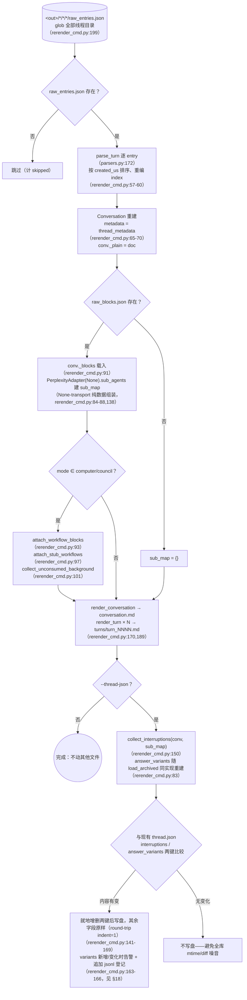
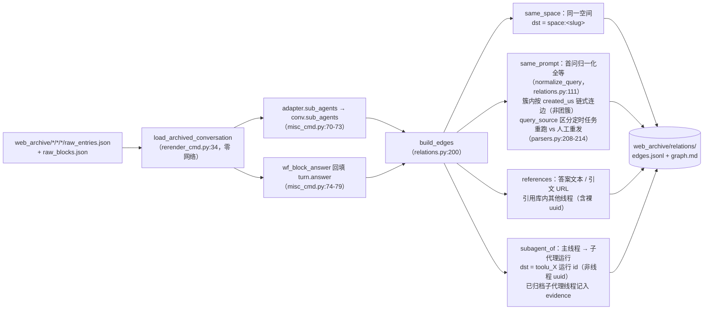
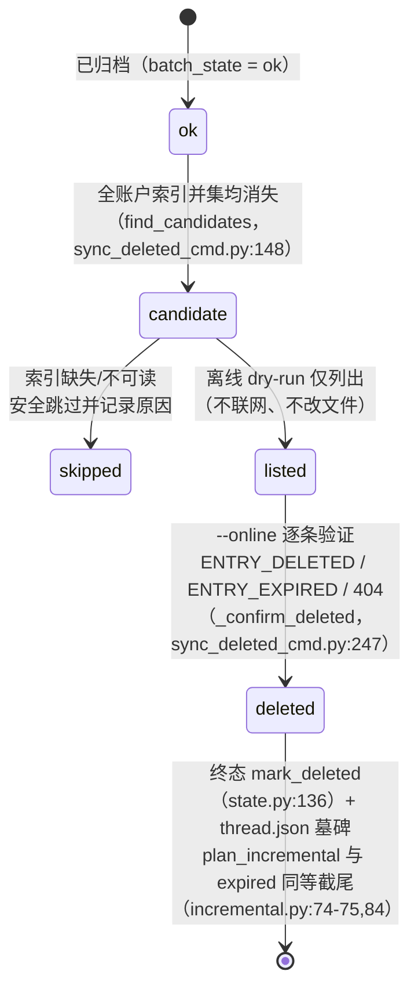
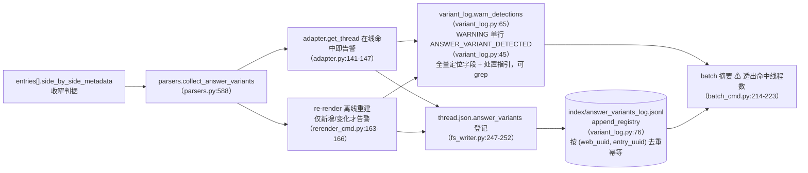

# 离线操作

`pplx_export` 的零网络一侧：raw JSON 离线再生、relations 离线重建管线、索引富化回填、
远端删除状态机与 answer_variants 检测链。小节保留[架构总览](overview.md)的原始编号。

---

## 离线再生（re-render）

渲染层修复后，从 raw JSON **零网络**幂等再生全部产物。实现：
`commands/rerender_cmd.py`（单线程 `rerender` rerender_cmd.py:105-190；
批量 `cmd_rerender` rerender_cmd.py:193-212）。

纪律：

- **零网络**：`PerplexityAdapter(None)` 只复用纯数据组装方法，任何在线方法
  （get_thread 等）不会被调用。
- **幂等**：产物只由 raw + 渲染器决定；重跑结果字节一致（快照回归测试保证，[§13](../development/testing-architecture.md)）。
- **不动其他文件**：sources、report.md、assets 原样；thread.json 默认不动，
  `--thread-json` 时仅增删 interruptions / answer_variants 两个键。
- `--dry-run` 只列目录不写文件（rerender_cmd.py:204-206）；`--limit N` 取前 N 个。

---

## relations 离线重建管线

`cmd_relations`（misc_cmd.py:16）从归档 raw **零网络**重建全库对话关系图：
复用 re-render 的离线重建管线 `load_archived_conversation`（rerender_cmd.py:34）
还原 Conversation（turns 解析/排序/编号、_plain/_blocks 挂载），逐线程经
`adapter.sub_agents` 填会话级 `conv.sub_agents`（misc_cmd.py:70-73；
导出管线不回填该字段，models.py:178-182）；computer 的答案兜底
（`wf_block_answer`）在本层回填 `turn.answer`，扩大 references 扫描面
（misc_cmd.py:74-79）。无 raw 的线程退化为 thread.json + conversation.md 壳
（仅 same_space / 裸 uuid 可判，misc_cmd.py:61-66）。

定案纪律（2026-07-23）：`branch_of` 机制确认但全库无实例、不建边；
`related_query` 不可从现有数据解析、不建边——宁可缺边，不建猜测边。
实测规模：全库 772 边 / 21 簇（same_space 559 / subagent_of 154 /
same_prompt 49 / references 10）。

---

## search-mode-backfill（索引 search_mode 富化）

`cmd_search_mode_backfill`（search_mode_backfill_cmd.py:81）把平台权威字段
`search_mode` 富化进 `index/library_<account>.json`：**本地 raw 优先**
（已归档线程从 raw_entries.json 的 `entries[].search_mode` 提取，零网络），
无本地 raw 才在线兜底抓 thread；写盘时合并保留既有索引字段
（refresh 语义：富化键覆盖、其余原样），幂等可续跑、`--limit` 可取子集。
富化后的索引行使 batch 的 `--mode` 过滤成为权威过滤：
`index_row_matches_mode`（batch_cmd.py:46）优先按索引 search_mode
（SEARCH_MODE_MAP，normalize.py:50）判定，缺失才回退启发式。

---

## sync-deleted 远端删除状态机

`cmd_sync_deleted`（sync_deleted_cmd.py:262）识别「平台侧已被用户/远端删除」
的线程并落终态，与 expired 并列。候选判定是**全账户索引并集 diff**：
已归档 ok 线程在**所有** `index/library_*.json` 中均消失才算候选
（跨账户 export_via 线程只出现在所有者索引，单账户 diff 会误报；
find_candidates，sync_deleted_cmd.py:148）；索引缺失/不可读时安全跳过并
如实记录原因。默认离线 dry-run 仅列候选（不联网、不改文件）；`--online`
逐条 GET thread 验证：`ENTRY_DELETED` / `ENTRY_EXPIRED` / 404 → 确认删除，
`state.mark_deleted`（state.py:136）+ thread.json 墓碑
（mark_thread_json_remote_deleted，sync_deleted_cmd.py:215）。

错误类型分层：`EntryDeletedError` 继承 `EntryExpiredError`（400 且 body 含
ENTRY_DELETED 的判定先于 ENTRY_EXPIRED，cookie_transport.py:93-98）；batch
捕获顺序须先子后父（batch_cmd.py:163-174 先于 175-183），否则 deleted 会被
误记为 expired。删除 API 本身：`DELETE /rest/thread/delete_thread_by_entry_uuid`
（read_write_token 取 `entries[].read_write_token` 首个非空；
已对自建测试线程与 BOT 空间线程实战验证 10/10 删除成功）。

---

## answer_variants 答案重写变体检测链

平台「答案重写 / A-B 实验」中被替换的变体在 API 侧不可见——选中的 answer
可见，落选 sibling 仅剩 `entries[].side_by_side_metadata` 痕迹，且或将被平台
清理（sibling 死链已实证：403 VIEW_THREAD_NOT_ALLOWED + SPA 重定向首页，
见 [API 参考 §5.2](../reference/api/api-responses-errors.md)）。检测链让「重写发生过」可观测、可追溯：

- **判据收窄**：只认 side_by_side_metadata 的权威信号，记录全量定位字段
  （thread 全量 uuid + uuid8、标题、entry_uuid、sibling_uuid、selection_status、
  experiment_role）与处置指引，格式见 `format_detection`（variant_log.py:53）。
- **幂等**：jsonl 按 (web_uuid, entry_uuid) 去重，在线（source=online）/离线
  （source=offline）两路重复登记不产生重复行；rerender 仅在 variants 内容
  变化时告警，全库重跑不刷屏。
- **处置流程**：命中后第一时间人工确认备选答案并补录（备选或将被平台清理，
  API 不可补救），完整流程见 [API 参考 §5.2](../reference/api/api-responses-errors.md)。
