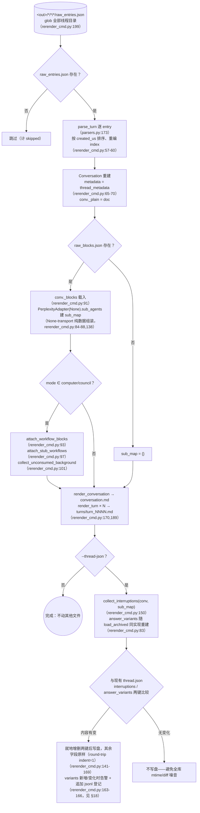
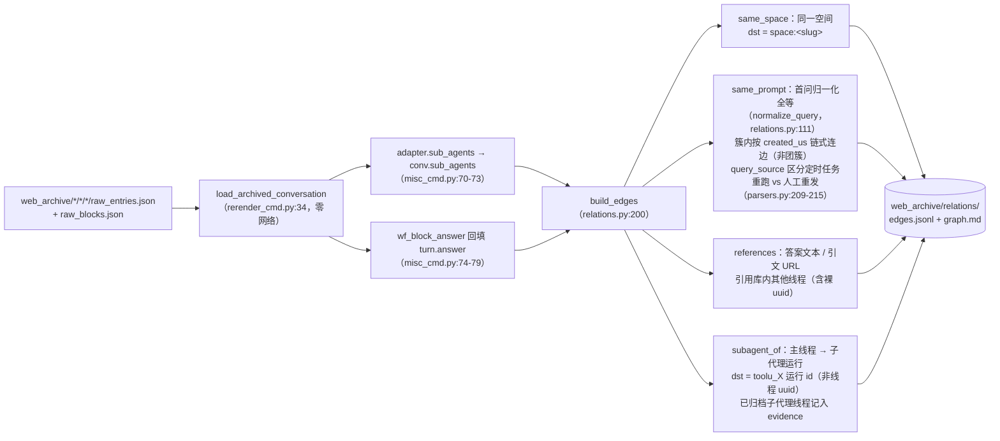
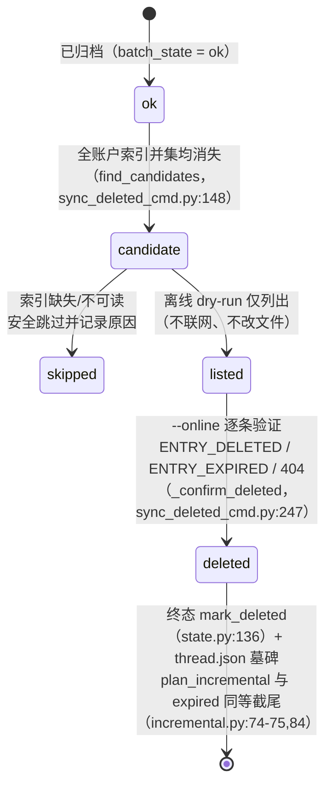
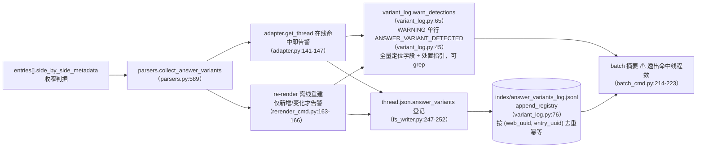

# 離線操作

`pplx_export` 的零網路一側：raw JSON 離線再生、relations 離線重建管線、索引富化回填、
遠端刪除狀態機與 answer_variants 檢測鏈。小節保留[架構總覽](overview.md)的原始編號。

---

## 離線再生（re-render）

渲染層修復後，從 raw JSON **零網路**冪等再生全部產物。實現：
`commands/rerender_cmd.py`（單執行緒 `rerender` rerender_cmd.py:105-190；
批次 `cmd_rerender` rerender_cmd.py:193-212）。

紀律：

- **零網路**：`PerplexityAdapter(None)` 只複用純資料組裝方法，任何線上方法
  （get_thread 等）不會被呼叫。
- **冪等**：產物只由 raw + 渲染器決定；重跑結果位元組一致（快照回歸測試保證，[§13](../development/testing-architecture.md)）。
- **不動其他檔案**：sources、report.md、assets 原樣；thread.json 預設不動，
  `--thread-json` 時僅增刪 interruptions / answer_variants 兩個鍵。
- `--dry-run` 只列目錄不寫檔案（rerender_cmd.py:204-206）；`--limit N` 取前 N 個。

---

## relations 離線重建管線

`cmd_relations`（misc_cmd.py:16）從歸檔 raw **零網路**重建全庫對話關係圖：
複用 re-render 的離線重建管線 `load_archived_conversation`（rerender_cmd.py:34）
還原 Conversation（turns 解析/排序/編號、_plain/_blocks 掛載），逐執行緒經
`adapter.sub_agents` 填會話級 `conv.sub_agents`（misc_cmd.py:70-73；
匯出管線不回填該欄位，models.py:178-182）；computer 的答案兜底
（`wf_block_answer`）在本層回填 `turn.answer`，擴大 references 掃描面
（misc_cmd.py:74-79）。無 raw 的執行緒退化為 thread.json + conversation.md 殼
（僅 same_space / 裸 uuid 可判，misc_cmd.py:61-66）。

定案紀律（2026-07-23）：`branch_of` 機制確認但全庫無實例、不建邊；
`related_query` 不可從現有資料解析、不建邊——寧可缺邊，不建猜測邊。
實測規模：全庫 772 邊 / 21 簇（same_space 559 / subagent_of 154 /
same_prompt 49 / references 10）。

---

## search-mode-backfill（索引 search_mode 富化）

`cmd_search_mode_backfill`（search_mode_backfill_cmd.py:81）把平台權威欄位
`search_mode` 富化進 `index/library_<account>.json`：**本地 raw 優先**
（已歸檔執行緒從 raw_entries.json 的 `entries[].search_mode` 提取，零網路），
無本地 raw 才線上兜底抓 thread；寫盤時合併保留既有索引欄位
（refresh 語義：富化鍵覆蓋、其餘原樣），冪等可續跑、`--limit` 可取子集。
富化後的索引行使 batch 的 `--mode` 過濾成為權威過濾：
`index_row_matches_mode`（batch_cmd.py:46）優先按索引 search_mode
（SEARCH_MODE_MAP，normalize.py:50）判定，缺失才回退啟發式。

---

## sync-deleted 遠端刪除狀態機

`cmd_sync_deleted`（sync_deleted_cmd.py:262）識別「平台側已被使用者/遠端刪除」
的執行緒並落終態，與 expired 並列。候選判定是**全帳戶索引並集 diff**：
已歸檔 ok 執行緒在**所有** `index/library_*.json` 中均消失才算候選
（跨帳戶 export_via 執行緒只出現在擁有者索引，單帳戶 diff 會誤報；
find_candidates，sync_deleted_cmd.py:148）；索引缺失/不可讀時安全跳過並
如實記錄原因。預設離線 dry-run 僅列候選（不聯網、不改檔案）；`--online`
逐條 GET thread 驗證：`ENTRY_DELETED` / `ENTRY_EXPIRED` / 404 → 確認刪除，
`state.mark_deleted`（state.py:136）+ thread.json 墓碑
（mark_thread_json_remote_deleted，sync_deleted_cmd.py:215）。

錯誤類型分層：`EntryDeletedError` 繼承 `EntryExpiredError`（400 且 body 含
ENTRY_DELETED 的判定先於 ENTRY_EXPIRED，cookie_transport.py:93-98）；batch
捕獲順序須先子後父（batch_cmd.py:163-174 先於 175-183），否則 deleted 會被
誤記為 expired。刪除 API 本身：`DELETE /rest/thread/delete_thread_by_entry_uuid`
（read_write_token 取 `entries[].read_write_token` 首個非空；
已對自建測試執行緒與 BOT 空間執行緒實戰驗證 10/10 刪除成功）。

---

## answer_variants 答案改寫變體檢測鏈

平台「答案改寫 / A-B 實驗」中被替換的變體在 API 側不可見——選中的 answer
可見，落選 sibling 僅剩 `entries[].side_by_side_metadata` 痕跡，且或將被平台
清理（sibling 死鏈已實證：403 VIEW_THREAD_NOT_ALLOWED + SPA 重新導向首頁，
見 [API 參考 §5.2](../reference/api/api-responses-errors.md)）。檢測鏈讓「改寫發生過」可觀測、可追溯：

- **判據收窄**：只認 side_by_side_metadata 的權威訊號，記錄全量定位欄位
  （thread 全量 uuid + uuid8、標題、entry_uuid、sibling_uuid、selection_status、
  experiment_role）與處置指引，格式見 `format_detection`（variant_log.py:53）。
- **冪等**：jsonl 按 (web_uuid, entry_uuid) 去重，線上（source=online）/離線
  （source=offline）兩路重複登記不產生重複行；rerender 僅在 variants 內容
  變化時告警，全庫重跑不洗版。
- **處置流程**：命中後第一時間人工確認備選答案並補錄（備選或將被平台清理，
  API 不可補救），完整流程見 [API 參考 §5.2](../reference/api/api-responses-errors.md)。
