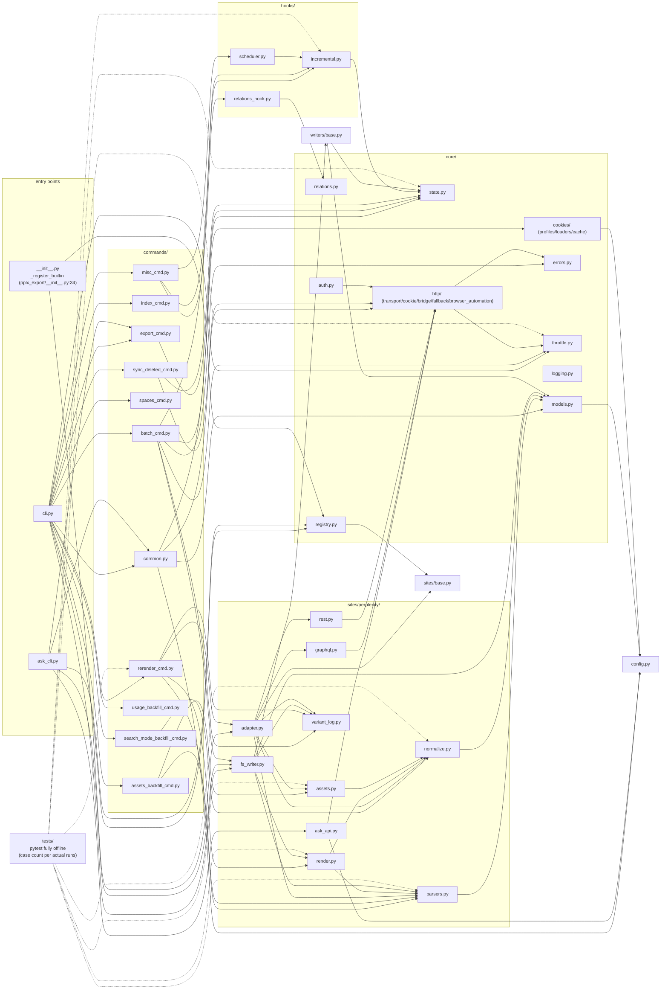

# نظرة عامة على البنية

---

## نظرة عامة على البنية الطبقية

هيكل الحزمة (`pplx_export/`، ~5.6 ألف سطر من المصدر وتزداد مع التطوير، باستثناء الاختبارات؛
أعداد الأسطر الدقيقة حسب `wc -l`):

```mermaid
flowchart TD
    subgraph CLI["CLI layer (entry points)"]
        CL1["cli.py — pplx-export<br/>argparse definitions + dispatch (cli.py:57)"]
        CL2["ask_cli.py — pplx-ask<br/>interactive query entry (ask_cli.py:221)"]
    end

    subgraph CMD["commands/ command layer (shared by both entries)"]
        C0["common.py<br/>account mapping / make_transport assembly<br/>cookie validation and auto-switching (common.py:93)"]
        C1["index_cmd / export_cmd / batch_cmd"]
        C2["spaces_cmd / misc_cmd / rerender_cmd"]
        C3["assets_backfill_cmd / usage_backfill_cmd<br/>search_mode_backfill_cmd / sync_deleted_cmd"]
    end

    subgraph SITES["sites/ site layer"]
        SB["base.py — SiteAdapter ABC<br/>(pplx_export/sites/base.py:21)"]
        subgraph PPLX["sites/perplexity/"]
            AD["adapter.py<br/>PerplexityAdapter assembly (adapter.py:24)"]
            GQ["graphql.py<br/>APQ list pagination (graphql.py:43)"]
            RS["rest.py<br/>ThreadFetcher thread fetching (rest.py:38)"]
            PA["parsers.py<br/>single point of schema parsing (parsers.py)"]
            NM["normalize.py<br/>mode detection / math normalization (normalize.py:66,240)"]
            RD["render.py<br/>markdown rendering (render.py)"]
            AS["assets.py<br/>asset download and extension resolution (assets.py:27)"]
            AK["ask_api.py<br/>envelope / SSE / telemetry (ask_api.py)"]
            FW["fs_writer.py<br/>web_archive persistence (fs_writer.py:54)"]
            VL["variant_log.py<br/>ANSWER_VARIANT_DETECTED detection log<br/>+ jsonl registry (variant_log.py:45)"]
        end
    end

    subgraph CORE["core/ foundation layer (site-agnostic)"]
        MO["models.py domain models (models.py)"]
        ER["errors.py error types (errors.py)"]
        TH["throttle.py rate-limit backoff (throttle.py:15)"]
        ST["state.py BatchState checkpoint (state.py:63)"]
        LG["logging.py central logging (logging.py:45)"]
        CK["cookies/ + auth.py<br/>cookie sources and credentials (cookies/loaders.py:270)"]
        RL["relations.py relations graph (relations.py:200)"]
        RG["registry.py site registry (registry.py:9)"]
        subgraph HTTP["core/http/ transports"]
            TP["transport.py Transport ABC (transport.py:12)"]
            CT["cookie_transport.py<br/>urllib direct (cookie_transport.py:44)"]
            BT["bridge_transport.py<br/>WebBridge page context (bridge_transport.py:22)"]
            FB["fallback.py fallback chain [reserved · not wired]"]
            BA["browser_automation_transport.py<br/>heavyweight browser [reserved · not implemented]"]
        end
    end

    subgraph HOOKS["hooks/ extension points"]
        H1["incremental.py<br/>plan_incremental pure function (incremental.py:36)"]
        H2["relations_hook.py relations rebuild (relations_hook.py:17)"]
        H3["scheduler.py periodic schedule + cron (scheduler.py:22)"]
    end

    subgraph WRT["writers/ output abstraction"]
        WB["base.py Writer ABC (writers/base.py:17)"]
    end

    CFG["config.py — single source of site constants<br/>+ user-level config loading (account table / BOT space externalized to config.toml)"]

    CL1 --> C0
    CL2 --> C0
    C0 --> C1
    C0 --> C2
    C0 --> C3
    C1 --> AD
    C2 --> AD
    C3 --> AD
    AD --> GQ
    AD --> RS
    AD --> PA
    AD --> AS
    PA --> MO
    RD --> PA
    FW --> RD
    FW --> VL
    AD --> VL
    FW --> WB
    SB --> MO
    AD --> SB
    GQ --> TP
    RS --> TP
    AS --> TP
    AK --> CT
    CT --> TH
    CT --> ER
    C0 --> CK
    C1 --> ST
    H1 --> ST
    H2 --> RL
    RG -. "core's only import of sites:<br/>just the ABC of sites/base (registry.py:7)" .-> SB
    CFG -. "imported by all layers, zero dependencies itself" .- MO
```

أساسيات اتجاه التبعية (تم التحقق منها عن طريق فحص جميع الاستيرادات):

- **اتجاه واحد**: CLI ← أوامر ← مواقع ← نواة. `core/` لا يستورد أي تنفيذ ملموس لـ Perplexity
  (لا ترميز موقع ثابت)؛ **الاستثناء الوحيد** هو `core/registry.py:7` الذي يستورد
  ABC `SiteAdapter` من `sites/base.py` — مرجع واجهة، وليس مرجع موقع؛ يتم حقن المواقع الملموسة عبر `register()`
  (تسجيل Perplexity المدمج في `pplx_export/__init__.py:34-43`).
- `config.py` هو المصدر الوحيد لثوابت الموقع (النطاق، `DEFAULT_ARCHIVE_ROOT`)، ويحمل
  **تكوينًا خارجيًا على مستوى المستخدم**: جداول الحسابات `ACCOUNT_DISPLAY_NAMES/ACCOUNT_EMAIL/ACCOUNT_UID` ومساحة
  BOT تأتي من TOML (`--config` > `PPLX_EXPORT_CONFIG` >
  `~/.config/pplx-export/config.toml`؛ قالب `config.example.toml`)، يتم تحديث القواميس في مكانها،
  تدهور سلس عند الغياب؛ `core/models.py:18` يستورده أيضًا (`author_folder`).
- `ask_api.py` هي الوحدة الوحيدة في طبقة الموقع التي تعتمد بشكل مباشر على تنفيذ نقل ملموس
  (تستورد `CookieTransport` وتعيد استخدام داخلياته `_cookie_header`/`_opener` لدفق SSE،
  ask_api.py:23, 114-130) — SSE خارج تجريد Transport ABC.
- `hooks/`، `writers/` تعتمدان فقط على `core/`؛ التنفيذ الوحيد لـ `writers/base.py`،
  `FilesystemWriter`، يعيش في طبقة الموقع (fs_writer.py:54) — تم فصل ABC والتنفيذ.

---

## رسم بياني لتبعية الوحدات (علاقات الاستيراد الفعلية)

مرسوم من تعداد كامل لـ `grep '^from \.'` (تم حذف المراجع داخل الحزمة؛ جميع `__init__.py` فارغة
باستثناء جذر الحزمة `pplx_export/__init__.py`، الذي يحمل واجب التسجيل):

كيفية قراءة الرسم البياني:

- **سلسلة النواة**: `cli → commands → sites → core`. لا تعتمد أي وحدة نواة على تنفيذات أوامر/مواقع ملموسة؛
  `KG → SBASE` (السجل ← SiteAdapter ABC) هو المرجع العكسي الوحيد عبر الطبقات،
  مشكلاً حلقة حقن تبعية مع تسجيل `E0`.
- التجميع داخل `sites/perplexity/`: `adapter` هو الواجهة (تجميع graphql/rest/parsers/
  normalize/assets)؛ `render` يعتمد على `parsers` (مصدر الحقيقة لتصنيف حالة wf)؛ `fs_writer`
  يعتمد على `render + parsers + writers/base`.
- الاختبارات `tests/` تعيش خارج الحزمة وتستورد مباشرة دوال نقية من كل طبقة (conftest.py's
  `render_fixture` يعيد استخدام `commands.rerender_cmd.rerender` لإعادة التقديم دون اتصال).

---

## ملخص مبادئ التصميم

1. **الاستجابات الخام محفوظة؛ القطع الأثرية المقدمة قابلة لإعادة التوليد دون اتصال**:
   `adapter.get_thread` يوزع ويجمع المحادثة في الذاكرة قبل
   تشغيل الكاتب (adapter.py:58-157). الكتابة الناجحة تخزن `thread.json`
   أولاً ثم الاستجابات النصية/المخططمة المتاحة كـ `raw_*.json`
   (fs_writer.py:224-266)؛ يمكن إعادة تشغيل التحليل/التقديم/تسجيل المقاطعة لاحقًا
   من الخام بدون شبكة ([§12](offline-operations.md))، مما يفصل
   تطور المُقدّم عن الأرشيفات التاريخية.
2. **نقطة تحليل واحدة، متسامحة مع تغييرات هيكل البيانات**: استخراج الحقول
   مركز في `parsers.py` (ثلاثية تحمل الأخطاء `_g`/`_loads`/`to_int`)؛
   اكتشاف الوضع له إشارات زائدة مزدوجة بالإضافة إلى استرجاع احتياطي عند فقدان جميع الإشارات ([§4](export-pipeline.md)) —
   نصف قطر انفجار إعادة تصميم المنصة مضغوط في وحدة واحدة.
3. **شلال إسناد حتمي**: "كل حمولة خلفية تهبط في مكان واحد بالضبط،
   لا تُعرض أبدًا مرتين" مضمون بهياكل البيانات (المجموعة المثبتة، استهلاك used_cand
   الفردي، التكرار على المستوى الأعلى فقط ضد العد المزدوج) — لا تخمين زمني استدلالي؛
   دلالات المقاطعة لها خمس فئات مع مصدر حقيقة واحد
   (classify_wf_status) مشترك بين مسارات العرض/التسجيل/التنبيه ([§5, §6](subagents-interruptions.md)).
4. **انضباط حد المعدل هو خط أحمر للسلامة**: فترات عشوائية، لا تزامن، تراجع 3^N
   مع حد أقصى، فشل سريع عند فشل المصادقة، الحالة النهائية ENTRY_EXPIRED، 404 لا يُساء
   أبدًا تقديره كمنتهي ([§11](rate-limiting-errors.md)) — كلها تخدم هدف منع الحظر "سلوك التصدير ≈ تصفح بشري"
   (متطلب مستخدم صريح).
5. **مصدر واحد للتكوين + الخصوصية خارجية**: ثوابت الموقع/المسارات الافتراضية
   تعيش فقط في `config.py`؛ الحسابات/المساحات هي خصوصية شخصية، خارجية في TOML
   على مستوى المستخدم (`--config` > `PPLX_EXPORT_CONFIG` > `~/.config/pplx-export/config.toml`)؛
   التبديل التلقائي لملفات تعريف الارتباط متعددة الحسابات هو حلقة استقصاء مدفوعة بالبريد الإلكتروني المسجل،
   بدون عملية متصفح يدوية ([§9](ask-and-accounts.md)).
6. **تبعيات طبقات باتجاه واحد**: CLI ← أوامر ← مواقع ← نواة، مع عدم وجود ترميز موقع ثابت
   في النواة وحقن المواقع عبر السجل — موقع جديد ينفذ طرق `SiteAdapter` الخمسة
   ويعيد استخدام جميع مرافق النواة (sites/base.py:21-69).
