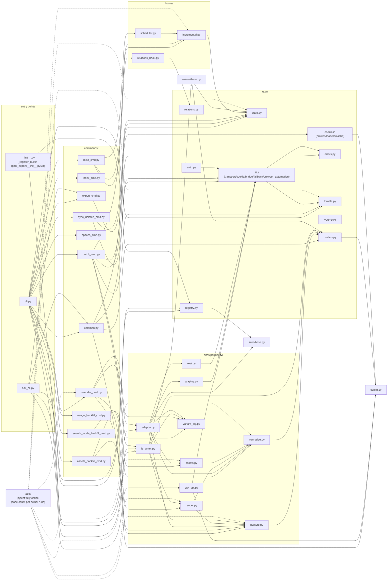

# Architekturübersicht

---

## Überblick über die Schichtenarchitektur

Paketstruktur (`pplx_export/`, ~5.600 Zeilen Quellcode und wachsend mit der Entwicklung, ohne Tests;
genauen Zeilenzahlen pro `wc -l`):

```mermaid
flowchart TD
    subgraph CLI["CLI layer (entry points)"]
        CL1["cli.py — pplx-export<br/>argparse definitions + dispatch (cli.py:57)"]
        CL2["ask_cli.py — pplx-ask<br/>interactive query entry (ask_cli.py:221)"]
    end

    subgraph CMD["commands/ command layer (shared by both entries)"]
        C0["common.py<br/>account mapping / make_transport assembly<br/>cookie validation and auto-switching (common.py:93)"]
        C1["index_cmd / export_cmd / batch_cmd"]
        C2["spaces_cmd / misc_cmd / rerender_cmd"]
        C3["assets_backfill_cmd / usage_backfill_cmd<br/>search_mode_backfill_cmd / sync_deleted_cmd"]
    end

    subgraph SITES["sites/ site layer"]
        SB["base.py — SiteAdapter ABC<br/>(pplx_export/sites/base.py:21)"]
        subgraph PPLX["sites/perplexity/"]
            AD["adapter.py<br/>PerplexityAdapter assembly (adapter.py:24)"]
            GQ["graphql.py<br/>APQ list pagination (graphql.py:43)"]
            RS["rest.py<br/>ThreadFetcher thread fetching (rest.py:38)"]
            PA["parsers.py<br/>single point of schema parsing (parsers.py)"]
            NM["normalize.py<br/>mode detection / math normalization (normalize.py:66,240)"]
            RD["render.py<br/>markdown rendering (render.py)"]
            AS["assets.py<br/>asset download and extension resolution (assets.py:27)"]
            AK["ask_api.py<br/>envelope / SSE / telemetry (ask_api.py)"]
            FW["fs_writer.py<br/>web_archive persistence (fs_writer.py:54)"]
            VL["variant_log.py<br/>ANSWER_VARIANT_DETECTED detection log<br/>+ jsonl registry (variant_log.py:45)"]
        end
    end

    subgraph CORE["core/ foundation layer (site-agnostic)"]
        MO["models.py domain models (models.py)"]
        ER["errors.py error types (errors.py)"]
        TH["throttle.py rate-limit backoff (throttle.py:15)"]
        ST["state.py BatchState checkpoint (state.py:63)"]
        LG["logging.py central logging (logging.py:45)"]
        CK["cookies/ + auth.py<br/>cookie sources and credentials (cookies/loaders.py:203)"]
        RL["relations.py relations graph (relations.py:200)"]
        RG["registry.py site registry (registry.py:9)"]
        subgraph HTTP["core/http/ transports"]
            TP["transport.py Transport ABC (transport.py:12)"]
            CT["cookie_transport.py<br/>urllib direct (cookie_transport.py:44)"]
            BT["bridge_transport.py<br/>WebBridge page context (bridge_transport.py:22)"]
            FB["fallback.py fallback chain [reserved · not wired]"]
            BA["browser_automation_transport.py<br/>heavyweight browser [reserved · not implemented]"]
        end
    end

    subgraph HOOKS["hooks/ extension points"]
        H1["incremental.py<br/>plan_incremental pure function (incremental.py:36)"]
        H2["relations_hook.py relations rebuild (relations_hook.py:17)"]
        H3["scheduler.py periodic schedule + cron (scheduler.py:22)"]
    end

    subgraph WRT["writers/ output abstraction"]
        WB["base.py Writer ABC (writers/base.py:17)"]
    end

    CFG["config.py — single source of site constants<br/>+ user-level config loading (account table / BOT space externalized to config.toml)"]

    CL1 --> C0
    CL2 --> C0
    C0 --> C1
    C0 --> C2
    C0 --> C3
    C1 --> AD
    C2 --> AD
    C3 --> AD
    AD --> GQ
    AD --> RS
    AD --> PA
    AD --> AS
    PA --> MO
    RD --> PA
    FW --> RD
    FW --> VL
    AD --> VL
    FW --> WB
    SB --> MO
    AD --> SB
    GQ --> TP
    RS --> TP
    AS --> TP
    AK --> CT
    CT --> TH
    CT --> ER
    C0 --> CK
    C1 --> ST
    H1 --> ST
    H2 --> RL
    RG -. "core's only import of sites:<br/>just the ABC of sites/base (registry.py:7)" .-> SB
    CFG -. "imported by all layers, zero dependencies itself" .- MO
```

Wesentliche Abhängigkeitsrichtungen (überprüft durch Durchsuchen aller Importe):

- **Einbahnstraße**: CLI → commands → sites → core. `core/` importiert keine Perplexity konkrete Implementierung
  (keine Site-Hardcodierung); **die einzige Ausnahme** ist `core/registry.py:7`, das die
  `SiteAdapter`-ABC aus `sites/base.py` importiert – ein Interface-Verweis, kein Site-Verweis; konkrete Sites werden über `register()` injiziert
  (eingebaute Perplexity-Registrierung in `pplx_export/__init__.py:34-43`).
- `config.py` ist die einzige Quelle für Site-Konstanten (Domain, `DEFAULT_ARCHIVE_ROOT`) und lädt
  **benutzerebene externalisierte Konfiguration**: die Account-Tabellen `ACCOUNT_DISPLAY_NAMES/ACCOUNT_EMAIL/ACCOUNT_UID` und den
  BOT-Bereich aus TOML (`--config` > `PPLX_EXPORT_CONFIG` >
  `~/.config/pplx-export/config.toml`; Vorlage `config.example.toml`), Dictionaries werden direkt aktualisiert,
  anmutiger Abbau bei Fehlen; `core/models.py:18` importiert es ebenfalls (`author_folder`).
- `ask_api.py` ist das einzige Site-Layer-Modul, das direkt von einer konkreten Transportimplementierung abhängt
  (importiert `CookieTransport` und verwendet dessen `_cookie_header`/`_opener`-Interna für den SSE-Stream,
  ask_api.py:23, 114-130) – SSE liegt außerhalb der Abstraktion des Transport-ABC.
- `hooks/`, `writers/` hängen nur von `core/` ab; die einzige Implementierung von `writers/base.py`,
  `FilesystemWriter`, lebt im Site-Layer (fs_writer.py:54) – ABC und Implementierung getrennt.

---

## Modulabhängigkeitsgraph (reale Importbeziehungen)

Erstellt aus einer vollständigen `grep '^from \.'`-Zählung (Intra-Paket-Referenzen ausgelassen; alle `__init__.py` sind leer
außer dem Paketstamm `pplx_export/__init__.py`, der die Registrierungsaufgabe trägt):

So lesen Sie den Graphen:

- **Core-Kette**: `cli → commands → sites → core`. Kein Core-Modul hängt von konkreten
  Befehls-/Site-Implementierungen ab; `KG → SBASE` (Registry → SiteAdapter ABC) ist die einzige
  schichtübergreifende Rückreferenz und bildet eine Dependency-Injection-Schleife mit der Registrierung von `E0`.
- Aggregation innerhalb von `sites/perplexity/`: `adapter` ist die Fassade (bestehend aus graphql/rest/parsers/
  normalize/assets); `render` hängt von `parsers` ab (Quelle der Wahrheit für die wf-Statusklassifizierung); `fs_writer`
  hängt von `render + parsers + writers/base` ab.
- Tests `tests/` leben außerhalb des Pakets und importieren direkt reine Funktionen aus jeder Schicht (conftest.py's
  `render_fixture` verwendet `commands.rerender_cmd.rerender` für das Offline-Neu-Rendering wieder).

---

## Zusammenfassung der Entwurfsprinzipien

1. **Rohe Antworten beibehalten; gerenderte Artefakte offline regenerierbar**:
   `adapter.get_thread` parst und assembliert die Konversation im Speicher, bevor
   der Writer läuft (adapter.py:58-157). Ein erfolgreicher Schreibvorgang speichert `thread.json`
   zuerst und dann die verfügbaren Klartext/schematisierten Antworten als `raw_*.json`
   (fs_writer.py:224-266); Parsen/Rendering/Unterbrechungsregistrierung können später
   aus den Rohdaten ohne Netzwerk erneut ausgeführt werden ([§12](offline-operations.md)),
   wodurch die Renderer-Entwicklung von historischen Archiven entkoppelt wird.
2. **Einzelner Parsing-Punkt, tolerant gegenüber Datenstrukturänderungen**: Feldextraktion ist
   in `parsers.py` konzentriert (das `_g`/`_loads`/`to_int`-Fehlertoleranz-Trio); die Modus-
   Erkennung hat duale redundante Signale plus einen All-Signale-Fehlen-Fallback-Abruf ([§4](export-pipeline.md)) –
   der Schadensradius einer Plattformüberholung wird auf ein Modul komprimiert.
3. **Deterministischer Attributionswasserfall**: „Jede Hintergrundnutzlast landet an genau einem
   Ort, wird nie zweimal gerendert“ wird durch Datenstrukturen garantiert (das verankerte Set, used_cand
   Einmalverbrauch, Iteration nur auf oberster Ebene gegen Doppelzählung) – keine heuristische Zeit-
   Schätzung; Unterbrechungssemantik hat fünf Klassen mit einer Quelle der Wahrheit
   (classify_wf_status), die von Render-/Registrierungs-/Alarmpfaden gemeinsam genutzt wird ([§5, §6](subagents-interruptions.md)).
4. **Ratenbegrenzungsdisziplin ist eine rote Sicherheitslinie**: zufällige Intervalle, keine Nebenläufigkeit, 3^N
   Backoff mit einer Obergrenze, Auth-Fehler-Fail-Fast, der ENTRY_EXPIRED-Endzustand, 404 nie
   als abgelaufen fehlinterpretiert ([§11](rate-limiting-errors.md)) – alles dient dem Anti-Ban-Ziel „Exportverhalten ≈ menschliches
   Surfen“ (eine explizite Benutzeranforderung).
5. **Einzelne Konfigurationsquelle + Datenschutz externalisiert**: Site-Konstanten/Standardpfade
   leben nur in `config.py`; Accounts/Bereiche sind persönlicher Datenschutz, externalisiert in benutzerebene
   TOML (`--config` > `PPLX_EXPORT_CONFIG` > `~/.config/pplx-export/config.toml`); Multi-Account-
   Cookie-Autoumschaltung ist eine durch registrierte E-Mails gesteuerte Sondierungsschleife, ohne manuelle Browser-
   Bedienung ([§9](ask-and-accounts.md)).
6. **Geschichtete Einweg-Abhängigkeiten**: CLI → commands → sites → core, mit null Site-Hardcodierung
   in core und Sites, die über die Registry injiziert werden – eine neue Site implementiert die fünf `SiteAdapter`
   Methoden und nutzt alle Core-Funktionen wieder (sites/base.py:21-69).
