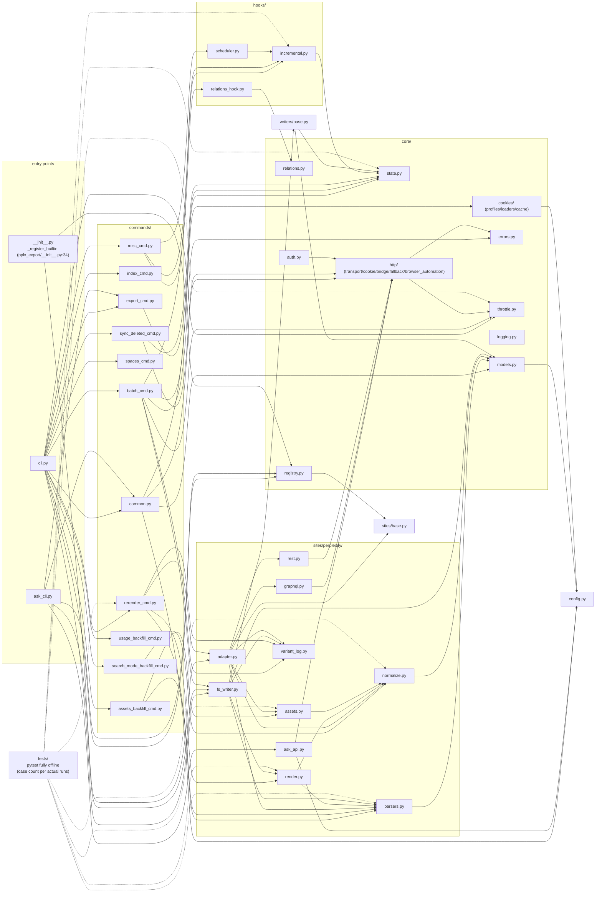

# Resumen de la arquitectura

---

## Resumen de la arquitectura en capas

Estructura del paquete (`pplx_export/`, ~5.6k líneas de código fuente y creciendo con el desarrollo, excluyendo pruebas;
recuentos exactos de líneas por `wc -l`):

```mermaid
flowchart TD
    subgraph CLI["CLI layer (entry points)"]
        CL1["cli.py — pplx-export<br/>argparse definitions + dispatch (cli.py:57)"]
        CL2["ask_cli.py — pplx-ask<br/>interactive query entry (ask_cli.py:221)"]
    end

    subgraph CMD["commands/ command layer (shared by both entries)"]
        C0["common.py<br/>account mapping / make_transport assembly<br/>cookie validation and auto-switching (common.py:93)"]
        C1["index_cmd / export_cmd / batch_cmd"]
        C2["spaces_cmd / misc_cmd / rerender_cmd"]
        C3["assets_backfill_cmd / usage_backfill_cmd<br/>search_mode_backfill_cmd / sync_deleted_cmd"]
    end

    subgraph SITES["sites/ site layer"]
        SB["base.py — SiteAdapter ABC<br/>(pplx_export/sites/base.py:21)"]
        subgraph PPLX["sites/perplexity/"]
            AD["adapter.py<br/>PerplexityAdapter assembly (adapter.py:24)"]
            GQ["graphql.py<br/>APQ list pagination (graphql.py:43)"]
            RS["rest.py<br/>ThreadFetcher thread fetching (rest.py:38)"]
            PA["parsers.py<br/>single point of schema parsing (parsers.py)"]
            NM["normalize.py<br/>mode detection / math normalization (normalize.py:66,240)"]
            RD["render.py<br/>markdown rendering (render.py)"]
            AS["assets.py<br/>asset download and extension resolution (assets.py:27)"]
            AK["ask_api.py<br/>envelope / SSE / telemetry (ask_api.py)"]
            FW["fs_writer.py<br/>web_archive persistence (fs_writer.py:54)"]
            VL["variant_log.py<br/>ANSWER_VARIANT_DETECTED detection log<br/>+ jsonl registry (variant_log.py:45)"]
        end
    end

    subgraph CORE["core/ foundation layer (site-agnostic)"]
        MO["models.py domain models (models.py)"]
        ER["errors.py error types (errors.py)"]
        TH["throttle.py rate-limit backoff (throttle.py:15)"]
        ST["state.py BatchState checkpoint (state.py:63)"]
        LG["logging.py central logging (logging.py:45)"]
        CK["cookies/ + auth.py<br/>cookie sources and credentials (cookies/loaders.py:203)"]
        RL["relations.py relations graph (relations.py:200)"]
        RG["registry.py site registry (registry.py:9)"]
        subgraph HTTP["core/http/ transports"]
            TP["transport.py Transport ABC (transport.py:12)"]
            CT["cookie_transport.py<br/>urllib direct (cookie_transport.py:44)"]
            BT["bridge_transport.py<br/>WebBridge page context (bridge_transport.py:22)"]
            FB["fallback.py fallback chain [reserved · not wired]"]
            BA["browser_automation_transport.py<br/>heavyweight browser [reserved · not implemented]"]
        end
    end

    subgraph HOOKS["hooks/ extension points"]
        H1["incremental.py<br/>plan_incremental pure function (incremental.py:36)"]
        H2["relations_hook.py relations rebuild (relations_hook.py:17)"]
        H3["scheduler.py periodic schedule + cron (scheduler.py:22)"]
    end

    subgraph WRT["writers/ output abstraction"]
        WB["base.py Writer ABC (writers/base.py:17)"]
    end

    CFG["config.py — single source of site constants<br/>+ user-level config loading (account table / BOT space externalized to config.toml)"]

    CL1 --> C0
    CL2 --> C0
    C0 --> C1
    C0 --> C2
    C0 --> C3
    C1 --> AD
    C2 --> AD
    C3 --> AD
    AD --> GQ
    AD --> RS
    AD --> PA
    AD --> AS
    PA --> MO
    RD --> PA
    FW --> RD
    FW --> VL
    AD --> VL
    FW --> WB
    SB --> MO
    AD --> SB
    GQ --> TP
    RS --> TP
    AS --> TP
    AK --> CT
    CT --> TH
    CT --> ER
    C0 --> CK
    C1 --> ST
    H1 --> ST
    H2 --> RL
    RG -. "core's only import of sites:<br/>just the ABC of sites/base (registry.py:7)" .-> SB
    CFG -. "imported by all layers, zero dependencies itself" .- MO
```

Elementos esenciales de la dirección de dependencias (verificados examinando todas las importaciones):

- **Unidireccional**: CLI → comandos → sitios → núcleo. `core/` no importa ninguna implementación concreta de Perplexity
  (sin codificación fija de sitios); **la única excepción** es `core/registry.py:7` que importa la
  clase abstracta `SiteAdapter` de `sites/base.py` — una referencia de interfaz, no una referencia de sitio; los sitios concretos se inyectan a través de `register()`
  (registro integrado de Perplexity en `pplx_export/__init__.py:34-43`).
- `config.py` es la única fuente de constantes de sitio (dominio, `DEFAULT_ARCHIVE_ROOT`), y carga
  **configuración externalizada a nivel de usuario**: las tablas de cuentas `ACCOUNT_DISPLAY_NAMES/ACCOUNT_EMAIL/ACCOUNT_UID` y el
  espacio BOT provienen de TOML (`--config` > `PPLX_EXPORT_CONFIG` >
  `~/.config/pplx-export/config.toml`; plantilla `config.example.toml`), diccionarios actualizados in situ,
  degradación controlada cuando faltan; `core/models.py:18` también lo importa (`author_folder`).
- `ask_api.py` es el único módulo de la capa de sitios que depende directamente de una implementación de transporte concreta
  (importa `CookieTransport` y reutiliza sus internos `_cookie_header`/`_opener` para el flujo SSE,
  ask_api.py:23, 114-130) — SSE está fuera de la abstracción de Transport ABC.
- `hooks/`, `writers/` dependen solo de `core/`; la única implementación de `writers/base.py`,
  `FilesystemWriter`, reside en la capa de sitios (fs_writer.py:54) — ABC e implementación separadas.

---

## Grafo de dependencias de módulos (relaciones de importación reales)

Extraído de un censo completo de `grep '^from \.'` (se omiten referencias dentro del paquete; todos los `__init__.py` están vacíos
excepto la raíz del paquete `pplx_export/__init__.py`, que lleva a cabo el registro):

Cómo leer el grafo:

- **Cadena del núcleo**: `cli → commands → sites → core`. Ningún módulo del núcleo depende de implementaciones concretas
  de comandos/sitios; `KG → SBASE` (registro → SiteAdapter ABC) es la única
  referencia inversa entre capas, formando un bucle de inyección de dependencias con el registro de `E0`.
- Agregación dentro de `sites/perplexity/`: `adapter` es la fachada (componiendo graphql/rest/parsers/
  normalize/assets); `render` depende de `parsers` (fuente de verdad para la clasificación de estado wf); `fs_writer`
  depende de `render + parsers + writers/base`.
- Las pruebas `tests/` viven fuera del paquete e importan directamente funciones puras de cada capa (`render_fixture` de conftest.py
  reutiliza `commands.rerender_cmd.rerender` para renderizado fuera de línea).

---

## Resumen de principios de diseño

1. **Respuestas sin procesar conservadas; artefactos renderizados regenerables fuera de línea**:
   `adapter.get_thread` analiza y ensambla la conversación en memoria antes de que
   el escritor se ejecute (adapter.py:58-157). Una escritura exitosa almacena `thread.json`
   primero y luego las respuestas sin procesar/esquematizadas disponibles como `raw_*.json`
   (fs_writer.py:224-266); el análisis/representación/registro de interrupción puede luego
   reejecutarse a partir de datos sin procesar sin red ([§12](offline-operations.md)), desacoplando
   la evolución del renderizador de los archivos históricos.
2. **Punto de análisis único, tolerante a cambios en la estructura de datos**: la extracción de campos está
   concentrada en `parsers.py` (el trío de tolerancia a fallos `_g`/`_loads`/`to_int`); la detección
   de modo tiene señales redundantes duales más una recuperación de respaldo cuando faltan todas las señales ([§4](export-pipeline.md)) —
   el radio de explosión de una renovación de plataforma se comprime en un módulo.
3. **Cascada de atribución determinista**: "cada carga útil de fondo aterriza exactamente en un
   lugar, nunca se renderiza dos veces" está garantizado por las estructuras de datos (el conjunto anclado, consumo único de used_cand,
   iteración solo de nivel superior contra doble conteo) — sin adivinación heurística de tiempo;
   la semántica de interrupción tiene cinco clases con una fuente de verdad
   (classify_wf_status) compartida por las rutas de renderizado/registro/alerta ([§5, §6](subagents-interruptions.md)).
4. **La disciplina de límite de velocidad es una línea roja de seguridad**: intervalos aleatorios, sin concurrencia, retroceso 3^N
   con un límite, fallo rápido en fallo de autenticación, el estado terminal ENTRY_EXPIRED, 404 nunca
   malinterpretado como caducado ([§11](rate-limiting-errors.md)) — todo sirviendo al objetivo anti-bloqueo de "comportamiento de exportación ≈ navegación humana"
   (un requisito explícito del usuario).
5. **Fuente única de configuración + privacidad externalizada**: las constantes de sitio/rutas predeterminadas
   viven solo en `config.py`; las cuentas/espacios son privacidad personal, externalizados en TOML
   a nivel de usuario (`--config` > `PPLX_EXPORT_CONFIG` > `~/.config/pplx-export/config.toml`); el cambio automático
   de cookies entre cuentas múltiples es un bucle de sondeo impulsado por correos electrónicos registrados, sin operación
   manual del navegador ([§9](ask-and-accounts.md)).
6. **Dependencias unidireccionales en capas**: CLI → comandos → sitios → núcleo, con cero codificación fija de sitios
   en el núcleo y sitios inyectados a través del registro — un nuevo sitio implementa los cinco métodos de `SiteAdapter`
   y reutiliza todas las instalaciones del núcleo (sites/base.py:21-69).
