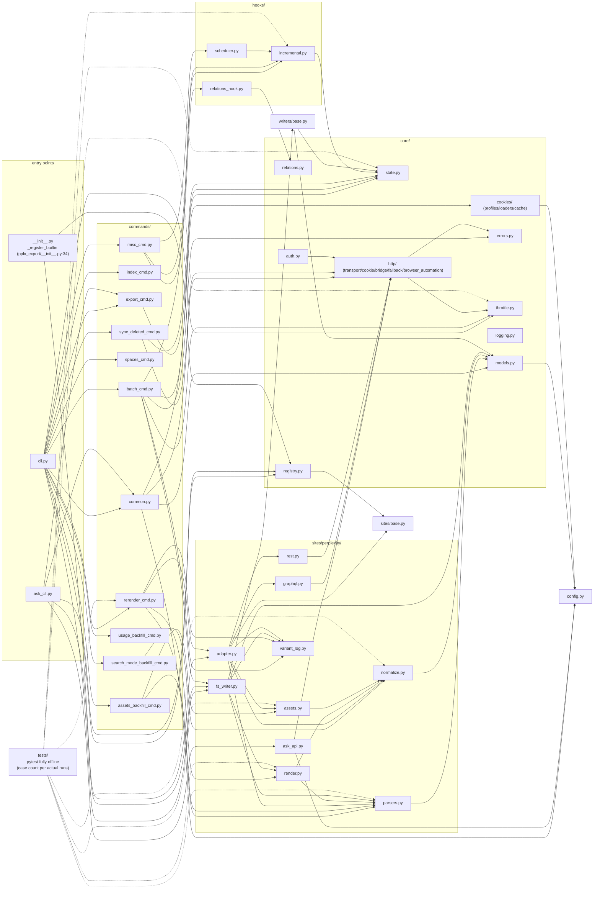

# Aperçu de l'architecture

---

## Aperçu de l'architecture en couches

Structure du package (`pplx_export/`, ~5,6k lignes de code source et en croissance avec le développement, hors tests ;
comptes exacts de lignes par `wc -l`) :

```mermaid
flowchart TD
    subgraph CLI["CLI layer (entry points)"]
        CL1["cli.py — pplx-export<br/>argparse definitions + dispatch (cli.py:57)"]
        CL2["ask_cli.py — pplx-ask<br/>interactive query entry (ask_cli.py:221)"]
    end

    subgraph CMD["commands/ command layer (shared by both entries)"]
        C0["common.py<br/>account mapping / make_transport assembly<br/>cookie validation and auto-switching (common.py:93)"]
        C1["index_cmd / export_cmd / batch_cmd"]
        C2["spaces_cmd / misc_cmd / rerender_cmd"]
        C3["assets_backfill_cmd / usage_backfill_cmd<br/>search_mode_backfill_cmd / sync_deleted_cmd"]
    end

    subgraph SITES["sites/ site layer"]
        SB["base.py — SiteAdapter ABC<br/>(pplx_export/sites/base.py:21)"]
        subgraph PPLX["sites/perplexity/"]
            AD["adapter.py<br/>PerplexityAdapter assembly (adapter.py:24)"]
            GQ["graphql.py<br/>APQ list pagination (graphql.py:43)"]
            RS["rest.py<br/>ThreadFetcher thread fetching (rest.py:38)"]
            PA["parsers.py<br/>single point of schema parsing (parsers.py)"]
            NM["normalize.py<br/>mode detection / math normalization (normalize.py:66,240)"]
            RD["render.py<br/>markdown rendering (render.py)"]
            AS["assets.py<br/>asset download and extension resolution (assets.py:27)"]
            AK["ask_api.py<br/>envelope / SSE / telemetry (ask_api.py)"]
            FW["fs_writer.py<br/>web_archive persistence (fs_writer.py:54)"]
            VL["variant_log.py<br/>ANSWER_VARIANT_DETECTED detection log<br/>+ jsonl registry (variant_log.py:45)"]
        end
    end

    subgraph CORE["core/ foundation layer (site-agnostic)"]
        MO["models.py domain models (models.py)"]
        ER["errors.py error types (errors.py)"]
        TH["throttle.py rate-limit backoff (throttle.py:15)"]
        ST["state.py BatchState checkpoint (state.py:63)"]
        LG["logging.py central logging (logging.py:45)"]
        CK["cookies/ + auth.py<br/>cookie sources and credentials (cookies/loaders.py:270)"]
        RL["relations.py relations graph (relations.py:200)"]
        RG["registry.py site registry (registry.py:9)"]
        subgraph HTTP["core/http/ transports"]
            TP["transport.py Transport ABC (transport.py:12)"]
            CT["cookie_transport.py<br/>urllib direct (cookie_transport.py:44)"]
            BT["bridge_transport.py<br/>WebBridge page context (bridge_transport.py:22)"]
            FB["fallback.py fallback chain [reserved · not wired]"]
            BA["browser_automation_transport.py<br/>heavyweight browser [reserved · not implemented]"]
        end
    end

    subgraph HOOKS["hooks/ extension points"]
        H1["incremental.py<br/>plan_incremental pure function (incremental.py:36)"]
        H2["relations_hook.py relations rebuild (relations_hook.py:17)"]
        H3["scheduler.py periodic schedule + cron (scheduler.py:22)"]
    end

    subgraph WRT["writers/ output abstraction"]
        WB["base.py Writer ABC (writers/base.py:17)"]
    end

    CFG["config.py — single source of site constants<br/>+ user-level config loading (account table / BOT space externalized to config.toml)"]

    CL1 --> C0
    CL2 --> C0
    C0 --> C1
    C0 --> C2
    C0 --> C3
    C1 --> AD
    C2 --> AD
    C3 --> AD
    AD --> GQ
    AD --> RS
    AD --> PA
    AD --> AS
    PA --> MO
    RD --> PA
    FW --> RD
    FW --> VL
    AD --> VL
    FW --> WB
    SB --> MO
    AD --> SB
    GQ --> TP
    RS --> TP
    AS --> TP
    AK --> CT
    CT --> TH
    CT --> ER
    C0 --> CK
    C1 --> ST
    H1 --> ST
    H2 --> RL
    RG -. "core's only import of sites:<br/>just the ABC of sites/base (registry.py:7)" .-> SB
    CFG -. "imported by all layers, zero dependencies itself" .- MO
```

Essentiels de la direction des dépendances (vérifiés en parcourant toutes les importations) :

- **Unidirectionnel** : CLI → commandes → sites → core. `core/` n'importe aucune implémentation concrète de Perplexity
  (pas de codification en dur de site) ; **la seule exception** est `core/registry.py:7` important l'ABC
  `SiteAdapter` depuis `sites/base.py` — une référence d'interface, pas une référence de site ; les sites concrets sont injectés via `register()`
  (enregistrement Perplexity intégré dans `pplx_export/__init__.py:34-43`).
- `config.py` est la source unique des constantes de site (domaine, `DEFAULT_ARCHIVE_ROOT`), et charge
  la **configuration externalisée au niveau utilisateur** : les tables de comptes `ACCOUNT_DISPLAY_NAMES/ACCOUNT_EMAIL/ACCOUNT_UID` et
  l'espace BOT proviennent de TOML (`--config` > `PPLX_EXPORT_CONFIG` >
  `~/.config/pplx-export/config.toml` ; modèle `config.example.toml`), dictionnaires mis à jour sur place,
  dégradation gracieuse en cas d'absence ; `core/models.py:18` l'importe également (`author_folder`).
- `ask_api.py` est le seul module de la couche site qui dépend directement d'une implémentation de transport concrète
  (importe `CookieTransport` et réutilise ses internes `_cookie_header`/`_opener` pour le flux SSE,
  ask_api.py:23, 114-130) — SSE est en dehors de l'abstraction de l'ABC Transport.
- `hooks/`, `writers/` dépendent uniquement de `core/` ; la seule implémentation de `writers/base.py`,
  `FilesystemWriter`, vit dans la couche site (fs_writer.py:54) — ABC et implémentation séparés.

---

## Graphe de dépendances des modules (relations d'importation réelles)

Issu d'un recensement complet `grep '^from \.'` (références intra-package omises ; tous les `__init__.py` sont vides
sauf la racine du package `pplx_export/__init__.py`, qui porte la charge d'enregistrement) :

Comment lire le graphe :

- **Chaîne core** : `cli → commands → sites → core`. Aucun module core ne dépend d'implémentations concrètes de
  commandes/sites ; `KG → SBASE` (registre → SiteAdapter ABC) est la seule
  référence croisée inverse entre couches, formant une boucle d'injection de dépendances avec l'enregistrement de `E0`.
- Agrégation dans `sites/perplexity/` : `adapter` est la façade (composant graphql/rest/parsers/
  normalize/assets) ; `render` dépend de `parsers` (source de vérité pour la classification du statut wf) ; `fs_writer`
  dépend de `render + parsers + writers/base`.
- Les tests `tests/` vivent en dehors du package et importent directement des fonctions pures de chaque couche (le `render_fixture` de conftest.py
  réutilise `commands.rerender_cmd.rerender` pour le rendu hors ligne).

---

## Résumé des principes de conception

1. **Réponses brutes conservées ; artefacts rendus régénérables hors ligne** :
   `adapter.get_thread` analyse et assemble la conversation en mémoire avant
   que le writer ne s'exécute (adapter.py:58-157). Une écriture réussie stocke `thread.json`
   d'abord, puis les réponses disponibles en texte brut/schématisées comme `raw_*.json`
   (fs_writer.py:224-266) ; l'analyse/rendu/enregistrement d'interruption peuvent ensuite
   être réexécutés à partir des données brutes sans réseau ([§12](offline-operations.md)),
   découplant l'évolution du rendu des archives historiques.
2. **Point d'analyse unique, tolérant aux changements de structure de données** : l'extraction de champs est
   concentrée dans `parsers.py` (le trio de tolérance aux pannes `_g`/`_loads`/`to_int`) ; la détection
   de mode a des signaux redondants doubles plus une solution de repli en cas d'absence de tous les signaux ([§4](export-pipeline.md)) —
   le rayon d'impact d'une refonte de plateforme est compressé dans un seul module.
3. **Cascade d'attribution déterministe** : "chaque charge utile d'arrière-plan atterrit exactement à un
   endroit, jamais rendue deux fois" est garantie par les structures de données (l'ensemble ancré, la consommation unique de used_cand,
   l'itération uniquement au niveau supérieur contre le double comptage) — pas de devinette heuristique de temps ;
   la sémantique d'interruption a cinq classes avec une source de vérité unique
   (classify_wf_status) partagée par les chemins de rendu/enregistrement/alerte ([§5, §6](subagents-interruptions.md)).
4. **La discipline de limitation de débit est une ligne rouge de sécurité** : intervalles aléatoires, pas de concurrence, backoff 3^N
   avec un plafond, échec rapide en cas d'échec d'authentification, état terminal ENTRY_EXPIRED, 404 jamais
   mal interprété comme expiré ([§11](rate-limiting-errors.md)) — tout servant l'objectif anti-bannissement de "comportement d'exportation ≈ navigation humaine"
   (une exigence utilisateur explicite).
5. **Source unique de configuration + confidentialité externalisée** : les constantes de site/chemins par défaut
   vivent uniquement dans `config.py` ; les comptes/espaces sont une confidentialité personnelle, externalisée dans du TOML
   au niveau utilisateur (`--config` > `PPLX_EXPORT_CONFIG` > `~/.config/pplx-export/config.toml`) ; le
   changement automatique de cookies multi-comptes est une boucle de sondage pilotée par les emails enregistrés, sans opération
   manuelle de navigateur ([§9](ask-and-accounts.md)).
6. **Dépendances unidirectionnelles en couches** : CLI → commandes → sites → core, avec zéro codification en dur de site
   dans core et les sites injectés via le registre — un nouveau site implémente les cinq méthodes `SiteAdapter`
   et réutilise toutes les fonctionnalités core (sites/base.py:21-69).
