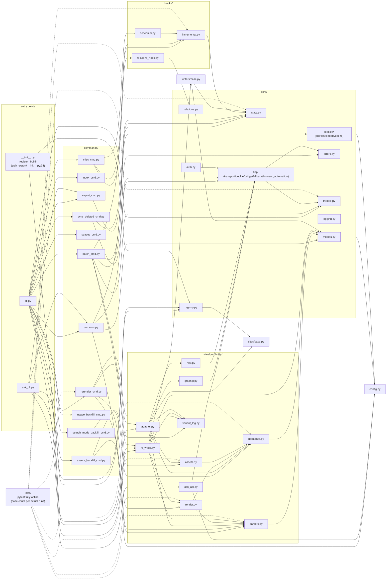

# Panoramica dell'architettura

---

## Panoramica dell'architettura a livelli

Struttura del pacchetto (`pplx_export/`, ~5.6k righe di codice sorgente e in crescita con lo sviluppo, esclusi i test;
conteggi esatti delle righe per `wc -l`):

```mermaid
flowchart TD
    subgraph CLI["CLI layer (entry points)"]
        CL1["cli.py — pplx-export<br/>argparse definitions + dispatch (cli.py:57)"]
        CL2["ask_cli.py — pplx-ask<br/>interactive query entry (ask_cli.py:221)"]
    end

    subgraph CMD["commands/ command layer (shared by both entries)"]
        C0["common.py<br/>account mapping / make_transport assembly<br/>cookie validation and auto-switching (common.py:93)"]
        C1["index_cmd / export_cmd / batch_cmd"]
        C2["spaces_cmd / misc_cmd / rerender_cmd"]
        C3["assets_backfill_cmd / usage_backfill_cmd<br/>search_mode_backfill_cmd / sync_deleted_cmd"]
    end

    subgraph SITES["sites/ site layer"]
        SB["base.py — SiteAdapter ABC<br/>(pplx_export/sites/base.py:21)"]
        subgraph PPLX["sites/perplexity/"]
            AD["adapter.py<br/>PerplexityAdapter assembly (adapter.py:24)"]
            GQ["graphql.py<br/>APQ list pagination (graphql.py:43)"]
            RS["rest.py<br/>ThreadFetcher thread fetching (rest.py:38)"]
            PA["parsers.py<br/>single point of schema parsing (parsers.py)"]
            NM["normalize.py<br/>mode detection / math normalization (normalize.py:66,240)"]
            RD["render.py<br/>markdown rendering (render.py)"]
            AS["assets.py<br/>asset download and extension resolution (assets.py:27)"]
            AK["ask_api.py<br/>envelope / SSE / telemetry (ask_api.py)"]
            FW["fs_writer.py<br/>web_archive persistence (fs_writer.py:54)"]
            VL["variant_log.py<br/>ANSWER_VARIANT_DETECTED detection log<br/>+ jsonl registry (variant_log.py:45)"]
        end
    end

    subgraph CORE["core/ foundation layer (site-agnostic)"]
        MO["models.py domain models (models.py)"]
        ER["errors.py error types (errors.py)"]
        TH["throttle.py rate-limit backoff (throttle.py:15)"]
        ST["state.py BatchState checkpoint (state.py:63)"]
        LG["logging.py central logging (logging.py:45)"]
        CK["cookies/ + auth.py<br/>cookie sources and credentials (cookies/loaders.py:270)"]
        RL["relations.py relations graph (relations.py:200)"]
        RG["registry.py site registry (registry.py:9)"]
        subgraph HTTP["core/http/ transports"]
            TP["transport.py Transport ABC (transport.py:12)"]
            CT["cookie_transport.py<br/>urllib direct (cookie_transport.py:44)"]
            BT["bridge_transport.py<br/>WebBridge page context (bridge_transport.py:22)"]
            FB["fallback.py fallback chain [reserved · not wired]"]
            BA["browser_automation_transport.py<br/>heavyweight browser [reserved · not implemented]"]
        end
    end

    subgraph HOOKS["hooks/ extension points"]
        H1["incremental.py<br/>plan_incremental pure function (incremental.py:36)"]
        H2["relations_hook.py relations rebuild (relations_hook.py:17)"]
        H3["scheduler.py periodic schedule + cron (scheduler.py:22)"]
    end

    subgraph WRT["writers/ output abstraction"]
        WB["base.py Writer ABC (writers/base.py:17)"]
    end

    CFG["config.py — single source of site constants<br/>+ user-level config loading (account table / BOT space externalized to config.toml)"]

    CL1 --> C0
    CL2 --> C0
    C0 --> C1
    C0 --> C2
    C0 --> C3
    C1 --> AD
    C2 --> AD
    C3 --> AD
    AD --> GQ
    AD --> RS
    AD --> PA
    AD --> AS
    PA --> MO
    RD --> PA
    FW --> RD
    FW --> VL
    AD --> VL
    FW --> WB
    SB --> MO
    AD --> SB
    GQ --> TP
    RS --> TP
    AS --> TP
    AK --> CT
    CT --> TH
    CT --> ER
    C0 --> CK
    C1 --> ST
    H1 --> ST
    H2 --> RL
    RG -. "core's only import of sites:<br/>just the ABC of sites/base (registry.py:7)" .-> SB
    CFG -. "imported by all layers, zero dependencies itself" .- MO
```

Elementi essenziali della direzione delle dipendenze (verificati esaminando tutte le importazioni):

- **Unidirezionale**: CLI → comandi → siti → core. `core/` non importa alcuna implementazione concreta di Perplexity
  (nessun hardcoding del sito); **l'unica eccezione** è `core/registry.py:7` che importa l'ABC
  `SiteAdapter` da `sites/base.py` — un riferimento all'interfaccia, non un riferimento al sito; i siti concreti vengono iniettati tramite `register()`
  (registrazione Perplexity integrata in `pplx_export/__init__.py:34-43`).
- `config.py` è l'unica fonte di costanti del sito (dominio, `DEFAULT_ARCHIVE_ROOT`) e carica
  la **configurazione esternalizzata a livello utente**: le tabelle degli account `ACCOUNT_DISPLAY_NAMES/ACCOUNT_EMAIL/ACCOUNT_UID` e lo
  spazio BOT provengono da TOML (`--config` > `PPLX_EXPORT_CONFIG` >
  `~/.config/pplx-export/config.toml`; template `config.example.toml`), dizionari aggiornati sul posto,
  degradazione graduale in caso di assenza; anche `core/models.py:18` lo importa (`author_folder`).
- `ask_api.py` è l'unico modulo del livello sito che dipende direttamente da un'implementazione di trasporto concreta
  (importa `CookieTransport` e riutilizza i suoi interni `_cookie_header`/`_opener` per lo stream SSE,
  ask_api.py:23, 114-130) — SSE è al di fuori dell'astrazione dell'ABC Transport.
- `hooks/`, `writers/` dipendono solo da `core/`; l'unica implementazione di `writers/base.py`,
  `FilesystemWriter`, risiede nel livello sito (fs_writer.py:54) — ABC e implementazione separati.

---

## Grafico delle dipendenze dei moduli (relazioni di importazione reali)

Derivato da un censimento completo di `grep '^from \.'` (riferimenti intra-pacchetto omessi; tutti i `__init__.py` sono vuoti
eccetto la radice del pacchetto `pplx_export/__init__.py`, che svolge il compito di registrazione):

Come leggere il grafico:

- **Catena core**: `cli → commands → sites → core`. Nessun modulo core dipende da implementazioni concrete
  di comandi/siti; `KG → SBASE` (registro → SiteAdapter ABC) è l'unico
  riferimento incrociato inverso tra livelli, formando un ciclo di dependency injection con la registrazione di `E0`.
- Aggregazione all'interno di `sites/perplexity/`: `adapter` è la facciata (compone graphql/rest/parser/
  normalize/assets); `render` dipende da `parsers` (fonte di verità per la classificazione dello stato wf); `fs_writer`
  dipende da `render + parsers + writers/base`.
- I test `tests/` risiedono al di fuori del pacchetto e importano direttamente funzioni pure da ogni livello (conftest.py
  `render_fixture` riutilizza `commands.rerender_cmd.rerender` per il re-rendering offline).

---

## Riepilogo dei principi di progettazione

1. **Risposte grezze conservate; artefatti renderizzati rigenerabili offline**:
   `adapter.get_thread` analizza e assembla la conversazione in memoria prima
   che lo scrittore venga eseguito (adapter.py:58-157). Una scrittura riuscita memorizza `thread.json`
   per primo e poi le risposte plain/schematizzate disponibili come `raw_*.json`
   (fs_writer.py:224-266); l'analisi/rendering/registrazione dell'interruzione possono successivamente
   essere rieseguiti dai dati grezzi senza rete ([§12](offline-operations.md)), disaccoppiando
   l'evoluzione del renderer dagli archivi storici.
2. **Singolo punto di analisi, tollerante ai cambiamenti della struttura dati**: l'estrazione dei campi è
   concentrata in `parsers.py` (il trio di tolleranza ai guasti `_g`/`_loads`/`to_int`); il rilevamento della
   modalità ha segnali ridondanti duali più un fallback di recupero in caso di assenza di tutti i segnali ([§4](export-pipeline.md)) —
   il raggio d'esplosione di una revisione della piattaforma è compresso in un modulo.
3. **Cascata di attribuzione deterministica**: "ogni payload di sfondo atterra esattamente in un
   posto, mai renderizzato due volte" è garantito dalle strutture dati (l'insieme ancorato, consumo singolo di used_cand,
   iterazione solo a livello superiore contro il doppio conteggio) — nessuna stima euristica del
   tempo; la semantica di interruzione ha cinque classi con una fonte di verità
   (classify_wf_status) condivisa dai percorsi di rendering/registrazione/avviso ([§5, §6](subagents-interruptions.md)).
4. **La disciplina del limite di velocità è una linea rossa di sicurezza**: intervalli casuali, nessuna concorrenza, backoff 3^N
   con un limite, fail-fast in caso di errore di autenticazione, stato terminale ENTRY_EXPIRED, 404 mai
   scambiato per scaduto ([§11](rate-limiting-errors.md)) — tutto al servizio dell'obiettivo anti-ban di "comportamento di esportazione ≈ navigazione
   umana" (un requisito utente esplicito).
5. **Singola fonte di configurazione + privacy esternalizzata**: le costanti del sito/i percorsi predefiniti
   risiedono solo in `config.py`; account/spazi sono privacy personale, esternalizzati in TOML
   a livello utente (`--config` > `PPLX_EXPORT_CONFIG` > `~/.config/pplx-export/config.toml`); il cambio automatico di cookie
   multi-account è un ciclo di probe guidato dalle email registrate, senza operazione manuale del
   browser ([§9](ask-and-accounts.md)).
6. **Dipendenze unidirezionali a livelli**: CLI → comandi → siti → core, con zero hardcoding del sito
   in core e siti iniettati tramite il registro — un nuovo sito implementa i cinque metodi `SiteAdapter`
   e riutilizza tutte le funzionalità core (sites/base.py:21-69).
