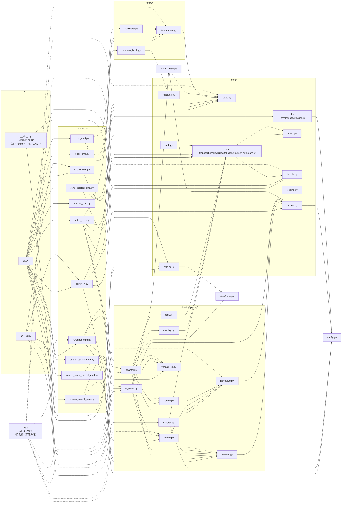

# アーキテクチャ概要

---

## 階層アーキテクチャ概要

パッケージ構造（`pplx_export/`、ソースコード規模は約5.6k行で開発に伴い増加、テストは含まず；
正確な行数は `wc -l` の実測による）：

```mermaid
flowchart TD
    subgraph CLI["CLI 层（入口）"]
        CL1["cli.py — pplx-export<br/>argparse 定义 + 分发（cli.py:57）"]
        CL2["ask_cli.py — pplx-ask<br/>交互查询入口（ask_cli.py:221）"]
    end

    subgraph CMD["commands/ 命令层（双入口共用）"]
        C0["common.py<br/>账户映射 / make_transport 装配<br/>cookie 校验与自动切换（common.py:93）"]
        C1["index_cmd / export_cmd / batch_cmd"]
        C2["spaces_cmd / misc_cmd / rerender_cmd"]
        C3["assets_backfill_cmd / usage_backfill_cmd<br/>search_mode_backfill_cmd / sync_deleted_cmd"]
    end

    subgraph SITES["sites/ 站点层"]
        SB["base.py — SiteAdapter ABC<br/>（pplx_export/sites/base.py:21）"]
        subgraph PPLX["sites/perplexity/"]
            AD["adapter.py<br/>PerplexityAdapter 组装（adapter.py:24）"]
            GQ["graphql.py<br/>APQ 列表分页（graphql.py:43）"]
            RS["rest.py<br/>ThreadFetcher 线程抓取（rest.py:38）"]
            PA["parsers.py<br/>schema 解析单点（parsers.py）"]
            NM["normalize.py<br/>模式判别 / 公式规范化（normalize.py:66,240）"]
            RD["render.py<br/>markdown 渲染（render.py）"]
            AS["assets.py<br/>资产下载与扩展名判定（assets.py:27）"]
            AK["ask_api.py<br/>envelope / SSE / 遥测（ask_api.py）"]
            FW["fs_writer.py<br/>web_archive 落盘（fs_writer.py:54）"]
            VL["variant_log.py<br/>ANSWER_VARIANT_DETECTED 检测日志<br/>+ jsonl 登记（variant_log.py:45）"]
        end
    end

    subgraph CORE["core/ 基础层（站点无关）"]
        MO["models.py 领域模型（models.py）"]
        ER["errors.py 错误类型（errors.py）"]
        TH["throttle.py 限频退避（throttle.py:15）"]
        ST["state.py BatchState 断点（state.py:63）"]
        LG["logging.py 中央日志（logging.py:45）"]
        CK["cookies/ + auth.py<br/>cookie 来源与凭证（cookies/loaders.py:203）"]
        RL["relations.py 关系图（relations.py:200）"]
        RG["registry.py 站点注册表（registry.py:9）"]
        subgraph HTTP["core/http/ transports"]
            TP["transport.py Transport ABC（transport.py:12）"]
            CT["cookie_transport.py<br/>urllib 直连（cookie_transport.py:44）"]
            BT["bridge_transport.py<br/>WebBridge 页面上下文（bridge_transport.py:22）"]
            FB["fallback.py 降级链【预留·未接线】"]
            BA["browser_automation_transport.py<br/>重量级浏览器【预留·未实现】"]
        end
    end

    subgraph HOOKS["hooks/ 扩展点"]
        H1["incremental.py<br/>plan_incremental 纯函数（incremental.py:36）"]
        H2["relations_hook.py 关系重建（relations_hook.py:17）"]
        H3["scheduler.py 周期计划 + cron（scheduler.py:22）"]
    end

    subgraph WRT["writers/ 输出抽象"]
        WB["base.py Writer ABC（writers/base.py:17）"]
    end

    CFG["config.py — 站点常量单一来源<br/>+ 用户级配置加载（账户表/BOT 空间外置 config.toml）"]

    CL1 --> C0
    CL2 --> C0
    C0 --> C1
    C0 --> C2
    C0 --> C3
    C1 --> AD
    C2 --> AD
    C3 --> AD
    AD --> GQ
    AD --> RS
    AD --> PA
    AD --> AS
    PA --> MO
    RD --> PA
    FW --> RD
    FW --> VL
    AD --> VL
    FW --> WB
    SB --> MO
    AD --> SB
    GQ --> TP
    RS --> TP
    AS --> TP
    AK --> CT
    CT --> TH
    CT --> ER
    C0 --> CK
    C1 --> ST
    H1 --> ST
    H2 --> RL
    RG -. "core 唯一 import sites 之处：<br/>仅 sites/base 的 ABC（registry.py:7）" .-> SB
    CFG -. "被各层 import，自身零依赖" .- MO
```

依存方向の要点（grep で全 import を確認）：

- **単方向**：CLI → commands → sites → core。`core/` は Perplexity の具体的な実装を一切 import しない
  （サイトのハードコードなし）；**唯一の例外**は `core/registry.py:7` が `sites/base.py` の
  `SiteAdapter` ABC を import する点——サイト参照ではなくインターフェース参照であり、具体的なサイトは `register()` を介して注入される
  （`pplx_export/__init__.py:34-43` に組み込みで perplexity が登録されている）。
- `config.py` はサイト定数（ドメイン名、`DEFAULT_ARCHIVE_ROOT`）の唯一のソースであり、**ユーザーレベルの外部設定**の読み込みも担当する：
  アカウントテーブル `ACCOUNT_DISPLAY_NAMES/ACCOUNT_EMAIL/ACCOUNT_UID` と
  BOT スペースは TOML から（`--config` > `PPLX_EXPORT_CONFIG` >
  `~/.config/pplx-export/config.toml`、テンプレート `config.example.toml`）、dict はその場で更新、
  欠落時はデフォルトにフォールバック；`core/models.py:18` もこれを import する（`author_folder`）。
- `ask_api.py` はサイト層で唯一、具体的な transport 実装に直接依存するモジュールである
  （import `CookieTransport` し、その `_cookie_header`/`_opener` 内部フィールドを SSE ストリームに再利用、
  ask_api.py:23、114-130）——SSE は Transport ABC の抽象範囲外。
- `hooks/`、`writers/` は `core/` のみに依存；`writers/base.py` の唯一の実装
  `FilesystemWriter` はサイト層にある（fs_writer.py:54）、ABC と実装は分離されている。

---

## モジュール依存関係図（実際の import 関係）

`grep '^from \.'` の全量統計に基づいて作成（同一パッケージ内の参照は省略；`__init__.py` はすべて空で、
パッケージルート `pplx_export/__init__.py` のみが登録責務を担う）：

図の読み方のポイント：

- **コアリンク**：`cli → commands → sites → core`。どの core モジュールも
  commands/sites の具体的な実装に依存せず、`KG → SBASE`（registry → SiteAdapter ABC）が唯一の
  クロスレイヤー逆参照であり、`E0` の登録動作と合わせて依存性注入の閉ループを形成する。
- `sites/perplexity/` 内部の集約関係：`adapter` はファサード（graphql/rest/parsers/
  normalize/assets を組み合わせる）、`render` は `parsers` に依存（wf ステータス分類の真のソース）、`fs_writer`
  は `render + parsers + writers/base` に依存。
- テスト `tests/` はパッケージ外にあり、各層の純粋関数を直接 import する（conftest.py の
  `render_fixture` は `commands.rerender_cmd.rerender` を再利用してオフラインで再レンダリング）。

---

## 設計原則のまとめ

1. **元のレスポンスを保持し、レンダリング成果物はオフラインで再生成可能**：`adapter.get_thread` はまずメモリ上でパースし
   会話を組み立て（adapter.py:58-157）、その後 writer が実行される。書き込み成功時はまず
   `thread.json` を保存し、次に実際に取得した plain/schematized レスポンスを `raw_*.json` として保存する
   （fs_writer.py:224-266）；パース/レンダリング/中断登録はその後、raw からネットワークゼロで再実行可能
   （[§12](offline-operations.md)）、レンダラーの進化と履歴アーカイブは疎結合。
2. **パースは単一アダプターで、データ構造の変更に耐性**：フィールド抽出は `parsers.py` に集中（`_g`/`_loads`/
   `to_int` のフォールトトレラント三種の神器）、パターン判定は二重シグナルの相互バックアップ＋全シグナル消失時のフォールバックで多めに取得（[§4](export-pipeline.md)）、
   プラットフォームの変更による影響範囲は一つのモジュールに圧縮される。
3. **帰属のウォーターフォールは決定論的**：バックグラウンド負荷「各アイテムは一箇所のみ、二重レンダリングは絶対にしない」はデータ構造で保証
   （anchored 集合、used_cand の一回限りの消費、トップレベルのイテレーションで二重カウント防止）、ヒューリスティックな時間推測は行わない；
   中断セマンティクスは五種類で一つの真のソース（classify_wf_status）、レンダリング/登録/警告の三つの経路で共有（[§5、§6](subagents-interruptions.md)）。
4. **レート制限の規律は安全上の赤線**：ランダム間隔、並行処理なし、3^N バックオフ上限、認証失敗時は fail-fast、
   ENTRY_EXPIRED は終端状態、404 は決して期限切れと誤判定しない（[§11](rate-limiting-errors.md)）——すべて「エクスポート動作 ≈ 人間の
   ブラウジング」というアカウント停止防止目標に奉仕する（ユーザーの明確な要求）。
5. **設定は単一ソース＋プライバシーは外部化**：サイト定数/デフォルトパスは `config.py` のみ；アカウント/スペースは
   個人のプライバシーに属し、ユーザーレベルの TOML として外部化（`--config` > `PPLX_EXPORT_CONFIG` >
   `~/.config/pplx-export/config.toml`）；複数アカウントの cookie 自動切り替え
   は登録メール駆動の検出ループであり、手動でのブラウザ操作は不要（[§9](ask-and-accounts.md)）。
6. **階層的な単方向依存**：CLI → commands → sites → core、core はサイトのハードコードがゼロ、
   サイトはレジストリを介して注入される——新しいサイト実装は `SiteAdapter` の五つのメソッドを実装するだけで全てのコア機能を再利用可能
   （sites/base.py:21-69）。
