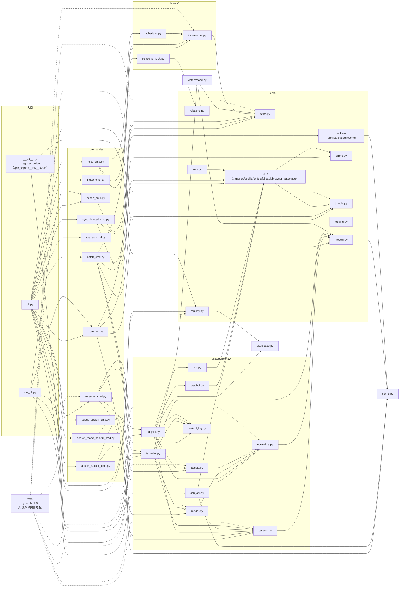

# 아키텍처 개요

---

## 계층형 아키텍처 개요

패키지 구조(`pplx_export/`, 소스 코드 규모 약 5.6k 라인이며 개발에 따라 증가, 테스트 제외;
정확한 라인 수는 `wc -l` 실측 기준):

```mermaid
flowchart TD
    subgraph CLI["CLI 层（入口）"]
        CL1["cli.py — pplx-export<br/>argparse 定义 + 分发（cli.py:57）"]
        CL2["ask_cli.py — pplx-ask<br/>交互查询入口（ask_cli.py:221）"]
    end

    subgraph CMD["commands/ 命令层（双入口共用）"]
        C0["common.py<br/>账户映射 / make_transport 装配<br/>cookie 校验与自动切换（common.py:93）"]
        C1["index_cmd / export_cmd / batch_cmd"]
        C2["spaces_cmd / misc_cmd / rerender_cmd"]
        C3["assets_backfill_cmd / usage_backfill_cmd<br/>search_mode_backfill_cmd / sync_deleted_cmd"]
    end

    subgraph SITES["sites/ 站点层"]
        SB["base.py — SiteAdapter ABC<br/>（pplx_export/sites/base.py:21）"]
        subgraph PPLX["sites/perplexity/"]
            AD["adapter.py<br/>PerplexityAdapter 组装（adapter.py:24）"]
            GQ["graphql.py<br/>APQ 列表分页（graphql.py:43）"]
            RS["rest.py<br/>ThreadFetcher 线程抓取（rest.py:38）"]
            PA["parsers.py<br/>schema 解析单点（parsers.py）"]
            NM["normalize.py<br/>模式判别 / 公式规范化（normalize.py:66,240）"]
            RD["render.py<br/>markdown 渲染（render.py）"]
            AS["assets.py<br/>资产下载与扩展名判定（assets.py:27）"]
            AK["ask_api.py<br/>envelope / SSE / 遥测（ask_api.py）"]
            FW["fs_writer.py<br/>web_archive 落盘（fs_writer.py:54）"]
            VL["variant_log.py<br/>ANSWER_VARIANT_DETECTED 检测日志<br/>+ jsonl 登记（variant_log.py:45）"]
        end
    end

    subgraph CORE["core/ 基础层（站点无关）"]
        MO["models.py 领域模型（models.py）"]
        ER["errors.py 错误类型（errors.py）"]
        TH["throttle.py 限频退避（throttle.py:15）"]
        ST["state.py BatchState 断点（state.py:63）"]
        LG["logging.py 中央日志（logging.py:45）"]
        CK["cookies/ + auth.py<br/>cookie 来源与凭证（cookies/loaders.py:203）"]
        RL["relations.py 关系图（relations.py:200）"]
        RG["registry.py 站点注册表（registry.py:9）"]
        subgraph HTTP["core/http/ transports"]
            TP["transport.py Transport ABC（transport.py:12）"]
            CT["cookie_transport.py<br/>urllib 直连（cookie_transport.py:44）"]
            BT["bridge_transport.py<br/>WebBridge 页面上下文（bridge_transport.py:22）"]
            FB["fallback.py 降级链【预留·未接线】"]
            BA["browser_automation_transport.py<br/>重量级浏览器【预留·未实现】"]
        end
    end

    subgraph HOOKS["hooks/ 扩展点"]
        H1["incremental.py<br/>plan_incremental 纯函数（incremental.py:36）"]
        H2["relations_hook.py 关系重建（relations_hook.py:17）"]
        H3["scheduler.py 周期计划 + cron（scheduler.py:22）"]
    end

    subgraph WRT["writers/ 输出抽象"]
        WB["base.py Writer ABC（writers/base.py:17）"]
    end

    CFG["config.py — 站点常量单一来源<br/>+ 用户级配置加载（账户表/BOT 空间外置 config.toml）"]

    CL1 --> C0
    CL2 --> C0
    C0 --> C1
    C0 --> C2
    C0 --> C3
    C1 --> AD
    C2 --> AD
    C3 --> AD
    AD --> GQ
    AD --> RS
    AD --> PA
    AD --> AS
    PA --> MO
    RD --> PA
    FW --> RD
    FW --> VL
    AD --> VL
    FW --> WB
    SB --> MO
    AD --> SB
    GQ --> TP
    RS --> TP
    AS --> TP
    AK --> CT
    CT --> TH
    CT --> ER
    C0 --> CK
    C1 --> ST
    H1 --> ST
    H2 --> RL
    RG -. "core 唯一 import sites 之处：<br/>仅 sites/base 的 ABC（registry.py:7）" .-> SB
    CFG -. "被各层 import，自身零依赖" .- MO
```

의존성 방향 요점(grep 전체 import 확인):

- **단방향**: CLI → commands → sites → core. `core/`는 어떤 Perplexity 구체 구현도 import하지 않음
  (사이트 하드코딩 없음); **유일한 예외**는 `core/registry.py:7`가 `sites/base.py`의
  `SiteAdapter` ABC를 import하는 것——인터페이스 참조이지 사이트 참조가 아니며, 구체 사이트는 `register()`를 통해 주입됨
  (`pplx_export/__init__.py:34-43`에 내장 등록된 perplexity).
- `config.py`는 사이트 상수(도메인, `DEFAULT_ARCHIVE_ROOT`)의 유일한 출처이며, **사용자 수준 외부 설정** 로딩을 담당:
  계정 테이블 `ACCOUNT_DISPLAY_NAMES/ACCOUNT_EMAIL/ACCOUNT_UID`와
  BOT 공간은 TOML에서 가져옴(`--config` > `PPLX_EXPORT_CONFIG` >
  `~/.config/pplx-export/config.toml`, 템플릿 `config.example.toml`), dict 제자리 업데이트,
  누락 시 폴백; `core/models.py:18`도 이를 import함(`author_folder`).
- `ask_api.py`는 사이트 계층에서 유일하게 구체적인 transport 구현에 직접 의존하는 모듈
  (`CookieTransport`을 import하고 그 `_cookie_header`/`_opener` 내부 필드를 SSE 스트림에 재사용,
  ask_api.py:23, 114-130)——SSE는 Transport ABC의 추상 범위에 포함되지 않음.
- `hooks/`, `writers/`는 `core/`에만 의존; `writers/base.py`의 유일한 구현
  `FilesystemWriter`는 사이트 계층에 있음(fs_writer.py:54), ABC와 구현이 분리됨.

---

## 모듈 의존성 그래프(실제 import 관계)

`grep '^from \.'` 전체 통계 기준으로 작성(동일 패키지 내 참조 생략; `__init__.py`는 모두 비어 있으며,
패키지 루트 `pplx_export/__init__.py`만 등록 역할 담당):

그래프 읽기 요점:

- **핵심 경로**: `cli → commands → sites → core`. 어떤 core 모듈도
  commands/sites의 구체 구현에 의존하지 않으며, `KG → SBASE`(registry → SiteAdapter ABC)가 유일한
  계층 간 역참조로, `E0`의 등록 동작과 함께 의존성 주입 폐루프를 형성함.
- `sites/perplexity/` 내부 집계 관계: `adapter`는 퍼사드(graphql/rest/parsers/
  normalize/assets 조합), `render`는 `parsers`에 의존(wf 상태 분류의 진정한 출처), `fs_writer`는
  `render + parsers + writers/base`에 의존.
- 테스트 `tests/`는 패키지 외부에 있으며, 각 계층의 순수 함수를 직접 import함(conftest.py의
  `render_fixture`는 `commands.rerender_cmd.rerender`를 재사용하여 오프라인 재렌더링).

---

## 설계 원칙 요약

1. **원본 응답 보존, 렌더링 결과물은 오프라인에서 재생성 가능**: `adapter.get_thread`는 먼저 메모리에서 대화를
   파싱하고 조립한 후(adapter.py:58-157), writer가 실행됨. 성공적으로 쓰기 시 먼저
   `thread.json`를 저장한 후, 실제로 얻은 plain/schematized 응답을 `raw_*.json`로 저장
   (fs_writer.py:224-266); 파싱/렌더링/중단 등록 이후 모두 raw에서 네트워크 없이 재실행 가능
   ([§12](offline-operations.md)), 렌더러 발전과 기록 보관이 분리됨.
2. **파싱 단일 지점 적응, 데이터 구조 변경에 내성**: 필드 추출은 `parsers.py`에 집중됨(`_g`/`_loads`/
   `to_int` 오류 허용 삼총사), 패턴 판별은 이중 신호 상호 백업 + 신호 완전 소멸 시 폴백으로 여러 개 가져오기([§4](export-pipeline.md)),
   플랫폼 변경의 영향 범위가 하나의 모듈로 축소됨.
3. **귀속 워터폴 결정적**: 백그라운드 로드는 "각 항목은 한 곳에만 저장, 절대 이중 렌더링 없음"이 데이터 구조로 보장됨
   (anchored 집합, used_cand 단일 소비, 최상위 반복 이중 계산 방지), 휴리스틱 시간 추측 없음;
   중단 의미는 다섯 가지 유형, 하나의 진정한 출처(classify_wf_status), 렌더링/등록/경고 세 가지 경로에서 공유([§5, §6](subagents-interruptions.md)).
4. **속도 제한 규율은 안전 경계선**: 무작위 간격, 동시성 없음, 3^N 백오프 상한, 인증 실패 시 fail-fast,
   ENTRY_EXPIRED 최종 상태, 404는 절대 만료로 오판하지 않음([§11](rate-limiting-errors.md))——모두 "내보내기 동작 ≈ 인간
   브라우징"의 계정 차단 방지 목표에 기여(사용자 명시적 요구).
5. **설정 단일 출처 + 프라이버시 외부화**: 사이트 상수/기본 경로는 `config.py`에만 있음; 계정/공간은
   개인 프라이버시에 속하므로 사용자 수준 TOML로 외부화(`--config` > `PPLX_EXPORT_CONFIG` >
   `~/.config/pplx-export/config.toml`); 다중 계정 쿠키 자동 전환은
   등록된 email 기반 탐지 폐루프로, 사용자가 브라우저를 조작할 필요 없음([§9](ask-and-accounts.md)).
6. **계층형 단방향 의존성**: CLI → commands → sites → core, core는 사이트 하드코딩 없음,
   사이트는 레지스트리를 통해 주입됨——새 사이트 구현은 `SiteAdapter`의 다섯 가지 메서드만 구현하면 모든 핵심 기능을 재사용 가능
   (sites/base.py:21-69).
