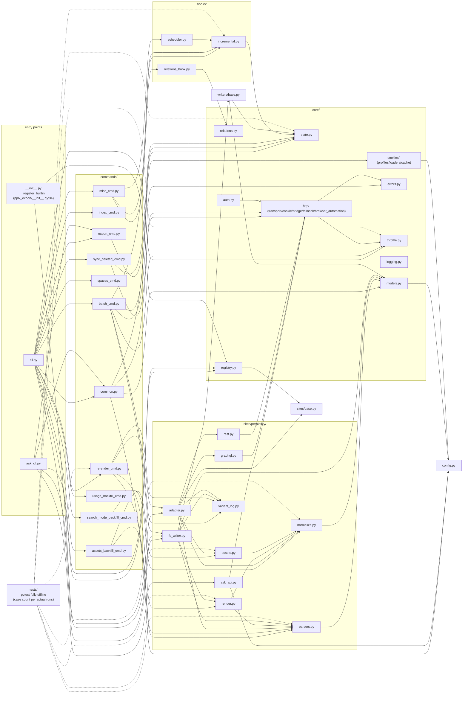

# Architecture overview

---

## Layered architecture overview

Package structure (`pplx_export/`, ~5.6k lines of source and growing with development, excluding tests;
exact line counts per `wc -l`):

```mermaid
flowchart TD
    subgraph CLI["CLI layer (entry points)"]
        CL1["cli.py — pplx-export<br/>argparse definitions + dispatch (cli.py:57)"]
        CL2["ask_cli.py — pplx-ask<br/>interactive query entry (ask_cli.py:221)"]
    end

    subgraph CMD["commands/ command layer (shared by both entries)"]
        C0["common.py<br/>account mapping / make_transport assembly<br/>cookie validation and auto-switching (common.py:93)"]
        C1["index_cmd / export_cmd / batch_cmd"]
        C2["spaces_cmd / misc_cmd / rerender_cmd"]
        C3["assets_backfill_cmd / usage_backfill_cmd<br/>search_mode_backfill_cmd / sync_deleted_cmd"]
    end

    subgraph SITES["sites/ site layer"]
        SB["base.py — SiteAdapter ABC<br/>(pplx_export/sites/base.py:21)"]
        subgraph PPLX["sites/perplexity/"]
            AD["adapter.py<br/>PerplexityAdapter assembly (adapter.py:24)"]
            GQ["graphql.py<br/>APQ list pagination (graphql.py:43)"]
            RS["rest.py<br/>ThreadFetcher thread fetching (rest.py:38)"]
            PA["parsers.py<br/>single point of schema parsing (parsers.py)"]
            NM["normalize.py<br/>mode detection / math normalization (normalize.py:66,240)"]
            RD["render.py<br/>markdown rendering (render.py)"]
            AS["assets.py<br/>asset download and extension resolution (assets.py:27)"]
            AK["ask_api.py<br/>envelope / SSE / telemetry (ask_api.py)"]
            FW["fs_writer.py<br/>web_archive persistence (fs_writer.py:54)"]
            VL["variant_log.py<br/>ANSWER_VARIANT_DETECTED detection log<br/>+ jsonl registry (variant_log.py:45)"]
        end
    end

    subgraph CORE["core/ foundation layer (site-agnostic)"]
        MO["models.py domain models (models.py)"]
        ER["errors.py error types (errors.py)"]
        TH["throttle.py rate-limit backoff (throttle.py:15)"]
        ST["state.py BatchState checkpoint (state.py:63)"]
        LG["logging.py central logging (logging.py:45)"]
        CK["cookies/ + auth.py<br/>cookie sources and credentials (cookies/loaders.py:203)"]
        RL["relations.py relations graph (relations.py:200)"]
        RG["registry.py site registry (registry.py:9)"]
        subgraph HTTP["core/http/ transports"]
            TP["transport.py Transport ABC (transport.py:12)"]
            CT["cookie_transport.py<br/>urllib direct (cookie_transport.py:44)"]
            BT["bridge_transport.py<br/>WebBridge page context (bridge_transport.py:22)"]
            FB["fallback.py fallback chain [reserved · not wired]"]
            BA["browser_automation_transport.py<br/>heavyweight browser [reserved · not implemented]"]
        end
    end

    subgraph HOOKS["hooks/ extension points"]
        H1["incremental.py<br/>plan_incremental pure function (incremental.py:36)"]
        H2["relations_hook.py relations rebuild (relations_hook.py:17)"]
        H3["scheduler.py periodic schedule + cron (scheduler.py:22)"]
    end

    subgraph WRT["writers/ output abstraction"]
        WB["base.py Writer ABC (writers/base.py:17)"]
    end

    CFG["config.py — single source of site constants<br/>+ user-level config loading (account table / BOT space externalized to config.toml)"]

    CL1 --> C0
    CL2 --> C0
    C0 --> C1
    C0 --> C2
    C0 --> C3
    C1 --> AD
    C2 --> AD
    C3 --> AD
    AD --> GQ
    AD --> RS
    AD --> PA
    AD --> AS
    PA --> MO
    RD --> PA
    FW --> RD
    FW --> VL
    AD --> VL
    FW --> WB
    SB --> MO
    AD --> SB
    GQ --> TP
    RS --> TP
    AS --> TP
    AK --> CT
    CT --> TH
    CT --> ER
    C0 --> CK
    C1 --> ST
    H1 --> ST
    H2 --> RL
    RG -. "core's only import of sites:<br/>just the ABC of sites/base (registry.py:7)" .-> SB
    CFG -. "imported by all layers, zero dependencies itself" .- MO
```

Dependency-direction essentials (verified by grepping all imports):

- **One-way**: CLI → commands → sites → core. `core/` imports no Perplexity concrete implementation
  (no site hardcoding); **the only exception** is `core/registry.py:7` importing the
  `SiteAdapter` ABC from `sites/base.py` — an interface reference, not a site reference; concrete sites are injected via `register()`
  (built-in perplexity registration in `pplx_export/__init__.py:34-43`).
- `config.py` is the single source of site constants (domain, `DEFAULT_ARCHIVE_ROOT`), and loads
  **user-level externalized config**: the account tables `ACCOUNT_DISPLAY_NAMES/ACCOUNT_EMAIL/ACCOUNT_UID` and the
  BOT space come from TOML (`--config` > `PPLX_EXPORT_CONFIG` >
  `~/.config/pplx-export/config.toml`; template `config.example.toml`), dicts updated in place,
  graceful degradation when missing; `core/models.py:18` also imports it (`author_folder`).
- `ask_api.py` is the only site-layer module that directly depends on a concrete transport implementation
  (imports `CookieTransport` and reuses its `_cookie_header`/`_opener` internals for the SSE stream,
  ask_api.py:23, 114-130) — SSE is outside the Transport ABC's abstraction.
- `hooks/`, `writers/` depend only on `core/`; the only implementation of `writers/base.py`,
  `FilesystemWriter`, lives in the site layer (fs_writer.py:54) — ABC and implementation separated.

---

## Module dependency graph (real import relations)

Drawn from a full `grep '^from \.'` census (intra-package references omitted; all `__init__.py` are empty
except the package root `pplx_export/__init__.py`, which carries the registration duty):

How to read the graph:

- **Core chain**: `cli → commands → sites → core`. No core module depends on concrete
  commands/sites implementations; `KG → SBASE` (registry → SiteAdapter ABC) is the only
  cross-layer reverse reference, forming a dependency-injection loop with `E0`'s registration.
- Aggregation inside `sites/perplexity/`: `adapter` is the facade (composing graphql/rest/parsers/
  normalize/assets); `render` depends on `parsers` (source of truth for wf status classification); `fs_writer`
  depends on `render + parsers + writers/base`.
- Tests `tests/` live outside the package and directly import pure functions from each layer (conftest.py's
  `render_fixture` reuses `commands.rerender_cmd.rerender` for offline re-rendering).

---

## Design principles summary

1. **Raw responses retained; rendered artifacts offline-regenerable**:
   `adapter.get_thread` parses and assembles the conversation in memory before
   the writer runs (adapter.py:58-157). A successful write stores `thread.json`
   first and then the available plain/schematized responses as `raw_*.json`
   (fs_writer.py:224-266); parsing/rendering/interruption registration can later
   be re-run from raw with zero network ([§12](offline-operations.md)), decoupling
   renderer evolution from historical archives.
2. **Single parsing point, tolerant of data-structure changes**: field extraction is
   concentrated in `parsers.py` (the `_g`/`_loads`/`to_int` fault-tolerance trio); mode
   detection has dual redundant signals plus an all-signals-missing fallback fetch ([§4](export-pipeline.md)) —
   a platform revamp's blast radius is compressed into one module.
3. **Deterministic attribution waterfall**: "each background payload lands in exactly one
   place, never rendered twice" is guaranteed by data structures (the anchored set, used_cand
   single consumption, top-level-only iteration against double counting) — no heuristic time
   guessing; interruption semantics have five classes with one source of truth
   (classify_wf_status) shared by render/registration/alert paths ([§5, §6](subagents-interruptions.md)).
4. **Rate-limit discipline is a safety red line**: random intervals, no concurrency, 3^N
   backoff with a cap, auth-failure fail-fast, the ENTRY_EXPIRED terminal state, 404 never
   misjudged as expired ([§11](rate-limiting-errors.md)) — all serving the anti-ban goal of "export behavior ≈ human
   browsing" (an explicit user requirement).
5. **Single source of configuration + privacy externalized**: site constants/default paths
   live only in `config.py`; accounts/spaces are personal privacy, externalized into user-level
   TOML (`--config` > `PPLX_EXPORT_CONFIG` > `~/.config/pplx-export/config.toml`); multi-account
   cookie auto-switching is a probe loop driven by registered emails, with no manual browser
   operation ([§9](ask-and-accounts.md)).
6. **Layered one-way dependencies**: CLI → commands → sites → core, with zero site hardcoding
   in core and sites injected via the registry — a new site implements the five `SiteAdapter`
   methods and reuses all core facilities (sites/base.py:21-69).
