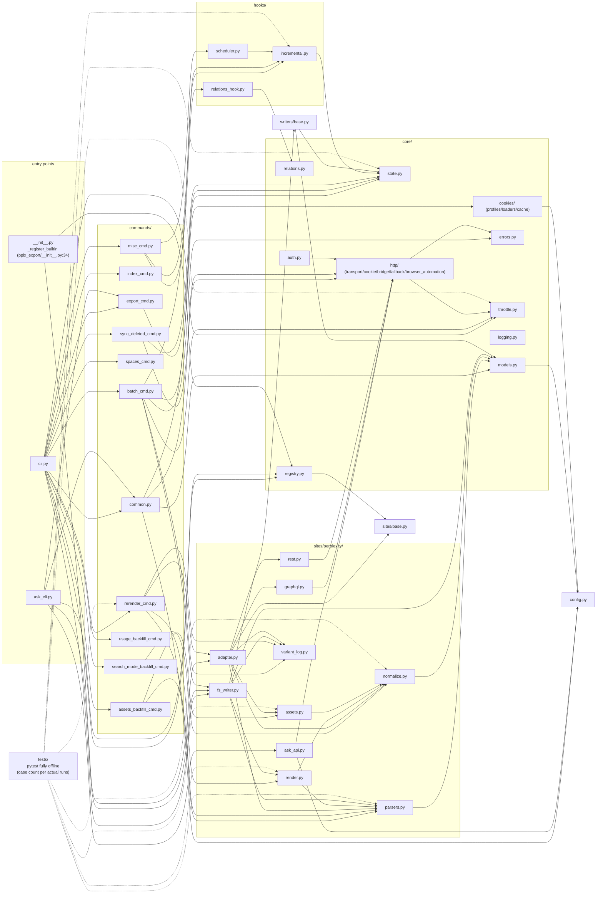

# Visão geral da arquitetura

---

## Visão geral da arquitetura em camadas

Estrutura de pacotes (`pplx_export/`, ~5,6k linhas de código-fonte e crescendo com o desenvolvimento, excluindo testes;
contagens exatas de linhas por `wc -l`):

```mermaid
flowchart TD
    subgraph CLI["CLI layer (entry points)"]
        CL1["cli.py — pplx-export<br/>argparse definitions + dispatch (cli.py:57)"]
        CL2["ask_cli.py — pplx-ask<br/>interactive query entry (ask_cli.py:221)"]
    end

    subgraph CMD["commands/ command layer (shared by both entries)"]
        C0["common.py<br/>account mapping / make_transport assembly<br/>cookie validation and auto-switching (common.py:93)"]
        C1["index_cmd / export_cmd / batch_cmd"]
        C2["spaces_cmd / misc_cmd / rerender_cmd"]
        C3["assets_backfill_cmd / usage_backfill_cmd<br/>search_mode_backfill_cmd / sync_deleted_cmd"]
    end

    subgraph SITES["sites/ site layer"]
        SB["base.py — SiteAdapter ABC<br/>(pplx_export/sites/base.py:21)"]
        subgraph PPLX["sites/perplexity/"]
            AD["adapter.py<br/>PerplexityAdapter assembly (adapter.py:24)"]
            GQ["graphql.py<br/>APQ list pagination (graphql.py:43)"]
            RS["rest.py<br/>ThreadFetcher thread fetching (rest.py:38)"]
            PA["parsers.py<br/>single point of schema parsing (parsers.py)"]
            NM["normalize.py<br/>mode detection / math normalization (normalize.py:66,240)"]
            RD["render.py<br/>markdown rendering (render.py)"]
            AS["assets.py<br/>asset download and extension resolution (assets.py:27)"]
            AK["ask_api.py<br/>envelope / SSE / telemetry (ask_api.py)"]
            FW["fs_writer.py<br/>web_archive persistence (fs_writer.py:54)"]
            VL["variant_log.py<br/>ANSWER_VARIANT_DETECTED detection log<br/>+ jsonl registry (variant_log.py:45)"]
        end
    end

    subgraph CORE["core/ foundation layer (site-agnostic)"]
        MO["models.py domain models (models.py)"]
        ER["errors.py error types (errors.py)"]
        TH["throttle.py rate-limit backoff (throttle.py:15)"]
        ST["state.py BatchState checkpoint (state.py:63)"]
        LG["logging.py central logging (logging.py:45)"]
        CK["cookies/ + auth.py<br/>cookie sources and credentials (cookies/loaders.py:270)"]
        RL["relations.py relations graph (relations.py:200)"]
        RG["registry.py site registry (registry.py:9)"]
        subgraph HTTP["core/http/ transports"]
            TP["transport.py Transport ABC (transport.py:12)"]
            CT["cookie_transport.py<br/>urllib direct (cookie_transport.py:44)"]
            BT["bridge_transport.py<br/>WebBridge page context (bridge_transport.py:22)"]
            FB["fallback.py fallback chain [reserved · not wired]"]
            BA["browser_automation_transport.py<br/>heavyweight browser [reserved · not implemented]"]
        end
    end

    subgraph HOOKS["hooks/ extension points"]
        H1["incremental.py<br/>plan_incremental pure function (incremental.py:36)"]
        H2["relations_hook.py relations rebuild (relations_hook.py:17)"]
        H3["scheduler.py periodic schedule + cron (scheduler.py:22)"]
    end

    subgraph WRT["writers/ output abstraction"]
        WB["base.py Writer ABC (writers/base.py:17)"]
    end

    CFG["config.py — single source of site constants<br/>+ user-level config loading (account table / BOT space externalized to config.toml)"]

    CL1 --> C0
    CL2 --> C0
    C0 --> C1
    C0 --> C2
    C0 --> C3
    C1 --> AD
    C2 --> AD
    C3 --> AD
    AD --> GQ
    AD --> RS
    AD --> PA
    AD --> AS
    PA --> MO
    RD --> PA
    FW --> RD
    FW --> VL
    AD --> VL
    FW --> WB
    SB --> MO
    AD --> SB
    GQ --> TP
    RS --> TP
    AS --> TP
    AK --> CT
    CT --> TH
    CT --> ER
    C0 --> CK
    C1 --> ST
    H1 --> ST
    H2 --> RL
    RG -. "core's only import of sites:<br/>just the ABC of sites/base (registry.py:7)" .-> SB
    CFG -. "imported by all layers, zero dependencies itself" .- MO
```

Essenciais da direção de dependências (verificados examinando todas as importações):

- **Unidirecional**: CLI → comandos → sites → core. `core/` não importa nenhuma implementação concreta de Perplexity
  (sem hardcoding de site); **a única exceção** é `core/registry.py:7` importando a
  ABC `SiteAdapter` de `sites/base.py` — uma referência de interface, não uma referência de site; sites concretos são injetados via `register()`
  (registro interno do Perplexity em `pplx_export/__init__.py:34-43`).
- `config.py` é a única fonte de constantes de site (domínio, `DEFAULT_ARCHIVE_ROOT`), e carrega
  **configuração externalizada em nível de usuário**: as tabelas de conta `ACCOUNT_DISPLAY_NAMES/ACCOUNT_EMAIL/ACCOUNT_UID` e o
  espaço BOT vêm de TOML (`--config` > `PPLX_EXPORT_CONFIG` >
  `~/.config/pplx-export/config.toml`; modelo `config.example.toml`), dicionários atualizados in-place,
  degradação graciosa quando ausentes; `core/models.py:18` também o importa (`author_folder`).
- `ask_api.py` é o único módulo da camada de site que depende diretamente de uma implementação de transporte concreta
  (importa `CookieTransport` e reutiliza seus internos `_cookie_header`/`_opener` para o stream SSE,
  ask_api.py:23, 114-130) — SSE está fora da abstração do Transport ABC.
- `hooks/`, `writers/` dependem apenas de `core/`; a única implementação de `writers/base.py`,
  `FilesystemWriter`, vive na camada de site (fs_writer.py:54) — ABC e implementação separadas.

---

## Grafo de dependência de módulos (relações reais de importação)

Extraído de um censo completo de `grep '^from \.'` (referências intra-pacote omitidas; todos os `__init__.py` estão vazios,
 exceto a raiz do pacote `pplx_export/__init__.py`, que carrega a função de registro):

Como ler o grafo:

- **Cadeia core**: `cli → commands → sites → core`. Nenhum módulo core depende de implementações concretas
  de comandos/sites; `KG → SBASE` (registry → SiteAdapter ABC) é a única
  referência reversa entre camadas, formando um loop de injeção de dependência com o registro de `E0`.
- Agregação dentro de `sites/perplexity/`: `adapter` é a fachada (compondo graphql/rest/parsers/
  normalize/assets); `render` depende de `parsers` (fonte da verdade para classificação de status wf); `fs_writer`
  depende de `render + parsers + writers/base`.
- Testes `tests/` vivem fora do pacote e importam diretamente funções puras de cada camada (o `render_fixture` do conftest.py
  reutiliza `commands.rerender_cmd.rerender` para re-renderização offline).

---

## Resumo dos princípios de design

1. **Respostas brutas retidas; artefatos renderizados regeneráveis offline**:
   `adapter.get_thread` analisa e monta a conversa em memória antes
   do writer executar (adapter.py:58-157). Uma escrita bem-sucedida armazena `thread.json`
   primeiro e depois as respostas simples/esquematizadas disponíveis como `raw_*.json`
   (fs_writer.py:224-266); análise/renderização/registro de interrupção podem posteriormente
   ser reexecutados a partir do bruto com zero rede ([§12](offline-operations.md)), desacoplando
   a evolução do renderizador de arquivos históricos.
2. **Ponto único de análise, tolerante a mudanças na estrutura de dados**: a extração de campos está
   concentrada em `parsers.py` (o trio de tolerância a falhas `_g`/`_loads`/`to_int`); a detecção
   de modo tem sinais redundantes duais mais um fallback de busca quando todos os sinais estão ausentes ([§4](export-pipeline.md)) —
   o raio de explosão de uma reformulação da plataforma é comprimido em um módulo.
3. **Cascata de atribuição determinística**: "cada payload de fundo cai em exatamente um
   lugar, nunca renderizado duas vezes" é garantido por estruturas de dados (o conjunto ancorado, consumo único de used_cand,
   iteração apenas no nível superior contra contagem dupla) — sem adivinhação heurística de tempo;
   a semântica de interrupção tem cinco classes com uma fonte da verdade
   (classify_wf_status) compartilhada pelos caminhos de renderização/registro/alerta ([§5, §6](subagents-interruptions.md)).
4. **Disciplina de limite de taxa é uma linha vermelha de segurança**: intervalos aleatórios, sem concorrência, backoff 3^N
   com um limite, fail-fast em falha de autenticação, estado terminal ENTRY_EXPIRED, 404 nunca
   mal interpretado como expirado ([§11](rate-limiting-errors.md)) — todos servindo ao objetivo anti-ban de "comportamento de exportação ≈ navegação humana"
   (um requisito explícito do usuário).
5. **Fonte única de configuração + privacidade externalizada**: constantes de site/caminhos padrão
   vivem apenas em `config.py`; contas/espaços são privacidade pessoal, externalizados em TOML
   de nível de usuário (`--config` > `PPLX_EXPORT_CONFIG` > `~/.config/pplx-export/config.toml`); a troca automática de
   cookies de múltiplas contas é um loop de sondagem orientado por e-mails registrados, sem operação manual
   de navegador ([§9](ask-and-accounts.md)).
6. **Dependências unidirecionais em camadas**: CLI → comandos → sites → core, com zero hardcoding de site
   em core e sites injetados via registry — um novo site implementa os cinco métodos `SiteAdapter`
   e reutiliza todas as facilidades do core (sites/base.py:21-69).
