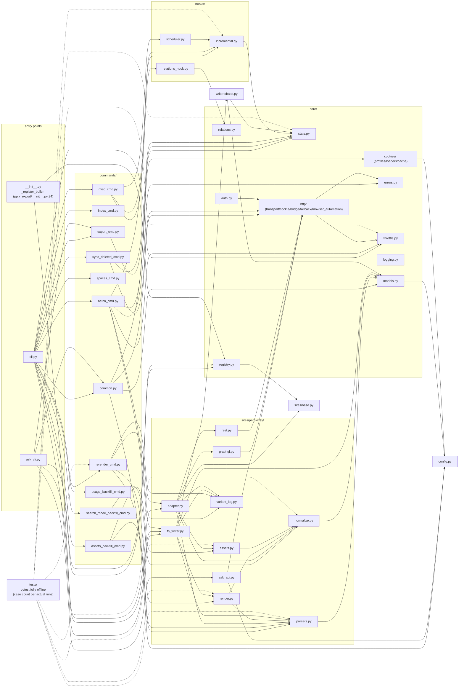

# Обзор архитектуры

---

## Обзор многоуровневой архитектуры

Структура пакета (`pplx_export/`, ~5.6 тыс. строк исходного кода и растёт с развитием, без учёта тестов;
точное количество строк по `wc -l`):

```mermaid
flowchart TD
    subgraph CLI["CLI layer (entry points)"]
        CL1["cli.py — pplx-export<br/>argparse definitions + dispatch (cli.py:57)"]
        CL2["ask_cli.py — pplx-ask<br/>interactive query entry (ask_cli.py:221)"]
    end

    subgraph CMD["commands/ command layer (shared by both entries)"]
        C0["common.py<br/>account mapping / make_transport assembly<br/>cookie validation and auto-switching (common.py:93)"]
        C1["index_cmd / export_cmd / batch_cmd"]
        C2["spaces_cmd / misc_cmd / rerender_cmd"]
        C3["assets_backfill_cmd / usage_backfill_cmd<br/>search_mode_backfill_cmd / sync_deleted_cmd"]
    end

    subgraph SITES["sites/ site layer"]
        SB["base.py — SiteAdapter ABC<br/>(pplx_export/sites/base.py:21)"]
        subgraph PPLX["sites/perplexity/"]
            AD["adapter.py<br/>PerplexityAdapter assembly (adapter.py:24)"]
            GQ["graphql.py<br/>APQ list pagination (graphql.py:43)"]
            RS["rest.py<br/>ThreadFetcher thread fetching (rest.py:38)"]
            PA["parsers.py<br/>single point of schema parsing (parsers.py)"]
            NM["normalize.py<br/>mode detection / math normalization (normalize.py:66,240)"]
            RD["render.py<br/>markdown rendering (render.py)"]
            AS["assets.py<br/>asset download and extension resolution (assets.py:27)"]
            AK["ask_api.py<br/>envelope / SSE / telemetry (ask_api.py)"]
            FW["fs_writer.py<br/>web_archive persistence (fs_writer.py:54)"]
            VL["variant_log.py<br/>ANSWER_VARIANT_DETECTED detection log<br/>+ jsonl registry (variant_log.py:45)"]
        end
    end

    subgraph CORE["core/ foundation layer (site-agnostic)"]
        MO["models.py domain models (models.py)"]
        ER["errors.py error types (errors.py)"]
        TH["throttle.py rate-limit backoff (throttle.py:15)"]
        ST["state.py BatchState checkpoint (state.py:63)"]
        LG["logging.py central logging (logging.py:45)"]
        CK["cookies/ + auth.py<br/>cookie sources and credentials (cookies/loaders.py:203)"]
        RL["relations.py relations graph (relations.py:200)"]
        RG["registry.py site registry (registry.py:9)"]
        subgraph HTTP["core/http/ transports"]
            TP["transport.py Transport ABC (transport.py:12)"]
            CT["cookie_transport.py<br/>urllib direct (cookie_transport.py:44)"]
            BT["bridge_transport.py<br/>WebBridge page context (bridge_transport.py:22)"]
            FB["fallback.py fallback chain [reserved · not wired]"]
            BA["browser_automation_transport.py<br/>heavyweight browser [reserved · not implemented]"]
        end
    end

    subgraph HOOKS["hooks/ extension points"]
        H1["incremental.py<br/>plan_incremental pure function (incremental.py:36)"]
        H2["relations_hook.py relations rebuild (relations_hook.py:17)"]
        H3["scheduler.py periodic schedule + cron (scheduler.py:22)"]
    end

    subgraph WRT["writers/ output abstraction"]
        WB["base.py Writer ABC (writers/base.py:17)"]
    end

    CFG["config.py — single source of site constants<br/>+ user-level config loading (account table / BOT space externalized to config.toml)"]

    CL1 --> C0
    CL2 --> C0
    C0 --> C1
    C0 --> C2
    C0 --> C3
    C1 --> AD
    C2 --> AD
    C3 --> AD
    AD --> GQ
    AD --> RS
    AD --> PA
    AD --> AS
    PA --> MO
    RD --> PA
    FW --> RD
    FW --> VL
    AD --> VL
    FW --> WB
    SB --> MO
    AD --> SB
    GQ --> TP
    RS --> TP
    AS --> TP
    AK --> CT
    CT --> TH
    CT --> ER
    C0 --> CK
    C1 --> ST
    H1 --> ST
    H2 --> RL
    RG -. "core's only import of sites:<br/>just the ABC of sites/base (registry.py:7)" .-> SB
    CFG -. "imported by all layers, zero dependencies itself" .- MO
```

Основные направления зависимостей (проверено поиском всех импортов):

- **Однонаправленно**: CLI → commands → sites → core. `core/` не импортирует ни одной конкретной реализации Perplexity
  (нет жёсткой привязки к сайту); **единственное исключение** — `core/registry.py:7` импортирует
  ABC `SiteAdapter` из `sites/base.py` — ссылка на интерфейс, а не на сайт; конкретные сайты внедряются через `register()`
  (встроенная регистрация Perplexity в `pplx_export/__init__.py:34-43`).
- `config.py` является единственным источником констант сайта (домен, `DEFAULT_ARCHIVE_ROOT`) и загружает
  **внешнюю конфигурацию на уровне пользователя**: таблицы учётных записей `ACCOUNT_DISPLAY_NAMES/ACCOUNT_EMAIL/ACCOUNT_UID` и
  пространство BOT берутся из TOML (`--config` > `PPLX_EXPORT_CONFIG` >
  `~/.config/pplx-export/config.toml`; шаблон `config.example.toml`), словари обновляются на месте,
  корректная деградация при отсутствии; `core/models.py:18` также импортирует его (`author_folder`).
- `ask_api.py` — единственный модуль уровня сайта, который напрямую зависит от конкретной реализации транспорта
  (импортирует `CookieTransport` и повторно использует его внутренности `_cookie_header`/`_opener` для потока SSE,
  ask_api.py:23, 114-130) — SSE находится за пределами абстракции Transport ABC.
- `hooks/`, `writers/` зависят только от `core/`; единственная реализация `writers/base.py`,
  `FilesystemWriter`, находится на уровне сайта (fs_writer.py:54) — ABC и реализация разделены.

---

## Граф зависимостей модулей (реальные отношения импорта)

Составлено на основе полного подсчёта `grep '^from \.'` (ссылки внутри пакета опущены; все `__init__.py` пусты,
за исключением корня пакета `pplx_export/__init__.py`, который выполняет обязанности по регистрации):

Как читать граф:

- **Цепочка ядра**: `cli → commands → sites → core`. Ни один модуль ядра не зависит от конкретных
  реализаций команд/сайтов; `KG → SBASE` (реестр → SiteAdapter ABC) является единственной
  обратной ссылкой между уровнями, образуя цикл внедрения зависимостей с регистрацией в `E0`.
- Агрегация внутри `sites/perplexity/`: `adapter` является фасадом (объединяет graphql/rest/parsers/
  normalize/assets); `render` зависит от `parsers` (источник истины для классификации статуса wf); `fs_writer`
  зависит от `render + parsers + writers/base`.
- Тесты `tests/` находятся вне пакета и напрямую импортируют чистые функции из каждого уровня (conftest.py's
  `render_fixture` повторно использует `commands.rerender_cmd.rerender` для офлайн-перерендеринга).

---

## Сводка принципов проектирования

1. **Сырые ответы сохраняются; артефакты рендеринга регенерируемы офлайн**:
   `adapter.get_thread` разбирает и собирает беседу в памяти до того, как
   запускается писатель (adapter.py:58-157). Успешная запись сначала сохраняет `thread.json`,
   а затем доступные простые/схематизированные ответы как `raw_*.json`
   (fs_writer.py:224-266); разбор/рендеринг/регистрация прерываний могут быть
   повторно запущены из сырых данных без сети ([§12](offline-operations.md)), что
   отделяет эволюцию рендерера от исторических архивов.
2. **Единая точка разбора, устойчивая к изменениям структуры данных**: извлечение полей
   сосредоточено в `parsers.py` (трио отказоустойчивости `_g`/`_loads`/`to_int`); обнаружение
   режима имеет двойные избыточные сигналы плюс запасной вариант при отсутствии всех сигналов ([§4](export-pipeline.md)) —
   радиус поражения при переработке платформы сжимается до одного модуля.
3. **Детерминированный водопад атрибуции**: «каждая фоновая полезная нагрузка попадает ровно в одно
   место, никогда не рендерится дважды» гарантируется структурами данных (набор закреплённых, однократное потребление used_cand,
   итерация только по верхнему уровню для предотвращения двойного подсчёта) — никакого эвристического угадывания
   времени; семантика прерываний имеет пять классов с одним источником истины
   (classify_wf_status), общим для путей рендеринга/регистрации/оповещения ([§5, §6](subagents-interruptions.md)).
4. **Дисциплина ограничения скорости — красная линия безопасности**: случайные интервалы, без параллелизма, экспоненциальная задержка 3^N
   с ограничением, быстрый отказ при ошибке аутентификации, терминальное состояние ENTRY_EXPIRED, 404 никогда
   не ошибочно считается истекшим ([§11](rate-limiting-errors.md)) — всё служит цели анти-бана «поведение экспорта ≈ просмотр человеком»
   (явное требование пользователя).
5. **Единый источник конфигурации + конфиденциальность вынесена наружу**: константы сайта/пути по умолчанию
   находятся только в `config.py`; учётные записи/пространства — личная конфиденциальность, вынесены в TOML на уровне пользователя
   (`--config` > `PPLX_EXPORT_CONFIG` > `~/.config/pplx-export/config.toml`); автоматическое переключение
   cookie для нескольких учётных записей — это цикл проверки, управляемый зарегистрированными email, без ручных операций
   в браузере ([§9](ask-and-accounts.md)).
6. **Многоуровневые однонаправленные зависимости**: CLI → commands → sites → core, без жёсткой привязки к сайту
   в ядре, сайты внедряются через реестр — новый сайт реализует пять методов `SiteAdapter`
   и использует все возможности ядра (sites/base.py:21-69).
