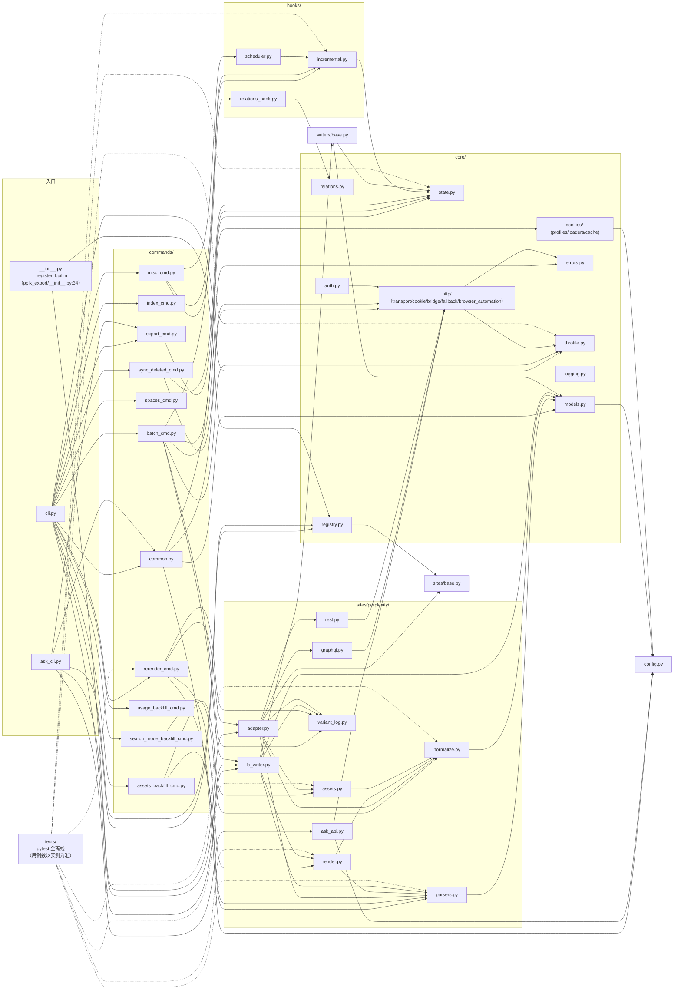

# 架构总览

---

## 分层架构总览

包结构（`pplx_export/`，源码规模约 5.6k 行且随开发增长，不含测试；
精确行数以 `wc -l` 实测为准）：

```mermaid
flowchart TD
    subgraph CLI["CLI 层（入口）"]
        CL1["cli.py — pplx-export<br/>argparse 定义 + 分发（cli.py:57）"]
        CL2["ask_cli.py — pplx-ask<br/>交互查询入口（ask_cli.py:221）"]
    end

    subgraph CMD["commands/ 命令层（双入口共用）"]
        C0["common.py<br/>账户映射 / make_transport 装配<br/>cookie 校验与自动切换（common.py:93）"]
        C1["index_cmd / export_cmd / batch_cmd"]
        C2["spaces_cmd / misc_cmd / rerender_cmd"]
        C3["assets_backfill_cmd / usage_backfill_cmd<br/>search_mode_backfill_cmd / sync_deleted_cmd"]
    end

    subgraph SITES["sites/ 站点层"]
        SB["base.py — SiteAdapter ABC<br/>（pplx_export/sites/base.py:21）"]
        subgraph PPLX["sites/perplexity/"]
            AD["adapter.py<br/>PerplexityAdapter 组装（adapter.py:24）"]
            GQ["graphql.py<br/>APQ 列表分页（graphql.py:43）"]
            RS["rest.py<br/>ThreadFetcher 线程抓取（rest.py:38）"]
            PA["parsers.py<br/>schema 解析单点（parsers.py）"]
            NM["normalize.py<br/>模式判别 / 公式规范化（normalize.py:66,240）"]
            RD["render.py<br/>markdown 渲染（render.py）"]
            AS["assets.py<br/>资产下载与扩展名判定（assets.py:27）"]
            AK["ask_api.py<br/>envelope / SSE / 遥测（ask_api.py）"]
            FW["fs_writer.py<br/>web_archive 落盘（fs_writer.py:54）"]
            VL["variant_log.py<br/>ANSWER_VARIANT_DETECTED 检测日志<br/>+ jsonl 登记（variant_log.py:45）"]
        end
    end

    subgraph CORE["core/ 基础层（站点无关）"]
        MO["models.py 领域模型（models.py）"]
        ER["errors.py 错误类型（errors.py）"]
        TH["throttle.py 限频退避（throttle.py:15）"]
        ST["state.py BatchState 断点（state.py:63）"]
        LG["logging.py 中央日志（logging.py:45）"]
        CK["cookies/ + auth.py<br/>cookie 来源与凭证（cookies/loaders.py:203）"]
        RL["relations.py 关系图（relations.py:200）"]
        RG["registry.py 站点注册表（registry.py:9）"]
        subgraph HTTP["core/http/ transports"]
            TP["transport.py Transport ABC（transport.py:12）"]
            CT["cookie_transport.py<br/>urllib 直连（cookie_transport.py:44）"]
            BT["bridge_transport.py<br/>WebBridge 页面上下文（bridge_transport.py:22）"]
            FB["fallback.py 降级链【预留·未接线】"]
            BA["browser_automation_transport.py<br/>重量级浏览器【预留·未实现】"]
        end
    end

    subgraph HOOKS["hooks/ 扩展点"]
        H1["incremental.py<br/>plan_incremental 纯函数（incremental.py:36）"]
        H2["relations_hook.py 关系重建（relations_hook.py:17）"]
        H3["scheduler.py 周期计划 + cron（scheduler.py:22）"]
    end

    subgraph WRT["writers/ 输出抽象"]
        WB["base.py Writer ABC（writers/base.py:17）"]
    end

    CFG["config.py — 站点常量单一来源<br/>+ 用户级配置加载（账户表/BOT 空间外置 config.toml）"]

    CL1 --> C0
    CL2 --> C0
    C0 --> C1
    C0 --> C2
    C0 --> C3
    C1 --> AD
    C2 --> AD
    C3 --> AD
    AD --> GQ
    AD --> RS
    AD --> PA
    AD --> AS
    PA --> MO
    RD --> PA
    FW --> RD
    FW --> VL
    AD --> VL
    FW --> WB
    SB --> MO
    AD --> SB
    GQ --> TP
    RS --> TP
    AS --> TP
    AK --> CT
    CT --> TH
    CT --> ER
    C0 --> CK
    C1 --> ST
    H1 --> ST
    H2 --> RL
    RG -. "core 唯一 import sites 之处：<br/>仅 sites/base 的 ABC（registry.py:7）" .-> SB
    CFG -. "被各层 import，自身零依赖" .- MO
```

依赖方向要点（grep 全量 import 核实）：

- **单向**：CLI → commands → sites → core。`core/` 不 import 任何 Perplexity 具体实现
  （无站点硬编码）；**唯一例外**是 `core/registry.py:7` import `sites/base.py` 的
  `SiteAdapter` ABC——接口引用而非站点引用，具体站点经 `register()` 注入
  （`pplx_export/__init__.py:34-43` 内建注册 perplexity）。
- `config.py` 是站点常量（域名、`DEFAULT_ARCHIVE_ROOT`）的唯一来源，并负责加载
  **用户级外置配置**：账户表 `ACCOUNT_DISPLAY_NAMES/ACCOUNT_EMAIL/ACCOUNT_UID` 与
  BOT 空间来自 TOML（`--config` > `PPLX_EXPORT_CONFIG` >
  `~/.config/pplx-export/config.toml`，模板 `config.example.toml`），dict 就地更新、
  缺失降级；`core/models.py:18` 也 import 它（`author_folder`）。
- `ask_api.py` 是站点层中唯一直接依赖具体 transport 实现的模块
  （import `CookieTransport` 并复用其 `_cookie_header`/`_opener` 内部字段做 SSE 流，
  ask_api.py:23、114-130）——SSE 不在 Transport ABC 的抽象范围内。
- `hooks/`、`writers/` 只依赖 `core/`；`writers/base.py` 的唯一实现
  `FilesystemWriter` 在站点层（fs_writer.py:54），ABC 与实现分离。

---

## 模块依赖图（真实 import 关系）

按 `grep '^from \.'` 全量统计绘制（同包内引用省略；`__init__.py` 均为空，
仅包根 `pplx_export/__init__.py` 承担注册职责）：

读图要点：

- **核心链路**：`cli → commands → sites → core`。任何 core 模块都不依赖
  commands/sites 的具体实现，`KG → SBASE`（registry → SiteAdapter ABC）是唯一的
  跨层反向引用，配合 `E0` 的注册动作形成依赖注入闭环。
- `sites/perplexity/` 内部聚合关系：`adapter` 是门面（组合 graphql/rest/parsers/
  normalize/assets），`render` 依赖 `parsers`（wf 状态分类真源），`fs_writer`
  依赖 `render + parsers + writers/base`。
- 测试 `tests/` 位于包外，直接 import 各层纯函数（conftest.py 的
  `render_fixture` 复用 `commands.rerender_cmd.rerender` 做离线重渲）。

---

## 设计原则总结

1. **保留原始响应，渲染产物可离线再生**：`adapter.get_thread` 会先在内存中解析并
   组装对话（adapter.py:58-157），随后 writer 才运行。成功写入时先保存
   `thread.json`，再把实际取得的 plain/schematized 响应保存为 `raw_*.json`
   （fs_writer.py:224-266）；解析/渲染/中断登记之后均可从 raw 零网络重跑
   （[§12](offline-operations.md)），渲染器演进与历史归档解耦。
2. **解析单点适配，抗数据结构变更**：字段提取集中在 `parsers.py`（`_g`/`_loads`/
   `to_int` 容错三件套），模式判别双信号互备 + 信号全灭兜底多抓（[§4](export-pipeline.md)），
   平台改版的影响面被压缩到一个模块。
3. **归属瀑布确定性**：后台负载「每条只落一处、绝不双渲染」由数据结构保证
   （anchored 集合、used_cand 单次消费、顶层迭代防双计入），不做启发式时间猜测；
   中断语义五类一真源（classify_wf_status），渲染/登记/告警三路共用（[§5、§6](subagents-interruptions.md)）。
4. **限频纪律是安全红线**：随机间隔、无并发、3^N 退避封顶、鉴权失败 fail-fast、
   ENTRY_EXPIRED 终态、404 绝不误判过期（[§11](rate-limiting-errors.md)）——全部服务于「导出行为 ≈ 人类
   浏览」的防封号目标（用户明确要求）。
5. **配置单一来源 + 隐私外置**：站点常量/默认路径只在 `config.py`；账户/空间属
   个人隐私，外置为用户级 TOML（`--config` > `PPLX_EXPORT_CONFIG` >
   `~/.config/pplx-export/config.toml`）；多账户 cookie 自动切换
   是登记 email 驱动的探测闭环，无需人工操作浏览器（[§9](ask-and-accounts.md)）。
6. **分层单向依赖**：CLI → commands → sites → core，core 零站点硬编码，
   站点经注册表注入——新站点实现 `SiteAdapter` 五个方法即可复用全部核心设施
   （sites/base.py:21-69）。
