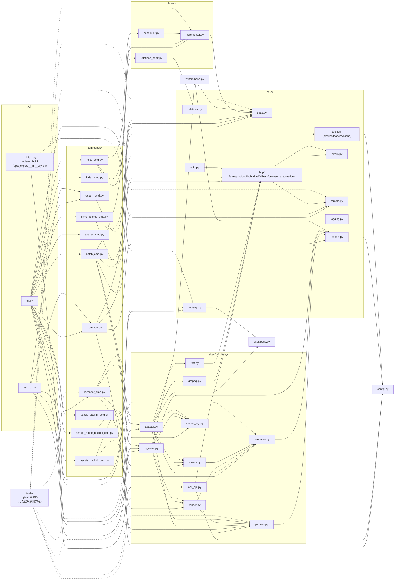

# 架構總覽

---

## 分層架構總覽

套件結構（`pplx_export/`，原始碼規模約 5.6k 行且隨開發增長，不含測試；
精確行數以 `wc -l` 實測為準）：

```mermaid
flowchart TD
    subgraph CLI["CLI 层（入口）"]
        CL1["cli.py — pplx-export<br/>argparse 定义 + 分发（cli.py:57）"]
        CL2["ask_cli.py — pplx-ask<br/>交互查询入口（ask_cli.py:221）"]
    end

    subgraph CMD["commands/ 命令层（双入口共用）"]
        C0["common.py<br/>账户映射 / make_transport 装配<br/>cookie 校验与自动切换（common.py:93）"]
        C1["index_cmd / export_cmd / batch_cmd"]
        C2["spaces_cmd / misc_cmd / rerender_cmd"]
        C3["assets_backfill_cmd / usage_backfill_cmd<br/>search_mode_backfill_cmd / sync_deleted_cmd"]
    end

    subgraph SITES["sites/ 站点层"]
        SB["base.py — SiteAdapter ABC<br/>（pplx_export/sites/base.py:21）"]
        subgraph PPLX["sites/perplexity/"]
            AD["adapter.py<br/>PerplexityAdapter 组装（adapter.py:24）"]
            GQ["graphql.py<br/>APQ 列表分页（graphql.py:43）"]
            RS["rest.py<br/>ThreadFetcher 线程抓取（rest.py:38）"]
            PA["parsers.py<br/>schema 解析单点（parsers.py）"]
            NM["normalize.py<br/>模式判别 / 公式规范化（normalize.py:66,240）"]
            RD["render.py<br/>markdown 渲染（render.py）"]
            AS["assets.py<br/>资产下载与扩展名判定（assets.py:27）"]
            AK["ask_api.py<br/>envelope / SSE / 遥测（ask_api.py）"]
            FW["fs_writer.py<br/>web_archive 落盘（fs_writer.py:54）"]
            VL["variant_log.py<br/>ANSWER_VARIANT_DETECTED 检测日志<br/>+ jsonl 登记（variant_log.py:45）"]
        end
    end

    subgraph CORE["core/ 基础层（站点无关）"]
        MO["models.py 领域模型（models.py）"]
        ER["errors.py 错误类型（errors.py）"]
        TH["throttle.py 限频退避（throttle.py:15）"]
        ST["state.py BatchState 断点（state.py:63）"]
        LG["logging.py 中央日志（logging.py:45）"]
        CK["cookies/ + auth.py<br/>cookie 来源与凭证（cookies/loaders.py:270）"]
        RL["relations.py 关系图（relations.py:200）"]
        RG["registry.py 站点注册表（registry.py:9）"]
        subgraph HTTP["core/http/ transports"]
            TP["transport.py Transport ABC（transport.py:12）"]
            CT["cookie_transport.py<br/>urllib 直连（cookie_transport.py:44）"]
            BT["bridge_transport.py<br/>WebBridge 页面上下文（bridge_transport.py:22）"]
            FB["fallback.py 降级链【预留·未接线】"]
            BA["browser_automation_transport.py<br/>重量级浏览器【预留·未实现】"]
        end
    end

    subgraph HOOKS["hooks/ 扩展点"]
        H1["incremental.py<br/>plan_incremental 纯函数（incremental.py:36）"]
        H2["relations_hook.py 关系重建（relations_hook.py:17）"]
        H3["scheduler.py 周期计划 + cron（scheduler.py:22）"]
    end

    subgraph WRT["writers/ 输出抽象"]
        WB["base.py Writer ABC（writers/base.py:17）"]
    end

    CFG["config.py — 站点常量单一来源<br/>+ 用户级配置加载（账户表/BOT 空间外置 config.toml）"]

    CL1 --> C0
    CL2 --> C0
    C0 --> C1
    C0 --> C2
    C0 --> C3
    C1 --> AD
    C2 --> AD
    C3 --> AD
    AD --> GQ
    AD --> RS
    AD --> PA
    AD --> AS
    PA --> MO
    RD --> PA
    FW --> RD
    FW --> VL
    AD --> VL
    FW --> WB
    SB --> MO
    AD --> SB
    GQ --> TP
    RS --> TP
    AS --> TP
    AK --> CT
    CT --> TH
    CT --> ER
    C0 --> CK
    C1 --> ST
    H1 --> ST
    H2 --> RL
    RG -. "core 唯一 import sites 之处：<br/>仅 sites/base 的 ABC（registry.py:7）" .-> SB
    CFG -. "被各层 import，自身零依赖" .- MO
```

依賴方向要點（grep 全量 import 核實）：

- **單向**：CLI → commands → sites → core。`core/` 不 import 任何 Perplexity 具體實現
  （無站點硬編碼）；**唯一例外**是 `core/registry.py:7` import `sites/base.py` 的
  `SiteAdapter` ABC——介面引用而非站點引用，具體站點經 `register()` 注入
  （`pplx_export/__init__.py:34-43` 內建註冊 perplexity）。
- `config.py` 是站點常數（域名、`DEFAULT_ARCHIVE_ROOT`）的唯一來源，並負責載入
  **使用者級外置配置**：帳戶表 `ACCOUNT_DISPLAY_NAMES/ACCOUNT_EMAIL/ACCOUNT_UID` 與
  BOT 空間來自 TOML（`--config` > `PPLX_EXPORT_CONFIG` >
  `~/.config/pplx-export/config.toml`，模板 `config.example.toml`），dict 就地更新、
  缺失降級；`core/models.py:18` 也 import 它（`author_folder`）。
- `ask_api.py` 是站點層中唯一直接依賴具體 transport 實作的模組
  （import `CookieTransport` 並復用其 `_cookie_header`/`_opener` 內部欄位做 SSE 串流，
  ask_api.py:23、114-130）——SSE 不在 Transport ABC 的抽象範圍內。
- `hooks/`、`writers/` 只依賴 `core/`；`writers/base.py` 的唯一實作
  `FilesystemWriter` 在站點層（fs_writer.py:54），ABC 與實作分離。

---

## 模組依賴圖（真實 import 關係）

按 `grep '^from \.'` 全量統計繪製（同套件內引用省略；`__init__.py` 均為空，
僅套件根 `pplx_export/__init__.py` 承擔註冊職責）：

讀圖要點：

- **核心鏈路**：`cli → commands → sites → core`。任何 core 模組都不依賴
  commands/sites 的具體實作，`KG → SBASE`（registry → SiteAdapter ABC）是唯一的
  跨層反向引用，配合 `E0` 的註冊動作形成依賴注入閉環。
- `sites/perplexity/` 內部聚合關係：`adapter` 是門面（組合 graphql/rest/parsers/
  normalize/assets），`render` 依賴 `parsers`（wf 狀態分類真源），`fs_writer`
  依賴 `render + parsers + writers/base`。
- 測試 `tests/` 位於套件外，直接 import 各層純函數（conftest.py 的
  `render_fixture` 復用 `commands.rerender_cmd.rerender` 做離線重渲）。

---

## 設計原則總結

1. **保留原始回應，渲染產物可離線再生**：`adapter.get_thread` 會先在記憶體中解析並
   組裝對話（adapter.py:58-157），隨後 writer 才執行。成功寫入時先儲存
   `thread.json`，再把實際取得的 plain/schematized 回應儲存為 `raw_*.json`
   （fs_writer.py:224-266）；解析/渲染/中斷登記之後均可從 raw 零網路重跑
   （[§12](offline-operations.md)），渲染器演進與歷史歸檔解耦。
2. **解析單點適配，抗資料結構變更**：欄位提取集中在 `parsers.py`（`_g`/`_loads`/
   `to_int` 容錯三件套），模式判別雙訊號互備 + 訊號全滅兜底多抓（[§4](export-pipeline.md)），
   平台改版的影響面被壓縮到一個模組。
3. **歸屬瀑布確定性**：後台負載「每條只落一處、絕不雙渲染」由資料結構保證
   （anchored 集合、used_cand 單次消費、頂層迭代防雙計入），不做啟發式時間猜測；
   中斷語義五類一真源（classify_wf_status），渲染/登記/告警三路共用（[§5、§6](subagents-interruptions.md)）。
4. **限頻紀律是安全紅線**：隨機間隔、無並發、3^N 退避封頂、鑑權失敗 fail-fast、
   ENTRY_EXPIRED 終態、404 絕不誤判過期（[§11](rate-limiting-errors.md)）——全部服務於「匯出行為 ≈ 人類
   瀏覽」的防封號目標（使用者明確要求）。
5. **配置單一來源 + 隱私外置**：站點常數/預設路徑只在 `config.py`；帳戶/空間屬
   個人隱私，外置為使用者級 TOML（`--config` > `PPLX_EXPORT_CONFIG` >
   `~/.config/pplx-export/config.toml`）；多帳戶 cookie 自動切換
   是登記 email 驅動的探測閉環，無需人工操作瀏覽器（[§9](ask-and-accounts.md)）。
6. **分層單向依賴**：CLI → commands → sites → core，core 零站點硬編碼，
   站點經註冊表注入——新站點實作 `SiteAdapter` 五個方法即可復用全部核心設施
   （sites/base.py:21-69）。
