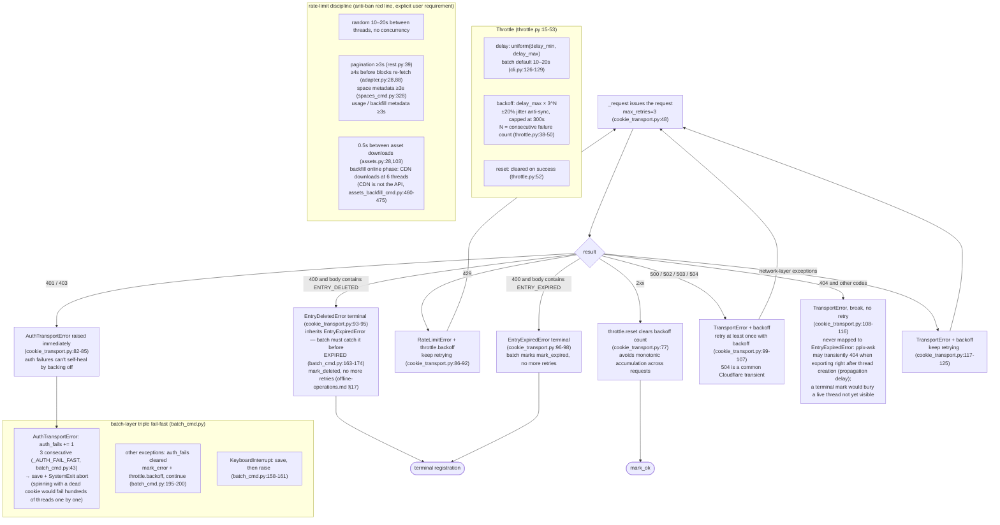

# Ratenbegrenzung und Fehlerbehandlung

## Ratenbegrenzung und Fehlerbehandlung

Zwei Ebenen: `Throttle` (core/throttle.py:15) + Fehlerweiterleitung in `CookieTransport._request`
(core/http/cookie_transport.py:63-126); plus Fail-Fast auf der Batch-Ebene.

- **WebBridgeTransport** gleicht 429-Backoff und `throttle.reset()` bei Erfolg ab
  (bridge_transport.py); Fehlerklassifizierung abgestimmt mit CookieTransport — 401/403 →
  `AuthTransportError`, 400 mit Body, der ENTRY_EXPIRED enthält → `EntryExpiredError`,
  5xx-Backoff-Retry; Fail-Fast bei Auth und abgelaufene Terminalzustände des Batches gelten ebenfalls unter
  `--transport webbridge`; Nicht-JSON-Antworten des Daemons werden zu
  TransportError zusammengefasst (URLError/JSONDecodeError/OSError einheitlich abgefangen); andere Nicht-200er gehen direkt zu
  TransportError.
- **Geteilter Throttle**: Batch übergibt dieselbe Instanz an CookieTransport (cli.py:280-282),
  wodurch Backoff-Zählungen zwischen Transport- und Batch-Ebene vereinheitlicht werden; **Neuerstellung nach automatischem Kontowechsel verliert sie ebenfalls nicht**
  (common.py:139 übergibt sie ebenfalls); Einzelbefehle, die keine übergeben, erhalten eine Standardinstanz, die von CookieTransport erstellt wird
  (cookie_transport.py:49).
