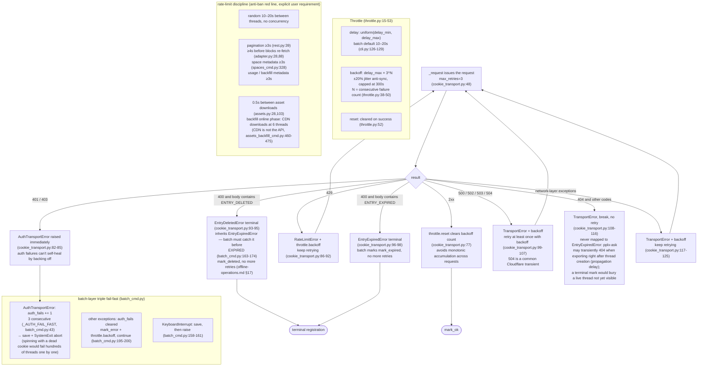

# Limitation de débit et gestion des erreurs

## Limitation de débit et gestion des erreurs

Deux couches : `Throttle` (core/throttle.py:15) + routage des erreurs dans `CookieTransport._request`
(core/http/cookie_transport.py:63-126) ; plus échec rapide au niveau du lot.

- **WebBridgeTransport** aligne le backoff 429 et `throttle.reset()` en cas de succès
  (bridge_transport.py) ; classification des erreurs alignée avec CookieTransport — 401/403 →
  `AuthTransportError`, 400 avec corps contenant ENTRY_EXPIRED → `EntryExpiredError`,
  5xx backoff-retry ; l'échec rapide d'authentification du lot et les états terminaux expirés s'appliquent également sous
  `--transport webbridge` ; les réponses non JSON du démon se réduisent en
  TransportError (URLError/JSONDecodeError/OSError capturés uniformément) ; les autres non-200 vont directement à
  TransportError.
- **Throttle partagé** : le lot passe la même instance à CookieTransport (cli.py:280-282),
  unifiant les compteurs de backoff entre les couches de transport et de lot ; **les reconstructions après changement automatique de compte ne le perdent pas non plus**
  (common.py:139 le passe aussi) ; les commandes uniques qui n'en passent pas une reçoivent une instance par défaut construite par CookieTransport
  (cookie_transport.py:49).
